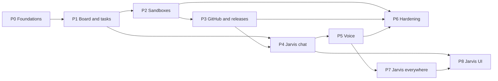

# Project plan

Phase 1 delivers the Software Factory. Requirements and page specifications are in [PRODUCT.md](PRODUCT.md); the system and stack in [docs/architecture.md](docs/architecture.md); the data model in [docs/data-model.md](docs/data-model.md); decisions and learnings in [docs/decisions.md](docs/decisions.md).

## Current focus

- **P7-23 (#327):** Reopened: live first word remains 9–19 s after the earlier reflex fix. Chat settings now load alongside catalogue/context; content-free stage logs and spans, first-delta forwarding/cleanup, and incremental-streaming tests are implemented offline. Keep the 60-second container catalogue cache and on-demand memory tools; do not reintroduce caller-chosen `agent_session_id` (reverted in #356). Next: deploy through the approved workflow, collect Application Insights before/after timings, and investigate the reported ~4.5 s pre-container delay. The ≤2.5 s first-token / ≤4 s complete-reply acceptance is not verified.
- **Approved Software Factory layout (#369):** Task Lens board, project release bar and right task-details pane are planned in P8-34. The design handoff is published for review; implementation waits for shared glass task #364 (P8-31, introduced in draft PR #367). Existing task/detail/release contracts remain authoritative.

- **Accepted centred Jarvis stage (P8-28–P8-33, #361–#366):** Dan approved the corrected live prototype and confirmed Jarvis-only 3D plus a re-lit version of the same room for light mode. Design/source/reference handoff is in this change for #211; all six follow-ups remain unclaimed and Not started. #361 (room) and #364 (glass) can start after that handoff is merged and #211 closes; native dependencies order orb, transitions/flicker, light appearance and phone/rendering acceptance. The transition flicker remains unresolved, and no new stage code is deployed. Reuse the existing shell/workspace/runtime/preferences instead of repeating them.
- **P7-27 (#347):** Workspace reflex targets and decision logging are implemented offline. The signed-in client publishes bounded open-window titles/IDs to its active broker session; fixed window/layout/context actions run through `WorkspaceCommand` in chat and voice partials/finals. Semantic duplicate matching ignores delivery IDs, and `reflex.decision` logs contain no transcript. Full workspace checks pass (1,135 tests, lint/build); Chromium verifies desktop/phone controls, idempotent panel opening and retained-close restoration. Next: coordinator live acceptance that “tile my windows” changes layout within 1.5 seconds of chat send.
- **P8-26 (#345):** Implemented offline: visible removable FIFO chat queue, per-message language, retained turn errors, and Stop reply advancing the queue. Chromium verified two queued messages during streaming at 1440×900 and 390×844 in dark/light, including removal, double Enter, Stop/next, error/next and reduced motion. Live Entra/Foundry behavior remains unverified.
- **P8-25 (#337):** Implemented offline: editable composer during replies, acceptance-time draft clearing, reduced-motion-safe thinking feedback, open-surface streaming, and ID-deduped history merges. All 234 configured web tests, lint and build pass. Chromium verified initial focus/bottom scroll, next-draft preservation and stale post-turn refresh at 1440×900 and 390×844 in dark/light; screenshots and turn sequence are recorded in DESIGN.md. Live auth/Foundry latency remains unverified.
- **P8-24 (#328):** Implemented offline in draft PR #330. Jarvis's saved, streamed and interrupted chat replies render safe Markdown with no raw HTML, protocol-limited links and theme-surface code blocks; Dan's messages and voice transcripts remain plain. All web tests (225), lint and build pass; Chromium verified dark/light at 1440×900 and 390×844, plus no page overflow at 320/280px. Before/after evidence is in `docs/ui/screenshots/p8-24-{before,after}-{dark,light}-{desktop,phone}.png`. Live auth and Foundry delivery remain unverified.
- **P8-16 (#254):** Implemented offline in draft PR #302. A strict ephemeral activity contract publishes observed chat/voice/tool states over authenticated `/now/events`; the top bar and orb consume it, and Jarvis-updated windows alone receive the tool-call shimmer. Protocol tests cover recorded `ok`/`refused`/`error` outcomes and exclude private tool data. Scratch-fixture browser acceptance passed at desktop and phone widths. Live Entra/Foundry delivery and physical audio remain unverified.
- **P8-11 (#242):** Complete offline. Phones show one foreground view with touch swipe, named/keyboard selection and existing focus/restore requests. Content ends above the active voice dock; no content returns the orb to the main space. Typing keeps the small explicit-start orb and one-line top bar with camera/sharing overflow. Labelled desktop/phone before/after evidence is in `docs/ui/screenshots/p8-11-*`. P8-15 is now merged; phone regressions cover page-only, agent-only and mixed view collections with valid command IDs, current-title announcements and close/minimise fallback. Next: P8-16 tool activity and live integration acceptance. Physical-phone keyboards, screen readers, hardware audio and live Entra/Azure remain unverified.

- **P8-21 (#293):** Complete offline. The main conversation now uses the selected Concept B/C surfaces, a floating DA/EN composer, quiet relative metadata and streaming feedback. Client windows support title dragging, edge resizing and compact Arrange shortcuts with reduced-motion-safe lifecycle transitions. Web tests (190), lint and build pass; labelled desktop/phone screenshots and concept comparisons are committed under `docs/ui/screenshots/p8-21-*`. P8-10 is complete and integrated against this polished composer and window chrome. Next: P8-22 shell finishing touches, then P8-11 phone workspace, P8-15 agent-delivered windows and P8-16 tool-call activity; live auth, physical audio and agent-delivered windows remain unverified.
- **P8-22 (#297):** Implemented offline. Home shows the Jarvis breadcrumb once; deeper routes show the area and matching page. Per-window keyboard arrangement is behind an accessible 44px overflow trigger while minimise, maximise and close remain lifecycle actions. Fixture footer text stays in screenshot captures and is absent from the production bundle. Desktop/phone captures and Concept B/C comparisons cover both appearances; P8-11 still owns phone voice layout. The issue and draft PR remain open, so Plan status stays In progress until merge. Next: P8-11 phone workspace, P8-15 agent-delivered windows and P8-16 tool-call activity.
- **P8-23 (#301):** In progress in draft PR #303. Voice presentation uses only existing P5-04 status/audio and P8-20 tokens; hides workspace headings, retains P8-22 window chrome, groups accessible voice actions beneath the orb, and reverses the orb/window transition on exit. Tool-call events remain owned by P8-16. Desktop listening/thinking/speaking captures in dark/light and phone speaking captures in both appearances are in `docs/ui/screenshots/p8-23-*`, with side-by-side Concept B/C comparisons. Local-fixture and browser evidence and limitations are in [agent-context](docs/agent-context.md#setup-and-commands) and [DESIGN.md](DESIGN.md). Next: complete PR review/merge, then P8-16 activity events; live auth, hardware audio/camera and tool activity remain unverified.

- **P7-06 (#204):** The .NET 10 Windows tray bridge, Dan-only authenticated backend protocol, allow-listed PC tools, fake-bridge tests, Entra bootstrap, optional deployment setting, installer, and setup documentation are implemented offline. After merge, the coordinator must provision Entra, deploy, install on Dan's PC, and verify sign-in and opening live. P8 owns any future UI.
- **P7-25 (#339):** Implemented offline. The default-off browser executor prefers Dan's normal Chrome profile through the MV3 extension/native-messaging host and current-user-only named pipe, with loopback CDP fallback. Installer registration, extension setup instructions, fake-extension/CDP contract tests, and the Windows-target build are in place. Dan's normal-profile search acceptance remains; P7-26 separately owns foreground URL opening.
- **P7-26 (#342):** Implemented offline. `pc_open` URLs, P7-20 reflex URL targets and `browser_do` navigation use the connected extension when Chrome automation is on, creating an active tab and focusing its window. Disconnected-extension shell fallback is identified in the result; launched apps receive Windows foreground permission. Focused backend/bridge tests, portable bridge tests and Windows-target build pass. Dan's foreground Chrome acceptance remains.
- **P7-18 (#308):** Complete offline. The bridge has a default-off persisted Chrome toggle, local CDP tab listing, atomic node-bound snapshots, indexed freshness/occlusion-checked actions, sensitive-input blocking, P7-03 confirmation for risky clicks, and redacted backend tools. Fake-CDP and backend protocol tests pass; Dan's signed-in Chrome check remains unverified.
- **P7-17 (#307):** Complete offline. `browser_do` uses P7-04 reflex routing and one Jev decision per observed step, delegates fixed indexed actions to P7-18, generates text only for TYPE, verifies DONE independently, and reports through P8-16 activity/P8-15 workspace. Fake executor/Jev/model tests pass; median fake step latency is 0.07 ms excluding page loads. Live Jev, Foundry, Chrome, voice and approval delivery remain unverified.
- **P7-19 (#309):** Complete offline. The screen-share request captures its selected window label with the transient vision description; `browser_do_shared` resolves a unique live Chrome tab or asks Dan, then reuses P7-17/P7-18. Shared-tab intent bypasses focused-tab reflex, voice waits for fresh context, speaks one progress update and cancels on “stop”; progress remains in the workspace. Fake end-to-end, ambiguity, offline, stop and confirmation tests pass. Dan's live Chrome form, Jev/Foundry, Voice Live and physical approval delivery remain unverified.
- **P7-14 (#264):** Implemented offline in draft PR #319. The existing Foundry runner now supports a `codex-tool` mode for live `web_research`, with the Codex shell tool disabled, bounded output/deadline, cancellation, explicit usage-limit refusal, and temporary-workspace cleanup. The backend validates and returns a typed source-linked answer, redacts private tool payloads from audit, and exposes today's UTC web-research call count in Usage. Focused fake tests, builds, and Usage UI checks pass; live Codex/web-search and deployed Azure acceptance remain unverified.
- **P7-20 (#312):** Complete offline in draft PR #315. English and Danish Voice Live partials run clause-by-clause Jev reflexes with a per-turn action ledger, safe partial-action gating, final-transcript replacement/reconciliation, supported undo, and privacy-filtered latency/count logs. Focused fake-stream/backend and Danish provisioner tests, lint, and build pass. Live Voice Live/Jev latency and Dan's PC/browser action timing remain unverified; P7-17's browser agent is still in progress.
- **P7-24 (#335):** In progress. English and Danish Voice Live finals use MAI Transcribe, while Azure Speech on the Foundry AIServices account streams interim PCM hypotheses only while the microphone is unmuted into P7-20's existing safe clause/ledger path. Fake-recognizer tests cover early action, contradiction undo, failure fallback, and mute; backend/web focused checks pass. Deployment, live managed-identity access and Dan's Danish/English speech-to-first-action acceptance remain unverified.

- **Accepted capability additions (4 October 2026):** P7-13–P7-16 cover long-term memory, source-linked web research, image generation, and editable personality; P8-19 supplies the Personality settings UI. P7-13's storage, capture and retention choices are resolved in issue #263 and implemented offline; live verification remains pending. Dan's 5 October decision moved image generation to the existing ChatGPT/Codex subscription and deferred video indefinitely.

- **Jarvis UI (5 October 2026):** Dan agreed the shared shell/voice structure in [ui.md](ui.md). P8-09 presents actual runtime states accessibly, with reduced-motion support and an unknown-state fallback. P8-10 is complete offline and integrated with P8-21: voice immediately hides the shell/history/composer, grows the active orb from the composer's small orb, positions it around carried workspace windows, and restores typing and focus on natural/manual end or failure; Escape and End voice are implemented. The default-off minimise preference persists through P8-17 and is mirrored locally for immediate shell reads. P8-14/P8-15 are complete offline: typed declarative views render through fixed React elements, and authenticated session-scoped commands reach the active workspace and contextual panel in typing and voice modes; generated code never executes and view state is not persisted. P8-16 is complete offline: a strict ephemeral activity contract publishes observed chat/voice/tool states over authenticated `/now/events`; the top bar and orb consume it, and Jarvis-updated windows alone receive the tool-call shimmer. Live Entra/Foundry delivery and physical audio remain unverified. P8-06 supplies the temporary client-side workspace host with tiled/layered arrangements, pointer/keyboard movement and resizing, and narrow-screen reflow. P8-13 persists validated light/dark appearance through P1-11; custom/Jarvis-directed variable updates remain P8-17. The frontend breakdown is P8-04–P8-13 with coverage in [docs/ui-implementation-coverage.md](docs/ui-implementation-coverage.md); P8-03 owns enabling logic and contracts. P8-08 is complete on the client, while authenticated Jarvis command delivery is supplied by P8-15. P8-20 completes the shared Concept B dark / Concept C light visual and motion system offline; the orb follows observed activity and decoded playback PCM. The full UI is not complete.
- **P8-04 (#235):** The shared shell is implemented with the existing Jarvis, Software Factory, Usage, and Settings routes. P7-08 enables the top-bar Camera toggle; screen sharing still uses its conversation controls. App tests (20/20), web lint, and web build pass. Chromium checks at 1280×900 and phone widths 390×844, 320×800, and 280×800 exercised every navigation/context-panel combination; the mobile rail spans through the footer in each state, active shell controls measure at least 44×44px, Settings stays right-aligned, and no horizontal overflow or page exceptions occur. The updated global top bar spans the window, matches the rail width in height, and keeps controls on one line; screenshots are attached to the PR. The browser used scratch auth/API fixtures, so live Azure, screen sharing, and camera hardware/model acceptance remain unverified.
- **P7-13 (#263):** Durable source-linked memory tools and Foundry embeddings are implemented offline; verify the SQL integration contract in CI, then the coordinator checks deployment and recall across chat/voice sessions. No UI is added; P8 owns it.
- **P7-15 (#265):** Image generation only is implemented offline through the existing ChatGPT/Codex login on the hosted runner; validated images are saved as private workspace artifacts and displayed in chat and the workspace. Focused backend, contract and web tests cover lifecycle, cancellation, retries, ownership and artifact previews. A live ChatGPT generation and deployed Blob acceptance remain unverified; video is deferred separately and artifact retention remains unresolved.

- **P7-10 (#208):** `notes_search` and the OneDrive folder setting are implemented and tested offline. After merge, the coordinator must approve and assign Graph `Files.Read.All`, then verify a known note returns a quote and link; live tenant setup and search remain unverified.
- **P7-02 (#200):** Away mode is implemented offline: voice/chat tool, ten-minute Teams Away/Offline detection, active-browser return, durable settings/activity, Now status, mode-routed task updates, and browser/Teams approval routes. After merge, a tenant administrator must grant Graph `Presence.Read.All` with `infra/setup-away-presence.ps1`; verify presence timing and delivery to Dan's installed Teams chat. Live tenant/phone behavior remains unverified.

- **P7-12 (#210):** Complete offline. Selected committed task transitions and verified ready-for-review/failed-deployment webhooks produce fixed, burst-merged voice announcements; `get_status_summary` returns aggregate counts only. Backend tests, build and lint pass. The live English voice acceptance and production webhook delivery remain unverified.

- **P6-06 (#67):** The operations runbook is drafted in [docs/runbook.md](docs/runbook.md); Dan's acceptance review and live production verification are pending.
- **P7-09 (#207):** The Outlook provider was superseded by P7-22. Its calendar/mail tool contracts, redacted persistence, and later-message confirmations are preserved on the Google provider.
- **P7-22 (#321):** Google Gmail and Calendar provider implemented offline; fake API/token tests cover refresh/cache, expiry alert callback, redaction, and confirmation-gated writes. Dan must run `infra/setup-google.ps1`, deploy `JARVIS_GOOGLE_TIME_ZONE`, and verify live account/API behavior.
- **P7-28 (#350):** Calendar range and next-event reads are implemented offline with local-date boundaries, pagination, a 100-event/62-day range cap, all-day date preservation and Jev-safe read tools. Fake-client tests pass; coordinator verification of "this week" and next appointment against Dan's live calendar remains pending.
- **P2-13 (#195):** Task starts now carry repository/default/task branch, dispatch persists `tasks.branch`, and the runner prepares the checkout before ACP. Commit-free `end_turn` replies become Needs attention questions. Next step: coordinator post-merge live Copilot/Codex pushes and question verification on `DanAakesen/jarvis-test-target`; live Foundry/GitHub acceptance remains unverified.
- **P2-14 (#226):** Complete offline after the production task 4 regression. Dispatcher cleanup and heartbeat decisions now check current task/latest-invocation evidence, retain completion across polls/restarts, and export secret-safe decision logs. Continue/steer after expiry starts a new session on the task branch. Backend tests, Foundry contracts, existing task-control UI tests, lint, build, and CodeQL pass. Next: SQL Server CI and the coordinator's live completed-task/idle-expiry check; neither is verified locally.
- **P1-14 (#192):** Complete. SQL connection acquisition and explicitly read-only queries wait through resume errors with backoff within a shared 90-second deadline; executed writes and transactions are not replayed. Signed-in pages show backend-reported “Waking Jarvis…” while requests wait. Offline retry/status/SSE tests and desktop/mobile browser checks pass. Next: verify production auto-resume after deployment; live Azure SQL remains unverified.
- **P3-12 (#185):** Complete. `npm test`, `npm run lint`, and `npm run build` pass; runner tests and Ruff pass; SQL Server integration tests pass in a disposable container; Bicep compiles and the built runner reports PowerShell 7.6.6. Live Key Vault/GitHub creation, private template access, and a throwaway scaffold PR remain the coordinator's post-merge check.
- **P6-06 (#67):** The operations runbook is drafted in [docs/runbook.md](docs/runbook.md); Dan's acceptance review and live production verification are pending.
- **P3-06 (#44):** Complete. Both project policies and merge refusal paths are covered with fakes; backend tests, lint and build pass. Live GitHub App installation and test-repository merge acceptance remain unverified.
- **P3-14 (#245):** Complete offline. Completed task branches with commits ahead of the default branch now open or reuse a PR through the repository-scoped App token; every refusal records a reason and moves the task to Needs attention. Focused fake-GitHub tests, backend lint and build pass; the coordinator's live PR check on `jarvis-test-target` remains unverified.
- **P7-05 (#203):** Complete offline. Authenticated, request-triggered screen inspection uses the existing Foundry managed identity, supplies transient context to chat/voice, records frame/token usage and estimated DKK, and exposes share/stop controls plus a daily cap. Live image support, deployment SKU/rates, Azure SQL and browser acceptance remain for the coordinator.
- **P7-04 (#202):** Implemented offline in draft PR #306 for chat and English Voice Live end-of-turns. Fake-provider tests cover confidence gating, safe-tool filtering, fallback, bounded 429 retry, hosted-agent handoff and voice ordering; local fake-provider classification measured 0.43 ms and final-transcript-to-response-request 1.04 ms (not Jev network or first generated audio). Semantic VAD disables automatic responses until the backend runs reflex. Dan must set `jev-api-key` in Key Vault after merge; live Jev/Voice Live and Danish voice integration remain unverified.
- **P7-08 (#206):** Complete offline. The shared shell turns camera access on only after Dan's action, supports one-frame chat/voice requests through P7-05's authenticated vision bridge, and releases the stream at voice/app-session end or after five minutes. Fake-camera/model, cap/usage-path, voice-intent and transient-context tests pass; live camera hardware, deployed image model and billed usage remain unverified.
- **P7-03 (#201):** Complete offline. Teams personal-chat notifications and five-minute, single-use Adaptive Card approvals use Dan's tenant/object ID; repository creation and automatic merge fail closed without approval. Speech F0 voice notes fall back to text. Fake-connector, persistence, integration and project-policy tests pass; Bicep is checked locally. Coordinator deploy, bot installation, and live phone approval remain unverified.
- **Active phase:** P7. P7-22 replaces P7-09's Outlook provider with Google Gmail and Calendar; implementation and offline checks are complete, while Dan's Key Vault OAuth setup, production consent, deployment, and live account acceptance remain. P8's UI sequence continues in parallel; P8-10 is complete offline, P8-14/15/16 are complete offline, and P8-17 supplies the remaining account preference integration. P8-11 phone workspace is complete offline. P6-04 backup/restore and P6-08's live parallel-load check remain pending. P6-01 through P6-03 provide usage, deduplicated alerts and task-event archival; P6-02 records failed deployment, confirmed sandbox crash, expiring credential and 80% budget conditions once in SQL activity, surfaces them in Now and routes email through Azure Monitor. Focused fake tests and Bicep validation pass; disposable SQL integration, live email/monitor delivery and Azure budget polling remain unverified. P1-01 through P1-05 provide the core schema, APIs, and task-event pipeline; P1-05 writes task events and activity transactionally and publishes committed events through the in-process hub. P1-06 implements authenticated fetch SSE with 25-second heartbeats and replay from the last event ID; P1-08 can now consume live task updates. P0-01 through P0-16 provide the deployed foundations. P2-02 and P2-04 provide offline runner and backend Foundry contracts; live sandbox acceptance remains with P2-07. P1-02 provides backend module composition and the internal tool catalogue; P4-02 adds HTTP discovery/dispatch and records calls against the group-one `tool_calls` table. P0-14 adds the Copilot and Codex cloud environment setup; the Codex run is P0-15. P3-01's registration settings and secure setup guide are complete; Dan registered and installed the App on 3 October 2026, and its private key and Key Vault storage are P3-10. P3-09 adds copy-ready managed-project PR and release workflows; adoption and Azure deployment remain unverified. P3-07 records one default-branch release per project/SHA and links runs and deployments; the P3-08 release view remains to be built. P5-01 selects an authenticated backend WebSocket relay. P5-03 adds the backend-owned English realtime session and tool loop, verified against a local mock; Azure interoperability and browser audio remain unverified. P0-11 adds the `main` Deploy workflow (changed parts only, queued, smoke checks); P0-16 completed its first live run and post-deploy setup. P1-07 adds the signed-in app shell: the Jarvis main page, Software Factory area navigation, the settings entry and the "Now" activity panel. Each unbuilt data point and action is shown with an explanation and disabled; P1-13 connects the activity panel to a backend feed. P4-05 makes each tool response carry an `ok`/`refused`/`error` outcome and a backend-built confirmation; P4-01 relays that result from the dispatcher. P4-01 ports the hosted Jarvis agent to `agents/jarvis`: its tools come only from the backend registry, called with the agent's app-only `Jarvis.Tools` token, which the backend accepts on the tool routes only. It is checked offline and against a locally built backend. P4-03 stores chat history and P5-06 persists voice transcripts and minutes; P4-06 sends chat from the main page. P4-09 connects chat to the deployed agent through Foundry Invocations, with the delegated token and stored message ID in the application payload; its offline contract checks pass, and live streamed-chat/tool-call acceptance is the coordinator's post-merge step. P4-10 registers the Factory project and task tools for chat and voice on the existing stores and lifecycle controller; live tool calls remain unverified. Voice/client wiring remains P5-03/P5-04. P1-03 provides authenticated project APIs, and P1-10 adds the projects list and project settings on them (running counts from the Running-task API, refreshed on demand; last release remains unavailable until P3-08); P1-04 provides authenticated task create/list/detail endpoints, bounded filters/event history, and server-side lifecycle enforcement. P4-08's hosted-agent deployment and bootstrap setup succeeded on main; the workflow and Bicep configure the chat agent name. P5-02 adds the authenticated Danish `/voice/da` relay and hash-locked post-Deploy provisioning for MAI Transcribe (`da`) and Harper (`da-DK`); local checks pass, while live browser audio waits on P5-04 and Azure acceptance. P4-07 applies model/reasoning settings to new hosted-agent sessions only. P1-12 adds the sleep switch: API, refusal while tasks are Ready or Running, main-page UI, and the backend's Bicep permission to scale its own Container App. P6-03 implements the 90-day Blob archive and on-demand history read; its live Azure check remains post-merge. P2-12 adds group 7 usage tracking and per-task detail, with provider-specific usage fields left for post-merge Codex/Copilot runs to verify. P1-13 connects that panel to the protected Now feed and live SSE refresh; SQL Server integration and deployed identity/streaming remain unverified.
- **P2-10 (#36):** Complete offline. Recover starts a fresh Foundry session on the task's existing P2-13 workspace branch with the original task, bounded steering and event history; GitHub branch and PR evidence gate Done. SQL Server/live Foundry/GitHub acceptance remains unverified.
- **P2-08 (#34):** Daily Codex renewal, shared SQL lease, and non-secret credential dates in Settings are implemented and locally checked. Keep the task In progress until live Key Vault/Codex proof; P2-05 dispatch must use the guarded task-store transition.
- **P3 webhook receiver:** P3-03 and P3-04 are complete. P3-14 opens or reuses a PR at completed-turn time; P3-06 applies project policy after persisted PR/check webhooks. P3-07 records one release per project/default-branch SHA, linking workflow runs and deployments by SHA with out-of-order webhook handling. Backend tests and SQL Server integration pass; live GitHub delivery and App-backed PR creation remain to verify. P3-08 adds the per-project release UI and on-demand commit graph; live GitHub, Entra, and Azure SQL behavior remain unverified. P3-02 is complete.
- **P3-05 checks loop:** Complete offline. Failed task-PR workflow logs are bounded, stored privately, and sent through the same-task steer path; attempt exhaustion or unavailable recovery moves tasks to Needs attention. Focused fakes, backend lint/build pass; live GitHub webhook, Blob access, and agent repair/push remain unverified.
- **P3-11 (#184):** Complete. The validated New projects defaults are persisted in `dbo.settings` and editable in Settings; Projects retains edit/archive only. The backend POST route remains for P3-12. P3-12 now specifies using the configured owner and visibility; sync the matching issue description.
- **P3-13 (#191):** Existing installation repositories are listed on Projects and can be registered in one step from the page or Jarvis. Focused tests and browser checks cover the offline flow; live GitHub App, Key Vault, Entra, and Azure SQL behavior remain unverified.
- **P5 voice:** P5-04 (#58) now implements the browser audio client, Danish warm-up, interruption and automatic reconnect with local mock coverage; live browser audio remains unverified. P5-05 (#59) owns the language toggle and voice settings and is active in parallel. P5-06 (#60) persists voice transcripts and session minutes; P5-07 (#61) remains in progress for Dan’s post-merge live test.
- **P6-01 (#62):** Complete. The authenticated Usage page groups existing rows by project, agent, or source across 7/30/90-day and all-time periods. P5-06 voice rows are included if present; live SQL and provider/voice data remain unverified.
- **P6-02 (#63):** Complete offline. Deployment, sandbox-crash and credential-expiry activity is unique per condition; budget actual spend is checked with the backend identity. Now shows alerts, while Application Insights log rules and Azure Budget notifications use one email-only action group. Live SQL, telemetry, budget polling, email delivery and the required `JARVIS_BUDGET_CONTACT_EMAILS` GitHub secret remain to verify.
- **P2-07 state coordination:** `PauseRequested` continues to consume dispatcher capacity and blocks backend sleep until the heartbeat resolves the pause; SQL integration coverage is included but cannot run here without the isolated SQL Server configuration.
- **P1-11:** The protected settings API and page are backed by `dbo.settings`; provider model choices stay at verified defaults until P2-11.
- **P1-13 (#136):** Complete. The protected Now feed, per-item persisted dismissal, main-page activity panel and task-event SSE refresh are complete. Offline route/client tests and SQL-backed contracts are in place; SQL Server integration and deployed identity/streaming remain unverified. P1-08 (#22) remains the next task and is kept separate.
- **P2-11 (#37):** Provider options are verified; the Foundry client forwards effective model and Codex reasoning, and the runner applies them through Copilot CLI / Codex ACP while retaining them across resumed turns. P2-05 resolves task overrides before settings defaults; live provider selection remains unverified until deployment.
- **P2-03 (#29):** Runner event delivery and the runner-only backend ingestion route are implemented through P1-05 `recordEvent`; local contracts pass. Azure role assignment/live delivery await the post-merge bootstrap and a task-ID-bearing invocation; browser streaming remains P1-06.
- **P6-05 (#66):** Complete. A SQL Server load test in CI runs 15 tasks across three projects with three competing dispatchers, alternating Codex and Copilot; it stayed within the global and per-project limits and released capacity after simulated Codex limit failures (results in [decisions.md](docs/decisions.md)). The dispatcher now sends `task_id` in start and resume requests, without which the deployed runner rejected every dispatch (L59). The runner reports a Codex usage-limit failure as `Codex usage limit reached`. The live run with real sandboxes and Codex Pro limits is P6-08, for Dan.
- **P6-07 (#68):** Runner turn-start disk snapshots and periodic low-disk checks report through P2-03; `disk_low` moves Running tasks to Needs attention, and the task detail page shows recorded readings. Local runner/backend/web coverage is implemented; live Foundry measurement and SQL Server integration remain unverified.
- **Coordinator (#12):** Removed at Dan's request. The separate Project board sync from #108 is restored and retains its existing `project-board` environment; only the coordinator is withdrawn. Dan or an explicitly authorized agent merges tested PRs. Deployment integration remains #11.
- **Conversation (#50):** P4-03 stores chat and voice sessions and exposes paginated history on the signed-in main page. P4-06 adds chat sending and P4-09 routes the turn through Foundry Invocations; coordinator live chat/tool-call acceptance remains post-merge. Voice wiring is P5-03/P5-04, and agent-driven task creation P1-04/P4-01; production SQL verification remains feature-specific after P0-16. P4-04 and P4-06 are complete.
- **P1-08 (#22):** The Software Factory task board is implemented with filtered task cards, task creation, and live updates through the authenticated per-task SSE client. Pull-request, check, and usage values remain unavailable until their planned data integrations land.
- **P1-09 (#23):** Task detail now uses the authenticated task API, SSE, paginated archived-event history, and a one-row conversation-history read for its origin message. The header, GitHub branch/project links, full-source timeline, event filtering/payload expansion, disk readings, P2-07 state-aware task controls, and P2-12 Usage slot are implemented; live Entra, Azure SQL/Blob, and deployed streaming remain unverified.
- **P3-02 (#40):** Complete offline: the runner-only backend route binds the active task to its Foundry session, derives the repository, and mints a one-hour App token; the runner requests a fresh token through its Git credential helper. App-token mode is opt-in, preserving `jarvis-github` until the post-merge live push check on `DanAakesen/jarvis-test-target`; production Key Vault/GitHub/sandbox behavior remains unverified.
- **P3-02 post-merge:** keep `JARVIS_GITHUB_APP_TOKEN_ENABLED` false until the backend is deployed and its Key Vault key is available; then opt in through Runner deploy and verify a sandbox push to `DanAakesen/jarvis-test-target`. Only after success, remove the legacy `jarvis-github` secret/token and runner read grant in a follow-up.

- **Features list:** [docs/features.md](docs/features.md) lists every feature with its surface and status for P8 design; each task PR keeps it current. P4-10 registers the Software Factory tools; P7-11 (#209) adds validated Jarvis and task model-switching tools, with running-task changes refused.
- **P7 and P8 (added 4 October 2026):** Dan accepted the features from the reviewed Jarvis demo video (except animated eyes and hand gestures). P7 issues are headless; those labelled `needs-decision` wait for Dan. P7-11 and P7-12 have no open decisions. P8-01 is Dan's UI design session.
- **P7-16 (#266):** Personality preferences persist through the validated settings store and are snapshotted for new chat and voice sessions; focused offline tests pass. The paired P8-19 Settings UI is implemented and tested offline. Live Azure session and settings behavior remain unverified.
- **Next step:** P2-07 (#33) implementation is complete offline. After merge, the coordinator runs the live acceptance with both Codex and Copilot on `DanAakesen/jarvis-test-target` and verifies intermediate commits on the task branch. P1-09 (#23) is complete. P4-06 (chat) is unblocked by P1-07, P4-03 and P4-04. P0-10 (aggregate CI), P0-11 (deploy workflow), P0-13 (automatic task statuses and issue dependencies), and P0-16 (first production deploy and setup) are complete. Required checks on `main` wait for GitHub Pro. Until then Dan starts tasks and merges green PRs, or explicitly authorizes Codex to merge them. Issue #30's live Azure validation remains #11. After P4-09 merges, the coordinator runs the live chat check: confirm a streamed hosted-agent reply and a `tool_calls` row linked to the stored source-message ID.
- **Blockers:** P1-06 focused offline tests and SQL Server integration pass; deployed streaming remains unverified. P1-08 passed focused tests and mocked Chromium checks; live Entra, Azure SQL, and deployed task streaming remain unverified. P1-09 focused web tests and mocked Chromium checks pass; live Entra, Azure SQL/Blob archive reads, and deployed SSE remain unverified. P2-07 focused backend/web tests and mocked Chromium checks pass; the SQL Server integration test is included but could not run without the isolated loopback configuration, and live Azure/Foundry acceptance remains with the coordinator post-merge. Required checks on `main` still await GitHub Pro; items marked **Confirm** or **Verify** block only the tasks that depend on them. `foundryNameTimestamp` remains fixed at `20261003200000` in `infra/main.parameters.json`. P1-10's live project CRUD was not exercised; its browser check used mocked APIs. P1-12's live identity, role assignment and ARM scaling can only be verified after deploy. P4-09's live chat stream and linked tool-call row require the coordinator's post-merge Azure check; the coding agent cannot access Azure. P6-03's live archive/restore check also requires post-merge Azure access.
- **P2-06:** The heartbeat implementation in PR #144 reloads active sessions at startup and polls registered invocations; P2-05 persists `agent_name`, registers new sessions, and unregisters ended sessions. Live Foundry/SQL verification remains pending.

- **Jarvis (#51):** P4-04 is complete. Every model turn receives a bounded running-task snapshot and recent events, alongside the existing bounded in-session message history; a typical status answer uses one model request. Offline tests pass; the new SQL context query still needs its isolated SQL Server run.

- **Database (#7):** managed-identity connection and bounded startup migration ownership are implemented in PR #100; 118 offline backend tests and isolated SQL Server contracts pass; the SQL job is part of aggregate CI. Bicep now supplies the managed-identity SQL settings and the Deploy workflow requires `/health` after each backend deploy; applying migrations in Azure is observed in P0-16.

- **Runner (#28):** production port and main-only deployment are implemented in its PR. Live ACR/Foundry/Key Vault acceptance proceeds through Runner deploy from `main`; set `JARVIS_INFRA_DEPLOYMENT_NAME` to `jarvis-infra`. Runner deploy shares the queued `jarvis-production-deploy` group. P2-09 adds per-turn frequent-push instructions with offline coverage; live intermediate-commit acceptance remains with P2-07.

- **Schema (#15):** P1-01 adds `0001_core_tables.sql` (groups 1–3) with a reviewed down script and a lock-guarded `revertMigration`; SQL Server CI proves up, constraints, down and re-up. The first production deployment completed in P0-16. P1-03, P1-04 and P1-11 are unblocked on the schema side. P0-16 applied the initial schema in production; P2-06 adds heartbeat routing metadata for the next deploy.
- **Authentication (#8–#9):** backend bearer validation, MSAL browser sign-in and the protected `/me` profile endpoint are implemented and checked offline. Dan's account is allow-listed by object ID; other accounts are refused. Live Entra sign-in remains unverified after the P0-16 deployment.
- **Schema follow-up (#27):** P2-01 adds `0002_sandbox_operations.sql` (groups 4 and 6) with its reverse batch and schema contracts. Offline tests pass and the production Deploy run succeeded; isolated SQL Server validation remains with CI.

## Implementation phases

Nine phases, P0–P8, each ending in something Dan can use. Every task is sized for one coding-agent task, has acceptance criteria, and names its dependencies. Each task has a [GitHub issue](https://github.com/DanAakesen/jarvis/issues) whose title starts with the task ID, and the Depends on column is mirrored as the issues' "Blocked by" dependencies, so GitHub shows which tasks are ready. Status values, who sets them, and the start, finish, and merge rules are in the [development workflow](docs/agent-context.md#development-workflow). Mark a phase complete only when all its acceptance criteria are met.

| Phase | Goal | Dan can then |
| --- | --- | --- |
| **P0** | Repository, infrastructure, sign-in, CI/CD, database | Sign in to an empty Jarvis at its URL |
| **P1** | Backend core, task store, board with live updates | Create projects and tasks and see them update live |
| **P2** | Tasks run in Foundry sandboxes with Codex or Copilot | Start, steer, pause, resume and cancel real coding tasks |
| **P3** | GitHub App, PR checks loop, merge policy, releases | Watch PRs, failing checks fixed automatically, releases and deploys |
| **P4** | The Jarvis agent in chat on the main page | Ask Jarvis in text to start and follow tasks |
| **P5** | Voice in Danish and English | Talk to Jarvis |
| **P6** | Recovery, cost views, monitoring, operations | Trust it day to day |
| **P7** | Teams calling, phone confirmations, reflex layer, screen, camera, PC control, calendar, mail, notes | Use Jarvis away from the browser and on his PC |
| **P8** | The complete Jarvis front end | Use every feature from one designed UI |

### Ground rules for every task

- **Source of truth:** [PRODUCT.md](PRODUCT.md) for requirements, [docs/decisions.md](docs/decisions.md) for decisions and learnings (L1–L40), [docs/architecture.md](docs/architecture.md) for the system. They win over anything a task implies; a task that conflicts with them stops and asks.
- **Workflow:** every agent follows the [development workflow](docs/agent-context.md#development-workflow): remote only, one PR per task, statuses on `main`, never start from a broken `main`.
- **Definition of done:** code, tests for changed behaviour, lint clean, every document in the [finish table](docs/agent-context.md#finish-a-task) updated, merged automatically through a PR whose checks pass against the latest `main`, deployed by GitHub Actions. No manual portal changes.
- **Secrets:** none in code, images, environment variables, or logs. Managed identities and Key Vault only ([sandbox credentials](docs/architecture.md#sandbox-credentials)).
- **Azure:** see [docs/agent-context.md](docs/agent-context.md#azure). Scripts pass `--subscription` explicitly (L7). Never reuse deleted Foundry names (L2).
- **Size:** one task = one PR, reviewable in under 30 minutes. Split anything larger.

### Reuse from the prototypes

| Prototype file | Becomes | Notes |
| --- | --- | --- |
| [`docs/reference/coding-sandbox-prototype/runner/`](docs/reference/coding-sandbox-prototype/runner/) (`app.py`, `Dockerfile`, tests) | `runner/` | ACP adapter, steer/pause/resume, Codex login handling and renewal. Remove the prototype's `crash-test` mode. Add live-event push (P2-03) and frequent pushes (P2-09). |
| [`docs/reference/coding-sandbox-prototype/infra/deploy.ps1`](docs/reference/coding-sandbox-prototype/infra/deploy.ps1) | Reference for Bicep and the Foundry agent-version deploy step | Keep its learnings: separate admin and runtime endpoints (L10), wait for the runtime host, explicit subscription, delete probe sessions (L14). |
| [`docs/reference/coding-sandbox-prototype/driver/src/cli.ts`](docs/reference/coding-sandbox-prototype/driver/src/cli.ts) | Reference for the backend's Foundry client | Invocations calls, status polling, steer/pause modes. |
| [`docs/reference/voice-prototype/agent/`](docs/reference/voice-prototype/agent/) | `agents/jarvis/` | Voice Live Bridge runtime, tool loop, strict action rules. Fake tools are replaced by calls to the backend. |
| [`docs/reference/voice-prototype/infra/`](docs/reference/voice-prototype/infra/) (`create_voice_agents.py`, `create_realtime_agents.py`) | Voice-agent provisioning step | Voices, transcription, warm-up rule (L21). |
| [`docs/reference/voice-prototype/client/talk.py`](docs/reference/voice-prototype/client/talk.py) | Reference for the browser audio client | Warm-up, reconnect, interruption handling. |

### P0 — Foundations

Goal: an empty Jarvis that Dan can sign in to, deployed entirely by GitHub Actions.

| ID | Issue | Task | Acceptance criteria | Depends on | Status |
| --- | --- | --- | --- | --- | --- |
| P0-01 | [#1](https://github.com/DanAakesen/jarvis/issues/1) | Turn the pushed scaffold into the monorepo: folder layout from the [stack overview](docs/architecture.md#stack-overview) (`apps/web`, `apps/backend`, `agents/jarvis`, `runner`, `infra`, `db`), `README.md`, `.gitignore`, editor config, licence. Project rules stay in [docs/agent-context.md](docs/agent-context.md); the generated `AGENTS.md` is not edited | Folder layout on `main`; empty apps build | P0-06 | Complete |
| P0-02 | [#2](https://github.com/DanAakesen/jarvis/issues/2) | Web app skeleton: Vite + React + TypeScript, router, lint, Vitest. `npm run dev` in the repository root starts the web app on `http://localhost:5173` against the production backend; configuration comes from `infra/bootstrap.output.json` and the backend URL | `npm run build` and tests pass in CI; `npm run dev` then opening `http://localhost:5173` works with no other step | P0-01 | Complete |
| P0-03 | [#3](https://github.com/DanAakesen/jarvis/issues/3) | Backend skeleton: Fastify + TypeScript, `/health`, structured logging to Application Insights, lint, Vitest, Dockerfile; CORS allows only `http://localhost:5173` and the Static Web App origin | Container builds; `/health` returns 200 | P0-01 | Complete |
| P0-04 | [#4](https://github.com/DanAakesen/jarvis/issues/4) | Bicep: resource group, Log Analytics, Application Insights, Key Vault (RBAC), Storage (Blob), Container Registry, Azure SQL server + database `jarvis` (free offer; Entra admin = group `jarvis-sql-admins`), Container Apps environment + backend app (minimum 1 replica, existing identity `id-jarvis-backend`), Static Web App in West Europe, 300 DKK budget alert. Resource group `rg-jarvis` already exists | `az bicep build` and the Bicep linter pass in the PR (no Azure access needed); everything except the bootstrap items is in Bicep. The first real deployment is checked by P0-11 | P0-06 | Complete |
| P0-05 | [#5](https://github.com/DanAakesen/jarvis/issues/5) | Bicep: Foundry account and project (timestamped names, L2), model deployments (`gpt-5.6-luna`, `gpt-realtime-2.1`), project connections for ACR and Application Insights | `az bicep build` and the linter pass in the PR; P0-11's first deploy checks that the project data plane and runtime host answer (L10) | P0-04 | Complete |
| P0-06 | [#6](https://github.com/DanAakesen/jarvis/issues/6) | Bootstrap with [`infra/bootstrap.ps1`](infra/bootstrap.ps1): resource providers, `rg-jarvis`, deploy identity with GitHub OIDC (main branch) and roles on the resource group, `jarvis-api` (scope `access_as_user`, only Dan assigned) and `jarvis-web` (SPA), `id-jarvis-backend`, group `jarvis-sql-admins`, private repository and Actions variables | Script re-runs with no changes; IDs in `infra/bootstrap.output.json` | — | Complete |
| P0-07 | [#7](https://github.com/DanAakesen/jarvis/issues/7) | Database access and migrations: connect with managed identity; the backend runs pending migrations at startup under a SQL app lock; CI runs the migrations and database tests against SQL Server in a container (GitHub runners never reach Azure SQL) | **Verify** the chosen tools support Entra ID; CI passes against the container. The live check (a deploy applies a new migration once) moved to P0-11 on 3 October 2026, because P0-11 depends on this task | P0-04, P0-03 | Complete |
| P0-08 | [#8](https://github.com/DanAakesen/jarvis/issues/8) | Backend authentication: validate `jarvis-api` tokens; allow-list Dan's object ID; reject everything else with 401/403 | Tests cover valid, wrong audience, wrong user, expired | P0-03, P0-06 | Complete |
| P0-09 | [#9](https://github.com/DanAakesen/jarvis/issues/9) | Web sign-in with MSAL; call `/me`; show Dan's name | Signing in with Dan's account works; any other account is refused by the backend | P0-02, P0-08 | Complete |
| P0-10 | [#10](https://github.com/DanAakesen/jarvis/issues/10) | CI workflow: lint, test, build for web, backend and Python on every PR | Runs on every PR; required checks on `main` once Dan has GitHub Pro (Free has no branch protection on private repositories) | P0-02, P0-03 | Complete |
| P0-11 | [#11](https://github.com/DanAakesen/jarvis/issues/11) | Deploy workflow for `main`: runs on `push` to `main` and on `workflow_dispatch` (started by Dan as a manual redeploy of the current `main`). Deploys only what changed: `infra/` → Bicep, `apps/backend/` or `db/` → backend image to ACR and Container Apps, `apps/web/` → Static Web Apps; changes to shared files (root `package.json`, lockfile, workflows) deploy everything; a manual run deploys everything. Skips changes that touch only `*.md` or `docs/`. One deploy at a time (`concurrency` group, queued, never cancelled). After the first deploy, re-run `infra/bootstrap.ps1 -WebRedirectUris <Static Web App URL>` to allow sign-in there | The first deploy creates every Bicep resource, and a smoke step checks `/health` and the Foundry project endpoints (P0-04, P0-05); a merge deploys only the changed parts; a docs-only merge deploys nothing; two quick merges deploy one after the other; a manual run redeploys everything; the Jarvis URL and `http://localhost:5173` both show the signed-in page | P0-04…P0-10 | Complete |
| P0-12 | [#12](https://github.com/DanAakesen/jarvis/issues/12) | Coordinator withdrawn at Dan's request: automatic issue assignment, PR merges and conflict-repair dispatch removed. Keep the separate Project board sync from #13 and its existing environment. PR merges are manual or explicitly authorized | Coordinator workflow and scripts absent; Project board workflow, script, tests and environment retained | P0-10, P0-11 | Complete |
| P0-13 | [#13](https://github.com/DanAakesen/jarvis/issues/13) | Plan-status workflow: keeps the Issue and Status columns of `PLAN.md` on `main` in step with GitHub. An open issue with a `Codex`, `Copilot`, `Dan` or `Jarvis` worker label, or an open PR with `Fixes #<issue>` → In progress; merged PR or completed issue → Complete; an open issue without a worker label or open linked PR → Not started. Preserve manually set Blocked. A new task row creates a standard issue with its "Blocked by" links. Commits only Issue and Status cells. **Verify** it can still commit if `main` gets branch protection | Every task row's issue link and status match GitHub within a minute; worker-label and linked-PR changes reconcile to In progress, Complete, or Not started as defined above | P0-10 | Complete |
| P0-14 | [#14](https://github.com/DanAakesen/jarvis/issues/14) | Cloud agent environments: `.github/workflows/copilot-setup-steps.yml` (Node, Python, dependencies) for Copilot cloud agent, and `scripts/codex-setup.sh` for Dan to use as the Codex cloud environment's setup script | One Copilot task and one Codex task each run lint and tests in their cloud environment. Copilot verified; the Codex run moved to P0-15 because it needs Dan's Codex settings after merge | P0-02, P0-03 | Complete |
| P0-15 | [#107](https://github.com/DanAakesen/jarvis/issues/107) | Verify the Codex cloud environment: Dan sets `bash scripts/codex-setup.sh` as the setup script (see [agent-context](docs/agent-context.md#cloud-agent-environments)); a Codex task then runs `npm run lint` and `npm test` | Setup completes with Node.js 22.23.3, npm 10.9.9 and Python 3.12.14; one Codex task runs lint and tests | P0-14 | Complete |
| P0-16 | [#131](https://github.com/DanAakesen/jarvis/issues/131) | First production deploy and post-deploy setup: Dan runs the Deploy workflow on `main` (or merges P0-11), then runs `infra/bootstrap.ps1 -WebRedirectUris <Static Web App URL>`, records the backend URL in `apps/web/config.json`, and sets the Actions variable `JARVIS_INFRA_DEPLOYMENT_NAME` to `jarvis-infra` for Runner deploy. Fix anything the first run exposes (Foundry smoke routes, SQL group sign-in, model quota) | The Deploy run creates every Bicep resource; `/health` and the Foundry smoke step pass; the startup log shows migrations applied once with managed identity; a docs-only merge starts no deploy; two quick merges deploy in order; a manual run redeploys everything; the Jarvis URL and `http://localhost:5173` both show the signed-in page | P0-11 | Complete |

### P1 — Board and tasks

Goal: the Jarvis app shell, projects and tasks in SQL, and live updates on the board. No agents yet.

| ID | Issue | Task | Acceptance criteria | Depends on | Status |
| --- | --- | --- | --- | --- | --- |
| P1-01 | [#15](https://github.com/DanAakesen/jarvis/issues/15) | Migrations for data-model groups 1–3: `settings`, `jarvis_sessions`, `messages`, `tool_calls`, `activity`, `projects`, `tasks`, `task_events` (columns, constraints, indexes as in the data model) | Migration up/down works against the CI container; applied in production by the next deploy | P0-07 | Complete |
| P1-02 | [#16](https://github.com/DanAakesen/jarvis/issues/16) | Backend module structure: `core` (settings, activity, events, SSE hub, tool registry) and `factory` (projects, tasks); each module registers routes and Jarvis tools | Adding a module needs no change in `core` | P0-03 | Complete |
| P1-03 | [#17](https://github.com/DanAakesen/jarvis/issues/17) | Projects API: list, create, update, archive; validation of `repo`, `policy`, `sandbox_size`, `tech`, `max_parallel_tasks` | Tests for each rule | P1-01, P1-02 | Complete |
| P1-04 | [#18](https://github.com/DanAakesen/jarvis/issues/18) | Tasks API: create (from board), list with filters, get with events; [task lifecycle](PRODUCT.md#task-lifecycle) enforced server-side | Illegal transitions rejected; tests for every transition | P1-01, P1-02 | Complete |
| P1-05 | [#19](https://github.com/DanAakesen/jarvis/issues/19) | Event pipeline: every state change and event writes `task_events` and `activity`, and is published on the SSE hub | An event reaches a connected client in under 1 s | P1-04 | Complete |
| P1-06 | [#20](https://github.com/DanAakesen/jarvis/issues/20) | SSE endpoint over `fetch` with bearer token; heartbeat comment every 25 s; resume from last event ID after reconnect | Reconnect replays missed events; no duplicates | P1-05, P0-08 | Complete |
| P1-07 | [#21](https://github.com/DanAakesen/jarvis/issues/21) | App shell: Jarvis main page, area navigation (Software Factory only), settings entry, activity panel | Matches the [page requirements](PRODUCT.md#page-requirements) (data points and actions; no visual design yet) | P0-09 | Complete |
| P1-08 | [#22](https://github.com/DanAakesen/jarvis/issues/22) | Factory task view: columns by state, cards with the card data points, create-task dialog, filters by project and agent | Matches the [page requirements](PRODUCT.md#software-factory--task-view); live updates via SSE | P1-04, P1-06, P1-07 | Complete |
| P1-09 | [#23](https://github.com/DanAakesen/jarvis/issues/23) | Task detail page: header, event timeline (all runner events), links, actions (shown, disabled until P2) | Matches the [page requirements](PRODUCT.md#page-requirements) | P1-08 | Complete |
| P1-10 | [#24](https://github.com/DanAakesen/jarvis/issues/24) | Projects page and project settings | Matches the [page requirements](PRODUCT.md#page-requirements) | P1-03, P1-07 | Complete |
| P1-11 | [#25](https://github.com/DanAakesen/jarvis/issues/25) | Settings page: Jarvis, voice and coding-agent settings stored in `settings`; changes apply to new sessions and tasks only | Matches the [page requirements](PRODUCT.md#settings-1); values validated against available models | P1-01, P1-07 | Complete |
| P1-12 | [#26](https://github.com/DanAakesen/jarvis/issues/26) | Sleep switch: backend endpoint changes its own minimum replicas (0/1) through ARM with its managed identity; refused while tasks are Ready, Running, or PauseRequested | Switching works; refusal tested | P0-11, P1-04 | Complete |
| P1-13 | [#136](https://github.com/DanAakesen/jarvis/issues/136) | Now feed: a protected backend read of the main page's "Now" data (running tasks with project, agent, activity and start time; activity items for tasks needing attention, releases and deployments, and credential warnings, each with its `activity.link`) and a dismiss action that persists per item (adds a dismissal column to `activity` with an up/down migration); connect the web activity panel and update it through SSE | The main page shows real running tasks and activity; a dismissed item stays dismissed after reload; tests for the read, dismissal and an unknown item | P1-05, P1-06, P1-07 | Complete |
| P1-14 | [#192](https://github.com/DanAakesen/jarvis/issues/192) | Wait for the serverless database to wake: SQL requests that fail because the database is resuming (errors 40613, 40197, 40501 and connection timeouts) retry with backoff for up to 90 seconds instead of failing after 30; the web pages show "Waking Jarvis…" while the backend reports the wait | A request during auto-resume succeeds (test with a simulated resume error); the page shows the waking state | P1-02 | Complete |

### P2 — Sandboxes

Goal: real coding tasks run in Foundry sandboxes, controlled from the board.

| ID | Issue | Task | Acceptance criteria | Depends on | Status |
| --- | --- | --- | --- | --- | --- |
| P2-01 | [#27](https://github.com/DanAakesen/jarvis/issues/27) | Migrations for group 4 (`sandbox_sessions`, `sandbox_turns`, `artifacts`) and group 6 (`webhook_deliveries`, `credential_status`) | Migration works | P1-01 | Complete |
| P2-02 | [#28](https://github.com/DanAakesen/jarvis/issues/28) | Port the runner from the prototype into `runner/`; image builds in ACR; agent version deployed by a workflow (1×2 and 2×4 variants; small images per tech, L23); pinned CLI versions (L13) | Prototype runner tests pass; Key Vault probe works with the agent identity | P0-05 | Complete |
| P2-03 | [#29](https://github.com/DanAakesen/jarvis/issues/29) | Runner pushes live events to the backend (`POST /factory/sandbox-events`) authenticated with the agent identity; backend validates the identity and stores every event in `task_events` | Events appear on the task detail page live | P2-02, P1-05 | Complete |
| P2-04 | [#30](https://github.com/DanAakesen/jarvis/issues/30) | Backend Foundry client: start task, steer, pause, resume, cancel, status, delete session; separate admin and runtime endpoints (L10) | Contract tests against recorded responses | P0-05 | Complete |
| P2-05 | [#31](https://github.com/DanAakesen/jarvis/issues/31) | Dispatcher: picks Ready tasks within global and project limits using the lease columns; starts a sandbox, writes `sandbox_sessions.agent_name`, and registers/unregisters it with the heartbeat; retries with `attempt_count`/`next_attempt_at`; then NeedsAttention | Two dispatcher instances never start the same task (test); no recurring SQL queries while no task is Ready, Running or waiting for a retry, so the database can pause (test) | P2-04, P1-04 | Complete |
| P2-06 | [#32](https://github.com/DanAakesen/jarvis/issues/32) | Sandbox heartbeat: about once a minute per running session; updates `last_heartbeat_at`; crash rule from L22 (HTTP 424/404/5xx on two polls or 30 s → NeedsAttention); event gaps alone never trigger it | Rule unit-tested with recorded responses | P2-04, P2-01 | Complete |
| P2-07 | [#33](https://github.com/DanAakesen/jarvis/issues/33) | Task controls on the board and task detail: steer (text), pause, resume, cancel; buttons follow the state machine | End-to-end with both agents on a private test repository `DanAakesen/jarvis-test-target` (created with `gh`); the task branch shows intermediate commits | P2-04, P1-09 | Complete |
| P2-08 | [#34](https://github.com/DanAakesen/jarvis/issues/34) | Credentials for the sandbox: Copilot token and Codex login from Key Vault ([Codex login rules](docs/architecture.md#sandbox-credentials)); `credential_status` dates; daily Codex renewal job (renews at ≤3 days, never while a Codex task runs) | Renewal job proven once; dates on the board | P2-02, P2-01 | Complete |
| P2-09 | [#35](https://github.com/DanAakesen/jarvis/issues/35) | Frequent pushes: instructions to the agent to commit and push work-in-progress to the task branch after each meaningful step | Offline tests verify instructions reach new, resumed, and recovered agent prompts; live task-branch acceptance is checked in P2-07 | P2-02 | Complete |
| P2-10 | [#36](https://github.com/DanAakesen/jarvis/issues/36) | Crash recovery: on NeedsAttention after a crash, "Recover" starts a new session from the task branch with the task, its steering and a summary of its events; `completed` is accepted only when the branch and PR exist on GitHub (L22) | Forced-crash test recovers to a PR | P2-06, P2-09, P3-03 | Complete |
| P2-11 | [#37](https://github.com/DanAakesen/jarvis/issues/37) | Model and reasoning per task: runner passes the model (and reasoning effort for Codex) from settings or task overrides | **Verify** Codex (`codex-acp`) and Copilot CLI options first; record what works in [docs/decisions.md](docs/decisions.md) | P2-02, P1-11 | Complete |
| P2-12 | [#38](https://github.com/DanAakesen/jarvis/issues/38) | Usage: migration for group 7 (`usage`); sandbox minutes and DKK per session; Codex/Copilot turns and any reported tokens or premium requests | **Verify** what each agent reports; usage visible per task | P2-03, P2-01 | Complete |
| P2-13 | [#195](https://github.com/DanAakesen/jarvis/issues/195) | Task workspace: the dispatcher sends the project's repository, default branch and the task branch `jarvis/task-<id>` in the start request and stores it in `tasks.branch`; the runner clones the repository into the session workspace through the Git credential helper, checks out the task branch (from the remote if it exists, otherwise from the default branch) and starts the agent there; resume and recovery reuse the same branch. When an agent turn ends without a new commit on the task branch, the task moves to Needs attention with the agent's last message as the question | Live: a Copilot and a Codex task on `DanAakesen/jarvis-test-target` each push commits to their task branch; an agent question appears as Needs attention (tests for clone, existing branch, missing repository access and question) | P2-05, P2-03 | Complete |
| P2-14 | [#226](https://github.com/DanAakesen/jarvis/issues/226) | Distinguish a confirmed Foundry expiry after a completed invocation from an active-turn crash: end the session as `Ended`/`idle_expired` without changing task state; Continue/steer uses P2-10 recovery on the existing task branch; log every heartbeat decision | Fake Foundry tests cover active crash versus completed-turn expiry, including the first failing poll and completion races; task state remains unchanged at idle expiry; Continue/steer starts a new session on the task branch | P2-06, P2-10 | Complete |

### P3 — GitHub and releases

Goal: PR checks in GitHub Actions drive the task, merges follow the project policy, and releases are visible.

| ID | Issue | Task | Acceptance criteria | Depends on | Status |
| --- | --- | --- | --- | --- | --- |
| P3-01 | [#39](https://github.com/DanAakesen/jarvis/issues/39) | Prepare the GitHub App registration settings and secure setup checklist; no live registration, installation, or secret provisioning by the cloud agent | Least-privilege manifest and manual steps are documented without exposing credentials | P0-04 | Complete |
| P3-02 | [#40](https://github.com/DanAakesen/jarvis/issues/40) | Installation tokens per push: the runner's Git credential helper asks the backend for a 1-hour token for the task's repository (agent identity authenticated); replaces the prototype's fine-grained token | Push from a sandbox works with an App token | P3-10, P2-02 | Complete |
| P3-03 | [#41](https://github.com/DanAakesen/jarvis/issues/41) | Webhook receiver: signature check, idempotency via `webhook_deliveries`, events `pull_request`, `check_run`, `workflow_run`, `deployment_status`, `push` | Duplicate deliveries are ignored (test) | P3-10, P2-01 | Complete |
| P3-04 | [#42](https://github.com/DanAakesen/jarvis/issues/42) | Migrations for group 5 (`pull_requests`, `workflow_runs`, `releases`, `deployments`) and mapping from webhooks | Records match GitHub for a test repository | P3-03 | Complete |
| P3-05 | [#43](https://github.com/DanAakesen/jarvis/issues/43) | Checks loop: a failed PR check stores the failing job's log in Blob and steers the task with it; the agent fixes and pushes | A deliberately failing test is fixed by the agent | P3-04, P2-07 | Complete |
| P3-07 | [#45](https://github.com/DanAakesen/jarvis/issues/45) | Release records: one release per merge to `main`; workflow runs and deployments linked by SHA | Release view data correct for a test project | P3-04 | Complete |
| P3-06 | [#44](https://github.com/DanAakesen/jarvis/issues/44) | Project policy and merge: create a PR for completed branch commits when none is open; `deliver_pr` stops at a verified green PR; `complete_without_deployment` merges with the App when project merge rules pass; Done follows verified GitHub state | Both policies, PR creation/refusal paths, and merge refusals tested with fakes; live test-repository acceptance remains unverified | P3-04 | Complete |
| P3-08 | [#46](https://github.com/DanAakesen/jarvis/issues/46) | Release view per project: list of releases with runs and deployments; horizontal git graph (branches as lines, commits as dots) from the GitHub API on demand, coloured by PR, checks, release and deployment state | Matches the [page requirements](PRODUCT.md#page-requirements) | P3-07, P1-07, P8-04 | Complete |
| P3-09 | [#47](https://github.com/DanAakesen/jarvis/issues/47) | Template GitHub Actions workflows for managed projects: PR checks (full build and tests) and release (build, test, deploy with OIDC) | A new project can adopt them in one PR | P3-01 | Complete |
| P3-10 | [#102](https://github.com/DanAakesen/jarvis/issues/102) | Dan's live GitHub App setup: register from the P3-01 settings and install it (done 3 October 2026; all repositories), trim its permissions to the credentials inventory; after P0-11, generate the private key and store it in the deployed Key Vault | App permissions match the credentials inventory in docs/architecture.md; Key Vault has the private-key secret; only the backend identity can read it | P0-11, P3-01 | Complete |
| P3-11 | [#184](https://github.com/DanAakesen/jarvis/issues/184) | New projects settings: a Settings section with owner, visibility, templates repository, default agent, policy, max parallel tasks and default branch (PRODUCT.md *New projects*); the projects page drops its New project form and keeps edit and archive | Defaults saved and read back; the projects page has no create form | P1-10, P1-11 | Complete |
| P3-12 | [#185](https://github.com/DanAakesen/jarvis/issues/185) | Jarvis creates a new project: a `create_project` tool takes a name and description, creates a repository using the configured New projects owner and visibility with the backend-only `jarvis-repo-admin` token (Key Vault), registers the project with the New projects defaults, and starts the scaffolding task (clone the templates repository, run `cpinit` with modules the agent picks from the description, fill PRODUCT.md and PLAN.md, add the P3-09 workflows, open a PR; Needs attention with a question when information is missing). The runner image gains PowerShell 7 for `cpinit` | Saying a name and description gives a new repository with a scaffolding PR and a registered project (live check on a throwaway project, then deleted) | P3-11, P3-09, P4-09, P2-07 | Complete |
| P3-13 | [#191](https://github.com/DanAakesen/jarvis/issues/191) | Existing repositories: the backend lists every repository of the App installation (cached, refreshed on demand); the projects page shows managed projects first and the other repositories with **Manage with Jarvis**, which registers the repository with the New projects defaults and a detected tech identifier; a `manage_repository` Jarvis tool does the same | All of Dan's repositories appear; managing one registers it without a form (test) | P3-02, P3-11 | Complete |
| P3-14 | [#245](https://github.com/DanAakesen/jarvis/issues/245) | Open the task's pull request on completion: when the task branch is ahead of the project default branch and has no open PR, open one with the repository-scoped App token, link the Jarvis task, record `pull_request_opened`, and continue with P3-06; refuse missing commits or GitHub failures with a task event and Needs attention | Fake GitHub tests cover idempotent creation/reuse, no-ahead refusal, and API failure reason; coordinator verifies an open PR from `jarvis/task-<id>` on `jarvis-test-target` | P3-06, P2-13 | Complete |
| P3-16 | [#331](https://github.com/DanAakesen/jarvis/issues/331) | Reconcile stale Running tasks at startup and on a bounded schedule using Foundry invocation status and GitHub PR evidence; transition through the task store and expose unresolved outcomes as Needs attention | Fake-client tests cover completion with a lost event, active/failed runners, and GitHub unavailability; production task and root-cause verification remain pending | P3-04, P3-06, P2-14 | Complete |

### P4 — Jarvis in chat

Goal: Dan talks to Jarvis in text on the main page; Jarvis uses the real backend.

| ID | Issue | Task | Acceptance criteria | Depends on | Status |
| --- | --- | --- | --- | --- | --- |
| P4-01 | [#48](https://github.com/DanAakesen/jarvis/issues/48) | Port the hosted Jarvis agent from `docs/reference/voice-prototype/agent` to `agents/jarvis`; replace fake tools with calls to the backend's tool registry, authenticated with the agent identity | All factory tools work against the backend | P1-02, P0-05, P4-02 | Complete |
| P4-02 | [#49](https://github.com/DanAakesen/jarvis/issues/49) | Tool registry endpoint: the backend exposes every registered tool's schema and executes calls; each call writes `tool_calls` | Tools of a new module appear without agent changes | P1-02 | Complete |
| P4-03 | [#50](https://github.com/DanAakesen/jarvis/issues/50) | Conversation store: one continuous conversation; each chat or voice sitting is a `jarvis_session`; messages and tool calls stored; tasks get `origin_message_id` | History visible on the main page | P1-01, P4-02 | Complete |
| P4-04 | [#51](https://github.com/DanAakesen/jarvis/issues/51) | Context for Jarvis: running tasks and recent events passed with each turn (saves the `list_tasks` round); a bounded window of recent messages | Typical commands answered in one model round | P4-01, P4-03 | Complete |
| P4-05 | [#52](https://github.com/DanAakesen/jarvis/issues/52) | Honest confirmations: Jarvis's reply about an action is built from the tool result (L16) | A refused or failed tool call is reported as such (test) | P4-02 | Complete |
| P4-06 | [#53](https://github.com/DanAakesen/jarvis/issues/53) | Chat on the main page: message list, input, streaming replies, tool-call chips linking to tasks | Matches the [page requirements](PRODUCT.md#page-requirements) | P1-07, P4-03 | Complete |
| P4-07 | [#54](https://github.com/DanAakesen/jarvis/issues/54) | Model and reasoning for Jarvis from settings, per session | Changing the setting changes the next session's model | P1-11, P4-01 | Complete |
| P4-08 | [#137](https://github.com/DanAakesen/jarvis/issues/137) | Deploy the Jarvis agent: a `main` workflow pushes the `agents/jarvis` image to ACR and creates a Foundry hosted-agent version with `JARVIS_BACKEND_URL`; then run `infra/bootstrap.ps1 -JarvisAgentPrincipalId <instance_identity.principal_id>` and set the backend's `ENTRA_JARVIS_AGENT_OBJECT_ID` to the same ID | The deployed agent gets a token for `jarvis-api` with the `Jarvis.Tools` role, lists the backend tools, and every factory tool succeeds with its own identity and is recorded in `tool_calls`; the same token is refused on `/me` | P4-01, P0-11, P4-03, P1-03, P1-04, P4-06 | Complete |
| P4-09 | [#157](https://github.com/DanAakesen/jarvis/issues/157) | Connect chat through Foundry Invocations: the backend calls `POST {project_endpoint}/agents/{agent_name}/endpoint/protocols/invocations?api-version=v1` using its managed identity; the hosted agent registers the chat handler with `@app.invoke_handler`; the delegated user authorization and stored source-message ID travel in the application payload. Bicep and the main Deploy workflow configure `JARVIS_CHAT_AGENT_NAME` | Local backend and agent tests verify the Invocations path, delegated-token/source-message checks, streamed text, completed reply contract and tool-call message ID. Coordinator runs live Azure acceptance after merge: streamed reply and `tool_calls` row linked to the stored source message | P4-06, P4-08 | Complete |
| P4-10 | [#219](https://github.com/DanAakesen/jarvis/issues/219) | Register `list_projects`, `list_tasks`, `get_task`, `create_task`, `steer_task`, `pause_task`, `resume_task`, and `cancel_task` with the backend tool registry, using the existing Factory stores and lifecycle controller | Chat and both voice paths discover the tools; inputs follow Tasks API bounds; calls return backend-built outcomes, lifecycle refusals stay refused, and task details omit event payloads | P4-02, P1-04 | Complete |

### P5 — Voice

Goal: Dan talks to Jarvis in Danish or English in the browser.

| ID | Issue | Task | Acceptance criteria | Depends on | Status |
| --- | --- | --- | --- | --- | --- |
| P5-01 | [#55](https://github.com/DanAakesen/jarvis/issues/55) | Browser voice connection design: no keys in the browser; choose backend-relayed WebSocket or short-lived tokens for Voice Live; record the choice in [docs/decisions.md](docs/decisions.md) and [docs/architecture.md](docs/architecture.md) | Decision recorded with an authenticated relay spike against a local mock upstream | P0-08 | Complete |
| P5-02 | [#56](https://github.com/DanAakesen/jarvis/issues/56) | Danish voice agent: voice bridge to the Jarvis agent, MAI Transcribe (`da`, phrase list), Harper locked to `da-DK`, provisioned by a workflow | Danish round trip works from the browser | P4-01, P4-08, P5-01 | Complete |
| P5-03 | [#57](https://github.com/DanAakesen/jarvis/issues/57) | English voice agent: `gpt-realtime-2.1`, Ryan HD, British butler persona; tool calls handled by the backend (not the browser) | English round trip with a tool call works | P5-01, P4-02 | Complete |
| P5-04 | [#58](https://github.com/DanAakesen/jarvis/issues/58) | Browser audio client: microphone capture, playback, interruption (stop playback on `speech_started`), silent warm-up before the microphone opens, automatic reconnect (L21) | Interruption and reconnect tested | P5-02 | Complete |
| P5-05 | [#59](https://github.com/DanAakesen/jarvis/issues/59) | Language toggle and voice settings on the main page and the settings page | Toggle switches voice agent for the next session | P5-02, P5-03, P1-11 | Complete |
| P5-06 | [#60](https://github.com/DanAakesen/jarvis/issues/60) | Voice sessions stored as `jarvis_sessions` with transcripts and usage (voice minutes) | Transcript and usage visible | P4-03, P2-12 | Complete |
| P5-07 | [#61](https://github.com/DanAakesen/jarvis/issues/61) | Dan's live test (V8 of the voice prototype) in Danish and English; record the verdict in [docs/decisions.md](docs/decisions.md) | Verdict recorded | P5-04, P5-05 | In progress |

### P6 — Hardening

Goal: Jarvis runs reliably and transparently day to day.

| ID | Issue | Task | Acceptance criteria | Depends on | Status |
| --- | --- | --- | --- | --- | --- |
| P6-01 | [#62](https://github.com/DanAakesen/jarvis/issues/62) | Usage and cost views per task, project and period (DKK where billed; usage only for Codex and Copilot) | Matches the [page requirements](PRODUCT.md#page-requirements) | P2-12 | Complete |
| P6-02 | [#63](https://github.com/DanAakesen/jarvis/issues/63) | Alerts: failed deployments, sandbox crashes, credential expiry, budget 80 % | Each alert fires once in a test; appears in Now and sends email through Azure Monitor | P2-06, P2-08, P3-07 | Complete |
| P6-03 | [#64](https://github.com/DanAakesen/jarvis/issues/64) | Archive `task_events` by age to Blob; restore on demand for the task detail page | Archive and restore tested | P1-05 | Complete |
| P6-04 | [#65](https://github.com/DanAakesen/jarvis/issues/65) | Database backup and restore drill | Restore of `jarvis` to a temporary database documented | P0-04, P0-11 | Not started |
| P6-05 | [#66](https://github.com/DanAakesen/jarvis/issues/66) | Parallel load test: several tasks across projects, both agents; watch Codex Pro limits | Results recorded in [docs/decisions.md](docs/decisions.md) | P2-05 | Complete |
| P6-06 | [#67](https://github.com/DanAakesen/jarvis/issues/67) | [Operations runbook](docs/runbook.md): deploy, Container Apps and Foundry rollback, rotate GitHub App key/webhook secret, re-seed Codex login, recover a crashed task, sleep switch, temporary SQL firewall access | Runbook reviewed by Dan | P2-10, P3-10 | Complete |
| P6-07 | [#68](https://github.com/DanAakesen/jarvis/issues/68) | Disk headroom: at session start the runner records total and free disk of the writable filesystem as a task event; when free disk drops below 1 GiB during a task, the runner reports it and the task moves to Needs attention with reason `disk_low` instead of failing in a build. Uses the documented budget (up to 20 GiB at ≥1 vCPU, about 20 % reserved) and the measured 6 GiB as the planning value | Disk figures visible on the task detail page; the low-disk path tested with a fake filesystem reading; the threshold is a setting | P2-03 | Complete |
| P6-08 | [#173](https://github.com/DanAakesen/jarvis/issues/173) | Live parallel load test: Dan runs the [documented procedure](docs/agent-context.md#setup-and-commands) on the deployed system with several tasks across at least two projects, alternating Codex and Copilot, and watches Codex Pro usage | Maximum concurrency, Ready-to-Running time, Needs attention reasons, sandbox minutes/DKK and Codex allowance before and after recorded in [docs/decisions.md](docs/decisions.md) | P6-05, P2-07, P2-08 | In progress |

### P7 — Jarvis everywhere

Goal: Dan reaches Jarvis away from the browser, and Jarvis can see, act on his PC, and use his calendar, mail, notes, and approved existing subscriptions. P7-13–P7-16 add long-term memory, web research, media generation, and editable personality; unresolved storage/provider/cost choices stay explicit. Each task is headless (backend, Jarvis tool, tests, docs); its UI is P8. Tasks labelled `needs-decision` wait for Dan's answers in the issue. Prefer Microsoft services and existing approved subscriptions; do not infer approval for a new paid API. Costs and non-Microsoft parts are flagged in each issue (Jev is the agreed exception).

| ID | Issue | Task | Acceptance criteria | Depends on | Status |
| --- | --- | --- | --- | --- | --- |
| P7-01 | [#199](https://github.com/DanAakesen/jarvis/issues/199) | Teams calling: use ACS Call Automation with Teams Phone extensibility (preview), Dan-only Entra caller verification, the existing backend tools, and P7-03 approval for personal data/actions | Dan reaches Jarvis through a service number; unknown callers are rejected before answer/session creation; phone tool calls correlate to the stored session and require Teams approval when needed; live task-status call succeeds | P5-03 | In progress |
| P7-02 | [#200](https://github.com/DanAakesen/jarvis/issues/200) | Away mode: voice/chat and Teams presence toggle that routes updates and confirmations to the phone while Dan is away | Mode persists; ten-minute presence threshold, browser return, and Now status verified offline; live permission/delivery pending | P7-03 | Complete |
| P7-03 | [#201](https://github.com/DanAakesen/jarvis/issues/201) | Phone notifications and confirmations through a Teams bot (Azure Bot Service, Teams channel) with text and a Speech F0 voice note; Adaptive Card approve/reject | Dan-only confirmation round trip; pending requests expire; unknown, expired, and replayed confirmations never run actions | P4-02 | Complete |
| P7-04 | [#202](https://github.com/DanAakesen/jarvis/issues/202) | Reflex layer: classify chat and English Voice Live end-of-turns with Jev before the main agent; directly execute only high-confidence addressed actions on registered reflex-safe tools; route all uncertain, unsafe, or confirmation-required requests to the main agent | Fake-provider tests; offline latency recorded; Voice Live semantic end-of-turn with automatic response disabled; no unsafe direct calls | P5-03, P4-02 | Complete |
| P7-05 | [#203](https://github.com/DanAakesen/jarvis/issues/203) | Screen sharing: browser frames to a backend vision-model bridge whose description enters the voice/chat session | Frames never stored or logged; Jarvis describes a shared window | P5-04 | Complete |
| P7-06 | [#204](https://github.com/DanAakesen/jarvis/issues/204) | .NET 10 Windows tray companion with Entra device-code sign-in, authenticated outbound WebSocket, backend `pc_open`/`pc_active_window` tools, status in Now, installer and setup steps | Dan-only bridge identity; URL/app/folder/window allow-list enforced in backend and PC app; fake-bridge protocol tests; no inbound ports | P4-02 | Complete |
| P7-07 | [#205](https://github.com/DanAakesen/jarvis/issues/205) | Computer use on Dan's PC through the bridge with Windows UI Automation (Playwright MCP for the browser); bounded, stoppable, confirmations for risky actions Deferred by Dan until the Windows app; browser use is P7-17–P7-19. | Dan completes a browser task by voice without the mouse | P7-06, P7-04 | Not started |
| P7-08 | [#206](https://github.com/DanAakesen/jarvis/issues/206) | Camera: explicitly enable the webcam from the P8-04 top bar; request one frame through P7-05's vision bridge | Clear on/off state and stop; camera closes at voice/app-session end or after five minutes; frames remain transient; fake camera/model tests | P7-05 | Complete |
| P7-09 | [#207](https://github.com/DanAakesen/jarvis/issues/207) | Original calendar/mail provider superseded by P7-22; existing tool contracts, redacted persistence, and later-message confirmation are retained | Current Gmail/Google Calendar implementation and acceptance criteria are tracked by P7-22 | P4-02 | Complete |
| P7-10 | [#208](https://github.com/DanAakesen/jarvis/issues/208) | Second brain: notes search through Graph search over a OneDrive notes folder | Jarvis quotes a known note with a link | P4-02 | Complete |
| P7-11 | [#209](https://github.com/DanAakesen/jarvis/issues/209) | Model switching by voice for the Jarvis model and coding tasks, limited to verified options | Valid, invalid and refused cases tested | P2-11, P4-07, P4-02 | Complete |
| P7-12 | [#210](https://github.com/DanAakesen/jarvis/issues/210) | Live status by voice: Jarvis announces selected Now-feed events and summarises status on request | Announcements merge bursts and never interrupt Dan | P5-03, P1-13 | Complete |
| P7-13 | [#263](https://github.com/DanAakesen/jarvis/issues/263) | Long-term memory across conversations: remember stated preferences, project facts, decisions and unfinished tasks in Azure SQL; retrieve bounded source-linked matches through chat and voice; expose inspect, correct and forget tools | SQL integration verifies same-key updates and source history across a new store/session; tools refuse missing evidence and sensitive data without “remember”; forgetting prevents stale recall; search falls back from vector to full-text/substring and reports retrieval failures | P4-02, P4-03, P4-09 | Complete |
| P7-14 | [#264](https://github.com/DanAakesen/jarvis/issues/264) | Jarvis uses live Codex web search through the existing Foundry runner and ChatGPT subscription; shell access is disabled, no repo is cloned, results are typed and sensitive tool payloads are redacted | Fake-runner/provider tests cover bounded results, source validation, timeout, partial results, usage-limit refusal, and cancellation; answers expose only returned HTTPS source URLs and honest no-source/limitation messaging; daily UTC counts use the existing tool audit; live Codex and Foundry acceptance remain post-merge | P4-02, P4-09 | Complete |
| P7-15 | [#265](https://github.com/DanAakesen/jarvis/issues/265) | Generate images from Dan's requests through the existing ChatGPT/Codex subscription on the Foundry hosted runner; validate, save and display private workspace artifacts in chat and the existing workspace | Offline tests cover pending/completed/failed/cancelled jobs, timeout, cancellation, bounded status retries, image validation, artifact ownership, redaction and daily per-tool usage counts. Live acceptance requires one approved Codex image to be inspectable in chat and the workspace. Codex limits are shared with coding tasks; no paid image API or fallback. Video is deferred separately; artifact retention remains unresolved. | P4-02, P4-09 | In progress |
| P7-16 | [#266](https://github.com/DanAakesen/jarvis/issues/266) | Editable Jarvis personality shared by chat and voice: validated tone, response-style, and bounded custom instructions | Saved preferences persist and reset to the current British-butler defaults, apply to new chat and voice sessions, and never change identity, tool permissions, truthful action outcomes, or active voice sessions | P1-11, P4-09, P5-03 | Complete |
| P7-17 | [#307](https://github.com/DanAakesen/jarvis/issues/307) | Ultrafast browser agent with Jev: one Jev request per step picks the operation and speculative targets from an observed element table; a fast Foundry model writes only typed text; stoppable, bounded, confirmations for risky steps; progress as activity and a workspace window | Offline tests with fake executor and Jev; median step latency recorded | P7-04, P4-02, P8-15 | Complete |
| P7-18 | [#308](https://github.com/DanAakesen/jarvis/issues/308) | Browser executor on Dan's PC: the P7-06 bridge attaches to Dan's own Chrome over local CDP (off by default), snapshots actionable elements atomically and executes indexed actions with freshness and occlusion checks | Fake-CDP protocol tests; real-Chrome check on a local page | P7-06 | Complete |
| P7-19 | [#309](https://github.com/DanAakesen/jarvis/issues/309) | Act on what Dan is sharing: "do it here" resolves the shared Chrome tab and runs P7-17 on it in Dan's Chrome, with spoken progress and stop | Fake end-to-end test; Dan's live form check | P7-17, P7-18, P7-05 | Complete |
| P7-20 | [#312](https://github.com/DanAakesen/jarvis/issues/312) | Jev acts on stable English/Danish Voice Live clauses before Dan finishes speaking; partials permit only safe reversible actions, the main response receives a per-turn ledger, and final contradictions are undone where supported | Timed fake-stream tests prove first action before the final transcript, no duplicate action, confirmation-required actions held, contradicted partials undone, and latency/count metrics recorded; live Voice Live/Jev and first-spoken-word latency remain for post-merge verification | P7-04, P5-02, P5-03, P8-16 | Complete |
| P7-22 | [#321](https://github.com/DanAakesen/jarvis/issues/321) | Replace Outlook with Gmail and Google Calendar APIs for `danaakesen@gmail.com`; keep existing tool contracts, redacted persistence, and later-message confirmation; store OAuth credentials only in Key Vault | Fake Google API/token tests cover tools, refresh/cache, `invalid_grant` alert, and confirmed send/draft/calendar writes; PowerShell 5.1 PKCE setup stores secrets in Key Vault and removes temporary access | — | Complete |
| P7-23 | [#327](https://github.com/DanAakesen/jarvis/issues/327) | Fast chat replies: start the hosted agent immediately, run the safety-gated Jev reflex concurrently with an 800 ms classification budget, overlap settings/catalogue/context, and instrument Responses-to-SSE delivery without content | Tests cover slow/failing reflex, concurrent action and reply without duplicate tool execution, cancellation, setup cleanup and incremental deltas; deployed "hi" must meet ≤2.5 s first token / ≤4 s complete reply, with before/after Application Insights measurements recorded (still pending) | P7-04, P4-09 | Complete |
| P7-24 | [#335](https://github.com/DanAakesen/jarvis/issues/335) | Keep Voice Live (`mai-transcribe`) as the Danish and English final transcript source; run Azure Speech continuous recognition in parallel on the active microphone PCM (`da-DK`/`en-GB`) and feed interim hypotheses into P7-20's safe stable-clause reflex/ledger. Use bounded phrase hints and running project names, Entra auth on the Foundry account, and stop on mute/end/disconnect; Speech failure falls back without blocking voice | Fake recognizer tests cover action-before-final, contradiction undo, failure fallback and mute; no audio is retained; `voice.partials_unavailable` and speech-to-first-action metrics are observable. Live account RBAC, deployment, $1/audio-hour S1 meter and Danish/English PC acceptance remain coordinator verification | P7-20 | Complete |
| P7-25 | [#339](https://github.com/DanAakesen/jarvis/issues/339) | Drive Dan's normal Chrome profile through the default-off MV3 extension and native messaging; register the host under HKCU, keep current-user-only named-pipe IPC, preserve CDP fallback, and share the P7-18 executor safety contract | Fake extension-port/CDP contract tests and Windows-target build; Dan's normal-profile “open google.com” and “search for X” live acceptance | P7-06, P7-17, P7-18 | Complete |
| P7-26 | [#342](https://github.com/DanAakesen/jarvis/issues/342) | Open HTTP(S) URLs from `pc_open`, P7-20 reflex targets and `browser_do` in Dan's normal Chrome through the connected extension when automation is on; create an active tab and focus/attend its window. Use the shell only if the extension is disconnected and state that fallback in the result. Grant launched apps foreground permission through Windows' documented API. | Fake-extension/open-URL and disconnected-fallback tests; reflex-target tests; portable tests and Windows-target build; coordinator verifies “open google.com” opens a foreground tab in Dan's normal profile | P7-06, P7-18, P7-20, P7-25 | Complete |
| P7-27 | [#347](https://github.com/DanAakesen/jarvis/issues/347) | Instant Jarvis window control through fixed Jev targets from currently open workspace titles/IDs: show, focus, minimise, restore, close, enlarge, tile/layer and context-panel visibility; execute in chat and voice partials/finals without confirmation, keep generated-view creation with the main agent, and log bounded transcript-free reflex decisions | Tests cover active-session target discovery, WorkspaceCommand execution, duplicate suppression and decision fields; coordinator verifies “tile my windows” changes layout within 1.5 s of chat send | P7-04, P7-20, P8-15 | Complete |
| P7-28 | [#350](https://github.com/DanAakesen/jarvis/issues/350) | Add Jev-safe Google Calendar range listing and next non-declined appointment reads, with optional text search, local-time date ranges, paging, a 62-day/100-event cap and correct all-day dates | Fake Google client covers week range, cross-day next event, empty results, over-limit refusal and multi-day all-day events; coordinator verifies "this week" and next appointment on Dan's live calendar | P7-22, P7-04 | Complete |
| P7-30 | [#354](https://github.com/DanAakesen/jarvis/issues/354) | Preserve follow-up context across chat-session/language switches, include safe summaries of recorded tool outcomes, and keep live reference data ahead of conversation history | A Danish `pc_open` refusal followed by English “try again” retains the refusal turn and selects `pc_open` again; bounded context telemetry contains counts/IDs/character totals only; coordinator repeats the exact live sequence with Dan | P7-23, P4-09 | Complete |

### P8 — Jarvis UI

Goal: one complete Jarvis front end that exposes the existing and P7 features on screen, by voice, or both. Backend enabling work is limited to typed safe view/data contracts, validated agent-directed workspace commands, truthful runtime activity, and persisted UI preferences. The open window set and generated views remain temporary; conversation and source records keep their existing retention.

P8-04–P8-13 are the initial frontend allocation, selected after checking `main` and both planning PRs (#233 and #234); P8-20 is the follow-on visual/motion system. Coordinate any later backend task IDs after this range and replace the P8-03 planning dependency with the matching implementation-task dependencies before those UI tasks start.

| ID | Issue | Task | Acceptance criteria | Depends on | Status |
| --- | --- | --- | --- | --- | --- |
| P8-01 | [#211](https://github.com/DanAakesen/jarvis/issues/211) | Design session with Dan: the coordinator prepares a feature inventory (on screen, voice only, or both) and layout sketches; the result goes into DESIGN.md and the build is split into P8 issues | Dan approves the design; P8 build issues created | None | Complete |
| P8-02 | [#230](https://github.com/DanAakesen/jarvis/issues/230) | Copilot breaks ui.md into frontend implementation issues with full coverage and no duplicates | UI coverage report; PLAN.md tasks and GitHub issues created with acceptance criteria and dependency links | None; design source is on main (#232); coordinate with companion planning issue | Complete |
| P8-03 | [#231](https://github.com/DanAakesen/jarvis/issues/231) | Copilot breaks ui.md into enabling tools, contracts, runtime state, data access and business-logic issues | Logic coverage report; PLAN.md tasks and GitHub issues created with acceptance criteria and dependency links | None; design source is on main (#232); coordinate with companion planning issue | Complete |
| P8-04 | [#235](https://github.com/DanAakesen/jarvis/issues/235) | Shared app shell: thin area rail, expandable area navigation, contextual bars/panels, Settings top-right, and confirmed screen-share/Camera control placement | Route the existing areas through the agreed shell; preserve keyboard access and visible focus; test narrow and desktop layouts and manually verify the shell against the structural wireframe. The Camera top-bar control becomes functional in P7-08; screen sharing remains in the conversation workflow. See [UI coverage](docs/ui-implementation-coverage.md#implementation-tasks). | P1-07, P1-11, P5-05 | Complete |
| P8-05 | [#236](https://github.com/DanAakesen/jarvis/issues/236) | Conversation opening screen and input: keep typing as the default, show the conversation automatically, keep the composer bottom-centred, and start voice only from the small input orb | Cover empty/history, send/loading, failure and interrupted-reply states; keep the composer out of voice mode and restore it on exit; test keyboard/focus and manually verify desktop and phone layouts. Starting voice must never enable the microphone automatically. See [UI coverage](docs/ui-implementation-coverage.md#implementation-tasks). | P8-04, P4-06, P5-04, P5-05 | Complete |
| P8-06 | [#237](https://github.com/DanAakesen/jarvis/issues/237) | Dynamic workspace composition: temporary data views, tiled or layered placement, focus/order, and user/Jarvis move and resize interactions | Keep generated views in the active workspace without saving them; support multiple views, fit/reflow them within the viewport, and exercise empty/loading/error/interrupted content plus keyboard-operable arrangement; manually inspect desktop and narrow layouts. Renderer/data and agent-control contracts belong to P8-03, not this task. See [UI coverage](docs/ui-implementation-coverage.md#implementation-tasks). | P8-03, P8-04 | Complete |
| P8-07 | [#238](https://github.com/DanAakesen/jarvis/issues/238) | Workspace tabs and window lifecycle: minimise, restore, switch, and retain views in the active workspace | Minimising hides but does not close or persist a view; restore by tab and expose the Jarvis-request path through P8-03 contracts; verify repeated/interrupted minimise/restore and keyboard focus. See [UI coverage](docs/ui-implementation-coverage.md#implementation-tasks). | P8-03, P8-06 | Complete |
| P8-08 | [#239](https://github.com/DanAakesen/jarvis/issues/239) | Contextual right panel: Jarvis or Dan can open, close, and change relevant content while preserving the main view | Test direct and app-internal agent-command toggles, changing context, narrow-screen behavior, focus return, and empty/loading/error states. Authenticated command delivery remains P8-15. Do not restrict it to alerts or selected-item details. See [UI coverage](docs/ui-implementation-coverage.md#implementation-tasks). | P8-03, P8-04 | Complete |
| P8-09 | [#240](https://github.com/DanAakesen/jarvis/issues/240) | Runtime-state orb presentation: reflect listening, thinking, tool calls, and speaking from actual voice state | Map typed runtime events to accessible statuses with a text alternative and reduced-motion-safe behavior; test state changes, interruption, reconnect, failure and unknown status. Exact visual styling and animation are deferred. See [UI coverage](docs/ui-implementation-coverage.md#implementation-tasks). | P8-03, P5-04 | Complete |
| P8-10 | [#241](https://github.com/DanAakesen/jarvis/issues/241) | Desktop fullscreen voice workspace and transitions: hide the default shell, place the orb centrally when alone and left of content windows otherwise, and carry/restore windows by default | Enter voice immediately; hide typing input/history; test no-window and multi-window layouts, natural voice end, interruption, and return to the prior typing layout. Keep End voice reachable on short desktop heights. Include the optional “Minimise all windows when starting voice” Settings toggle, default off; when enabled, start with the orb and return with windows tabbed. Implement the P8-12 Escape/End voice decision. P8-14 supplies the safe renderer; P8-15 supplies agent-delivered workspace commands; P8-16 supplies runtime activity; account preference persistence is supplied by P8-17. See [UI coverage](docs/ui-implementation-coverage.md#implementation-tasks). | P8-04, P8-05, P8-06, P8-07, P8-09, P8-12, P5-04 | Complete |
| P8-11 | [#242](https://github.com/DanAakesen/jarvis/issues/242) | Phone workspace: one foreground content view, swipe/direct-request switching, and an active voice orb docked at the bottom | Do not show the large orb in phone typing mode; bring the small composer orb forward only as the explicit voice-start control. During voice, dock the active orb while content is foreground and return it to the main space when no content remains; manually verify narrow touch and keyboard/accessibility behavior. See [UI coverage](docs/ui-implementation-coverage.md#implementation-tasks). | P8-05, P8-09, P8-10 | Complete |
| P8-12 | [#243](https://github.com/DanAakesen/jarvis/issues/243) | Decide the manual voice-end control’s form/placement and whether Escape ends voice (needs-decision) | Wait for Dan’s decision; record it in DESIGN.md before implementing the affordance. Preserve natural spoken ending and the rule that the small input orb starts, but does not end, voice. This decision does not select the orb’s final animation or overall visual styling. See [UI coverage](docs/ui-implementation-coverage.md#deferred-decisions). | None | Complete |
| P8-13 | [#244](https://github.com/DanAakesen/jarvis/issues/244) | Theme controls and client behavior: light/dark appearance, dynamic theme variables, and persistence across visits | Persist and apply accepted light/dark mode through the existing P1-11 settings API and semantic CSS variables; test refresh/reopen, valid update, invalid/rejected update, recovery without losing the prior theme, contrast, accessibility and responsive behavior. Custom/Jarvis-directed token updates remain deferred to P8-17 using P8-18's recorded allowlist. Do not require five presets or autonomous theme changes. See [UI coverage](docs/ui-implementation-coverage.md#implementation-tasks). | P1-11, P8-03 | Complete |
| P8-20 | [#282](https://github.com/DanAakesen/jarvis/issues/282) | Concept B dark / Concept C light visual and motion system across the current app | Canonical semantic tokens, responsive surfaces, CSS aurora, PCM- and status-driven labelled orb, truthful chat/voice working state, task feedback, reduced-motion and hidden-tab behavior; test switching and real local runtime signals, inspect desktop/phone in both appearances, and document screenshots/limitations. P8-15 and P8-16 supply the workspace and tool-call activity signals; live delivery remains unverified. | P8-04, P8-09, P8-13 | Complete |
| P8-21 | [#293](https://github.com/DanAakesen/jarvis/issues/293) | Polish the main conversation and client workspace to match Concept B dark / Concept C light | Floating frameless composer with DA/EN switch and voice orb; divider-free messages, relative metadata, live caret and truthful running feedback; title drag/edge resize and keyboard Arrange; reduced-motion coverage; labelled 1440×900 and 390×844 empty/history/streaming screenshots and side-by-side concept comparisons. P8-16 supplies the typed runtime tool events; live chat/voice delivery remains unverified. | P8-05, P8-06, P8-08, P8-20 | Complete |
| P8-22 | [#297](https://github.com/DanAakesen/jarvis/issues/297) | Shell finishing touches from the P8-21 review | Show the home breadcrumb once and deeper area/page breadcrumbs; put each window's keyboard Arrange controls behind an accessible overflow trigger; keep the fixture footer out of production; test and capture desktop/phone shell states in dark/light. Do not change phone voice layout, owned by P8-11. | P8-21 | Complete |
| P8-23 | [#301](https://github.com/DanAakesen/jarvis/issues/301) | Polish voice mode presentation to Concept B/C | In voice, hide workspace headings and header Arrange but retain windows and per-window menus; present real voice/audio state with one detail line and labelled controls beneath the orb; use interruptible, reduced-motion-safe entry/exit and the shared aurora; capture desktop listening/thinking/speaking in both themes and phone speaking in both themes, with side-by-side concept comparisons. Do not wire activity events owned by P8-16. | P8-10, P8-11, P8-22 | Complete |
| P8-24 | [#328](https://github.com/DanAakesen/jarvis/issues/328) | Render Markdown in chat replies | Render Jarvis history, stream and interrupted replies with safe Markdown (bold, italics, lists, inline/fenced code, links); never render raw HTML; permit only `http`, `https`, and `mailto` links that open safely in a new tab; keep Dan's text plain; keep unmatched streamed `**` markers visually stable; use Concept B/C body typography and existing readable code surfaces; test formatting/XSS/partial-bold behavior and capture labelled desktop/mobile before/after screenshots in both appearances. | P8-21 | Complete |
| P8-25 | [#337](https://github.com/DanAakesen/jarvis/issues/337) | Chat stays alive while Jarvis replies | Clear the submitted draft on user-message acceptance; preserve unsaved and next drafts; keep typing editable with Send and language disabled (no queue); show reduced-motion-safe thinking until the first delta, then unboxed streaming text; merge history by ID without dropping/reordering messages; focus the input and scroll to newest on load; test each behavior and verify desktop/phone turn sequences with dark/light before/after screenshots. | P8-24 | Complete |
| P8-34 | [#369](https://github.com/DanAakesen/jarvis/issues/369) | Implement the approved Software Factory task-board layout, with a project release bar and a contextual task-details pane. | Match the approved mockup using real task/release data; retain all six task states, create/search/filter and state-valid controls; scope release context to the selected project; preserve task selection and board position while details update; handle loading/empty/error/stale data, both appearances, keyboard and phone layouts; pass relevant web tests/lint/build and capture browser evidence. See [approved mockup and requirements](docs/ui/software-factory/README.md). | P8-31, P1-08, P1-09, P3-08, P8-04, P8-07, P8-08, P8-15 | Not started |

| P8-26 | [#345](https://github.com/DanAakesen/jarvis/issues/345) | Send several chat messages while Jarvis replies | Queue Send/Enter submissions as removable Dan bubbles with an accessible count; send sequentially after success, error or Stop; capture language per submission; retain failed-turn feedback; prevent double-Enter duplicates; leave voice unchanged; verify two queued messages during streaming on desktop/phone in both themes. | P8-25 | Complete |

| P8-28 | [#361](https://github.com/DanAakesen/jarvis/issues/361) | Port the accepted centred Three.js stage into the production Jarvis browser page, with live geometry, rotating mechanisms, orb-received light and a real mirror floor. | Real centred geometry, stable room/camera, independent ambient mechanisms, mirror and orb-received light; Jarvis-only mounting; route/resource cleanup; desktop/phone visual evidence and web checks. Full scope/checks: [#361](https://github.com/DanAakesen/jarvis/issues/361). | P8-01, P8-04, P8-20 | In progress |
| P8-29 | [#362](https://github.com/DanAakesen/jarvis/issues/362) | Replace the current voice-only orb presentation with the accepted always-visible cyan orb and transparent amber core, connected to existing runtime activity and playback audio. | Persistent transparent cyan exterior/open amber core in typing and voice; real observed activity and playback-audio adapter; readiness/microphone rules unchanged; accessible state/reduced-motion and failure/reconnect tests. Full scope/checks: [#362](https://github.com/DanAakesen/jarvis/issues/362). | P8-28, P8-09, P8-16 | Not started |
| P8-30 | [#363](https://github.com/DanAakesen/jarvis/issues/363) | Integrate the accepted persistent scene with real voice/window lifecycle, diagnose and remove reported transition flicker, and preserve reversible mode/window motion. | Diagnose and remove reported flicker in recorded entry/exit, reversals and repeated window cycles; same scene, orb-only placement; preserve tabs/windows, draft/focus, default-off preference, End voice/Escape and truthful acknowledgements. Full scope/checks: [#363](https://github.com/DanAakesen/jarvis/issues/363). | P8-29, P8-10, P8-07, P8-15 | Not started |
| P8-31 | [#364](https://github.com/DanAakesen/jarvis/issues/364) | Apply the selected glass window and shell treatment to real components while preserving existing navigation, conversation, actions and temporary workspace behaviour. | Selected readable glass treatment across real shared components/pages; no 3D outside Jarvis; preserve existing controls/data/keyboard/window actions; contrast/focus/touch/long-content and dark/light responsive evidence. Full scope/checks: [#364](https://github.com/DanAakesen/jarvis/issues/364). | P8-01, P8-04, P8-06, P8-07, P8-08, P8-22 | In progress |
| P8-32 | [#365](https://github.com/DanAakesen/jarvis/issues/365) | Implement dark and light appearances using the same live 3D Jarvis room, with theme-aware lighting/materials and persistent approved theme preferences. | Same room re-lit in light mode; geometry/viewpoint/window/runtime continuity through dark/light/system switching; persistent approved theme tokens and invalid-change recovery; readable light-mode browser evidence. Full scope/checks: [#365](https://github.com/DanAakesen/jarvis/issues/365). | P8-28, P8-29, P8-31, P8-13, P8-17 | Not started |
| P8-33 | [#366](https://github.com/DanAakesen/jarvis/issues/366) | Finish the accepted 3D experience on phones and constrained browsers, with adaptive rendering, reduced motion, resource recovery and end-to-end acceptance. | Phone foreground view/swipe/dock and reachable controls; adaptive rendering and hidden/off-route lifecycle; reduced motion and WebGL recovery/fallback; motion/performance/regression evidence with live/physical-device limits explicit. Full scope/checks: [#366](https://github.com/DanAakesen/jarvis/issues/366). | P8-30, P8-31, P8-32, P8-11 | Not started |

### Out of scope for phase 1

Banking, health and fitness, and other areas;  a paid phone number for Jarvis; Azure Web PubSub; the Codex API-key fallback (see [Ideas](#ideas)).

### P8 backend-enabling tasks

P8-02 allocated P8-04 through P8-13 to frontend work in PR #233. Backend tasks therefore start at P8-14. The matching frontend consumers are blocked by their enabling contracts: P8-06 by P8-14 and P8-15; P8-07, P8-08 and P8-11 by P8-15; P8-09 and P8-11 by P8-16; and P8-13 by P8-17. P8-10 uses client state and the P5-04 runtime; P8-16 now supplies the transient activity contract consumed by the orb and shell.

| ID | Issue | Task | Acceptance criteria | Depends on | Status |
| --- | --- | --- | --- | --- | --- |
| P8-14 | [#252](https://github.com/DanAakesen/jarvis/issues/252) | Typed, bounded generated-view and data contracts: describe views with versioned JSON data and Dan-approved renderer/action identifiers; accept only validated declarative payloads from existing authorised tools and APIs, with bounded results; never execute generated HTML, JavaScript or CSS | Contract schemas and TypeScript types agree; tests cover valid, malformed, unsupported and oversized payloads, bounded/paginated source data, and partial or unavailable results; a signed-in local UI can render a fixture from an existing data source without executing generated code | P1-04, P4-02, P4-10, P8-18 | Complete |
| P8-15 | [#253](https://github.com/DanAakesen/jarvis/issues/253) | Agent-directed workspace tools: register create, update, show, close, minimise, restore, focus, move and resize operations plus layout and context-panel controls; deliver validated commands to the active signed-in workspace without persisting temporary views | Tool schemas reject invalid IDs, geometry and operations; commands are scoped to the active workspace and acknowledged only after application; disconnected/stale clients, cancellation, timeout and partial failure return honest refused/error results; bounded queues and idempotent command IDs prevent runaway or duplicate actions; local chat/voice acceptance creates, rearranges, minimises, restores and closes a view while conversation and source records remain intact | P4-02, P4-10, P8-14 | Complete |
| P8-16 | [#254](https://github.com/DanAakesen/jarvis/issues/254) | Publish a typed, ephemeral Jarvis activity contract for actual listening, thinking, tool-call and speaking states, including interruption, reconnect and failure transitions where reported by the runtime; coordinate speaking state with P7-12 announcements rather than duplicating them | Mocked chat and voice protocol tests prove state transitions use observed events, including tool start and recorded ok/refused/error outcome; no listening state appears before voice is ready; cancellation and disconnect end or fail the activity visibly; no transcript, tool arguments or secrets are copied into activity events; the voice workspace shows the matching runtime state in a local acceptance check | P4-05, P4-10, P5-03, P5-04, P7-12, P8-15 | Complete |
| P8-17 | [#255](https://github.com/DanAakesen/jarvis/issues/255) | Persist confirmed UI preferences and safely update themes through the existing validated settings and Jarvis tool boundaries: light/dark mode, Dan-approved theme tokens, and “Minimise all windows when starting voice” defaulting off; do not persist generated views | Settings retain preferences across reloads while view/window state does not; token names and values are allowlisted and bounded; invalid updates fail without overwriting other settings; the registered theme tool reports truthful refused/error outcomes and updates an active UI without reload; offline API/store/tool tests and a local signed-in UI check cover theme persistence and the default-off toggle | P1-11, P4-02, P4-10, P8-18 | Complete |
| P8-18 | [#256](https://github.com/DanAakesen/jarvis/issues/256) | **needs-decision:** Confirm the initial generated-view renderer/action catalogue and adjustable theme-token names/value types without treating examples or the five-theme proposal as requirements | Dan chooses and records the initial allowlists in the UI source before P8-14 or P8-17 implements them; the decision explicitly excludes arbitrary generated code and leaves visual styling/preset count open unless Dan decides otherwise | None | Complete |
| P8-19 | [#267](https://github.com/DanAakesen/jarvis/issues/267) | Expose editable personality in Settings, under a Jarvis Personality section, using the backend contract from P7-16 | Dan can load, edit, save and reset personality with visible validation, pending/success/failure feedback; unsaved edits survive failed saves; keyboard and phone/desktop checks pass; explain that changes apply to new sessions | P1-11, P8-04, P7-16 | Complete |

### Confirm before P0

1. Stack choices ([stack overview](docs/architecture.md#stack-overview)): all confirmed on 3 October 2026, including Fastify.
2. Prototype cleanup: done 3 October 2026. Azure environments and the test repository are deleted. Code and reports are kept in [docs/reference](docs/reference/) until P2 and P4 have ported them.
3. Environments: one production environment; the local web app uses the production backend. Done.

### Dan's manual steps

Everything else is scripted with `az` and `gh`, or runs in GitHub Actions. `infra/bootstrap.ps1` runs on Dan's PC with his permission, because it needs his signed-in Azure CLI and GitHub CLI.

| When | Step | Why it is manual |
| --- | --- | --- |
| Each task | Start it: assign its GitHub issue to Copilot, or give the task ID to Codex in its app. The agent claims the issue itself | Dan decides what runs |
| Now | Revoke the two prototype fine-grained GitHub tokens | Token management is web-only |
| Now | Copilot cloud agent: allow GitHub Actions to run on Copilot's PRs without approval (repository settings) | Repository setting with no CLI command |
| Now | Codex cloud: connect GitHub and `DanAakesen/jarvis` in ChatGPT → Codex; after P0-14 merges, set its environment's setup script to `bash scripts/codex-setup.sh` ([details](docs/agent-context.md#cloud-agent-environments)), then run P0-15 | ChatGPT sign-in in the browser |
| Now | Codex claim token: create a fine-grained token for `DanAakesen/jarvis` with only **Issues: read and write**; add it to the Codex environment as the environment variable `GH_TOKEN` (not a secret); allow agent internet access to `api.github.com` with GET, POST, and PATCH | Fine-grained tokens and Codex settings are web-only |
| Now | Board automation: create a classic token with the `repo` scope and a 90-day expiry; save it with `gh secret set PROJECT_TOKEN --env project-board --repo DanAakesen/jarvis`. The `project-board` environment (only `main`) already exists; then run **Project board** once in the Actions tab | Classic tokens are web-only |
| Optional, now | Upgrade to GitHub Pro (https://github.com/account/upgrade) for required checks and 3,000 Actions minutes | Billing |
| During P2-08 | `codex login` in the Jarvis-only folder (`CODEX_HOME=.secrets\codex-jarvis`, Codex 0.157.0) | ChatGPT sign-in in the browser |
| During P2-08 | Create the Copilot fine-grained token (Copilot Requests only) | Fine-grained tokens can't be created by API |
| After P3-02 merges | Configure Actions variable `JARVIS_GITHUB_APP_ID`, deploy the backend and confirm its Key Vault secret, then set `JARVIS_GITHUB_APP_TOKEN_ENABLED=true` and dispatch Runner deploy; perform a live sandbox push to `DanAakesen/jarvis-test-target`. Only after success, revoke/remove `jarvis-github` and its runner read grant in a follow-up | GitHub App setup needs Dan's account; Azure verification and the live sandbox are production operations |
| During P5-07 | Live voice test in Danish and English | Needs Dan's voice and judgement |
| During P6-08 | Run the live parallel load test ([procedure](docs/agent-context.md#setup-and-commands)) and note the Codex allowance on the Jarvis ChatGPT account's usage page before and after | Needs production access and the ChatGPT sign-in |

## Ideas

Proposals only; an idea enters a phase only when Dan accepts it into scope.

| Idea | What it does | Trade-off | Add when |
| --- | --- | --- | --- |
| Codex API-key fallback | Runs Codex tasks with an OpenAI API key when the Jarvis Pro login fails or the Pro plan's Codex limits are reached. | Billed per use on top of Pro; keeps tasks running and leaves Dan's own Codex allowance untouched. | Pro limits or login failures block tasks. |
| Azure Web PubSub for board updates | Replaces server-sent events with a managed push service that holds the browser connections. | Free tier: 20 connections; Standard ≈ 320 DKK/month (list price). | The backend runs several copies at once, or many devices stay connected. |
| Foundry resilient tasks | Platform-managed recovery of in-progress hosted-agent work after a crash (preview; disabled in the prototype). | Preview; may replace part of the branch-restart recovery. | Crash recovery (P2-10) proves too lossy or complex. |
| Backend request rate limiting | Limits authenticated and unauthenticated request rates at the root authentication hook (CodeQL `js/missing-rate-limiting` on `apps/backend/src/auth/hook.ts`, raised during P4-01). | A new dependency (for example `@fastify/rate-limit`) and limits that must not throttle Dan or the Jarvis agent; one replica keeps in-memory counters sufficient. | Before the backend URL is public (P0-11), or when abuse or cost appears. |
