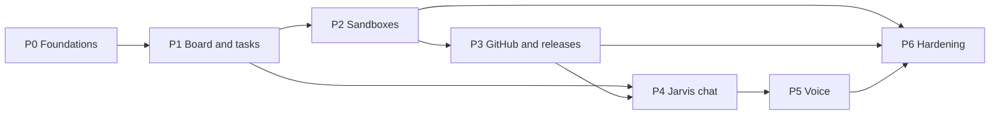

# Project plan

Phase 1 delivers the Software Factory. Requirements and page specifications are in [PRODUCT.md](PRODUCT.md); the system and stack in [docs/architecture.md](docs/architecture.md); the data model in [docs/data-model.md](docs/data-model.md); decisions and learnings in [docs/decisions.md](docs/decisions.md).

## Current focus

- **Active phase:** P0. P0-01 and P0-02 are merged. P0-03 implements the backend health endpoint, safe structured logs, offline tests and production container checks. P0-04 and P0-05 provide the locally checked core and Foundry Bicep templates; P0-06 completed the bootstrap. P2-02 and P2-04 are claimed in parallel. Azure deployment remains P0-11.
- **Next step:** Review P0-03 and complete P0-10 so P0-12 (automatic merges) and P0-13 (automatic statuses) can follow. Until then Dan starts tasks and merges green PRs, or explicitly authorizes Codex to merge them.
- **Blockers:** No production backend URL exists yet; P0-11 must record it in `apps/web/config.json`. P0-11 must also persist and supply `foundryNameTimestamp` on redeployments. These do not block opening the skeleton. Items marked **Confirm** or **Verify** block only the tasks that depend on them.

- **Runner (#28):** production port and main-only deployment are implemented in its PR. Live ACR/Foundry/Key Vault acceptance awaits #11; set `JARVIS_INFRA_DEPLOYMENT_NAME` after the successful infrastructure deployment and run Runner deploy from `main`.

## Implementation phases

Seven phases, P0–P6, each ending in something Dan can use. Every task is sized for one coding-agent task, has acceptance criteria, and names its dependencies. Each task has a [GitHub issue](https://github.com/DanAakesen/jarvis/issues) whose title starts with the task ID, and the Depends on column is mirrored as the issues' "Blocked by" dependencies, so GitHub shows which tasks are ready. Status values, who sets them, and the start, finish, and merge rules are in the [development workflow](docs/agent-context.md#development-workflow). Mark a phase complete only when all its acceptance criteria are met.

| Phase | Goal | Dan can then |
| --- | --- | --- |
| **P0** | Repository, infrastructure, sign-in, CI/CD, database | Sign in to an empty Jarvis at its URL |
| **P1** | Backend core, task store, board with live updates | Create projects and tasks and see them update live |
| **P2** | Tasks run in Foundry sandboxes with Codex or Copilot | Start, steer, pause, resume and cancel real coding tasks |
| **P3** | GitHub App, PR checks loop, merge policy, releases | Watch PRs, failing checks fixed automatically, releases and deploys |
| **P4** | The Jarvis agent in chat on the main page | Ask Jarvis in text to start and follow tasks |
| **P5** | Voice in Danish and English | Talk to Jarvis |
| **P6** | Recovery, cost views, monitoring, operations | Trust it day to day |

### Ground rules for every task

- **Source of truth:** [PRODUCT.md](PRODUCT.md) for requirements, [docs/decisions.md](docs/decisions.md) for decisions and learnings (L1–L28), [docs/architecture.md](docs/architecture.md) for the system. They win over anything a task implies; a task that conflicts with them stops and asks.
