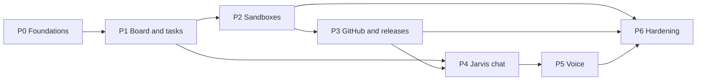

# Project plan

Phase 1 delivers the Software Factory. Requirements and page specifications are in [PRODUCT.md](PRODUCT.md); the system and stack in [docs/architecture.md](docs/architecture.md); the data model in [docs/data-model.md](docs/data-model.md); decisions and learnings in [docs/decisions.md](docs/decisions.md).

## Current focus

- **Active phase:** P0. P0-01 and P0-02 are merged. P0-05's Foundry template is merged in PR #79; this documentation follow-up lists its required timestamp input. P0-03 is claimed and in progress. P0-04 provides the locally checked core Bicep template; P0-06 completed the bootstrap. P3-01's registration manifest and secure setup guide are complete in PR #87; live GitHub and Key Vault setup is tracked separately by P3-10.
- **Next step:** Complete P0-03, then P0-10 so P0-12 (automatic merges) and P0-13 (automatic statuses) can follow. Until then Dan starts tasks and merges green PRs, or explicitly authorizes Codex to merge them.
- **Blockers:** No production backend URL exists yet; P0-11 must record it in `apps/web/config.json`. P0-11 must also persist and supply `foundryNameTimestamp` on redeployments. These do not block opening the skeleton. P3-10's live installation and Key Vault storage await Dan and the P0-11 deployment; webhook delivery also needs the P3-03 receiver. Items marked **Confirm** or **Verify** block only the tasks that depend on them.

## Implementation phases

Seven phases, P0–P6, each ending in something Dan can use. Every task is sized for one coding-agent task, has acceptance criteria, and names its dependencies. Each task has a [GitHub issue](https://github.com/DanAakesen/jarvis/issues) whose title starts with the task ID, and the Depends on column is mirrored as the issues' "Blocked by" dependencies, so GitHub shows which tasks are ready. Status values, who sets them, and the start, finish, and merge rules are in the [development workflow](docs/agent-context.md#development-workflow). Mark a phase complete only when all its acceptance criteria are met.

| Phase | Goal | Dan can then |
| --- | --- | --- |
| **P0** | Repository, infrastructure, sign-in, CI/CD, database | Sign in to an empty Jarvis at its URL |
| **P1** | Backend core, task store, board with live updates | Create projects and tasks and see them update live |
| **P2** | Tasks run in Foundry sandboxes with Codex or Copilot | Start, steer, pause, resume and cancel real coding tasks |
| **P3** | GitHub App, PR checks loop, merge policy, releases | Watch PRs, failing checks fixed automatically, releases and deploys |
| **P4** | The Jarvis agent in chat on the main page | Ask Jarvis in text to start and follow tasks |
| **P5** | Voice in Danish and English | Talk to Jarvis |
| **P6** | Recovery, cost views, monitoring, operations | Trust it day to day |

### Ground rules for every task

- **Source of truth:** [PRODUCT.md](PRODUCT.md) for requirements, [docs/decisions.md](docs/decisions.md) for decisions and learnings (L1–L24), [docs/architecture.md](docs/architecture.md) for the system. They win over anything a task implies; a task that conflicts with them stops and asks.
- **Workflow:** every agent follows the [development workflow](docs/agent-context.md#development-workflow): remote only, one PR per task, statuses on `main`, never start from a broken `main`.
- **Definition of done:** code, tests for changed behaviour, lint clean, every document in the [finish table](docs/agent-context.md#finish-a-task) updated, merged automatically through a PR whose checks pass against the latest `main`, deployed by GitHub Actions. No manual portal changes.
- **Secrets:** none in code, images, environment variables, or logs. Managed identities and Key Vault only ([sandbox credentials](docs/architecture.md#sandbox-credentials)).
- **Azure:** see [docs/agent-context.md](docs/agent-context.md#azure). Scripts pass `--subscription` explicitly (L7). Never reuse deleted Foundry names (L2).
- **Size:** one task = one PR, reviewable in under 30 minutes. Split anything larger.

### Reuse from the prototypes

| Prototype file | Becomes | Notes |
| --- | --- | --- |
| [`docs/reference/coding-sandbox-prototype/runner/`](docs/reference/coding-sandbox-prototype/runner/) (`app.py`, `Dockerfile`, tests) | `runner/` | ACP adapter, steer/pause/resume, Codex login handling and renewal. Remove the prototype's `crash-test` mode. Add live-event push (P2-03) and frequent pushes (P2-09). |
| [`docs/reference/coding-sandbox-prototype/infra/deploy.ps1`](docs/reference/coding-sandbox-prototype/infra/deploy.ps1) | Reference for Bicep and the Foundry agent-version deploy step | Keep its learnings: separate admin and runtime endpoints (L10), wait for the runtime host, explicit subscription, delete probe sessions (L14). |
| [`docs/reference/coding-sandbox-prototype/driver/src/cli.ts`](docs/reference/coding-sandbox-prototype/driver/src/cli.ts) | Reference for the backend's Foundry client | Invocations calls, status polling, steer/pause modes. |
| [`docs/reference/voice-prototype/agent/`](docs/reference/voice-prototype/agent/) | `agents/jarvis/` | Voice Live Bridge runtime, tool loop, strict action rules. Fake tools are replaced by calls to the backend. |
| [`docs/reference/voice-prototype/infra/`](docs/reference/voice-prototype/infra/) (`create_voice_agents.py`, `create_realtime_agents.py`) | Voice-agent provisioning step | Voices, transcription, warm-up rule (L21). |
| [`docs/reference/voice-prototype/client/talk.py`](docs/reference/voice-prototype/client/talk.py) | Reference for the browser audio client | Warm-up, reconnect, interruption handling. |

### P0 — Foundations

Goal: an empty Jarvis that Dan can sign in to, deployed entirely by GitHub Actions.

| ID | Task | Acceptance criteria | Depends on | Status |
| --- | --- | --- | --- | --- |
| P0-01 | Turn the pushed scaffold into the monorepo: folder layout from the [stack overview](docs/architecture.md#stack-overview) (`apps/web`, `apps/backend`, `agents/jarvis`, `runner`, `infra`, `db`), `README.md`, `.gitignore`, editor config, licence. Project rules stay in [docs/agent-context.md](docs/agent-context.md); the generated `AGENTS.md` is not edited | Folder layout on `main`; empty apps build | P0-06 | Complete |
| P0-02 | Web app skeleton: Vite + React + TypeScript, router, lint, Vitest. `npm run dev` in the repository root starts the web app on `http://localhost:5173` against the production backend; configuration comes from `infra/bootstrap.output.json` and the backend URL | `npm run build` and tests pass in CI; `npm run dev` then opening `http://localhost:5173` works with no other step | P0-01 | Complete |
| P0-03 | Backend skeleton: Fastify + TypeScript, `/health`, structured logging to Application Insights, lint, Vitest, Dockerfile; CORS allows only `http://localhost:5173` and the Static Web App origin | Container builds; `/health` returns 200 | P0-01 | In progress |
| P0-04 | Bicep: resource group, Log Analytics, Application Insights, Key Vault (RBAC), Storage (Blob), Container Registry, Azure SQL server + database `jarvis` (free offer; Entra admin = group `jarvis-sql-admins`), Container Apps environment + backend app (minimum 1 replica, existing identity `id-jarvis-backend`), Static Web App in West Europe, 300 DKK budget alert. Resource group `rg-jarvis` already exists | `az bicep build` and the Bicep linter pass in the PR (no Azure access needed); everything except the bootstrap items is in Bicep. The first real deployment is checked by P0-11 | P0-06 | Complete |
| P0-05 | Bicep: Foundry account and project (timestamped names, L2), model deployments (`gpt-5.6-luna`, `gpt-realtime-2.1`), project connections for ACR and Application Insights | `az bicep build` and the linter pass in the PR; P0-11's first deploy checks that the project data plane and runtime host answer (L10) | P0-04 | Complete |
| P0-06 | Bootstrap with [`infra/bootstrap.ps1`](infra/bootstrap.ps1): resource providers, `rg-jarvis`, deploy identity with GitHub OIDC (main branch) and roles on the resource group, `jarvis-api` (scope `access_as_user`, only Dan assigned) and `jarvis-web` (SPA), `id-jarvis-backend`, group `jarvis-sql-admins`, private repository and Actions variables | Script re-runs with no changes; IDs in `infra/bootstrap.output.json` | — | Complete |
| P0-07 | Database access and migrations: connect with managed identity; the backend runs pending migrations at startup under a SQL app lock; CI runs the migrations and database tests against SQL Server in a container (GitHub runners never reach Azure SQL) | **Verify** the chosen tools support Entra ID; a deploy applies a new migration once; CI passes against the container | P0-04, P0-03 | Not started |
| P0-08 | Backend authentication: validate `jarvis-api` tokens; allow-list Dan's object ID; reject everything else with 401/403 | Tests cover valid, wrong audience, wrong user, expired | P0-03, P0-06 | Not started |
| P0-09 | Web sign-in with MSAL; call `/me`; show Dan's name | Signing in with Dan's account works; any other account is refused by the backend | P0-02, P0-08 | Not started |
| P0-10 | CI workflow: lint, test, build for web, backend and Python on every PR | Runs on every PR; required checks on `main` once Dan has GitHub Pro (Free has no branch protection on private repositories) | P0-02, P0-03 | Not started |
| P0-11 | Deploy workflow for `main`: runs on `push` to `main` and on `workflow_dispatch` (started by the merge workflow, or by Dan as a manual redeploy of the current `main`). Deploys only what changed: `infra/` → Bicep, `apps/backend/` or `db/` → backend image to ACR and Container Apps, `apps/web/` → Static Web Apps; changes to shared files (root `package.json`, lockfile, workflows) deploy everything; a manual run deploys everything. Skips changes that touch only `*.md` or `docs/`. One deploy at a time (`concurrency` group, queued, never cancelled). After the first deploy, re-run `infra/bootstrap.ps1 -WebRedirectUris <Static Web App URL>` to allow sign-in there | The first deploy creates every Bicep resource, and a smoke step checks `/health` and the Foundry project endpoints (P0-04, P0-05); a merge deploys only the changed parts; a docs-only merge deploys nothing; two quick merges deploy one after the other; a manual run redeploys everything; the Jarvis URL and `http://localhost:5173` both show the signed-in page | P0-04…P0-10 | Not started |
| P0-12 | Merge workflow: when a PR's checks pass (`workflow_run`), squash-merge it if it is ready (not a draft; `copilot-ready.yml` already marks finished Copilot PRs ready), no Copilot session is still running on it (its latest timeline event is `copilot_work_finished`), its title starts with a task ID, `fix-main:`, or `docs:` (documentation only), and it contains the latest `main`; otherwise update the branch and wait for the checks again. While the latest CI or deploy run on `main` failed, merge only `fix-main:` PRs. After a merge, start CI and deploy on `main` with `workflow_dispatch`, because merges made with `GITHUB_TOKEN` do not trigger `push` workflows | A green, up-to-date PR merges with no human step; a failing or outdated PR does not; deploy runs after each merge; a red `main` blocks all but `fix-main:` PRs (tests on a scratch PR) | P0-10, P0-11 | Not started |
| P0-13 | Plan-status workflow: keeps the Status column of `PLAN.md` on `main` in step with GitHub. Issue gets an assignee, or a PR with `Fixes #<issue>` opens → In progress; the task's PR merged → Complete; PR closed unmerged and issue unassigned → Not started; a new task row in `PLAN.md` → a new issue in the standard format (task, acceptance criteria, depends on, "Before you start" and "Definition of done" checklist) with its "Blocked by" links. Commits only that column. **Verify** it can still commit if `main` gets branch protection | Statuses on `main` match GitHub within a minute for a test task | P0-10 | Not started |
| P0-14 | Cloud agent environments: `.github/workflows/copilot-setup-steps.yml` (Node, Python, dependencies) for Copilot cloud agent, and `scripts/codex-setup.sh` for Dan to use as the Codex cloud environment's setup script | One Copilot task and one Codex task each run lint and tests in their cloud environment | P0-02, P0-03 | Not started |

### P1 — Board and tasks

Goal: the Jarvis app shell, projects and tasks in SQL, and live updates on the board. No agents yet.

| ID | Task | Acceptance criteria | Depends on | Status |
| --- | --- | --- | --- | --- |
| P1-01 | Migrations for data-model groups 1–3: `settings`, `jarvis_sessions`, `messages`, `tool_calls`, `activity`, `projects`, `tasks`, `task_events` (columns, constraints, indexes as in the data model) | Migration up/down works against the CI container; applied in production by the next deploy | P0-07 | Not started |
| P1-02 | Backend module structure: `core` (settings, activity, events, SSE hub, tool registry) and `factory` (projects, tasks); each module registers routes and Jarvis tools | Adding a module needs no change in `core` | P0-03 | Not started |
| P1-03 | Projects API: list, create, update, archive; validation of `repo`, `policy`, `sandbox_size`, `tech`, `max_parallel_tasks` | Tests for each rule | P1-01, P1-02 | Not started |
| P1-04 | Tasks API: create (from board), list with filters, get with events; [task lifecycle](PRODUCT.md#task-lifecycle) enforced server-side | Illegal transitions rejected; tests for every transition | P1-01, P1-02 | Not started |
| P1-05 | Event pipeline: every state change and event writes `task_events` and `activity`, and is published on the SSE hub | An event reaches a connected client in under 1 s | P1-04 | Not started |
| P1-06 | SSE endpoint over `fetch` with bearer token; heartbeat comment every 25 s; resume from last event ID after reconnect | Reconnect replays missed events; no duplicates | P1-05, P0-08 | Not started |
| P1-07 | App shell: Jarvis main page, area navigation (Software Factory only), settings entry, activity panel | Matches the [page requirements](PRODUCT.md#page-requirements) (data points and actions; no visual design yet) | P0-09 | Not started |
| P1-08 | Factory task view: columns by state, cards with the card data points, create-task dialog, filters by project and agent | Matches the [page requirements](PRODUCT.md#software-factory--task-view); live updates via SSE | P1-04, P1-06, P1-07 | Not started |
| P1-09 | Task detail page: header, event timeline (all runner events), links, actions (shown, disabled until P2) | Matches the [page requirements](PRODUCT.md#page-requirements) | P1-08 | Not started |
| P1-10 | Projects page and project settings | Matches the [page requirements](PRODUCT.md#page-requirements) | P1-03, P1-07 | Not started |
| P1-11 | Settings page: Jarvis, voice and coding-agent settings stored in `settings`; changes apply to new sessions and tasks only | Matches the [page requirements](PRODUCT.md#settings-1); values validated against available models | P1-01, P1-07 | Not started |
| P1-12 | Sleep switch: backend endpoint changes its own minimum replicas (0/1) through ARM with its managed identity; refused while tasks are Ready or Running | Switching works; refusal tested | P0-11, P1-04 | Not started |

### P2 — Sandboxes

Goal: real coding tasks run in Foundry sandboxes, controlled from the board.

| ID | Task | Acceptance criteria | Depends on | Status |
| --- | --- | --- | --- | --- |
| P2-01 | Migrations for group 4 (`sandbox_sessions`, `sandbox_turns`, `artifacts`) and group 6 (`webhook_deliveries`, `credential_status`) | Migration works | P1-01 | Not started |
| P2-02 | Port the runner from the prototype into `runner/`; image builds in ACR; agent version deployed by a workflow (1×2 and 2×4 variants; small images per tech, L23); pinned CLI versions (L13) | Prototype runner tests pass; Key Vault probe works with the agent identity | P0-05 | Not started |
| P2-03 | Runner pushes live events to the backend (`POST /factory/sandbox-events`) authenticated with the agent identity; backend validates the identity and stores every event in `task_events` | Events appear on the task detail page live | P2-02, P1-05 | Not started |
| P2-04 | Backend Foundry client: start task, steer, pause, resume, cancel, status, delete session; separate admin and runtime endpoints (L10) | Contract tests against recorded responses | P0-05 | Not started |
| P2-05 | Dispatcher: picks Ready tasks within global and project limits using the lease columns; starts a sandbox; retries with `attempt_count`/`next_attempt_at`; then NeedsAttention | Two dispatcher instances never start the same task (test); no SQL queries while no task is Ready, Running or waiting for a retry, so the database can pause (test) | P2-04, P1-04 | Not started |
| P2-06 | Sandbox heartbeat: about once a minute per running session; updates `last_heartbeat_at`; crash rule from L22 (HTTP 424/404/5xx on two polls or 30 s → NeedsAttention); event gaps alone never trigger it | Rule unit-tested with recorded responses | P2-04, P2-01 | Not started |
| P2-07 | Task controls on the board: steer (text), pause, resume, cancel; buttons follow the state machine | End-to-end with both agents on a private test repository `DanAakesen/jarvis-test-target` (created with `gh`) | P2-04, P1-09 | Not started |
| P2-08 | Credentials for the sandbox: Copilot token and Codex login from Key Vault ([Codex login rules](docs/architecture.md#sandbox-credentials)); `credential_status` dates; daily Codex renewal job (renews at ≤3 days, never while a Codex task runs) | Renewal job proven once; dates on the board | P2-02 | Not started |
| P2-09 | Frequent pushes: instructions to the agent to commit and push work-in-progress to the task branch after each meaningful step | Branch shows intermediate commits on a test task | P2-02 | Not started |
| P2-10 | Crash recovery: on NeedsAttention after a crash, "Recover" starts a new session from the task branch with the task, its steering and a summary of its events; `completed` is accepted only when the branch and PR exist on GitHub (L22) | Forced-crash test recovers to a PR | P2-06, P2-09, P3-03 | Not started |
| P2-11 | Model and reasoning per task: runner passes the model (and reasoning effort for Codex) from settings or task overrides | **Verify** Codex (`codex-acp`) and Copilot CLI options first; record what works in [docs/decisions.md](docs/decisions.md) | P2-02, P1-11 | Not started |
| P2-12 | Usage: migration for group 7 (`usage`); sandbox minutes and DKK per session; Codex/Copilot turns and any reported tokens or premium requests | **Verify** what each agent reports; usage visible per task | P2-03, P2-01 | Not started |

### P3 — GitHub and releases

Goal: PR checks in GitHub Actions drive the task, merges follow the project policy, and releases are visible.

| ID | Task | Acceptance criteria | Depends on | Status |
| --- | --- | --- | --- | --- |
| P3-01 | Prepare the GitHub App registration settings and secure setup checklist; no live registration, installation, or secret provisioning by the cloud agent | Least-privilege manifest and manual steps are documented without exposing credentials | P0-04 | Complete |
| P3-02 | Installation tokens per push: the runner's Git credential helper asks the backend for a 1-hour token for the task's repository (agent identity authenticated); replaces the prototype's fine-grained token | Push from a sandbox works with an App token | P3-10, P2-02 | Not started |
| P3-03 | Webhook receiver: signature check, idempotency via `webhook_deliveries`, events `pull_request`, `check_run`, `workflow_run`, `deployment_status`, `push` | Duplicate deliveries are ignored (test) | P3-10, P2-01 | Not started |
| P3-04 | Migrations for group 5 (`pull_requests`, `workflow_runs`, `releases`, `deployments`) and mapping from webhooks | Records match GitHub for a test repository | P3-03 | Not started |
| P3-05 | Checks loop: a failed PR check stores the failing job's log in Blob and steers the task with it; the agent fixes and pushes | A deliberately failing test is fixed by the agent | P3-04, P2-07 | Not started |
| P3-06 | Project policy and merge: `deliver_pr` stops at a green PR; `complete_without_deployment` merges with the App when the project's merge rules pass; Done follows the policy | Both policies tested on a test repository | P3-04 | Not started |
| P3-07 | Release records: one release per merge to `main`; workflow runs and deployments linked by SHA | Release view data correct for a test project | P3-04 | Not started |
| P3-08 | Release view per project: list of releases with runs and deployments; horizontal git graph (branches as lines, commits as dots) from the GitHub API on demand, coloured by PR, checks, release and deployment state | Matches the [page requirements](PRODUCT.md#page-requirements) | P3-07, P1-07 | Not started |
| P3-09 | Template GitHub Actions workflows for managed projects: PR checks (full build and tests) and release (build, test, deploy with OIDC) | A new project can adopt them in one PR | P3-01 | Not started |
| P3-10 | Dan's live GitHub App setup: register from the P3-01 settings, install only on selected repositories, and store the private key in the deployed Key Vault | App installation is limited to Dan-selected repositories; Key Vault has the private-key secret; only the backend identity can read it | P0-11, P3-01 | Not started |

### P4 — Jarvis in chat

Goal: Dan talks to Jarvis in text on the main page; Jarvis uses the real backend.

| ID | Task | Acceptance criteria | Depends on | Status |
| --- | --- | --- | --- | --- |
| P4-01 | Port the hosted Jarvis agent from `docs/reference/voice-prototype/agent` to `agents/jarvis`; replace fake tools with calls to the backend's tool registry, authenticated with the agent identity | All factory tools work against the backend | P1-02, P0-05 | Not started |
| P4-02 | Tool registry endpoint: the backend exposes every registered tool's schema and executes calls; each call writes `tool_calls` | Tools of a new module appear without agent changes | P1-02 | Not started |
| P4-03 | Conversation store: one continuous conversation; each chat or voice sitting is a `jarvis_session`; messages and tool calls stored; tasks get `origin_message_id` | History visible on the main page | P1-01, P4-02 | Not started |
| P4-04 | Context for Jarvis: running tasks and recent events passed with each turn (saves the `list_tasks` round); a bounded window of recent messages | Typical commands answered in one model round | P4-01, P4-03 | Not started |
| P4-05 | Honest confirmations: Jarvis's reply about an action is built from the tool result (L16) | A refused or failed tool call is reported as such (test) | P4-02 | Not started |
| P4-06 | Chat on the main page: message list, input, streaming replies, tool-call chips linking to tasks | Matches the [page requirements](PRODUCT.md#page-requirements) | P1-07, P4-03 | Not started |
| P4-07 | Model and reasoning for Jarvis from settings, per session | Changing the setting changes the next session's model | P1-11, P4-01 | Not started |

### P5 — Voice

Goal: Dan talks to Jarvis in Danish or English in the browser.

| ID | Task | Acceptance criteria | Depends on | Status |
| --- | --- | --- | --- | --- |
| P5-01 | Browser voice connection design: no keys in the browser; choose backend-relayed WebSocket or short-lived tokens for Voice Live; record the choice in [docs/decisions.md](docs/decisions.md) and [docs/architecture.md](docs/architecture.md) | Decision recorded with a working spike | P0-08 | Not started |
| P5-02 | Danish voice agent: voice bridge to the Jarvis agent, MAI Transcribe (`da`, phrase list), Harper locked to `da-DK`, provisioned by a workflow | Danish round trip works from the browser | P4-01, P5-01 | Not started |
| P5-03 | English voice agent: `gpt-realtime-2.1`, Ryan HD, British butler persona; tool calls handled by the backend (not the browser) | English round trip with a tool call works | P5-01, P4-02 | Not started |
| P5-04 | Browser audio client: microphone capture, playback, interruption (stop playback on `speech_started`), silent warm-up before the microphone opens, automatic reconnect (L21) | Interruption and reconnect tested | P5-02 | Not started |
| P5-05 | Language toggle and voice settings on the main page and the settings page | Toggle switches voice agent for the next session | P5-02, P5-03, P1-11 | Not started |
| P5-06 | Voice sessions stored as `jarvis_sessions` with transcripts and usage (voice minutes) | Transcript and usage visible | P4-03, P2-12 | Not started |
| P5-07 | Dan's live test (V8 of the voice prototype) in Danish and English; record the verdict in [docs/decisions.md](docs/decisions.md) | Verdict recorded | P5-04, P5-05 | Not started |

### P6 — Hardening

Goal: Jarvis runs reliably and transparently day to day.

| ID | Task | Acceptance criteria | Depends on | Status |
| --- | --- | --- | --- | --- |
| P6-01 | Usage and cost views per task, project and period (DKK where billed; usage only for Codex and Copilot) | Matches the [page requirements](PRODUCT.md#page-requirements) | P2-12 | Not started |
| P6-02 | Alerts: failed deployments, sandbox crashes, credential expiry, budget 80 % | Each alert fires once in a test | P2-06, P2-08, P3-07 | Not started |
| P6-03 | Archive `task_events` by age to Blob; restore on demand for the task detail page | Archive and restore tested | P1-05 | Not started |
| P6-04 | Database backup and restore drill | Restore of `jarvis` to a temporary database documented | P0-04 | Not started |
| P6-05 | Parallel load test: several tasks across projects, both agents; watch Codex Pro limits | Results recorded in [docs/decisions.md](docs/decisions.md) | P2-05 | Not started |
| P6-06 | Runbook in the repository: deploy, rollback, rotate GitHub App key, re-seed Codex login, recover a crashed task, sleep switch | Runbook reviewed by Dan | P2-10, P3-10 | Not started |
| P6-07 | Ask Microsoft whether sandboxes can get the documented 20 GiB disk; if not, decide on Container Apps Jobs for heavy projects | Answer and decision in [docs/decisions.md](docs/decisions.md) | — | Not started |

### Out of scope for phase 1

Banking, health and fitness, calendar and other areas; the memory design (Decision 6); Jarvis by phone or Teams; Azure Web PubSub; the Codex API-key fallback (see [Ideas](#ideas)).

### Confirm before P0

1. Stack choices ([stack overview](docs/architecture.md#stack-overview)): all confirmed on 3 October 2026, including Fastify.
2. Prototype cleanup: done 3 October 2026. Azure environments and the test repository are deleted. Code and reports are kept in [docs/reference](docs/reference/) until P2 and P4 have ported them.
3. Environments: one production environment; the local web app uses the production backend. Done.

### Dan's manual steps

Everything else is scripted with `az` and `gh`, or runs in GitHub Actions. `infra/bootstrap.ps1` runs on Dan's PC with his permission, because it needs his signed-in Azure CLI and GitHub CLI.

| When | Step | Why it is manual |
| --- | --- | --- |
| Each task | Start it: assign its GitHub issue to Copilot, or give the task ID to Codex in its app. The agent claims the issue itself | Dan decides what runs |
| Now | Revoke the two prototype fine-grained GitHub tokens | Token management is web-only |
| Now | Copilot cloud agent: allow GitHub Actions to run on Copilot's PRs without approval (repository settings) | Repository setting with no CLI command |
| Now | Codex cloud: connect GitHub and `DanAakesen/jarvis` in ChatGPT → Codex; after P0-14, set its environment's setup script | ChatGPT sign-in in the browser |
| Now | Codex claim token: create a fine-grained token for `DanAakesen/jarvis` with only **Issues: read and write**; add it to the Codex environment as the environment variable `GH_TOKEN` (not a secret); allow agent internet access to `api.github.com` with GET, POST, and PATCH | Fine-grained tokens and Codex settings are web-only |
| Optional, now | Upgrade to GitHub Pro (https://github.com/account/upgrade) for required checks and 3,000 Actions minutes | Billing |
| During P2-08 | `codex login` in the Jarvis-only folder (`CODEX_HOME=.secrets\codex-jarvis`, Codex 0.157.0) | ChatGPT sign-in in the browser |
| During P2-08 | Create the Copilot fine-grained token (Copilot Requests only) | Fine-grained tokens can't be created by API |
| During P3-10 | Follow the [GitHub App setup checklist](docs/agent-context.md#github-app-setup): register the App from the prepared settings, install only on selected repositories, and import its private key into the deployed Key Vault | GitHub requires browser confirmation; key import needs Dan's Azure access; wait for P0-11, and configure webhooks after P3-03 |
| During P5-07 | Live voice test in Danish and English | Needs Dan's voice and judgement |

## Ideas

Proposals only; an idea enters a phase only when Dan accepts it into scope.

| Idea | What it does | Trade-off | Add when |
| --- | --- | --- | --- |
| Codex API-key fallback | Runs Codex tasks with an OpenAI API key when the Jarvis Pro login fails or the Pro plan's Codex limits are reached. | Billed per use on top of Pro; keeps tasks running and leaves Dan's own Codex allowance untouched. | Pro limits or login failures block tasks. |
| Jarvis by phone or Teams | Publishes the same Foundry voice agent to Microsoft Teams, Teams Phone, or a phone number (Twilio), so Dan can call Jarvis without the browser. | Phone audio is lower quality; a phone number and Teams Phone add monthly cost; callers must be verified before any action. | Dan wants Jarvis away from the browser. |
| Azure Web PubSub for board updates | Replaces server-sent events with a managed push service that holds the browser connections. | Free tier: 20 connections; Standard ≈ 320 DKK/month (list price). | The backend runs several copies at once, or many devices stay connected. |
| Foundry resilient tasks | Platform-managed recovery of in-progress hosted-agent work after a crash (preview; disabled in the prototype). | Preview; may replace part of the branch-restart recovery. | Crash recovery (P2-10) proves too lossy or complex. |
