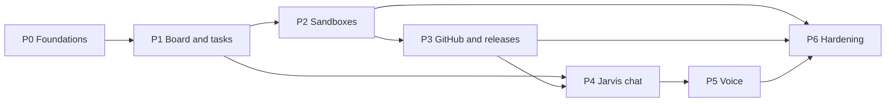

# Project plan

Phase 1 delivers the Software Factory. Requirements and page specifications are in [PRODUCT.md](PRODUCT.md); the system and stack in [docs/architecture.md](docs/architecture.md); the data model in [docs/data-model.md](docs/data-model.md); decisions and learnings in [docs/decisions.md](docs/decisions.md).

## Current focus

- **Active phase:** P0. P0-01, P0-02 and P0-03 are merged. P0-03 provides the backend health endpoint, safe structured logs, offline tests and production container checks. P0-04 and P0-05 provide the locally checked core and Foundry Bicep templates; P0-06 completed the bootstrap. P2-02 and P2-04 are merged with offline runner and backend Foundry contracts; live sandbox acceptance still awaits P0-16. P1-02 provides backend module composition and the internal tool catalogue; P4-02 adds HTTP discovery/dispatch and records calls against the group-one `tool_calls` table, whose migration remains P1-01. Domain APIs, event persistence and SSE remain later P1 tasks. P0-14 adds the Copilot and Codex cloud environment setup; the Codex run is P0-15. P3-01's registration settings and secure setup guide are complete; Dan registered and installed the App on 3 October 2026, and its private key and Key Vault storage are P3-10, after P0-16. P3-09 adds copy-ready managed-project PR and release workflows; adoption and Azure deployment remain unverified. P5-01 selects an authenticated backend WebSocket relay. P5-03 adds the backend-owned English realtime session and tool loop, verified against a local mock; Azure interoperability and browser audio remain unverified. P0-11 adds the `main` Deploy workflow (changed parts only, queued, smoke checks); its first live run and the post-deploy setup are P0-16. P1-07 adds the signed-in app shell: the Jarvis main page, Software Factory area navigation, the settings entry and the "Now" activity panel. Each unbuilt data point and action is shown with an explanation and disabled; P1-13 connects the activity panel to a backend feed. P4-05 makes each tool response carry an `ok`/`refused`/`error` outcome and a backend-built confirmation; the hosted agent must relay it once P4-01 connects to the dispatcher. P4-02 adds HTTP discovery/dispatch and records calls against the group-one `tool_calls` table, whose migration is P1-01. P4-01 ports the hosted Jarvis agent to `agents/jarvis`: its tools come only from the backend registry, called with the agent's app-only `Jarvis.Tools` token, which the backend accepts on the tool routes only. It is checked offline and against a locally built backend. Live use needs message IDs (P4-03), factory tools (P1-03/P1-04) and deployment (P4-08). Azure deployment remains P0-16.
- **Coordinator (#12):** Removed at Dan's request. The separate Project board sync from #108 is restored and retains its existing `project-board` environment; only the coordinator is withdrawn. Dan or an explicitly authorized agent merges tested PRs. Deployment integration remains #11.
- **Conversation (#50):** P4-03 stores chat and voice sessions and exposes paginated history on the signed-in main page. Chat sending remains P4-06, voice wiring P5-03/P5-04, and agent-driven task creation P1-04/P4-01; production SQL verification awaits P0-11. P4-04 still waits on P4-01; P4-06 is unblocked by P1-07 and P4-03.

- **Next step:** P0-10 (aggregate CI), P0-11 (deploy workflow) and P0-13 (automatic task statuses and issue dependencies) are complete. P0-16 is in progress: Deploy runs 1 and 2 on `main` failed at Azure sign-in because GitHub issues this repository immutable-ID OIDC subjects (`repo:DanAakesen@68902534/jarvis@1403065900:ref:refs/heads/main`, L49). After the P0-16 fix merges, Dan re-runs `./infra/bootstrap.ps1` to add that federated credential and starts Deploy manually on `main`; then `infra/bootstrap.ps1 -WebRedirectUris <Static Web App URL>`, the backend URL in `apps/web/config.json`, and `JARVIS_INFRA_DEPLOYMENT_NAME=jarvis-infra`; the P0-12 coordinator is withdrawn. Required checks on `main` wait for GitHub Pro. Until then Dan starts tasks and merges green PRs, or explicitly authorizes Codex to merge them. Issue #30's live Azure validation remains #11 and end-to-end task controls #33.
- **Blockers:** `main`'s Deploy is red until Dan re-runs `infra/bootstrap.ps1` (P0-16); only that fix and `fix-main:` work proceed meanwhile. No production backend URL exists yet; P0-16 records it in `apps/web/config.json` after the first deploy (the deployed web build already receives it from the Bicep outputs). `foundryNameTimestamp` is fixed at `20261003200000` in `infra/main.parameters.json`. These do not block opening the skeleton. P3-10's private key and Key Vault storage await the first deployment (P0-16) (the App is already registered and installed); webhook delivery also needs the P3-03 receiver. Items marked **Confirm** or **Verify** block only the tasks that depend on them.

- **Database (#7):** managed-identity connection and bounded startup migration ownership are implemented in PR #100; 118 offline backend tests and isolated SQL Server contracts pass; the SQL job is part of aggregate CI. Bicep now supplies the managed-identity SQL settings and the Deploy workflow requires `/health` after each backend deploy; applying migrations in Azure is observed in P0-16.

- **Runner (#28):** production port and main-only deployment are implemented in its PR. Live ACR/Foundry/Key Vault acceptance awaits the first deploy (P0-16); then set `JARVIS_INFRA_DEPLOYMENT_NAME` to `jarvis-infra` and run Runner deploy from `main`. Runner deploy shares the queued `jarvis-production-deploy` group. P2-09 adds per-turn frequent-push instructions with offline coverage; live intermediate-commit acceptance remains with P2-07.

- **Schema (#15):** P1-01 adds `0001_core_tables.sql` (groups 1–3) with a reviewed down script and a lock-guarded `revertMigration`; SQL Server CI proves up, constraints, down and re-up. The first production application happens during P0-16's first deploy. P1-03, P1-04 and P1-11 are unblocked on the schema side.
- **Authentication (#8–#9):** backend bearer validation, MSAL browser sign-in and the protected `/me` profile endpoint are implemented and checked offline. Dan's account is allow-listed by object ID; other accounts are refused. Live Entra sign-in and deployed backend verification remain pending P0-16 because this environment has no Azure access.

## Implementation phases

Seven phases, P0–P6, each ending in something Dan can use. Every task is sized for one coding-agent task, has acceptance criteria, and names its dependencies. Each task has a [GitHub issue](https://github.com/DanAakesen/jarvis/issues) whose title starts with the task ID, and the Depends on column is mirrored as the issues' "Blocked by" dependencies, so GitHub shows which tasks are ready. Status values, who sets them, and the start, finish, and merge rules are in the [development workflow](docs/agent-context.md#development-workflow). Mark a phase complete only when all its acceptance criteria are met.

| Phase | Goal | Dan can then |
| --- | --- | --- |
| **P0** | Repository, infrastructure, sign-in, CI/CD, database | Sign in to an empty Jarvis at its URL |
| **P1** | Backend core, task store, board with live updates | Create projects and tasks and see them update live |
| **P2** | Tasks run in Foundry sandboxes with Codex or Copilot | Start, steer, pause, resume and cancel real coding tasks |
| **P3** | GitHub App, PR checks loop, merge policy, releases | Watch PRs, failing checks fixed automatically, releases and deploys |
| **P4** | The Jarvis agent in chat on the main page | Ask Jarvis in text to start and follow tasks |
| **P5** | Voice in Danish and English | Talk to Jarvis |
| **P6** | Recovery, cost views, monitoring, operations | Trust it day to day |

### Ground rules for every task

- **Source of truth:** [PRODUCT.md](PRODUCT.md) for requirements, [docs/decisions.md](docs/decisions.md) for decisions and learnings (L1–L40), [docs/architecture.md](docs/architecture.md) for the system. They win over anything a task implies; a task that conflicts with them stops and asks.
- **Workflow:** every agent follows the [development workflow](docs/agent-context.md#development-workflow): remote only, one PR per task, statuses on `main`, never start from a broken `main`.
- **Definition of done:** code, tests for changed behaviour, lint clean, every document in the [finish table](docs/agent-context.md#finish-a-task) updated, merged automatically through a PR whose checks pass against the latest `main`, deployed by GitHub Actions. No manual portal changes.
- **Secrets:** none in code, images, environment variables, or logs. Managed identities and Key Vault only ([sandbox credentials](docs/architecture.md#sandbox-credentials)).
- **Azure:** see [docs/agent-context.md](docs/agent-context.md#azure). Scripts pass `--subscription` explicitly (L7). Never reuse deleted Foundry names (L2).
- **Size:** one task = one PR, reviewable in under 30 minutes. Split anything larger.

### Reuse from the prototypes

| Prototype file | Becomes | Notes |
| --- | --- | --- |
| [`docs/reference/coding-sandbox-prototype/runner/`](docs/reference/coding-sandbox-prototype/runner/) (`app.py`, `Dockerfile`, tests) | `runner/` | ACP adapter, steer/pause/resume, Codex login handling and renewal. Remove the prototype's `crash-test` mode. Add live-event push (P2-03) and frequent pushes (P2-09). |
| [`docs/reference/coding-sandbox-prototype/infra/deploy.ps1`](docs/reference/coding-sandbox-prototype/infra/deploy.ps1) | Reference for Bicep and the Foundry agent-version deploy step | Keep its learnings: separate admin and runtime endpoints (L10), wait for the runtime host, explicit subscription, delete probe sessions (L14). |
| [`docs/reference/coding-sandbox-prototype/driver/src/cli.ts`](docs/reference/coding-sandbox-prototype/driver/src/cli.ts) | Reference for the backend's Foundry client | Invocations calls, status polling, steer/pause modes. |
| [`docs/reference/voice-prototype/agent/`](docs/reference/voice-prototype/agent/) | `agents/jarvis/` | Voice Live Bridge runtime, tool loop, strict action rules. Fake tools are replaced by calls to the backend. |
| [`docs/reference/voice-prototype/infra/`](docs/reference/voice-prototype/infra/) (`create_voice_agents.py`, `create_realtime_agents.py`) | Voice-agent provisioning step | Voices, transcription, warm-up rule (L21). |
| [`docs/reference/voice-prototype/client/talk.py`](docs/reference/voice-prototype/client/talk.py) | Reference for the browser audio client | Warm-up, reconnect, interruption handling. |

### P0 — Foundations

Goal: an empty Jarvis that Dan can sign in to, deployed entirely by GitHub Actions.

| ID | Issue | Task | Acceptance criteria | Depends on | Status |
| --- | --- | --- | --- | --- | --- |
| P0-01 | [#1](https://github.com/DanAakesen/jarvis/issues/1) | Turn the pushed scaffold into the monorepo: folder layout from the [stack overview](docs/architecture.md#stack-overview) (`apps/web`, `apps/backend`, `agents/jarvis`, `runner`, `infra`, `db`), `README.md`, `.gitignore`, editor config, licence. Project rules stay in [docs/agent-context.md](docs/agent-context.md); the generated `AGENTS.md` is not edited | Folder layout on `main`; empty apps build | P0-06 | Complete |
| P0-02 | [#2](https://github.com/DanAakesen/jarvis/issues/2) | Web app skeleton: Vite + React + TypeScript, router, lint, Vitest. `npm run dev` in the repository root starts the web app on `http://localhost:5173` against the production backend; configuration comes from `infra/bootstrap.output.json` and the backend URL | `npm run build` and tests pass in CI; `npm run dev` then opening `http://localhost:5173` works with no other step | P0-01 | Complete |
| P0-03 | [#3](https://github.com/DanAakesen/jarvis/issues/3) | Backend skeleton: Fastify + TypeScript, `/health`, structured logging to Application Insights, lint, Vitest, Dockerfile; CORS allows only `http://localhost:5173` and the Static Web App origin | Container builds; `/health` returns 200 | P0-01 | Complete |
| P0-04 | [#4](https://github.com/DanAakesen/jarvis/issues/4) | Bicep: resource group, Log Analytics, Application Insights, Key Vault (RBAC), Storage (Blob), Container Registry, Azure SQL server + database `jarvis` (free offer; Entra admin = group `jarvis-sql-admins`), Container Apps environment + backend app (minimum 1 replica, existing identity `id-jarvis-backend`), Static Web App in West Europe, 300 DKK budget alert. Resource group `rg-jarvis` already exists | `az bicep build` and the Bicep linter pass in the PR (no Azure access needed); everything except the bootstrap items is in Bicep. The first real deployment is checked by P0-11 | P0-06 | Complete |
| P0-05 | [#5](https://github.com/DanAakesen/jarvis/issues/5) | Bicep: Foundry account and project (timestamped names, L2), model deployments (`gpt-5.6-luna`, `gpt-realtime-2.1`), project connections for ACR and Application Insights | `az bicep build` and the linter pass in the PR; P0-11's first deploy checks that the project data plane and runtime host answer (L10) | P0-04 | Complete |
| P0-06 | [#6](https://github.com/DanAakesen/jarvis/issues/6) | Bootstrap with [`infra/bootstrap.ps1`](infra/bootstrap.ps1): resource providers, `rg-jarvis`, deploy identity with GitHub OIDC (main branch) and roles on the resource group, `jarvis-api` (scope `access_as_user`, only Dan assigned) and `jarvis-web` (SPA), `id-jarvis-backend`, group `jarvis-sql-admins`, private repository and Actions variables | Script re-runs with no changes; IDs in `infra/bootstrap.output.json` | — | Complete |
| P0-07 | [#7](https://github.com/DanAakesen/jarvis/issues/7) | Database access and migrations: connect with managed identity; the backend runs pending migrations at startup under a SQL app lock; CI runs the migrations and database tests against SQL Server in a container (GitHub runners never reach Azure SQL) | **Verify** the chosen tools support Entra ID; CI passes against the container. The live check (a deploy applies a new migration once) moved to P0-11 on 3 October 2026, because P0-11 depends on this task | P0-04, P0-03 | Complete |
| P0-08 | [#8](https://github.com/DanAakesen/jarvis/issues/8) | Backend authentication: validate `jarvis-api` tokens; allow-list Dan's object ID; reject everything else with 401/403 | Tests cover valid, wrong audience, wrong user, expired | P0-03, P0-06 | Complete |
| P0-09 | [#9](https://github.com/DanAakesen/jarvis/issues/9) | Web sign-in with MSAL; call `/me`; show Dan's name | Signing in with Dan's account works; any other account is refused by the backend | P0-02, P0-08 | Complete |
| P0-10 | [#10](https://github.com/DanAakesen/jarvis/issues/10) | CI workflow: lint, test, build for web, backend and Python on every PR | Runs on every PR; required checks on `main` once Dan has GitHub Pro (Free has no branch protection on private repositories) | P0-02, P0-03 | Complete |
| P0-11 | [#11](https://github.com/DanAakesen/jarvis/issues/11) | Deploy workflow for `main`: runs on `push` to `main` and on `workflow_dispatch` (started by Dan as a manual redeploy of the current `main`). Deploys only what changed: `infra/` → Bicep, `apps/backend/` or `db/` → backend image to ACR and Container Apps, `apps/web/` → Static Web Apps; changes to shared files (root `package.json`, lockfile, workflows) deploy everything; a manual run deploys everything. Skips changes that touch only `*.md` or `docs/`. One deploy at a time (`concurrency` group, queued, never cancelled). After the first deploy, re-run `infra/bootstrap.ps1 -WebRedirectUris <Static Web App URL>` to allow sign-in there | The first deploy creates every Bicep resource, and a smoke step checks `/health` and the Foundry project endpoints (P0-04, P0-05); a merge deploys only the changed parts; a docs-only merge deploys nothing; two quick merges deploy one after the other; a manual run redeploys everything; the Jarvis URL and `http://localhost:5173` both show the signed-in page | P0-04…P0-10 | Complete |
| P0-12 | [#12](https://github.com/DanAakesen/jarvis/issues/12) | Coordinator withdrawn at Dan's request: automatic issue assignment, PR merges and conflict-repair dispatch removed. Keep the separate Project board sync from #13 and its existing environment. PR merges are manual or explicitly authorized | Coordinator workflow and scripts absent; Project board workflow, script, tests and environment retained | P0-10, P0-11 | Complete |
| P0-13 | [#13](https://github.com/DanAakesen/jarvis/issues/13) | Plan-status workflow: keeps the Issue and Status columns of `PLAN.md` on `main` in step with GitHub. An open issue with a `Codex`, `Copilot`, `Dan` or `Jarvis` worker label, or an open PR with `Fixes #<issue>` → In progress; merged PR or completed issue → Complete; an open issue without a worker label or open linked PR → Not started. Preserve manually set Blocked. A new task row creates a standard issue with its "Blocked by" links. Commits only Issue and Status cells. **Verify** it can still commit if `main` gets branch protection | Every task row's issue link and status match GitHub within a minute; worker-label and linked-PR changes reconcile to In progress, Complete, or Not started as defined above | P0-10 | Complete |
| P0-14 | [#14](https://github.com/DanAakesen/jarvis/issues/14) | Cloud agent environments: `.github/workflows/copilot-setup-steps.yml` (Node, Python, dependencies) for Copilot cloud agent, and `scripts/codex-setup.sh` for Dan to use as the Codex cloud environment's setup script | One Copilot task and one Codex task each run lint and tests in their cloud environment. Copilot verified; the Codex run moved to P0-15 because it needs Dan's Codex settings after merge | P0-02, P0-03 | Complete |
| P0-15 | [#107](https://github.com/DanAakesen/jarvis/issues/107) | Verify the Codex cloud environment: Dan sets `bash scripts/codex-setup.sh` as the setup script (see [agent-context](docs/agent-context.md#cloud-agent-environments)); a Codex task then runs `npm run lint` and `npm test` | Setup completes with Node.js 22.23.3, npm 10.9.9 and Python 3.12.14; one Codex task runs lint and tests | P0-14 | Complete |
| P0-16 | [#131](https://github.com/DanAakesen/jarvis/issues/131) | First production deploy and post-deploy setup: Dan runs the Deploy workflow on `main` (or merges P0-11), then runs `infra/bootstrap.ps1 -WebRedirectUris <Static Web App URL>`, records the backend URL in `apps/web/config.json`, and sets the Actions variable `JARVIS_INFRA_DEPLOYMENT_NAME` to `jarvis-infra` for Runner deploy. Fix anything the first run exposes (Foundry smoke routes, SQL group sign-in, model quota) | The Deploy run creates every Bicep resource; `/health` and the Foundry smoke step pass; the startup log shows migrations applied once with managed identity; a docs-only merge starts no deploy; two quick merges deploy in order; a manual run redeploys everything; the Jarvis URL and `http://localhost:5173` both show the signed-in page | P0-11 | Complete |

### P1 — Board and tasks

Goal: the Jarvis app shell, projects and tasks in SQL, and live updates on the board. No agents yet.

| ID | Issue | Task | Acceptance criteria | Depends on | Status |
| --- | --- | --- | --- | --- | --- |
| P1-01 | [#15](https://github.com/DanAakesen/jarvis/issues/15) | Migrations for data-model groups 1–3: `settings`, `jarvis_sessions`, `messages`, `tool_calls`, `activity`, `projects`, `tasks`, `task_events` (columns, constraints, indexes as in the data model) | Migration up/down works against the CI container; applied in production by the next deploy | P0-07 | Complete |
| P1-02 | [#16](https://github.com/DanAakesen/jarvis/issues/16) | Backend module structure: `core` (settings, activity, events, SSE hub, tool registry) and `factory` (projects, tasks); each module registers routes and Jarvis tools | Adding a module needs no change in `core` | P0-03 | Complete |
| P1-03 | [#17](https://github.com/DanAakesen/jarvis/issues/17) | Projects API: list, create, update, archive; validation of `repo`, `policy`, `sandbox_size`, `tech`, `max_parallel_tasks` | Tests for each rule | P1-01, P1-02 | Complete |
| P1-04 | [#18](https://github.com/DanAakesen/jarvis/issues/18) | Tasks API: create (from board), list with filters, get with events; [task lifecycle](PRODUCT.md#task-lifecycle) enforced server-side | Illegal transitions rejected; tests for every transition | P1-01, P1-02 | In progress |
| P1-05 | [#19](https://github.com/DanAakesen/jarvis/issues/19) | Event pipeline: every state change and event writes `task_events` and `activity`, and is published on the SSE hub | An event reaches a connected client in under 1 s | P1-04 | Not started |
| P1-06 | [#20](https://github.com/DanAakesen/jarvis/issues/20) | SSE endpoint over `fetch` with bearer token; heartbeat comment every 25 s; resume from last event ID after reconnect | Reconnect replays missed events; no duplicates | P1-05, P0-08 | Not started |
| P1-07 | [#21](https://github.com/DanAakesen/jarvis/issues/21) | App shell: Jarvis main page, area navigation (Software Factory only), settings entry, activity panel | Matches the [page requirements](PRODUCT.md#page-requirements) (data points and actions; no visual design yet) | P0-09 | Complete |
| P1-08 | [#22](https://github.com/DanAakesen/jarvis/issues/22) | Factory task view: columns by state, cards with the card data points, create-task dialog, filters by project and agent | Matches the [page requirements](PRODUCT.md#software-factory--task-view); live updates via SSE | P1-04, P1-06, P1-07 | Not started |
| P1-09 | [#23](https://github.com/DanAakesen/jarvis/issues/23) | Task detail page: header, event timeline (all runner events), links, actions (shown, disabled until P2) | Matches the [page requirements](PRODUCT.md#page-requirements) | P1-08 | Not started |
| P1-10 | [#24](https://github.com/DanAakesen/jarvis/issues/24) | Projects page and project settings | Matches the [page requirements](PRODUCT.md#page-requirements) | P1-03, P1-07 | Not started |
| P1-11 | [#25](https://github.com/DanAakesen/jarvis/issues/25) | Settings page: Jarvis, voice and coding-agent settings stored in `settings`; changes apply to new sessions and tasks only | Matches the [page requirements](PRODUCT.md#settings-1); values validated against available models | P1-01, P1-07 | In progress |
| P1-12 | [#26](https://github.com/DanAakesen/jarvis/issues/26) | Sleep switch: backend endpoint changes its own minimum replicas (0/1) through ARM with its managed identity; refused while tasks are Ready or Running | Switching works; refusal tested | P0-11, P1-04 | Not started |
| P1-13 | [#136](https://github.com/DanAakesen/jarvis/issues/136) | Now feed: a protected backend read of the main page's "Now" data (running tasks with project, agent, activity and start time; activity items for tasks needing attention, releases and deployments, and credential warnings, each with its `activity.link`) and a dismiss action that persists per item (adds a dismissal column to `activity` with an up/down migration); connect the web activity panel and update it through SSE | The main page shows real running tasks and activity; a dismissed item stays dismissed after reload; tests for the read, dismissal and an unknown item | P1-05, P1-06, P1-07 | Not started |

### P2 — Sandboxes

Goal: real coding tasks run in Foundry sandboxes, controlled from the board.

| ID | Issue | Task | Acceptance criteria | Depends on | Status |
| --- | --- | --- | --- | --- | --- |
| P2-01 | [#27](https://github.com/DanAakesen/jarvis/issues/27) | Migrations for group 4 (`sandbox_sessions`, `sandbox_turns`, `artifacts`) and group 6 (`webhook_deliveries`, `credential_status`) | Migration works | P1-01 | In progress |
| P2-02 | [#28](https://github.com/DanAakesen/jarvis/issues/28) | Port the runner from the prototype into `runner/`; image builds in ACR; agent version deployed by a workflow (1×2 and 2×4 variants; small images per tech, L23); pinned CLI versions (L13) | Prototype runner tests pass; Key Vault probe works with the agent identity | P0-05 | Complete |
| P2-03 | [#29](https://github.com/DanAakesen/jarvis/issues/29) | Runner pushes live events to the backend (`POST /factory/sandbox-events`) authenticated with the agent identity; backend validates the identity and stores every event in `task_events` | Events appear on the task detail page live | P2-02, P1-05 | Not started |
| P2-04 | [#30](https://github.com/DanAakesen/jarvis/issues/30) | Backend Foundry client: start task, steer, pause, resume, cancel, status, delete session; separate admin and runtime endpoints (L10) | Contract tests against recorded responses | P0-05 | Complete |
| P2-05 | [#31](https://github.com/DanAakesen/jarvis/issues/31) | Dispatcher: picks Ready tasks within global and project limits using the lease columns; starts a sandbox; retries with `attempt_count`/`next_attempt_at`; then NeedsAttention | Two dispatcher instances never start the same task (test); no SQL queries while no task is Ready, Running or waiting for a retry, so the database can pause (test) | P2-04, P1-04 | Not started |
| P2-06 | [#32](https://github.com/DanAakesen/jarvis/issues/32) | Sandbox heartbeat: about once a minute per running session; updates `last_heartbeat_at`; crash rule from L22 (HTTP 424/404/5xx on two polls or 30 s → NeedsAttention); event gaps alone never trigger it | Rule unit-tested with recorded responses | P2-04, P2-01 | Not started |
| P2-07 | [#33](https://github.com/DanAakesen/jarvis/issues/33) | Task controls on the board: steer (text), pause, resume, cancel; buttons follow the state machine | End-to-end with both agents on a private test repository `DanAakesen/jarvis-test-target` (created with `gh`); the task branch shows intermediate commits | P2-04, P1-09 | Not started |
| P2-08 | [#34](https://github.com/DanAakesen/jarvis/issues/34) | Credentials for the sandbox: Copilot token and Codex login from Key Vault ([Codex login rules](docs/architecture.md#sandbox-credentials)); `credential_status` dates; daily Codex renewal job (renews at ≤3 days, never while a Codex task runs) | Renewal job proven once; dates on the board | P2-02, P2-01 | Not started |
| P2-09 | [#35](https://github.com/DanAakesen/jarvis/issues/35) | Frequent pushes: instructions to the agent to commit and push work-in-progress to the task branch after each meaningful step | Offline tests verify instructions reach new, resumed, and recovered agent prompts; live task-branch acceptance is checked in P2-07 | P2-02 | Complete |
| P2-10 | [#36](https://github.com/DanAakesen/jarvis/issues/36) | Crash recovery: on NeedsAttention after a crash, "Recover" starts a new session from the task branch with the task, its steering and a summary of its events; `completed` is accepted only when the branch and PR exist on GitHub (L22) | Forced-crash test recovers to a PR | P2-06, P2-09, P3-03 | Not started |
| P2-11 | [#37](https://github.com/DanAakesen/jarvis/issues/37) | Model and reasoning per task: runner passes the model (and reasoning effort for Codex) from settings or task overrides | **Verify** Codex (`codex-acp`) and Copilot CLI options first; record what works in [docs/decisions.md](docs/decisions.md) | P2-02, P1-11 | Not started |
| P2-12 | [#38](https://github.com/DanAakesen/jarvis/issues/38) | Usage: migration for group 7 (`usage`); sandbox minutes and DKK per session; Codex/Copilot turns and any reported tokens or premium requests | **Verify** what each agent reports; usage visible per task | P2-03, P2-01 | Not started |

### P3 — GitHub and releases

Goal: PR checks in GitHub Actions drive the task, merges follow the project policy, and releases are visible.

| ID | Issue | Task | Acceptance criteria | Depends on | Status |
| --- | --- | --- | --- | --- | --- |
| P3-01 | [#39](https://github.com/DanAakesen/jarvis/issues/39) | Prepare the GitHub App registration settings and secure setup checklist; no live registration, installation, or secret provisioning by the cloud agent | Least-privilege manifest and manual steps are documented without exposing credentials | P0-04 | Complete |
| P3-02 | [#40](https://github.com/DanAakesen/jarvis/issues/40) | Installation tokens per push: the runner's Git credential helper asks the backend for a 1-hour token for the task's repository (agent identity authenticated); replaces the prototype's fine-grained token | Push from a sandbox works with an App token | P3-10, P2-02 | Not started |
| P3-03 | [#41](https://github.com/DanAakesen/jarvis/issues/41) | Webhook receiver: signature check, idempotency via `webhook_deliveries`, events `pull_request`, `check_run`, `workflow_run`, `deployment_status`, `push` | Duplicate deliveries are ignored (test) | P3-10, P2-01 | Not started |
| P3-04 | [#42](https://github.com/DanAakesen/jarvis/issues/42) | Migrations for group 5 (`pull_requests`, `workflow_runs`, `releases`, `deployments`) and mapping from webhooks | Records match GitHub for a test repository | P3-03 | Not started |
| P3-05 | [#43](https://github.com/DanAakesen/jarvis/issues/43) | Checks loop: a failed PR check stores the failing job's log in Blob and steers the task with it; the agent fixes and pushes | A deliberately failing test is fixed by the agent | P3-04, P2-07 | Not started |
| P3-06 | [#44](https://github.com/DanAakesen/jarvis/issues/44) | Project policy and merge: `deliver_pr` stops at a green PR; `complete_without_deployment` merges with the App when the project's merge rules pass; Done follows the policy | Both policies tested on a test repository | P3-04 | Not started |
| P3-07 | [#45](https://github.com/DanAakesen/jarvis/issues/45) | Release records: one release per merge to `main`; workflow runs and deployments linked by SHA | Release view data correct for a test project | P3-04 | Not started |
| P3-08 | [#46](https://github.com/DanAakesen/jarvis/issues/46) | Release view per project: list of releases with runs and deployments; horizontal git graph (branches as lines, commits as dots) from the GitHub API on demand, coloured by PR, checks, release and deployment state | Matches the [page requirements](PRODUCT.md#page-requirements) | P3-07, P1-07 | Not started |
| P3-09 | [#47](https://github.com/DanAakesen/jarvis/issues/47) | Template GitHub Actions workflows for managed projects: PR checks (full build and tests) and release (build, test, deploy with OIDC) | A new project can adopt them in one PR | P3-01 | Complete |
| P3-10 | [#102](https://github.com/DanAakesen/jarvis/issues/102) | Dan's live GitHub App setup: register from the P3-01 settings and install only on selected repositories (done 3 October 2026); after P0-11, generate the private key and store it in the deployed Key Vault | App installation is limited to Dan-selected repositories; Key Vault has the private-key secret; only the backend identity can read it | P0-11, P3-01 | In progress |

### P4 — Jarvis in chat

Goal: Dan talks to Jarvis in text on the main page; Jarvis uses the real backend.

| ID | Issue | Task | Acceptance criteria | Depends on | Status |
| --- | --- | --- | --- | --- | --- |
| P4-01 | [#48](https://github.com/DanAakesen/jarvis/issues/48) | Port the hosted Jarvis agent from `docs/reference/voice-prototype/agent` to `agents/jarvis`; replace fake tools with calls to the backend's tool registry, authenticated with the agent identity | All factory tools work against the backend | P1-02, P0-05, P4-02 | Complete |
| P4-02 | [#49](https://github.com/DanAakesen/jarvis/issues/49) | Tool registry endpoint: the backend exposes every registered tool's schema and executes calls; each call writes `tool_calls` | Tools of a new module appear without agent changes | P1-02 | Complete |
| P4-03 | [#50](https://github.com/DanAakesen/jarvis/issues/50) | Conversation store: one continuous conversation; each chat or voice sitting is a `jarvis_session`; messages and tool calls stored; tasks get `origin_message_id` | History visible on the main page | P1-01, P4-02 | Complete |
| P4-04 | [#51](https://github.com/DanAakesen/jarvis/issues/51) | Context for Jarvis: running tasks and recent events passed with each turn (saves the `list_tasks` round); a bounded window of recent messages | Typical commands answered in one model round | P4-01, P4-03 | Not started |
| P4-05 | [#52](https://github.com/DanAakesen/jarvis/issues/52) | Honest confirmations: Jarvis's reply about an action is built from the tool result (L16) | A refused or failed tool call is reported as such (test) | P4-02 | Complete |
| P4-06 | [#53](https://github.com/DanAakesen/jarvis/issues/53) | Chat on the main page: message list, input, streaming replies, tool-call chips linking to tasks | Matches the [page requirements](PRODUCT.md#page-requirements) | P1-07, P4-03 | Not started |
| P4-07 | [#54](https://github.com/DanAakesen/jarvis/issues/54) | Model and reasoning for Jarvis from settings, per session | Changing the setting changes the next session's model | P1-11, P4-01 | Not started |
| P4-08 | [#137](https://github.com/DanAakesen/jarvis/issues/137) | Deploy the Jarvis agent: a `main` workflow pushes the `agents/jarvis` image to ACR and creates a Foundry hosted-agent version with `JARVIS_BACKEND_URL`; then run `infra/bootstrap.ps1 -JarvisAgentPrincipalId <instance_identity.principal_id>` and set the backend's `ENTRA_JARVIS_AGENT_OBJECT_ID` to the same ID | The deployed agent gets a token for `jarvis-api` with the `Jarvis.Tools` role, lists the backend tools, and every factory tool succeeds with its own identity and is recorded in `tool_calls`; the same token is refused on `/me` | P4-01, P0-11, P4-03, P1-03, P1-04 | Not started |

### P5 — Voice

Goal: Dan talks to Jarvis in Danish or English in the browser.

| ID | Issue | Task | Acceptance criteria | Depends on | Status |
| --- | --- | --- | --- | --- | --- |
| P5-01 | [#55](https://github.com/DanAakesen/jarvis/issues/55) | Browser voice connection design: no keys in the browser; choose backend-relayed WebSocket or short-lived tokens for Voice Live; record the choice in [docs/decisions.md](docs/decisions.md) and [docs/architecture.md](docs/architecture.md) | Decision recorded with an authenticated relay spike against a local mock upstream | P0-08 | Complete |
| P5-02 | [#56](https://github.com/DanAakesen/jarvis/issues/56) | Danish voice agent: voice bridge to the Jarvis agent, MAI Transcribe (`da`, phrase list), Harper locked to `da-DK`, provisioned by a workflow | Danish round trip works from the browser | P4-01, P5-01 | Not started |
| P5-03 | [#57](https://github.com/DanAakesen/jarvis/issues/57) | English voice agent: `gpt-realtime-2.1`, Ryan HD, British butler persona; tool calls handled by the backend (not the browser) | English round trip with a tool call works | P5-01, P4-02 | Complete |
| P5-04 | [#58](https://github.com/DanAakesen/jarvis/issues/58) | Browser audio client: microphone capture, playback, interruption (stop playback on `speech_started`), silent warm-up before the microphone opens, automatic reconnect (L21) | Interruption and reconnect tested | P5-02 | Not started |
| P5-05 | [#59](https://github.com/DanAakesen/jarvis/issues/59) | Language toggle and voice settings on the main page and the settings page | Toggle switches voice agent for the next session | P5-02, P5-03, P1-11 | Not started |
| P5-06 | [#60](https://github.com/DanAakesen/jarvis/issues/60) | Voice sessions stored as `jarvis_sessions` with transcripts and usage (voice minutes) | Transcript and usage visible | P4-03, P2-12 | Not started |
| P5-07 | [#61](https://github.com/DanAakesen/jarvis/issues/61) | Dan's live test (V8 of the voice prototype) in Danish and English; record the verdict in [docs/decisions.md](docs/decisions.md) | Verdict recorded | P5-04, P5-05 | Not started |

### P6 — Hardening

Goal: Jarvis runs reliably and transparently day to day.

| ID | Issue | Task | Acceptance criteria | Depends on | Status |
| --- | --- | --- | --- | --- | --- |
| P6-01 | [#62](https://github.com/DanAakesen/jarvis/issues/62) | Usage and cost views per task, project and period (DKK where billed; usage only for Codex and Copilot) | Matches the [page requirements](PRODUCT.md#page-requirements) | P2-12 | Not started |
| P6-02 | [#63](https://github.com/DanAakesen/jarvis/issues/63) | Alerts: failed deployments, sandbox crashes, credential expiry, budget 80 % | Each alert fires once in a test | P2-06, P2-08, P3-07 | Not started |
| P6-03 | [#64](https://github.com/DanAakesen/jarvis/issues/64) | Archive `task_events` by age to Blob; restore on demand for the task detail page | Archive and restore tested | P1-05 | Not started |
| P6-04 | [#65](https://github.com/DanAakesen/jarvis/issues/65) | Database backup and restore drill | Restore of `jarvis` to a temporary database documented | P0-04, P0-11 | Not started |
| P6-05 | [#66](https://github.com/DanAakesen/jarvis/issues/66) | Parallel load test: several tasks across projects, both agents; watch Codex Pro limits | Results recorded in [docs/decisions.md](docs/decisions.md) | P2-05 | Not started |
| P6-06 | [#67](https://github.com/DanAakesen/jarvis/issues/67) | Runbook in the repository: deploy, rollback, rotate GitHub App key, re-seed Codex login, recover a crashed task, sleep switch | Runbook reviewed by Dan | P2-10, P3-10 | Not started |
| P6-07 | [#68](https://github.com/DanAakesen/jarvis/issues/68) | Disk headroom: at session start the runner records total and free disk of the writable filesystem as a task event; when free disk drops below 1 GiB during a task, the runner reports it and the task moves to Needs attention with reason `disk_low` instead of failing in a build. Uses the documented budget (up to 20 GiB at ≥1 vCPU, about 20 % reserved) and the measured 6 GiB as the planning value | Disk figures visible on the task detail page; the low-disk path tested with a fake filesystem reading; the threshold is a setting | P2-03 | Not started |

### Out of scope for phase 1

Banking, health and fitness, calendar and other areas; the memory design (Decision 6); Jarvis by phone or Teams; Azure Web PubSub; the Codex API-key fallback (see [Ideas](#ideas)).

### Confirm before P0

1. Stack choices ([stack overview](docs/architecture.md#stack-overview)): all confirmed on 3 October 2026, including Fastify.
2. Prototype cleanup: done 3 October 2026. Azure environments and the test repository are deleted. Code and reports are kept in [docs/reference](docs/reference/) until P2 and P4 have ported them.
3. Environments: one production environment; the local web app uses the production backend. Done.

### Dan's manual steps

Everything else is scripted with `az` and `gh`, or runs in GitHub Actions. `infra/bootstrap.ps1` runs on Dan's PC with his permission, because it needs his signed-in Azure CLI and GitHub CLI.

| When | Step | Why it is manual |
| --- | --- | --- |
| Each task | Start it: assign its GitHub issue to Copilot, or give the task ID to Codex in its app. The agent claims the issue itself | Dan decides what runs |
| Now | Revoke the two prototype fine-grained GitHub tokens | Token management is web-only |
| Now | Copilot cloud agent: allow GitHub Actions to run on Copilot's PRs without approval (repository settings) | Repository setting with no CLI command |
| Now | Codex cloud: connect GitHub and `DanAakesen/jarvis` in ChatGPT → Codex; after P0-14 merges, set its environment's setup script to `bash scripts/codex-setup.sh` ([details](docs/agent-context.md#cloud-agent-environments)), then run P0-15 | ChatGPT sign-in in the browser |
| Now | Codex claim token: create a fine-grained token for `DanAakesen/jarvis` with only **Issues: read and write**; add it to the Codex environment as the environment variable `GH_TOKEN` (not a secret); allow agent internet access to `api.github.com` with GET, POST, and PATCH | Fine-grained tokens and Codex settings are web-only |
| Now | Board automation: create a classic token with the `repo` scope and a 90-day expiry; save it with `gh secret set PROJECT_TOKEN --env project-board --repo DanAakesen/jarvis`. The `project-board` environment (only `main`) already exists; then run **Project board** once in the Actions tab | Classic tokens are web-only |
| Optional, now | Upgrade to GitHub Pro (https://github.com/account/upgrade) for required checks and 3,000 Actions minutes | Billing |
| During P2-08 | `codex login` in the Jarvis-only folder (`CODEX_HOME=.secrets\codex-jarvis`, Codex 0.157.0) | ChatGPT sign-in in the browser |
| During P2-08 | Create the Copilot fine-grained token (Copilot Requests only) | Fine-grained tokens can't be created by API |
| During P3-10 | Follow the [GitHub App setup checklist](docs/agent-context.md#github-app-setup): register the App from the prepared settings and install only on selected repositories (done 3 October 2026); after P0-16, generate its private key and import it into the deployed Key Vault | GitHub requires browser confirmation; key import needs Dan's Azure access; wait for P0-16, and configure webhooks after P3-03 |
| During P5-07 | Live voice test in Danish and English | Needs Dan's voice and judgement |

## Ideas

Proposals only; an idea enters a phase only when Dan accepts it into scope.

| Idea | What it does | Trade-off | Add when |
| --- | --- | --- | --- |
| Codex API-key fallback | Runs Codex tasks with an OpenAI API key when the Jarvis Pro login fails or the Pro plan's Codex limits are reached. | Billed per use on top of Pro; keeps tasks running and leaves Dan's own Codex allowance untouched. | Pro limits or login failures block tasks. |
| Jarvis by phone or Teams | Publishes the same Foundry voice agent to Microsoft Teams, Teams Phone, or a phone number (Twilio), so Dan can call Jarvis without the browser. | Phone audio is lower quality; a phone number and Teams Phone add monthly cost; callers must be verified before any action. | Dan wants Jarvis away from the browser. |
| Azure Web PubSub for board updates | Replaces server-sent events with a managed push service that holds the browser connections. | Free tier: 20 connections; Standard ≈ 320 DKK/month (list price). | The backend runs several copies at once, or many devices stay connected. |
| Foundry resilient tasks | Platform-managed recovery of in-progress hosted-agent work after a crash (preview; disabled in the prototype). | Preview; may replace part of the branch-restart recovery. | Crash recovery (P2-10) proves too lossy or complex. |
| Backend request rate limiting | Limits authenticated and unauthenticated request rates at the root authentication hook (CodeQL `js/missing-rate-limiting` on `apps/backend/src/auth/hook.ts`, raised during P4-01). | A new dependency (for example `@fastify/rate-limit`) and limits that must not throttle Dan or the Jarvis agent; one replica keeps in-memory counters sufficient. | Before the backend URL is public (P0-11), or when abuse or cost appears. |
