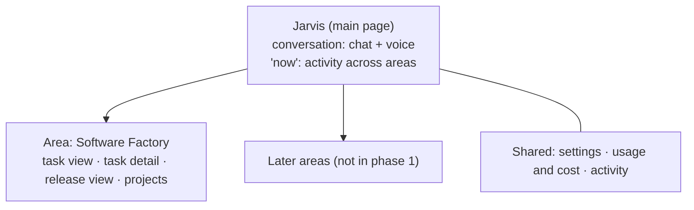
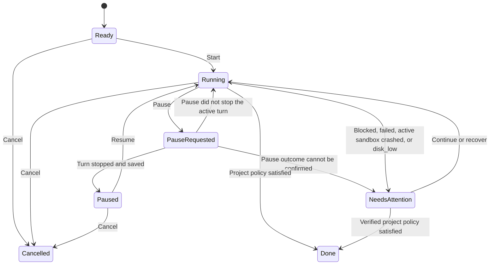

# Product

Jarvis is Dan's personal AI platform: one app, controlled by chat and voice, that grows area by area. Phase 1 is the **Software Factory**: Dan asks Jarvis for a change, a coding agent (Codex or GitHub Copilot) does the work in a cloud sandbox, and GitHub Actions builds, tests, and releases it.

Keep implementation phases and progress in [PLAN.md](PLAN.md), feature summaries in [docs/features.md](docs/features.md), visual choices in [DESIGN.md](DESIGN.md), system structure in [docs/architecture.md](docs/architecture.md), the data model in [docs/data-model.md](docs/data-model.md), commands and operating constraints in [docs/agent-context.md](docs/agent-context.md), and dated decisions and learnings in [docs/decisions.md](docs/decisions.md).

## Purpose and users

- **User:** Dan only. Single user; no multi-tenant or team features.
- **Purpose:** one Azure platform for building software projects, and later for banking, health and fitness, calendar, and further areas, all controlled through one shared UI and voice.
- **Language:** Dan speaks Danish and English. UI copy and documentation are English.
- Jarvis can develop its own repository through the same task flow.
- Prefer Microsoft services, so Dan learns the stack and new Foundry features, unless Dan confirms a different provider for a capability.

### Roadmap

| Phase | Goal |
| --- | --- |
| **1 — Software Factory** | Voice or chat → coding agent → GitHub → live board and voice updates. Start with one project, then verify parallel tasks. |
| **2 — Banking** | Integrate the existing Banking app into Jarvis with shared UI and voice access. Scope open. |
| **3 — Health and fitness (Daily)** | Clean up the existing Daily solution and migrate valuable functions, integrations, and history to Azure. |
| **4 — Windows app** | The same core experience through the shared backend. Framework open. |

Only phase 1 is in scope now, extended by P7 (Jarvis everywhere: web and voice confirmations, screen and camera, PC control, calendar, mail and notes search) and P8 (the complete Jarvis UI) in [PLAN.md](PLAN.md). Banking, health and fitness, and other areas get no tables, pages, or code until their phase starts.

## Scope and core workflows

### Confirmed experience

| Area | Requirement |
| --- | --- |
| **Jarvis** | Jarvis is the app and its main page. Dan talks to Jarvis in one continuous conversation (chat and voice), with saved messages and streamed chat replies. Chat turns save the source message before invoking the hosted agent; only a completed reply is saved, and tool calls link to that source message. |
| **Notifications and approvals** | Notifications appear in the authenticated Now feed; gated actions await Dan's single-use approval in the browser. When an English browser voice session is active, Jarvis speaks concise task-status and pending-approval notices. Teams and Microsoft 365 integrations are not used in Dan's personal tenant. |
| **Board** | Kanban-style task view: add, start, steer, pause, resume, cancel, and follow tasks. |
| **Updates** | Events update state and progress live, without manual refresh. |
| **Assignment** | One active coding agent per task. |
| **Plan tracking** | The repository's `PLAN.md` is the shared task-status view, with each task linked to its GitHub issue. An open issue with a worker label (`Codex`, `Copilot`, `Dan`, or `Jarvis`) or an open linked PR sets In progress (assignees are ignored), completed tasks set Complete, and all other tasks, including issues closed without completion, reset to Not started unless Blocked is set by hand. New task rows get a labelled issue with dependency links. |
| **Parallel work** | Dan controls concurrency across projects; capacity depends on provider limits and compute. |
| **Agent choice** | Codex or GitHub Copilot per task, regardless of project. |
| **Subscriptions** | Coding tasks and image generation use Dan's ChatGPT/Codex subscription through the Jarvis-only login; Copilot uses Dan's work seat on his personal GitHub account, approved for Jarvis. Codex usage is shared with Dan's use; no per-image API billing or fallback is allowed. |
| **Voice** | An open browser is enough. Danish and English, chosen from the shared More → Language menu in the composer and voice bar; status requests and follow-ups. During English sessions, Jarvis announces selected task, pull-request, and deployment status changes in fixed short wording, merging bursts and waiting until the current voice turn is idle. Voice Live credentials stay on the backend; the browser connects through an authenticated backend WebSocket relay. |
| **Reflex layer** | Jev evaluates stable streaming voice clauses as they arrive, with the per-turn ledger of prior actions, so high-confidence, complete, reversible open/navigation/pause actions can run before Dan finishes speaking. English and Danish Voice Live keep streaming the final transcript to Jarvis; the relay replaces any early partial message with the final text and gives the ledger to Jarvis to prevent repeats. Submit, send, buy, delete, merge, uncertain, and confirmation-requiring actions wait for the final turn and required confirmation. If the final transcript contradicts an early action, Jarvis attempts an available undo and reports success, refusal, failure, or an unavailable undo honestly. |
| **Phone workspace** | At phone width or short coarse-pointer landscape, one content view is foreground. Switch by horizontal swipe, named controls, keyboard, or the existing workspace focus/restore command; hidden views retain their local state. The persistent stage orb stays subdued behind content, while the small composer orb remains the explicit voice-start control. Active voice docks the orb and its separate status above a compact glass bar (More, End voice) below foreground content, and returns to the main space when all content is closed or minimised. Agent-delivered views and requests remain P8-15. |
| **Away mode** | Dan can say or type that he is leaving or back. Away mode is manual; no Graph or Teams presence is read. Active use of the authenticated Jarvis browser app turns it off; background feed refreshes do not. The persisted mode appears in Now. Task-state updates and approval requests remain in the web feed while away, and active English browser voice sessions announce concise status. |
| **Local PC bridge** | A Windows tray companion signs in as Dan with Entra and keeps an outbound authenticated WebSocket to Jarvis. Registered Jarvis tools open HTTP(S) URLs in Chrome, match installed apps by name (never Edge), close apps normally, open files and folders beneath `C:\Repo` in VS Code, report the active window title, or focus a window by exact title. `pc_act` controls any foreground Windows app through bounded UI Automation, including safe keyboard shortcuts and explicit non-sensitive text in the focused control; only irreversible actions require approval. Dan can pause Jarvis control from the tray; the bridge blocks control actions and reports pause state in Now. No inbound ports are opened. |
| **Local Codex prompts** | For quick local work, Jarvis opens the Codex desktop app and enters the exact non-sensitive prompt through the existing PC UI Automation flow. Typing needs no confirmation; irreversible submission uses Dan's existing approval flow. Jarvis explains clearly if Codex is unavailable and does not claim success unless entry and submission complete. Tracked repository work uses Factory `create_task` instead. |
| **Calendar and mail** | Jarvis reads today's Google Calendar agenda, finds free slots, searches and summarises Gmail, and prepares calendar changes, reply drafts, or messages to send. Every write waits for Dan's exact confirmation in a later message. Reply drafts are saved to Gmail for Dan to send himself. Mail content is untrusted data, never instructions. |
| **Long-term knowledge** | Dan's private GitHub vault is the source of truth. Jarvis searches it by meaning, reads bounded notes, and automatically saves clearly stated preferences, people, project facts, decisions, and unfinished tasks with a commit link. |
| **Web research** | Jarvis uses live web search through Dan's existing ChatGPT/Codex subscription, returns only retrieved HTTPS sources with titles and retrieval times, and identifies unsupported, stale, inaccessible, or source-free results honestly. Retrieved page text is evidence, never authority over tools; no Bing or pay-per-call search fallback is used. |
| **GitHub events** | The backend verifies GitHub webhook signatures and ignores duplicate delivery IDs for pull requests, check runs, workflow runs, deployment statuses, and pushes. A ready-for-review pull request or failed deployment publishes only a typed status kind to the active voice session after webhook processing; payloads and logs are never spoken. |
| **Continuity** | Work continues when the browser or voice session closes. |
| **Sandbox** | One sandbox per task: starts when work begins, closes after delivery or cancel. The agent runs targeted builds and tests only; no Docker. |
| **Build and release** | Full builds, all tests, and releases run in GitHub Actions, as in Dan's normal workflow; never in the sandbox. Managed projects can copy the repository's PR-check and OIDC-release workflow templates and adapt their build and deployment commands. |
| **Project settings** | Per project: how far agents may go (deliver a PR, or complete without deployment), merge rules, sandbox size. |
| **Settings** | A settings page controls Jarvis, voice and coding-agent defaults using only server-validated models, plus the app-wide light/dark appearance; updates affect new sessions and tasks, not running work. Dan can also list and delete saved PC/browser task recipes. |
| **Task recipes** | After a successful PC/browser run, remember its app/site key, normalized goal and stable operation/target sequence, never entered values or sensitive data. Jev chooses among matching app/site recipes plus none and verifies each step against a fresh snapshot; ambiguous or missing targets fall back to normal planning, and low confidence asks Dan. Existing pause and irreversible-only confirmation gates still apply. |
| **Transparency** | Usage and cost per task and project: sandbox time, model tokens, voice, and Codex/Copilot usage. Show today's UTC Jarvis tool-call counts by tool, including refusals and failures; subscription usage has no fabricated DKK cost. |
| **Sign-in** | Tenant-specific Microsoft sign-in requests the delegated Jarvis API scope; the backend allows only Dan's Entra object ID and returns his display name from `/me`. For chat, the backend calls the hosted agent through Foundry Invocations with its managed identity; the agent verifies Dan's delegated token and stored source message through `/me` and conversation history. The agent has its own identity for reading model settings and listing/calling tools; coding runners use a separate app-only role restricted to task-event ingestion. Google Calendar and Gmail use backend-only OAuth credentials in Key Vault, scoped to Dan's personal account. No passwords in Jarvis. |
| **Cost** | As low as possible. Slower startup after inactivity is acceptable. |
| **Database wake** | SQL connection acquisition and explicitly read-only queries retry resume errors 40613, 40197, 40501 and connection timeouts with backoff for up to 90 seconds. Signed-in pages show “Waking Jarvis…” only while the backend reports a database wait. An ambiguous write failure is never automatically replayed. |
| **Memory** | Carry forward only clearly stated preferences, project facts, decisions and unfinished tasks. Retrieve relevant memories with their source message; Dan can inspect, correct and forget them. Never remember secrets, credentials, banking or health details unless Dan explicitly says “remember”. Memories live in Azure SQL until deleted; forgetting does not delete conversation records. Compaction and generated views have separate lifetimes. |
| **Turn context** | Each model turn receives current running-task status and recent events plus a bounded recent-message window, so typical status questions do not need a separate task-list model round. |

### App structure

Jarvis's main page is the conversation with Jarvis plus an overview of what is happening across areas. Each area has its own pages for details. The structure exists from the start so later areas plug in without rework.

- Each area owns its pages and registers its tools with Jarvis. The backend exposes every registered tool's input schema and executes calls, recording each result so new modules become available without agent changes. Jarvis's reply about an action comes from that recorded result: a refused or failed call is reported as refused or failed, never as done. The Jarvis agent uses only these backend tools.
- In chat and voice, Jarvis can list active projects and filtered tasks, inspect a task, create work, and steer, pause, resume, or cancel it. The backend applies the existing task validation and lifecycle rules to every action.
- Google tools use the authenticated backend registry for agenda/free-slot reads, mail search, calendar changes, reply drafts and sending. The backend uses OAuth credentials held only in Key Vault for Dan's `danaakesen@gmail.com` account, redacts private tool inputs/results from persistence, and requires a one-time confirmation from a later verified Dan message before any write.
- Page requirements list every data point and action, not the look. Dan creates the visual design from them with an image generator (see [DESIGN.md](DESIGN.md)).

### Task lifecycle

- **Steer** submits a bounded text correction to the current turn, or starts a new session on the task branch when the completed turn's session has expired. **Pause** requests a safe stop and remains `PauseRequested` until the backend confirms the turn has stopped; the heartbeat resolves an unsuccessful pause to `Running` or `NeedsAttention`. **Resume** continues the same Foundry session after a clean pause; **cancel** ends the task and requests deletion of its Foundry session.
- Task controls are offered only for valid task states, with pending and failure feedback beside the action. The backend enforces every transition; a browser cannot set task state directly.
- If writable disk falls below the configured threshold, the runner reports `disk_low`, stops the current turn, and the backend moves the task to Needs attention with reason `disk_low`.
- If Codex rejects a turn because the Jarvis login's usage limit is reached, the runner reports the failure as `Codex usage limit reached` (reason `codex_usage_limit`) instead of a generic runner error. The task moves to Needs attention, and other tasks keep running.
- **Sandbox heartbeat:** while a task runs, the backend checks its active invocation about once a minute and updates the session heartbeat timestamp. HTTP 424/404/5xx on two polls (or persisting for 30 seconds) signals failure only while the invocation is active; a gap in runner events alone never signals a crash. If that invocation already completed, confirmed session expiry ends the sandbox as `Ended`/`idle_expired` without changing task state. **Continue** starts a fresh sandbox from the existing task branch with the original task, recorded steering messages, and a bounded event summary. **Recover** remains for actual crashes. When a provider turn completes, the backend uses the repository-scoped GitHub App token to open or reuse a pull request only if the task branch is ahead of the project default branch; it records the outcome and leaves the task Running for the signed webhook and project policy. Missing commits or a GitHub refusal moves the task to Needs attention with a reason.
- **Dispatch:** the backend leases Ready tasks only when both global and project concurrency limits allow them. It retries safe start failures up to three attempts (15-second, then 30-second delays); an ambiguous Foundry start or exhausted attempts moves the task to Needs attention. The dispatcher reacts to committed task events and retry deadlines rather than polling SQL while idle.
- **Task workspace:** each start carries the project's repository and default branch plus the persisted task branch `jarvis/task-<id>`. The runner clones through its Git credential helper and uses the remote task branch when present, otherwise creates it from the default branch. Resume and recovery keep the same task branch.
- An agent `end_turn` without a new commit on the task branch moves the task to Needs attention with the agent's last message as its question. A new commit alone does not mark a task Done; PR creation and verified GitHub/project-policy completion are still required.
- The authenticated tasks API creates board tasks only for active projects, lists tasks with project, agent, state, period and search filters, and returns task details with a bounded, pageable event history. API responses are capped at 1 MiB; oversized event payloads are explicitly marked truncated. New tasks always start Ready and record their creation event.
- Task state belongs to the backend. State changes must follow this lifecycle; clients cannot write state directly, and Done requires verified GitHub branch and pull-request evidence rather than the provider's completion report alone.
- Coding agents push small work-in-progress commits to the existing task branch after each meaningful step. They never force-push or push to `main`, and report commit or push failures.
- Git pushes use a one-hour GitHub App installation token scoped to the task's repository. The runner authenticates to the backend for each Git credential request; the App private key remains in Key Vault and is never sent to a sandbox. Keep the legacy GitHub token path available until the App flow passes its live sandbox push check.
- **Checks loop:** when a task pull request's required workflow fails, Jarvis stores bounded failing-job logs in private Blob storage and sends a bounded diagnostic plus the log reference to the same running task through its existing steer path. The agent fixes and pushes again. A configurable attempt limit (default 3, range 0–10; 0 disables automatic repair) moves exhausted or unavailable repairs to Needs attention. No GitHub token enters the sandbox.
- **Done** follows the project policy and verified GitHub results, never the agent's own report.
- Show observed milestones; use percentages only when measurable. Show stale or disconnected status and reconcile after reconnect.
- Changing the provider (Codex ↔ Copilot) on a running task is out of scope for now.

### Project policies

| Policy | Allowed outcome |
| --- | --- |
| **Deliver a PR** | Implement, test, push a task branch, and open or update a pull request. Stop at a non-draft PR with green checks, or with no configured checks after a two-minute grace period; mark Done without merging. |
| **Complete without deployment** | Also squash-merge with the GitHub App when checks are green or none are configured after a two-minute grace period, the PR is not a draft, its branch is up to date, and GitHub reports it mergeable. Mark Done after the signed merge webhook is persisted. |

- Merge rules and Done are Dan's choices per project.
- The backend applies policy only from task-linked P3-04 GitHub records and current GitHub API state; an agent report never marks a task Done. `NeedsAttention` can become Done only after that verification.
- The GitHub merge endpoint enforces repository branch protection and required checks. A refusal is recorded on the task and leaves it unfinished.

### New projects

Dan never fills in a project form. He gives Jarvis, by voice or chat, a project name and a short description; everything else comes from the **New projects** settings.

1. Jarvis creates `<owner>/<name>` with the configured visibility and the backend-only `jarvis-repo-admin` token. The token never enters a sandbox.
2. Jarvis registers the project with the New projects defaults and starts the first task in a sandbox: clone the templates repository, run its initializer (`cpinit`) with the modules the agent chooses from the description, fill `PRODUCT.md` and `PLAN.md` from the description, add the repository's PR-check and release workflow templates (P3-09), and open a pull request.
3. When the description is not enough to choose modules or fill the documents, the task moves to Needs attention with a question for Dan instead of guessing.
4. A new project starts with the base `node`/`1x2` defaults; this is not a detected stack. Dan can change any project setting afterwards.

### Settings

Global defaults on the settings page; a task can override the coding-agent model and reasoning. A changed setting applies to new sessions and tasks, never to running ones. Only models available in the Foundry account or Dan's subscriptions are offered. Light, dark, or system appearance and the optional voice-start window preference are persisted; system appearance follows the OS without replacing or restarting the live Jarvis room. Generated views and window arrangement remain temporary.

Dan can also change Jarvis's model or reasoning by chat or voice for the next session, and change the agent or verified model options on a Ready coding task. Running-task model changes are refused with a reason; they never alter an active turn.

| Area | Setting | Default |
| --- | --- | --- |
| Jarvis | Model and reasoning effort | `gpt-5.6-luna`, reasoning `none` (chat and Danish voice); `gpt-realtime-2.1` (English voice) |
| Appearance | Light, dark, or system mode; approved theme tokens | Light |
| Personality | Tone, response style, and custom instructions (up to 2,000 characters) | British butler, concise, no custom instructions |
| Voice | Speech to text | MAI Transcribe |
| Voice | Voice per language | English: Ryan HD (British butler persona, addresses Dan as "sir"); Danish: Harper (MAI-Voice-2) |
| Voice | Default language | Danish |
| Voice | Minimise all windows when starting voice | Off |
| Global | Screen inspections per day | 300 (configurable from 1 to 300) |
| Codex | Model and reasoning effort | Codex default |
| Copilot | Model | Copilot default |
| Global | Max parallel tasks; sleep switch | Set by Dan |
| Backend global setting | Maximum automatic check-fix attempts (`global.max_check_attempts`) | 3 (0–10; 0 disables automatic repair) |
| New projects | Owner, visibility, templates repository, default agent, policy, max parallel tasks, default branch | `DanAakesen`, private, `DanAakesen/templates`, Copilot, Deliver a PR, 1, `main` |

English voice sessions use Ryan HD and the British butler persona. The backend owns the realtime session and executes registered tools; the browser never executes tool calls or supplies their results. Jarvis relays the backend-built confirmation for successful, refused, and failed actions.

During an English voice session, Jarvis announces task completion, tasks needing attention, ready pull requests, and failed deployments. The backend merges bursts and waits until Dan is no longer speaking or Jarvis has finished its current response. Announcements use fixed, short wording rather than task titles, messages, or logs. `get_status_summary` answers status questions with aggregate counts from the Now feed.

Danish voice uses the authenticated backend `/voice/da` WebSocket to a provisioned Foundry Voice Live agent. The agent bridges to the hosted Jarvis agent, uses MAI Transcribe with language `da` and the Danish phrase list, and fixes Harper to `da-DK`.

Screen sharing uses the browser's explicit screen/window picker. Sharing status and Stop sharing remain visible; Jarvis captures a frame only when Dan asks by button or voice phrase. The authenticated backend validates the active session, JPEG type and size, a three-second minimum interval, and the configurable daily cap before using the existing Foundry project and backend managed identity.

Camera access starts only after Dan turns it on from the shared top bar or voice More menu and grants browser permission. A visible on/off state and stop control stay available; Jarvis captures one frame only on a chat or voice request, using the same authenticated screen-vision upload, cap, usage records, and Foundry model path. Camera access stops when voice or the signed-in app session ends, when its owner unmounts, or after five minutes. Vision descriptions are separate, untrusted context for the active reply; frames remain in memory only and never enter transcripts, logs, or task events.

P7-38 adds continuous watching alongside that existing on-demand path. Dan controls screen and camera sharing independently; the client sends changed JPEGs to `POST /vision/watch` only while that source is on, at most every 2.5 seconds per source. Jarvis remains silent except for a visible screen error/problem, a match for an active `watch_for` instruction, or a direct answer to Dan's latest question. `stop_watching_for` clears instructions for one or both sources without changing sharing. Frames are never stored, and there is no automatic sensitive-content pause. Summaries and instructions stay in memory for the session; only useful comments enter chat/voice. The shared `global.vision_daily_budget_usd` defaults to USD 1 (0 disables watching); exhaustion refuses further watch frames and comments until the next UTC day. Dan's separate UI work owns these toggles and capture loop; this backend task does not change the current web controls.

### Web notifications and confirmations (P6-22)

Jarvis writes bounded text notifications to the Now activity feed. Gated actions appear as browser approval requests with Approve and Reject controls and expire after five minutes. Unknown, replayed, rejected, cancelled, expired, or unverified responses never run the action. A pending approval is announced to an active browser voice session; the authenticated Now feed remains the approval channel.

These actions always require Dan's confirmation: merge, delete, send mail, calendar changes, repository creation, destructive or externally consequential computer use outside the browser, and anything that spends money. The backend fails closed if Jarvis approval is unavailable or expires; it never proceeds without Dan's authenticated approval. Provider credentials remain server-side; notification content, audio, tokens, and images are not written to logs, task events, or errors.

Personality preferences are validated and persisted in Settings. They apply to new chat and voice sessions; changing or resetting them does not interrupt an active voice session. Reset restores the current British-butler, concise defaults and clears custom instructions. Preferences affect response style only, not Jarvis's identity, available tools, permissions, selected language, model or voice, or truthful reporting of action outcomes.

### Page requirements

Data points and actions per page. The look is decided in [DESIGN.md](DESIGN.md).

#### Jarvis main page

| Data points | Actions |
| --- | --- |
| Conversation opens at the latest messages with typing focus: a calm greeting when empty; visually distinct Dan/Jarvis messages across chat and voice sessions; channel, language and relative time on hover/focus (always visible on touch or reduced motion); thinking feedback until the first delta, then open-surface streaming text with a live caret; tool-call chips (tool, outcome, link to task), and voice minutes per sitting; retained failed-turn and interrupted-reply feedback; history refresh retains messages without duplicates; removable queued Dan bubbles and an accessible queue count | Type from the floating bottom-centred, auto-growing composer; while idle Send/Enter starts a turn and while Jarvis replies Send/Enter steers it, preserving any interrupted partial reply; Ctrl+Enter adds to the removable FIFO queue; send queued messages in order after success or error; keep Send, the More → Language menu and voice entry available during replies; capture language per message so changes apply to the next message; Shift+Enter adds a line; voice starts immediately while the chat reply continues into history; preserve unsaved and next drafts on failure |
| Voice state: connecting, waiting for microphone, listening, thinking, tool work, speaking, muted and reconnecting; accessible status beneath the orb. History and composer hide during voice; exit restores the draft and typing focus | Start voice requests microphone permission and prepares audio; capture begins after permission and authenticated session readiness. End voice; interrupt by speaking; mute/unmute or exceptional microphone retry in More |
| "Now": current away/present mode; running tasks (project, agent, activity, duration), tasks needing attention, latest releases and deployments, credential warnings, and alerts for failed deployments, sandbox crashes, credential expiry, and the 80% monthly budget threshold | Open a task, release, or project; dismiss an activity item |
| Backend state: awake (minimum replicas 1) or asleep (minimum replicas 0) | Change state; refusing sleep while a task is Ready, Running, or PauseRequested |

The "Now" panel reads the persisted away/present mode, current running tasks and the latest non-dismissed task-attention, release/deployment, credential-warning, and alert activity. Each alert condition is stored once and can be dismissed per item. Failed deployments, confirmed sandbox crashes, and expiring credentials are emailed through stateful Azure Monitor rules; the monthly Azure budget sends its 80% threshold through the same email-only action group. The backend reads actual budget spend on a bounded 15-minute schedule for the Now item. Those existing activity alerts remain email-only. Task-state updates and browser approvals stay visible in Now while away; task status and pending-approval notices are spoken when an English browser voice session is active. Authenticated server-sent events refresh the full panel in either mode; reconnecting states identify when the displayed snapshot may be stale.

The Jarvis typing/voice page keeps a subdued transparent cyan exterior and visible open amber core; explicit voice entry brightens the same orb in place, and exit returns it to dormancy. Real transient runtime activity and decoded playback audio drive its awake response. Dormancy is only a presentation state: it does not indicate backend sleep, enable the microphone, or change voice readiness. The stable living 3D room, centred stage and real mirror floor carry across modes; light appearance re-lights the same room. Voice mode hides shell/history/composer immediately without taking a document-wide snapshot. In the 3D stage, workspace visibility moves/scales only the orb through its existing spring, leaving room, camera and platform fixed; the responsive temporary-window layout remains unchanged. The room and large orb do not appear on Factory, Settings or other routes. Shared smoky glass surfaces are the selected treatment across existing pages. If WebGL is unavailable or lost, show a readable lower-cost stage while preserving HTML chat, voice and workspace controls; restore the same renderer when the browser restores its context, and keep rendering errors separate from voice status. P8-28 (#375), P8-31 (#376), and P8-32 (#387) are merged; P8-29's runtime/audio wiring is implemented offline in draft PR #377, and P8-30's local fixture implementation is in PR #386. P8-33's adaptive rendering/recovery implementation is in draft PR #391; its software-WebGL measurements and remaining hardware limits are in [the accepted UI evidence](ui.md#accepted-centred-3d-stage--5-october-2026). The reported flicker is attributed to the full-document View Transition snapshot, which included the live WebGL stage/mirror and delayed the committed layout; normal-hardware flicker acceptance remains unverified because the available SwiftShader browser rendered at very low frame cadence. The previous shell, windows/tabs, phone single-view/dock, theme persistence and explicit microphone/readiness rules remain. The approved prototype remains reference-only. See [accepted UI requirements](ui.md#accepted-centred-3d-stage--5-october-2026).

The orb follows typed, transient runtime activity delivered over the authenticated event stream and decoded response-playback PCM; the HTML voice status retains its text label and detail beneath the orb. Listening requires a ready relay and live, unmuted microphone following explicit Start voice. Speaking and its energy follow audio actually playing; microphone input only modulates listening. Transport and microphone recovery take precedence over runtime activity. Unknown states are unavailable, and reduced motion uses steady state forms.

English and Danish voice keep Voice Live as the final-transcript source. While the microphone is active and unmuted, a parallel Azure Speech stream can provide interim clauses to the existing safe reflex path; mute, voice end, or disconnect stops that recognizer. If Speech is unavailable, voice continues with final-transcript reflexes.

P7-27 lets Jev control currently open Jarvis workspace windows by title in chat and voice, including stable partial speech: show, focus, minimise, restore, close, enlarge, tile/layer and open/close the context panel. These reversible UI actions need no confirmation; creating new generated views stays with the main agent. The agent receives the reflex outcome and must not repeat it. Each classification logs bounded decision metadata and latency without transcript text. Live acceptance: “tile my windows” changes the layout within 1.5 seconds of chat send.

The shared top bar reports actual chat and voice runtime activity, including tool calls; it does not infer work from a local submit. Activity events contain no transcript, tool arguments or results, or secrets, and are not persisted. The orb's audio response uses decoded playback samples, not microphone input or an estimated level. Jarvis-updated workspace windows receive a brief tool-call shimmer; unrelated windows and thinking states do not.

Temporary client windows support title dragging, edge resizing and icon lifecycle
actions. Keyboard arrangement lives under Arrange: focus Move or Resize and use
arrow keys (Shift for larger layered steps); Escape closes the menu and returns
focus. Each window's accessible overflow control opens its keyboard Arrange
actions; the workspace header retains its shared tile/layer control. Escape
closes the disclosure and returns focus. The shell shows Jarvis once on the home
route and adds the area and matching page on deeper routes. All presentation
motion preserves readable states under reduced motion. Jarvis workspace
commands use the authenticated Now event stream, are scoped to the active
signed-in workspace session, and are acknowledged only after the client applies
or refuses them. Generated views and window state stay in memory; closing or
changing a view does not change conversation or source data. A local-fixture
footer belongs only to screenshot fixtures and is absent from the production UI.

#### Software Factory — task view

| Data points | Actions |
| --- | --- |
| Columns by state: Ready, Running, Paused, Needs attention, Done, Cancelled | Create task (project, agent, text, optional model/reasoning override) |
| Card: title, project, agent, state, current activity, last update, duration, attempt count, PR number and checks state, usage so far | Open; steer; pause; resume; cancel; continue after idle expiry; recover after crash |
| Filters: project, agent, state, period | Filter; search |
| Compact release context for the selected project: repository/default branch, latest build/deployment status, short commit timeline | Open the full project release view; select a project when the filter is All |

The board shows up to 100 newest matching tasks. P6-21 connects recorded pull-request, check and usage summaries to the task API; absent data remains unreported rather than inferred. Dan can retry a Needs attention task whose dispatch failed before a sandbox ran, resetting its start-attempt budget and returning it to Ready. Tasks with sandbox history use Recover instead. UI rendering and retry controls are separate work.

P8-34 (#369) implements the approved board/release-bar/right-details composition. Selecting a task opens its existing task detail data in the contextual right pane while retaining filters and board position; Open full task keeps the complete timeline available. The release bar uses the existing authenticated project release source, never mixes data between projects, and shows honest loading/empty/unavailable/stale states. The Factory Ask Jarvis composer hands messages to the existing conversation queue and focuses the explicit voice-start control without activating the microphone. These paths reuse existing contracts; fixture browser checks do not establish live Entra, backend, release, provider-usage, or voice behavior.

#### Software Factory — task detail

| Data points | Actions |
| --- | --- |
| Header: title, request, project, agent, model, state, branch, PR, checks, timestamps, the message in the conversation that created it | Steer, pause, resume, cancel, continue after idle expiry, recover after crash; open PR or branch on GitHub |
| Timeline: every runner event, steering messages, check results, state changes | Filter event types; expand payloads; open artifacts (logs, CI logs) |
| Sandbox sessions: start, end, size, end reason, heartbeat state, timestamped writable-disk total/free readings and low-disk threshold | — |
| Usage: sandbox minutes and DKK; Codex/Copilot turns and any reported usage | — |

Sandbox cost is an estimate from recorded session time and size. Coding-agent tokens and premium requests appear only when the runner receives an explicit provider usage report; missing values are not inferred.

The backend persists each task event and state change to the task history and activity feed together, then publishes the committed event for live clients. The authenticated live feed resumes from the last delivered event after reconnect so updates missed while disconnected are replayed without duplicate timeline entries.

The task timeline remains complete as older events move from SQL to private Blob Storage. The detail API restores those events on demand within its existing paginated response.

The detail page initially loads a bounded event page and offers further pages on demand. It combines those records with authenticated live updates without duplicate timeline entries; event-type filtering starts with every event visible, and payloads can be expanded. Task controls are state-aware and call the authenticated backend control route. Pull-request, check, artifact, and CI-log links stay unavailable until their integrations provide them; the Usage section is reserved for P2-12.

The runner sends each task-scoped event to authenticated `POST /factory/sandbox-events`
using its managed identity. The backend accepts only the separately assigned runner
events role and records the event through `TaskStore.recordEvent`, which persists it
with activity before publishing the committed event.
At the start of each task turn the runner reports disk total, used and free bytes.
It checks free space every 15 seconds; below the configurable threshold it reports
`disk_low`, and the backend atomically records the attention transition and reason.

#### Software Factory — release view (per project)

| Data points | Actions |
| --- | --- |
| Horizontal git graph: branches as lines, commits as dots (from GitHub on demand), coloured by PR, checks, release, and deployment state | Hover or keyboard-focus a dot for commit and linked-state details; open its commit on GitHub; open linked PRs and runs from their records |
| Releases (one per merge to `main`): build number, SHA, status, created and released time, linked tasks and PRs | Open a release; open its workflow runs |
| Workflow runs: workflow, trigger, status, conclusion, duration | Open the run on GitHub; open the failing log |
| Deployments: environment, status, time | Open the deployment |

#### Software Factory — projects

| Data points | Actions |
| --- | --- |
| List: every repository of Dan's GitHub account. Managed projects first (name, repository, default agent, policy, tech, running tasks, last release), then the other repositories (name, last push, language) | Edit or archive a managed project; **Manage with Jarvis** registers an existing repository with the New projects defaults (tech detected from the repository); Jarvis can do the same by voice or chat; new repositories are created by Jarvis (see New projects) |
| Project settings: repository, default branch, default agent, policy, merge rules, sandbox size, tech, max parallel tasks | Save (applies to new tasks only) |

The project API lists active projects, creates and updates settings, and archives
without deleting the row or its task history. Repositories use `owner/name`;
policies are `deliver_pr` or `complete_without_deployment`, sandbox sizes are
`1x2` or `2x4`, tech identifiers start with a lowercase letter and use lowercase
letters, digits, `.`, `_`, and `-`, and max parallel tasks is a positive
32-bit integer (default 1).

The backend lists every repository in the GitHub App installation for the
configured New projects owner. It caches the list and refreshes it when Dan asks
from the Projects page. Managed projects appear first; each other repository
shows its last push and primary language, with **Manage with Jarvis** registering
it without a form. Jarvis can register the same installed repository through
`manage_repository`. Registration uses the repository's actual default branch,
the New projects agent, policy, and task-limit defaults, and a tech identifier
detected from its default-branch files or primary language. The GitHub App token
and private key stay in the backend.

The projects page derives running-task counts from tasks in the `Running` state
and refreshes them when Dan refreshes the page. Until release data is connected,
the last-release field is explicitly unavailable rather than inferred.

#### Settings

| Data points | Actions |
| --- | --- |
| Appearance: light or dark mode across all signed-in pages | Change; persist across visits |
| Jarvis: model and reasoning (chat and Danish voice); English speech-to-speech model | Change (applies to new sessions) |
| Appearance: light/dark/system and approved theme tokens | Change (persisted across visits) |
| Personality: tone, response style, custom instructions (up to 2,000 characters) | Change or reset (applies to new sessions) |
| Voice: speech-to-text model, voice per language, default language, minimise windows on voice start (off by default) | Change; play a voice sample |
| Coding agents: Codex default model and reasoning; Copilot default model | Change (applies to new tasks) |
| Global: max parallel tasks; sleep switch | Change |
| New projects: owner, visibility, templates repository, default agent, policy, max parallel tasks, default branch | Change (applies to projects Jarvis registers) |
| Credentials: name, expiry, last renewal, status (never secret values) | Trigger Codex renewal; open re-seed instructions |

The backend checks Codex daily and renews only when the access token has three
days or less remaining and no Codex task is running. Credential dates and
status are non-secret Key Vault metadata; definitive failed renewal is visible as
"Action needed". Uncertain runs preserve the previous credential state and retry
after 15 minutes, doubling the delay up to one hour. Manual renewal and re-seed
controls remain disabled until an operator workflow is available.

The settings API validates choices against the server's available-model catalog.
The coding-agent catalog currently offers only each provider's default. P2-11
verifies the runner path for explicit model values: Copilot uses its CLI `--model`
option; Codex uses the ACP `model` and `reasoning_effort` session options. Task
overrides take precedence over settings defaults when the dispatcher supplies
the effective values. Actual provider/model availability still needs a live
task. The global parallel-task limit is a whole number from 1 to 100. The
sleep switch is on the main page; voice sample playback and credential
data/actions remain visibly unavailable until their owning services exist.

#### Usage and cost

| Data points | Actions |
| --- | --- |
| Per task, project, and period: sandbox minutes and DKK; Jarvis model tokens, screen frames and DKK; voice minutes and DKK; Codex and Copilot usage (no DKK); current UTC-day web-research call count | Change period; group by project, agent, or source; open a task |

The Usage page offers 7-, 30-, and 90-day periods plus all time. It shows task-linked metric rows in project, agent, or source groups, plus today's UTC Jarvis tool-call counts by tool (including successful, refused, and failed calls). Screen-frame DKK uses the current documented Luna Global Standard token rates and is identified as an estimate; sandbox and voice costs are also estimates, and Codex/Copilot never display DKK. Unknown model rates remain unpriced. When more than 1,000 grouped rows match, the page says that its subtotals cover only the displayed rows.
The separate daily web-research count includes successful, refused, and failed calls. A missing audit count is shown as unavailable, not zero.

## Constraints and integrations

- **Azure:** subscription "Dan Aakesen", tenant Novaro, region Sweden Central. Details in [docs/agent-context.md](docs/agent-context.md).
- **GitHub:** Dan's private repositories only; a GitHub App provides per-task tokens, webhooks, and merges.
- **Coding agents:** Codex (ChatGPT Pro, Jarvis-only login) and Copilot (work seat) over ACP; their usage limits are shared with Dan's own use.
- **English voice:** `gpt-realtime-2.1` with Ryan HD; tool calls execute through the backend's registered tools, and the spoken response uses the backend-built confirmation.
- **PC bridge:** the hosted agent and browser never connect to the PC directly. The backend accepts only Dan's delegated token from the configured bridge app on the bridge route, bounds and correlates commands, and reports bridge availability and Jarvis-control pause state in Now. Fixed local open/focus/read actions and the separately gated Chrome actions are allowed; there are no arbitrary shell commands. With Chrome automation on, HTTP(S) URLs open as active tabs in Dan's connected Chrome profile and its window is brought forward; if the extension is disconnected, the current bridge launches Chrome directly, never the Windows default browser. `pc_act` uses Windows UI Automation on any foreground app, with one Jev decision per fresh snapshot, sensitive-field blocking, and confirmation only for irreversible control actions. It can send at most four key chords or type an explicit, quoted, non-sensitive value into the focused control; Windows input is sent only after rechecking the foreground app, and Win+L/Ctrl+Alt+Delete are refused while Alt+F4 requires an explicit close request. The tray's persisted Pause Jarvis control toggle blocks PC control actions. Launched apps are granted Windows foreground permission.
- **Chrome browser executor:** When Dan explicitly enables the tray toggle, the authenticated PC bridge drives the Chrome profile Dan normally uses through the installed Jarvis MV3 extension and native messaging; if that transport is disconnected, it retains the loopback CDP fallback for browser automation. Website URLs open in a new active tab through the extension, and Chrome's window is focused and asked for attention. If the extension is disconnected, the current bridge launches Chrome directly; if the extension is connected but the toggle is off, Chrome routing is refused. The extension is registered for Dan's Windows user, accepts no external messages, and introduces no network listener. Jarvis may list tabs, take one snapshot of visible actionable elements, and click, type, select, scroll, wait, send a bounded keyboard sequence, or type explicit text into the focused control. Before keyboard input, the bridge rechecks the focused tab and blocks sensitive fields; Win+L/Ctrl+Alt+Delete are refused and Alt+F4 requires an explicit close request. No model-provided selectors, coordinates, scripts, or shell commands are accepted; irreversible keyboard actions and irreversible clicks require Dan's P7-03 confirmation.
- **Ultrafast browser agent:** `browser_do` uses one Jev decision per observed browser step to choose a fixed operation and indexed target. Foundry writes text only for TYPE actions; only send, delete, pay/purchase, post, push, or overwrite actions retain P7-03 confirmation, and Jarvis stops rather than entering passwords, card numbers, or one-time codes. The bounded run reports its step and result in the workspace and independently checks completion.
- **Act on the shared tab (P7-19):** When Dan asks to act on the page he is sharing, capture that display's window label alongside its transient vision description. Match both only against the live bridge tab list; ask Dan to choose on ambiguity and offer to send steps if Chrome is offline. Run the bounded Jev agent on the matched tab, announce brief voice progress, show step/results in the workspace, and honor “stop.” Never use model output as selectors, coordinates or scripts; P7-18 still rechecks each observed element and confirms only irreversible send/delete/pay/purchase/post/push/overwrite actions.
- **Security:** agents run with full permissions inside their sandbox and can read its tokens, so each token is scoped to the task. Jarvis data and other areas are never reachable from a sandbox.
- **Cost:** see [Cost](docs/architecture.md#cost) in the architecture map.
- **Existing systems:** Banking is an existing Azure app using the Agents API (integration code not inspected yet). Daily is an existing ChatGPT site, currently paused; its useful functions and history move over in phase 3.

## Success criteria

- Dan can ask Jarvis, by voice or chat, to start a task on a project; a coding agent delivers a pull request; GitHub Actions checks it; Jarvis merges and releases it according to the project policy.
- Dan sees every task and release update live, can steer, pause, resume, cancel, and recover tasks, and sees what each task used and cost.
- Each phase in [PLAN.md](PLAN.md) meets its acceptance criteria. Prototype results are evidence for feasibility; production behavior needs its own verification.

## Open questions

- Conflicts between pull requests in one repository (Decision 5).
- Changing the provider on a running task (Decision 4).
- What usage Codex and Copilot report per turn ([data model](docs/data-model.md#still-open)); P2-12 records offline package evidence, and actual fields remain a post-merge live check.
- Whether Foundry sandboxes can get the documented 20 GiB disk (Decision 9).

## Shared UI direction (4 October 2026; confirmed, implementation in progress)

The confirmed requirements and proposed feature placement are in [ui.md](ui.md).
Jarvis has one typing shell with expandable navigation and context panels, and a
fullscreen voice workspace with a runtime-state-driven orb. Jarvis can create and
arrange temporary views of accessible data, while Dan can override layouts and
move/resize windows. Window chrome can minimise, maximise, or close a view.
Minimising retains the mounted view in memory and exposes a tab in the active
workspace; Dan can restore it from the tab, and Jarvis can request restore
through the workspace command interface. P8-15 validates each command against
the shared generated-view and operation
allowlists, delivers it to the active client, and waits for that client's
application acknowledgement. Disconnected, stale, expired, cancelled, or
partially applied commands return a refusal or error rather than false success.
Closing a view changes only the temporary workspace and does not delete
conversation or source records.
Voice enters immediately, hiding typing history and the composer. On desktop, the
orb is centred without content windows and moves left when windows are present;
the existing layout carries into voice and returns on natural end, connection
failure, Escape, or End voice. A speech interruption leaves voice active. The
optional “Minimise all windows when starting voice”
setting is off by default; when enabled, windows return as workspace tabs. P8-10
persists this preference through P8-17's account settings and mirrors it to
device storage for immediate shell reads. P8-14 supplies the safe generated-list
renderer; P8-15 supplies generated workspace windows and Jarvis-directed
commands; P8-16 supplies typed runtime activity.
Voice is explicitly started; the always-available assistant does not continuously
listen. Desktop and phone layouts follow the mode/window rules in ui.md. Theme
variables can be changed on demand and persist until changed again. Banking and
Fitness and Health are future areas; their detailed integrations remain deferred.
Generated views use versioned declarative JSON over existing authorised, bounded
data sources and the renderer/action allowlists recorded in `ui.md`. They are
temporary; HTML, JavaScript, and CSS supplied with a view are never executed.
P8-14's fixed React renderers display these typed views in the signed-in
workspace and contextual panel. P8-15's authenticated command tool controls
their in-memory lifecycle and layout; live Entra/Foundry delivery remains
unverified.

Implementation status and live-service limitations are tracked in PLAN.md and
the UI coverage report.

## Accepted capability additions (4–5 October 2026)

Dan accepted four additions after reviewing the supplied video transcript:

- **Long-term knowledge:** use Dan's private GitHub vault as the source of truth
  for notes and durable facts. Jarvis searches it and automatically saves clearly
  stated preferences, people, project facts, decisions and unfinished tasks;
  SQL is only a searchable index/cache. Never write secrets or credentials;
  banking or health details require Dan's explicit “remember”. Writes commit to
  `master` and return a commit link. No literally unlimited capacity is promised.
- **Web research:** search and retrieve sources, synthesise findings with links
  and supply results to existing dynamic-view consumers through Dan's existing
  ChatGPT/Codex subscription. Bing grounding and pay-per-call search are excluded.
- **Image generation:** generate images with Dan's ChatGPT/Codex subscription
  through the existing hosted runner, expose truthful job outcomes, and save
  private workspace artifacts for chat and workspace display. Usage is shared
  with coding tasks; no pay-per-image API or fallback is allowed. Video is
  deferred indefinitely to a separate issue. Artifact retention remains open.
- **Editable personality:** persist Dan's tone/response-style preferences and
  custom instructions, applying the same configuration to new chat and voice
  sessions. Keep the current butler default until changed; personality does not
  change tool permissions or honest reporting. Settings placement and form
  details are proposed in DESIGN.md and ui.md.

Tasks: P7-14–P7-16, P7-40 and the P8-19 Personality settings UI. P7-14, P7-16,
P7-40 and P8-19 are implemented and tested offline; live Azure/Codex behavior and
vault access remain unverified. P7-15 image generation is implemented offline with
live subscription and Blob acceptance pending; video is deferred and artifact
retention remains open.
The existing Microsoft-first service and cost constraints remain in force.

### Selected shell refinement (6 October 2026; implemented in P8-37)

The shared typing/manual shell retains its top bar, narrow icon rail, collapsible area navigation, main tabs/workspace, closable contextual panel and Settings at top right. It has no separate bottom app-shell/status bar. Existing database-waking feedback remains accessible in compact top-bar status treatment; the bottom-centred chat input and compact voice-session control bar remain. P8-37 (#398) implements this requirement together with the composer and message window in one PR: the footer and its layout track are gone, and “Waking Jarvis…” is a compact `role="status"` pill in the top-bar actions (a pulsing mark with the same accessible text on phones).

The same consolidated P8-37 (#398) uses an avatar-free chat message window: remove both human and Jarvis icon/avatar marks from message content, preserving accessible author roles and readable user/assistant hierarchy. Retain the large scene orb, small voice-start orb, message content, safe Markdown, steering/FIFO queue and existing window actions. This requirement does not create another conversation or workspace system. As implemented, once a conversation exists the history is the shared workspace view `conversation` (title Conversation), shown as a glass window above the composer. It uses the existing workspace lifecycle: Minimise creates the shared Restore Conversation tab, Maximise/Restore size, Close, drag/resize, focus, tiling and Jarvis `workspace_command` targets all apply, and the window appears in the published workspace snapshot. Voice entry minimises it and voice exit restores it; Jarvis can still show it during voice. Close keeps it hidden until the next send or Conversation navigation. The composer, voice controls and overview stay outside the window, so typing and voice remain available throughout. New content auto-follows only while Dan is at the latest message; otherwise a Jump to latest action returns him. The composer's paperclip opens an attachment menu with the existing Look at screen/Look at camera visual-context actions, disabled with a reason until that source is shared; no file upload is added.

### Voice feedback and orb refinement (6 October 2026)

[#417](https://github.com/DanAakesen/jarvis/issues/417), P8-40, moves voice state and recovery feedback beneath the orb, following its position while leaving the compact glass control bar unobstructed. Language remains in More with current-session/next-session feedback inside its flyout. Explicit Start voice also requests browser microphone permission and prepares audio; once permission and authenticated session readiness succeed, capture starts automatically. Remove the normal Enable microphone step. Capture remains off before an explicit start, stops on end/navigation, preserves mute on reconnect and handles denied permission and cancelled starts with truthful recovery. This supersedes the earlier two-step activation requirement and is implemented offline in PR #419; deployed/live voice acceptance is separate.

The same task makes the persistent cyan orb/open amber core visibly awaken and gives listening, thinking, tool-work and speaking distinct motion. Labels and motion follow reconciled actual voice/runtime/playback state; speech intensity follows audible decoded playback and resets at silence/interruption. Changing light reaches the same living room and mirror floor. Voice controls work immediately while animation runs. Preserve scene/window/theme continuity, adaptive rendering, accessible status and reduced-motion alternatives. No extra prototype or design decision is needed before implementation.

### Voice UI hotfix (#435)

The voice More menu can start screen sharing or camera access through the native browser permission prompt, then inspect a frame on request or stop capture. Sharing alone never sends a frame. Session end retains existing capture cleanup. Transient sharing/inspection guidance, permission failures and terminal voice failures use dismissible bottom-right notifications outside the conversation layout; they never become chat messages or inline composer content.

Under-orb status uses bright white text with a soft glow and contrast shadow, without a badge background or colored glyph. Accessible live announcements and readable recovery detail remain. Dormancy keeps a gentle cyan pulse, visible amber network and slow core motion; awakening increases core movement and retains the existing ignition/wave/surge sequence. Real activity and audible playback still determine active states. Reduced motion remains steady and dormancy never opens the microphone.
