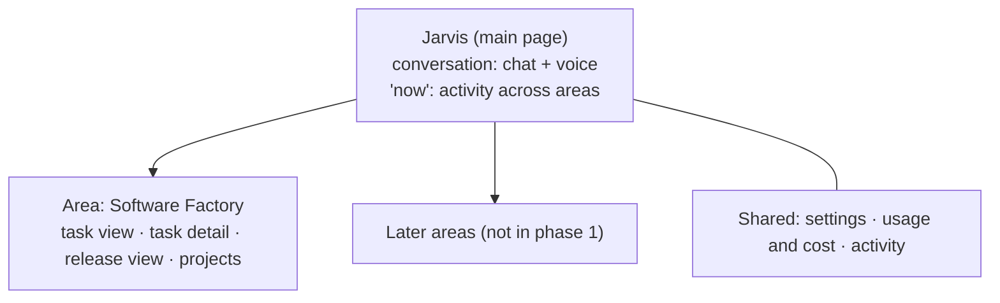
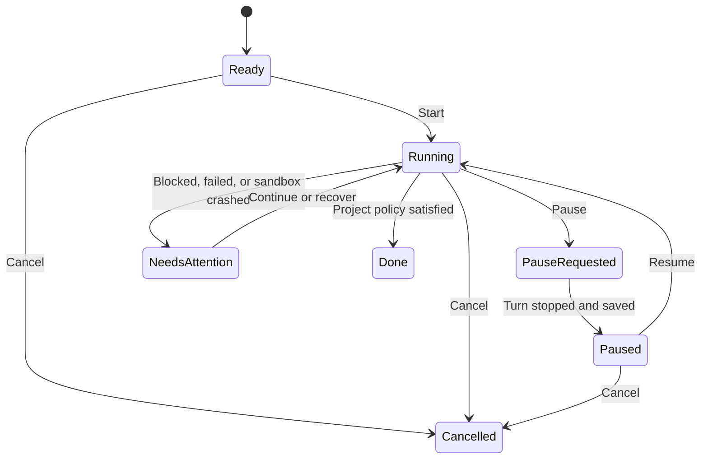

# Product

Jarvis is Dan's personal AI platform: one app, controlled by chat and voice, that grows area by area. Phase 1 is the **Software Factory**: Dan asks Jarvis for a change, a coding agent (Codex or GitHub Copilot) does the work in a cloud sandbox, and GitHub Actions builds, tests, and releases it.

Keep implementation phases and progress in [PLAN.md](PLAN.md), visual choices in [DESIGN.md](DESIGN.md), system structure in [docs/architecture.md](docs/architecture.md), the data model in [docs/data-model.md](docs/data-model.md), commands and operating constraints in [docs/agent-context.md](docs/agent-context.md), and dated decisions and learnings in [docs/decisions.md](docs/decisions.md).

## Purpose and users

- **User:** Dan only. Single user; no multi-tenant or team features.
- **Purpose:** one Azure platform for building software projects, and later for banking, health and fitness, calendar, and further areas, all controlled through one shared UI and voice.
- **Language:** Dan speaks Danish and English. UI copy and documentation are English.
- Jarvis can develop its own repository through the same task flow.
- Prefer Microsoft services, so Dan learns the stack and new Foundry features, as long as they meet the requirements.

### Roadmap

| Phase | Goal |
| --- | --- |
| **1 — Software Factory** | Voice or chat → coding agent → GitHub → live board and voice updates. Start with one project, then verify parallel tasks. |
| **2 — Banking** | Integrate the existing Banking app into Jarvis with shared UI and voice access. Scope open. |
| **3 — Health and fitness (Daily)** | Clean up the existing Daily solution and migrate valuable functions, integrations, and history to Azure. |
| **4 — Windows app** | The same core experience through the shared backend. Framework open. |

Only phase 1 is in scope now. Banking, health and fitness, calendar, and other areas get no tables, pages, or code until their phase starts.

## Scope and core workflows

### Confirmed experience

| Area | Requirement |
| --- | --- |
| **Jarvis** | Jarvis is the app and its main page. Dan talks to Jarvis in one continuous conversation (chat and voice), with saved messages and streamed chat replies. |
| **Board** | Kanban-style task view: add, start, steer, pause, resume, cancel, and follow tasks. |
| **Updates** | Events update state and progress live, without manual refresh. |
| **Assignment** | One active coding agent per task. |
| **Plan tracking** | The repository's `PLAN.md` is the shared task-status view, with each task linked to its GitHub issue. An open issue with a worker label (`Codex`, `Copilot`, `Dan`, or `Jarvis`) or an open linked PR sets In progress (assignees are ignored), completed tasks set Complete, and all other tasks, including issues closed without completion, reset to Not started unless Blocked is set by hand. New task rows get a labelled issue with dependency links. |
| **Parallel work** | Dan controls concurrency across projects; capacity depends on provider limits and compute. |
| **Agent choice** | Codex or GitHub Copilot per task, regardless of project. |
| **Subscriptions** | Codex uses Dan's ChatGPT Pro plan (Jarvis-only login); Copilot uses Dan's work seat on his personal GitHub account, approved for Jarvis. No per-use billing for either. |
| **Voice** | An open browser is enough. Danish and English with a language toggle; status requests and follow-ups. Voice Live credentials stay on the backend; the browser connects through an authenticated backend WebSocket relay. |
| **Continuity** | Work continues when the browser or voice session closes. |
| **Sandbox** | One sandbox per task: starts when work begins, closes after delivery or cancel. The agent runs targeted builds and tests only; no Docker. |
| **Build and release** | Full builds, all tests, and releases run in GitHub Actions, as in Dan's normal workflow; never in the sandbox. Managed projects can copy the repository's PR-check and OIDC-release workflow templates and adapt their build and deployment commands. |
| **Project settings** | Per project: how far agents may go (deliver a PR, or complete without deployment), merge rules, sandbox size. |
| **Settings** | A settings page controls Jarvis, voice and coding-agent defaults using only server-validated models; updates affect new sessions and tasks, not running work. |
| **Transparency** | Usage and cost per task and project: sandbox time, model tokens, voice, and Codex/Copilot usage. |
| **Sign-in** | Tenant-specific Microsoft sign-in requests the delegated Jarvis API scope; the backend allows only Dan's Entra object ID and returns his display name from `/me`. The hosted Jarvis agent has its own identity; it may read only its effective model settings and list and call tools. No passwords in Jarvis. |
| **Cost** | As low as possible. Slower startup after inactivity is acceptable. |
| **Memory** | One continuous conversation will need compaction and memory over time; the memory design is deferred. |
| **Turn context** | Each model turn receives current running-task status and recent events plus a bounded recent-message window, so typical status questions do not need a separate task-list model round. |

### App structure

Jarvis's main page is the conversation with Jarvis plus an overview of what is happening across areas. Each area has its own pages for details. The structure exists from the start so later areas plug in without rework.

- Each area owns its pages and registers its tools with Jarvis. The backend exposes every registered tool's input schema and executes calls, recording each result so new modules become available without agent changes. Jarvis's reply about an action comes from that recorded result: a refused or failed call is reported as refused or failed, never as done. The Jarvis agent uses only these backend tools.
- Page requirements list every data point and action, not the look. Dan creates the visual design from them with an image generator (see [DESIGN.md](DESIGN.md)).

### Task lifecycle

- **Steer and pause** stop the current turn at a safe point; **resume** continues the agent's conversation.
- **Sandbox heartbeat:** while a task runs, the backend checks its active invocation about once a minute and updates the session heartbeat timestamp. HTTP 424/404/5xx on two polls (or persisting for 30 seconds) moves the task to Needs attention; a gap in runner events alone never signals a crash. **Recover** restarts it in a new sandbox from the task branch, with the task and its history.
- **Dispatch:** the backend leases Ready tasks only when both global and project concurrency limits allow them. It retries safe start failures up to three attempts (15-second, then 30-second delays); an ambiguous Foundry start or exhausted attempts moves the task to Needs attention. The dispatcher reacts to committed task events and retry deadlines rather than polling SQL while idle.
- The authenticated tasks API creates board tasks only for active projects, lists tasks with project, agent, state, period and search filters, and returns task details with a bounded, pageable event history. API responses are capped at 1 MiB; oversized event payloads are explicitly marked truncated. New tasks always start Ready and record their creation event.
- Task state belongs to the backend. State changes must follow this lifecycle; clients cannot write state directly, and Done requires verified project-policy/GitHub completion.
- Coding agents push small work-in-progress commits to the existing task branch after each meaningful step. They never force-push or push to `main`, and report commit or push failures.
- **Checks loop:** when a pull request's checks fail, Jarvis sends the failing log back to the same task; the agent fixes and pushes again.
- **Done** follows the project policy and verified GitHub results, never the agent's own report.
- Show observed milestones; use percentages only when measurable. Show stale or disconnected status and reconcile after reconnect.
- Changing the provider (Codex ↔ Copilot) on a running task is out of scope for now.

### Project policies

| Policy | Allowed outcome |
| --- | --- |
| **Deliver a PR** | Implement, test, push a task branch, and open or update a pull request. Stop at a green PR. |
| **Complete without deployment** | Also merge when the project's merge rules pass. |

- Merge rules and Done are Dan's choices per project.
- Permissions are enforced in the backend and runner, and GitHub branch protection is respected.

### Settings

Global defaults on the settings page; a task can override the coding-agent model and reasoning. A changed setting applies to new sessions and tasks, never to running ones. Only models available in the Foundry account or Dan's subscriptions are offered.

| Area | Setting | Default |
| --- | --- | --- |
| Jarvis | Model and reasoning effort | `gpt-5.6-luna`, reasoning `none` (chat and Danish voice); `gpt-realtime-2.1` (English voice) |
| Voice | Speech to text | MAI Transcribe |
| Voice | Voice per language | English: Ryan HD (British butler persona, addresses Dan as "sir"); Danish: Harper (MAI-Voice-2) |
| Voice | Default language | Danish |
| Codex | Model and reasoning effort | Codex default |
| Copilot | Model | Copilot default |
| Global | Max parallel tasks; sleep switch | Set by Dan |

English voice sessions use Ryan HD and the British butler persona. The backend owns the realtime session and executes registered tools; the browser never executes tool calls or supplies their results. Jarvis relays the backend-built confirmation for successful, refused, and failed actions.

Danish voice uses the authenticated backend `/voice/da` WebSocket to a provisioned Foundry Voice Live agent. The agent bridges to the hosted Jarvis agent, uses MAI Transcribe with language `da` and the Danish phrase list, and fixes Harper to `da-DK`.

### Page requirements

Data points and actions per page. The look is decided in [DESIGN.md](DESIGN.md).

#### Jarvis main page

| Data points | Actions |
| --- | --- |
| Conversation: messages (Dan, Jarvis) across chat and voice sessions, time, language, streamed replies, tool-call chips (tool, outcome, link to task) | Type a message; start or stop voice; switch Danish/English |
| Voice state: connecting, listening, thinking, speaking, reconnecting; what Jarvis heard; latency | Start or stop browser voice; interrupt by speaking; mute |
| "Now": running tasks (project, agent, activity, duration), tasks needing attention, latest releases and deployments, credential warnings | Open a task, release, or project; dismiss an activity item |
| Backend state: awake (minimum replicas 1) or asleep (minimum replicas 0) | Change state; refusing sleep while a task is Ready or Running |

#### Software Factory — task view

| Data points | Actions |
| --- | --- |
| Columns by state: Ready, Running, Paused, Needs attention, Done, Cancelled | Create task (project, agent, text, optional model/reasoning override) |
| Card: title, project, agent, state, current activity, last update, duration, attempt count, PR number and checks state, usage so far | Open; steer; pause; resume; cancel; recover (Needs attention) |
| Filters: project, agent, state, period | Filter; search |

#### Software Factory — task detail

| Data points | Actions |
| --- | --- |
| Header: title, request, project, agent, model, state, branch, PR, checks, timestamps, the message in the conversation that created it | Steer, pause, resume, cancel, recover; open PR or branch on GitHub |
| Timeline: every runner event, steering messages, check results, state changes | Filter event types; expand payloads; open artifacts (logs, CI logs) |
| Sandbox sessions: start, end, size, end reason, heartbeat state | — |
| Usage: sandbox minutes and DKK; Codex/Copilot turns and any reported usage | — |

The backend persists each task event and state change to the task history and activity feed together, then publishes the committed event for live clients. The authenticated live feed resumes from the last delivered event after reconnect so updates missed while disconnected are replayed without duplicate timeline entries.

The task timeline remains complete as older events move from SQL to private Blob Storage. The detail API restores those events on demand within its existing paginated response.

#### Software Factory — release view (per project)

| Data points | Actions |
| --- | --- |
| Horizontal git graph: branches as lines, commits as dots (from GitHub on demand), coloured by PR, checks, release, and deployment state | Hover a dot for commit details; open commit, PR, or run on GitHub |
| Releases (one per merge to `main`): build number, SHA, status, created and released time, linked tasks and PRs | Open a release; open its workflow runs |
| Workflow runs: workflow, trigger, status, conclusion, duration | Open the run on GitHub; open the failing log |
| Deployments: environment, status, time | Open the deployment |

#### Software Factory — projects

| Data points | Actions |
| --- | --- |
| List: name, repository, default agent, policy, tech, running tasks, last release | Create, edit, archive a project |
| Project settings: repository, default branch, default agent, policy, merge rules, sandbox size, tech, max parallel tasks | Save (applies to new tasks only) |

The project API lists active projects, creates and updates settings, and archives
without deleting the row or its task history. Repositories use `owner/name`;
policies are `deliver_pr` or `complete_without_deployment`, sandbox sizes are
`1x2` or `2x4`, tech identifiers start with a lowercase letter and use lowercase
letters, digits, `.`, `_`, and `-`, and max parallel tasks is a positive
32-bit integer (default 1).

The projects page derives running-task counts from tasks in the `Running` state
and refreshes them when Dan refreshes the page. Until release data is connected,
the last-release field is explicitly unavailable rather than inferred.

#### Settings

| Data points | Actions |
| --- | --- |
| Jarvis: model and reasoning (chat and Danish voice); English speech-to-speech model | Change (applies to new sessions) |
| Voice: speech-to-text model, voice per language, default language | Change; play a voice sample |
| Coding agents: Codex default model and reasoning; Copilot default model | Change (applies to new tasks) |
| Global: max parallel tasks; sleep switch | Change |
| Credentials: name, expiry, last renewal, status (never secret values) | Trigger Codex renewal; open re-seed instructions |

The backend checks Codex daily and renews only when the access token has three
days or less remaining and no Codex task is running. Credential dates and
status are non-secret Key Vault metadata; failed renewal is visible as
"Action needed". Manual renewal and re-seed controls remain disabled until an
operator workflow is available.

The settings API validates choices against the server's available-model catalog.
The coding-agent catalog currently offers only each provider's default. P2-11
verifies the runner path for explicit model values: Copilot uses its CLI `--model`
option; Codex uses the ACP `model` and `reasoning_effort` session options. Task
overrides take precedence over settings defaults when the dispatcher supplies
the effective values. Actual provider/model availability still needs a live
task. The global parallel-task limit is a whole number from 1 to 100. The
sleep switch is on the main page; voice sample playback and credential
data/actions remain visibly unavailable until their owning services exist.

#### Usage and cost

| Data points | Actions |
| --- | --- |
| Per task, project, and period: sandbox minutes and DKK; Jarvis model tokens and DKK; voice minutes and DKK; Codex and Copilot usage (no DKK) | Change period; group by project, agent, or source; open a task |

## Constraints and integrations

- **Azure:** subscription "Dan Aakesen", tenant Novaro, region Sweden Central. Details in [docs/agent-context.md](docs/agent-context.md).
- **GitHub:** Dan's private repositories only; a GitHub App provides per-task tokens, webhooks, and merges.
- **Coding agents:** Codex (ChatGPT Pro, Jarvis-only login) and Copilot (work seat) over ACP; their usage limits are shared with Dan's own use.
- **English voice:** `gpt-realtime-2.1` with Ryan HD; tool calls execute through the backend's registered tools, and the spoken response uses the backend-built confirmation.
- **Security:** agents run with full permissions inside their sandbox and can read its tokens, so each token is scoped to the task. Jarvis data and other areas are never reachable from a sandbox.
- **Cost:** see [Cost](docs/architecture.md#cost) in the architecture map.
- **Existing systems:** Banking is an existing Azure app using the Agents API (integration code not inspected yet). Daily is an existing ChatGPT site, currently paused; its useful functions and history move over in phase 3.

## Success criteria

- Dan can ask Jarvis, by voice or chat, to start a task on a project; a coding agent delivers a pull request; GitHub Actions checks it; Jarvis merges and releases it according to the project policy.
- Dan sees every task and release update live, can steer, pause, resume, cancel, and recover tasks, and sees what each task used and cost.
- Each phase in [PLAN.md](PLAN.md) meets its acceptance criteria. Prototype results are evidence for feasibility; production behavior needs its own verification.

## Open questions

- Conflicts between pull requests in one repository (Decision 5).
- Changing the provider on a running task (Decision 4).
- Memory design (Decision 6).
- What usage Codex and Copilot report per turn ([data model](docs/data-model.md#still-open)).
- Whether Foundry sandboxes can get the documented 20 GiB disk (Decision 9).
