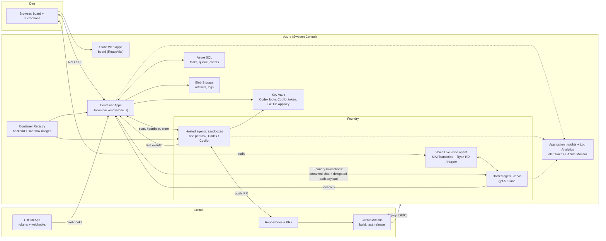
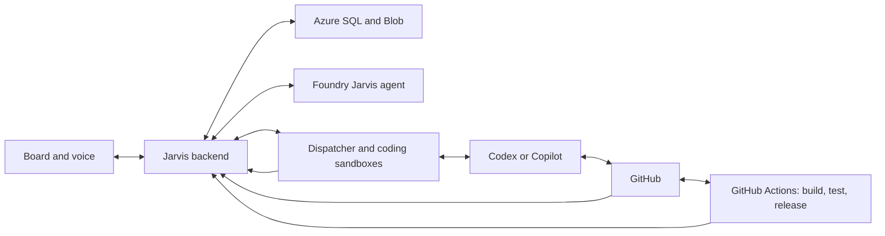
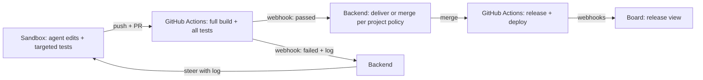
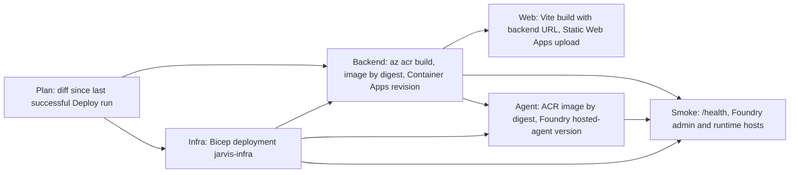

# Architecture

Jarvis is one backend with a shared core and one module per area, a static web app, Foundry agents for Jarvis and the coding sandboxes, and GitHub for code, CI, and releases. Phase 1 builds only the core and the Software Factory area. P0-01 provides the monorepo folders. P0-02 and P0-03 implement the web and backend skeletons. Statuses below distinguish implementation, design, and prototype evidence.

- Requirements: [PRODUCT.md](../PRODUCT.md). Feature summaries: [features.md](features.md). Phases and tasks: [PLAN.md](../PLAN.md). Decisions and learnings (L1–L78): [decisions.md](decisions.md).
- Data model: [data-model.md](data-model.md).
- **Flow diagrams:** [architecture-flows.html](architecture-flows.html). Tab 0 shows the complete flow, and tabs 1–25 show each flow as swimlanes, coloured by evidence (prototype/offline-tested, documented, assumed). Open it in a browser.

## Stack overview

| Area | Choice | Status |
| --- | --- | --- |
| Repository | One GitHub monorepo `jarvis`: `apps/web`, `apps/backend`, `packages/contracts`, `agents/jarvis`, `runner`, `infra`, `db`, and `pc-bridge`; npm workspaces for the two apps, one root lockfile | Implemented; P7-06 adds a .NET 10 Windows companion and portable protocol/policy project |
| Development tooling | Node.js 22.23.3, npm 10.9.9, TypeScript 6.0.3; Python 3.12.14 baseline (`.python-version`), voice reference container remains on 3.13; MIT licence. Cloud agent environments (P0-14): `copilot-setup-steps.yml` and `scripts/codex-setup.sh` provide the pinned toolchain, then the shared `scripts/setup-dependencies.sh` installs from the lockfiles | Node/npm/Python pinned in P0-01; TypeScript updated in P0-02 for lint compatibility; builds verified, Python production components pending; Copilot setup verified in P0-14, Codex setup pending P0-15 |
| Web | React/React DOM 19.3.0, React Router 7.18.4, `@azure/msal-browser` 5.24.0, Vite 8.3.2, React plugin 6.1.1; Azure Static Web Apps Free in West Europe | Skeleton and MSAL sign-in implemented; live Entra sign-in and deployment verification remain pending |
| Backend | Node.js + TypeScript on Azure Container Apps (Consumption): minimum 1 replica, heartbeat poller, sleep switch, `@azure/storage-blob` 12.31.0, `@azure/keyvault-secrets` 4.11.2, and `fflate` 0.8.3 | Health/logging/container skeleton implemented in P0-03; heartbeat polls active sandbox invocations without querying SQL while idle and distinguishes completed-turn expiry from active crashes; P1-12 implements the authenticated sleep API and board control; P6-03 archives old task events and reads them on demand; P2-10 starts fresh recovery sessions; P3-14 opens or reuses an App-token PR after completed task work and leaves policy completion to P3-06; P3-02 reads the GitHub App key through the backend identity; P3-05 stores bounded failed-job logs and steers the task; P6-22 routes approvals and away notifications through the Now feed and browser voice; P7-22 adds Google OAuth-backed Gmail and Calendar tools; P7-02 adds persisted manual away state; live Azure behavior remains unverified |
| Backend framework | Fastify 5.12.5, @fastify/cors 11.3.0; `@microsoft/teams.apps` and `@microsoft/teams.cards` 2.1.0: schema validation, a plugin per area, SSE support, optional Teams adapter and Adaptive Cards | Skeleton, core/factory module registration and P1-03 projects API implemented; optional Teams module and fake-connector coverage remain in source but are not configured in production |
| Database | Azure SQL, free offer: one database `jarvis`; Entra admin is the group `jarvis-sql-admins` (Dan and the backend identity) | Decided |
| Database access | `mssql` 12.7.2 (`@types/mssql` 12.3.0), Tedious managed identity; immutable SQL migrations under a transaction-owned app lock before backend listen; reviewed down scripts | Implemented in #7; groups 1–3 schema in #15, groups 4 and 6 in #27, group 5 in #42, heartbeat agent routing in #32, `idle_expired` session end reason in #226, group 8 conversation/confirmation state in P7-03, legacy group 9 in P7-13, and the derived vault index in P7-40; deployed heartbeat verification remains open |
| Files | Azure Blob Storage for artifacts, logs, and archived task events | Decided |
| Secrets | Azure Key Vault (RBAC) | Decided |
| Images | Azure Container Registry: backend and sandbox images | Decided |
| Monitoring | Pino 10.4.0 JSON logs, Application Insights SDK 3.16.0 manual traces + Log Analytics workspace in the resource group (L8); allowlisted voice-turn and PC bridge timings; stateful Azure Monitor email alerts and 300 DKK budget thresholds | Timing fields are content-free and allowlisted; alert contracts, deduplication and Bicep compile offline; SQL Server integration, live ingestion, budget reads and email delivery remain unverified |
| Infrastructure as code | Bicep, deployed by GitHub Actions with OpenID Connect | Bicep provisions no Teams Bot or separate Speech F0 resources; local Bicep checks pass, live Azure setup remains pending |
| Sign-in | Entra ID: tenant-specific MSAL Browser requests the delegated `jarvis-api` scope; backend verifies bearer tokens with jose 6.2.12 and Dan's object ID. `/me` returns only the validated display name. The hosted Jarvis agent's app-only token (`Jarvis.Tools`), runner identity, and P7-06 device-code bridge identity are restricted to explicitly opted-in routes; the bridge also requires its client ID, Dan's object ID, tenant and delegated API scope | Browser, agent, runner and bridge auth contracts are checked offline; live Dan sign-in, deployed chat invocation and the bridge's live Windows sign-in remain unverified |
| Board updates | Authenticated server-sent events (SSE) over `fetch`, so the bearer token can be sent. Reconnects resume from `Last-Event-ID`; persisted task events replay before buffered live hub events, with duplicate IDs suppressed. A comment heartbeat is sent every 25 seconds. | Implemented and tested offline; SQL Server integration and deployed streaming remain unverified |
| Jarvis agent and runner | Python 3.12 (Foundry hosted agents support Python or C#). `agents/jarvis` (P4-01): Python 3.12.14 image, `azure-ai-agentserver-invocations` 1.2.0 voice host, `openai` 3.24.0 Responses API, `azure-identity` 1.26.0, `httpx` 0.28.1; hash-locked `requirements.txt` | Agent ported and checked offline and as a local container in P4-01; Foundry deployment completed in P4-08; P4-09 registers chat through the public Invocations handler |
| Coding sandbox | Foundry Hosted Agents, Invocations protocol, one session per task; Container Apps Jobs as fallback | Proven |
| Agent protocol | ACP for both agents: Copilot CLI `--acp` (preview); Codex via `codex-acp`; CLI versions pinned (L13) | Proven |
| Voice | Danish: Voice Live voice bridge, MAI Transcribe, Harper. English: `gpt-realtime-2.1` speech to speech, Ryan HD. Browser traffic uses an authenticated backend WebSocket relay; provider credentials stay server-side. | Relay design selected; local mock spike verified, Azure interoperability unverified |
| Build and release | GitHub Actions: full build, tests, releases, deployments; Project board synchronizes issue/PR status | Jarvis coordinator removed at Dan's request. Project board script/workflow and existing environment retained. PR merges require Dan or explicit agent authorization; P3-03 receives signed webhooks, P3-04 maps them to group 5, P3-05 processes failed task-PR checks, and P3-07 creates one default-branch release per project/SHA with runs and deployments linked by SHA. |
| Testing | Web/backend: Vitest 5.0.3; web: jsdom 30.1.1, React Testing Library 16.3.3; lint: ESLint 10.12.0, typescript-eslint 8.71.0. Python pytest; PC bridge: .NET 10, xUnit; SQL container tests | Web/backend implemented in P0-02/P0-03; PC bridge policy and protocol have offline CI tests; live Windows execution remains unverified |

## Web skeleton and configuration

- P8-05 keeps the conversation screen viewport-bound within the P8-04 shell.
  `ConversationHistory` owns the draft, language, chat turn and typing/voice
  visibility; `VoiceControls` owns the browser voice client and reports active
  state. Hiding the composer preserves its draft, and terminal voice states
  restore input focus. Persisted voice completion refreshes history. The
  transcript scrolls independently; activity/backend controls are expandable
  within it. APIs and persisted conversation contracts are unchanged.
- P8-21 keeps that ownership while polishing presentation: auto-growing input,
  DA/EN pressed buttons, relative message metadata, streaming caret and
  reduced-motion-safe transitions. `Workspace` reuses its existing geometry
  operations for title dragging, edge resizing and Arrange keyboard controls.
  Now surfaces reflect existing feed data; tool shimmer requires an explicit
  tool-call state. No route, package, database or agent-delivery contract changes.
- P8-23 presents the existing P5-04 voice status and decoded playback level in
  the full-screen orb, moves voice actions beneath it, and keeps only P8-22
  window chrome visible. `VoiceControls`, `VoiceOrb` and `Workspace` retain their
  existing state ownership; P8-16 still owns tool-activity events. Motion reuses
  the P8-20 tokens and hidden-tab/reduced-motion rules. No event plumbing,
  persistence or service contract changes.
- P8-36 replaces the orb status and button group with the compact luminous-glass
  voice bar: `VoiceBarStatus` (formerly `VoiceOrb`) renders the same P5-04
  status, and the shared `ConversationMoreMenu` holds the Language flyout plus
  voice actions in both the bar and the composer. Language still flows through
  `ConversationHistory` state into the next session. No event, persistence or
  service contract changes.
- P8-40 (#417), implemented offline in PR #419, keeps the same voice client, authenticated activity and
  scene, but requests microphone access/audio preparation from explicit Start
  voice and enables capture after real session readiness without a second click.
  Transport/mute/runtime/playback are reconciled into one presentation state for
  the under-orb HTML status and distinct scene motion; speech energy must reflect
  actual playback time, including silence/interruption reset. Preserve permission
  recovery, reconnect mute, cancelled-start cleanup and existing provider/API
  contracts. No new persistence or retained audio/transcript is required. This
  implementation supersedes the separate-enable and in-bar placement below.
  `VoiceStageContext` supplies separate live input/playback readers to the scene;
  `voicePresentation` reconciles transport, microphone, mute and runtime state.
  `VoiceOrbStatus` provides HTML feedback independently of WebGL. The pure
  `createOrbMotion` model drives staged wake, state weights and attack/release
  envelopes. No backend protocol or persistence change is required.
- P8-43 (#435) adds screen/camera start/stop to voice More while reusing
  `useVisionCapture` and the same authenticated frame endpoint. `start` accepts an
  optional failure callback so its initiating control owns permission feedback,
  without retaining a duplicate inline error. Voice inspection also opts into
  caller-owned feedback. Inspection remains on request; late results from an
  ended/replaced voice session are discarded. `ConversationToast` portals transient
  feedback to the document body, outside transformed scene/composer ancestors,
  with dismissal, a hover/focus-paused timeout, and an offset above the actual
  composer/voice-bar height. `VoiceOrbStatus` remains HTML
  live status with white unframed text. Existing orb shaders add a continuous
  integrated core phase and low dormant light baseline; reduced motion freezes
  time. No new dependency, backend protocol or persistence is introduced.
- P8-31 applies the selected smoky glass to existing shell, conversation,
  temporary-workspace, contextual-panel, Factory and Settings surfaces through
  the light/dark semantic tokens in `apps/web/src/styles.css`. Shared headings
  use the selected sans typography; the real page content and typed renderers
  remain unchanged. No route, data flow, API, persistence or production
  dependency version changes. The production Three.js scene is still owned by
  P8-28, so reflected-stage readability remains to be checked there.
- React mounts into `apps/web/index.html`. BrowserRouter renders the home page
  and a catch-all page with a return link. Production static hosting must fall
  back to `index.html` for client routes (P0-11).
- Vite selects the tenant ID, web client ID and API scope from the bootstrap
  output and injects only those fields plus the backend origin. The bootstrap
  file is read at build time, never imported into the browser.
- `apps/web/config.json` records the production HTTPS origin; `VITE_BACKEND_URL`
  can override it at build/dev time. Missing deployment leaves the shell usable;
  invalid identity fields or URLs stop startup. P0-11 must persist its
  `backendFqdn` as the public URL. Backend connectivity is unverified until then.
- The home page uses a tenant-specific MSAL Browser client with the public web
  client ID and API scope. MSAL stores its cache in session storage; sign-in
  redirects the whole page to Entra (no popup, so embedded browsers and popup
  blockers work) and returns to the registered site root, where
  `handleRedirectPromise` completes it. It requests only the delegated API scope
  and sends the access token to `/me`. Cached accounts use silent token
  acquisition through the `/redirect.html` bridge. A missing backend URL disables
  sign-in instead of presenting a false success state.
- P1-07 adds the app shell. `useSignIn` owns the MSAL session for the whole
  app, so navigation never repeats sign-in. Until `/me` succeeds, every shell
  route shows sign-in and the header hides navigation; unknown addresses still
  show the not-found page. `src/areas.ts` registers each area (`id`, label, top-level
  path, component). The shell renders its navigation entry and mounts it at
  `/<path>/*`; the area renders its own nested routes. Software Factory
  (`src/factory/`) owns `/factory/tasks`, `/factory/tasks/:id`,
  `/factory/projects`, `/factory/projects/new`, `/factory/projects/:id` and
  `/factory/releases/:id`;
  invalid IDs show not found. The Usage area (`src/usage/`) owns `/usage` and
  reads the signed-in user's usage report. `/settings` is the shared settings entry. P1-11
  implements it as a responsive form for Jarvis, voice, coding-agent defaults,
  global task limits, and appearance. P8-13's shell-level theme provider loads
  the   accepted `appearance.theme` from `/settings`, saves light/dark/system changes
  through the same authenticated API, and resolves system mode from the OS
  preference. It applies the effective mode and approved appearance tokens to
  semantic CSS variables on the document root. Theme changes take effect only after the
  server returns the accepted value; rejected updates retain the previous
  appearance. Remaining voice samples, sleep, credential, and custom-theme
  controls are visibly disabled until their owning services/contracts exist.
  P6-18 supplies the credential-health and Codex-repair backend contract below;
  this backend-only change does not enable the Settings buttons.
- P8-32 keeps the existing Jarvis Three.js scene mounted while theme changes
  update its materials, lights, exposure and atmosphere from the semantic
  `--stage-*` CSS roles. Shared glass roles keep foreground HTML readable over
  either rendering; no additional preference or provider path is introduced.
- P8-20 keeps the visual system in `apps/web/src/styles.css`: semantic light/dark
  roles, type and layout tokens, elevation/translucency, and shared motion rules.
  P8-16 publishes typed chat/voice runtime activity through the existing
  owner-authenticated `/now/events` SSE stream. `JarvisActivityProvider` tracks
  event-derived operations and voice state, so one ending cannot clear another
  active operation. The orb maps those reported states and decoded playback PCM;
  listening is emitted only after the relay is ready and microphone audio is
  observed. Tool-call events contain only tool name and normalized outcome, not
  arguments, results, transcripts or secrets. Activity remains in memory and is
  neither persisted nor included in Now snapshots. CSS aurora and state motion
  pause while the document is hidden and reduce to fades/static readable states
  when motion is reduced.
- P8-07 keeps window lifecycle state in the mounted `Workspace` component.
  Minimised views remain mounted but hidden and inert; open/minimised/closed and
  maximised state is memory-only. The shell passes the component's typed
  `WorkspaceController` dispatch through `WorkspaceCommandContext` to the active
  page. P8-14 supplies bounded declarative view data and fixed React renderers.
- P8-15 registers one sensitive `workspace_command` Jarvis tool with the shared
  generated-view/operation schema. An in-memory broker delivers each command to
  every open, owner-authenticated `/now/events` session (every signed-in tab,
  7 October), bounds pending work and deduplicates command IDs. The first tab to
  apply a command settles it; the command is refused only when every tab refuses or
  disconnects. Hijacked event streams copy the Fastify reply headers so CORS survives. The event carries only validated JSON; the browser
  dispatches through the current `WorkspaceCommandContext` controller and posts
  an owner-authenticated acknowledgement to
  `POST /now/workspace/commands/:commandId/ack` after applying or refusing it.
  Timeouts, cancellation, disconnects, stale sessions and partial failures are
  returned as refused/error results; no view or geometry rows are persisted.
  On non-conversation signed-in routes, the shell keeps the command stream
  mounted in a hidden Now panel while the workspace controller remains active.
  Ordinary renderers use fixed React elements and declarative data. P8-41 adds
  the separate `html-app` renderer for owner-authorized artifacts; generated
  HTML/JS executes only inside its restrictive sandboxed iframe, never in the
  host page. Workspace-command tests pass; live delivery and report browser
  acceptance remain unverified.
- P8-37 registers conversation history as the page-owned workspace view
  `conversation` from `App.tsx` once a conversation exists. The view content is
  an empty host element; `ConversationHistory` portals its transcript into it
  through `ConversationWindowContext`, while the chat session, composer, voice
  controls and command-stream overview stay mounted outside the window. The
  window therefore uses the shared tabs, geometry, focus, snapshot and Jarvis
  commands. Voice entry minimises it, voice exit restores it, and sending or
  Conversation navigation restores it after Close.
- Background jobs (7 October): slow work that ends in a workspace window (research
  today; images and HTML apps next) registers with the in-memory
  `BackgroundJobRegistry` (`apps/backend/src/core/jobs.ts`). Every change publishes a
  contract-valid `BackgroundJob` (`packages/contracts`: `jobId`, `kind`, a 3-6 word
  `title`, `status` running/done/failed/cancelled, `step`/`steps`, optional `detail`,
  and `viewId` once done) as `event: job` on `/now/events`. `GET /jobs` lists current
  and recently finished jobs (kept 10 minutes, at most 20) so a reloaded tab can
  rebuild its job chip, and `POST /jobs/:jobId/cancel` (owner only) aborts a running
  job. Jarvis reads the same state through the `list_jobs` tool (chat and voice) and
  cancels by id or title words with `cancel_job`. Research progress windows are best effort, so a missed update no longer stops
  the job, and the final report falls back to `create` when no open tab still has the
  progress window.- P7-27 publishes a bounded `WorkspaceSnapshot` (at most 32 open-window titles
  and IDs, including minimised windows, plus context-panel visibility) through
  owner-authenticated `POST /now/workspace/state`. The broker keeps one snapshot per
  open `/now/events` session, uses the most recently reported one, and drops a
  tab's snapshot when that tab disconnects;
  no view content or workspace state is persisted. Jev selects fixed
  `workspace_command` targets for show/focus/minimise/restore/close, a large
  resize, tiled/layered layout and context-panel visibility. A context-panel
  `open` command without a view opens existing content idempotently; an `open`
  command with a generated view retains the original agent-only behavior.
  Creation/update and new generated panel content remain agent-only.
  Workspace operations are safe for stable voice partials as well as chat and
  finals, using the existing owner authentication, validation, audit and
  acknowledgement path. Resize also updates tiled spans so enlargement is
  visible in either arrangement. With a workspace snapshot available, running
  task discovery is capped at 150 ms so SQL cannot consume the chat reflex's
  entire 800 ms classification budget. Chat replay and the voice ledger compare
  semantic arguments without the workspace delivery ID; the agent receives the
  recorded outcome/note rather than repeating the command.
  Agent-closed generated windows retain up to eight view/geometry entries in
  client memory for `restore`; a contradicted partial close uses that contract
  to undo without generating content. Manual closes still discard the view,
  and reusing a view ID invalidates its retained entry. Older evicted entries
  cannot be restored and produce an honest refused result.
  Every attempted chat/voice classification emits an allowlisted
  `reflex.decision`: source, addressed, intent, tool (or `none`), confidence
  bucket, completeCommand, executed, bounded reason and latencyMs (0–600,000).
  Jev failures distinguish billing (402), auth (401/403), rate limiting (429),
  timeout, other HTTP status, invalid answer, and network error. The same
  allowlisted event records browser and PC planner failures. Transcripts, keys,
  titles, view IDs, arguments and results are excluded. Choice confidence is
  calibrated by Jev and gates actions at 0.9; no self-rated Score confidence is
  requested. Offline tests cover failure types, confidence gates, early voice
  execution, and duplicate final decisions; live Jev network latency remains
  unverified.
- P8-07's lifecycle remains in memory: closing a generated view removes only
  its temporary client entry, while closing an existing view changes only its
  workspace visibility. Neither action modifies conversation or source records.
- P8-10 keeps voice-scene state in the conversation/shell client: P5-04 runtime
  callbacks enter and leave fullscreen without an animation gate, and the
  workspace reports visible-view changes so the shell can position the orb.
  Natural/manual end, failure, and Escape restore typing; the default-off
  `voice.minimizeWindowsOnVoiceStart` preference is persisted through P8-17 and
  mirrored to device storage for immediate shell reads. P8-14 provides the safe
  list renderer in the Now panel; generated workspace delivery is provided by
  P8-15. P8-16 provides typed activity to the top bar, orb and Jarvis-updated
  workspace-window shimmer; speech output including P7-12 announcements follows
  the same observed speaking state. No workspace or activity state is persisted.
- P8-11 keeps phone foreground selection in the same mounted `Workspace`.
  The existing focus/restore commands select a phone view without changing
  desktop order. Background content stays mounted, hidden and inert; pointer
  swipes and named keyboard controls share that controller. The existing
  visible-view callback reserves content space above the phone voice dock and
  returns the orb to the centre when no visible content remains. No backend,
  persistence, public command contract or generated-view delivery is added.
- P7-16 extends the same authenticated, validated `dbo.settings` key/value store
  with bounded personality preferences. Hosted chat and Danish voice read them
  for each new agent invocation/session; the backend snapshots them when it
  configures each new English voice relay. Active voice connections keep their
  original snapshot.
- P1-10 passes the backend URL and MSAL token provider into the Software Factory
  area. The projects list and settings page call the authenticated project CRUD
  routes; running counts are derived from `GET /factory/tasks?state=Running`
  and refreshed on demand. Failure to load tasks leaves project management
  usable with counts marked unavailable. Last release is marked unavailable
  until release data is connected. Client validation improves form feedback;
  the backend remains authoritative. Live Azure CRUD is not verified by the
  browser-mocked UI check.
- The main page's "Now" activity panel takes a typed `NowFeed`
  (`src/activity.ts`): running tasks (title, project, agent, activity, start
  time) and activity items (category, title, `activity.link`, time). Only
  `task:<id>`, `release:<id>` and `project:<id>` links become routes. Dismissal
  removes an item only after the backend confirms it. P1-13 loads this data
  from authenticated `GET /now`, persists dismissal through
  `POST /now/activity/:id/dismiss`, and refreshes snapshots from authenticated
  `/now/events`. The panel identifies unavailable data and reconnecting or
  unavailable live updates rather than claiming a stale snapshot is current.
  P8-14 adds `@jarvis/contracts`, a shared version-1 JSON Schema and matching
  TypeScript discriminated union for the P8-18 renderer/action allowlists. The
  authenticated `/tools/:name` boundary validates tagged generated-view results
  against the schema and semantic bounds; `call-tool` actions must name a
  registered tool, and image URLs must use GitHub or the configured task-archive
  Blob host. The serialized view is capped at 256 KiB. The signed-in Now panel
  builds a list view from its existing bounded `/now` response and renders
  values through fixed React elements. No generated HTML, JavaScript or CSS is
  interpreted. Views remain ephemeral; live Entra/Azure behavior is unverified.
  P6-02 adds a dismissible Alerts group backed by `activity.alert_key`. Failed
  deployment, confirmed sandbox crash and credential-expiry activity is inserted
  transactionally with its source change and emits a hashed Application Insights
  trace only after commit. A unique filtered index suppresses repeated conditions.
  Stateful Azure Monitor rules query those traces and email through the configured
  action group. Budget actual spend is read with the backend managed identity every
  15 minutes; a unique monthly threshold activity refreshes Now. The native Azure
  Budget 80% threshold also uses the email action group. Failures remain visible in
  backend logs; no SMS or voice actions are configured.
- `/me` inherits the root authentication hook. The verifier accepts only
  Dan's signed delegated API token and returns a bounded display name from its
  validated `name` claim, falling back to `Dan` if that optional claim is absent
  or malformed. The route exposes only that name, never token claims or IDs.
- P1-14 tracks pending data requests in `src/backend-request.ts`. The signed-in
  shell probes authenticated `GET /database/status` while foreground requests
  are pending and displays “Waking Jarvis…” only for `{ waking: true }`,
  as a compact top-bar status (P8-37; there is no bottom shell bar).
  The endpoint reads process-local retry state, never SQL, and is not cached.
  Data requests allow 120 seconds; status probes stop when requests settle or
  the page is hidden. Task SSE sends `event: ready` after replay so heartbeat
  comments cannot falsely indicate the database wait has finished.
- `GET /settings` and `PATCH /settings` inherit the same Dan-only delegated
  authentication. The backend returns effective defaults with the validated
  model catalog, rejects unknown keys and unsupported values, and writes a
  partial update transactionally to whitelisted `global` rows in `dbo.settings`.
  The `appearance.theme` value accepts only `light` or `dark` and reuses the
  global `dbo.settings` key/value table without a migration. The `newProjects`
  settings area validates owner, visibility, templates
  repository, default agent, policy, per-project task limit, and default branch;
  these defaults reuse the existing settings table and are available to future
  project registration without changing the project API.
  P8-17 adds global appearance mode and optional theme-token scalars plus
  `voice.minimize_windows_on_voice_start` (default `false`) through the same
  settings store. Appearance is bounded to light/dark/system; colors use
  `#RRGGBB`, background uses the named visual presets, glow is 0–1, motion and
  density use closed catalogs, and radius is 0–24. The registered `set_theme`
  Jarvis tool validates its token patch and writes through `SettingsStore`;
  the existing dispatcher records `ok`, `refused`, or sanitized `error`
  outcomes. Successful calls return the accepted token patch. These values use
  the existing JSON-scalar settings rows, without a migration. Window/view state
  remains client-owned and is not stored. Applying tool-originated changes to an
  already-open client without reload depends on the P8-13 consumer and remains
  unverified.
  The SQL adapter is injected only when database configuration exists; the API
  returns 503 without it. The model catalog offers deployed Jarvis models and
  only provider defaults for Codex and Copilot because their available-model
  catalog values have not been verified. The agent-only `GET /agent/settings`
  route returns only the effective Jarvis model and reasoning effort to the
  `Jarvis.Tools` principal. The hosted agent reads it before acknowledging a new
  session and holds that snapshot for the session; if the read is unavailable,
  it logs a warning and uses the defaults. Future task creation reads these
  defaults; existing sessions and tasks are not updated.
- `ci.yml` (P0-10) is the aggregate CI on every PR, `main` push and
  `workflow_dispatch`. It calls the reusable `web-ci.yml`, `backend-ci.yml`
  (including the container smoke), `database-ci.yml` (isolated SQL Server migrations), `foundry-contract.yml`, `runner-ci.yml`
  (runner images) and `jarvis-agent-ci.yml` (agent image, non-root and fail-fast
  configuration checks, and a model-free voice turn over its WebSocket), runs Python lint, tests and byte-compilation for `runner`
  and `agents/jarvis` when they exist,
  and ends in one `CI result` gate job. No job uses Azure credentials.

### Shell windows, chat dock, presence and memory in the web client

- **One window layer.** `Workspace` is mounted by the shell on every page. Off the home page it is a fixed overlay above the page (pointer events only on windows). Minimised windows are portalled as tabs into `.window-tabbar` under the top bar; `window-fly-away.ts` animates inert copies for close and minimise.
- **Task windows.** `task-windows.ts` keeps open task windows (`task-<id>` views rendering `TaskDetailPage`) and saves `{ taskId, title }` entries (at most 12) in `localStorage` under `jarvis.windows.tasks`, so they return as tabs after a reload. `TaskWindowLink` opens a window on plain clicks and keeps `/factory/tasks/:id` for new tabs; that route opens the window and redirects to Kanban. No server state is added (#430's server-side pinning remains open).
- **Chat dock.** `JarvisPage` (conversation, composer and voice) stays mounted in the shell for every signed-in page. `.app-shell[data-home]` and `[data-chat="home|out|rail"]` drive its placement; `chat-flight.ts` animates the bar into and out of the rail orb. Starting voice off the home page navigates home.
- **Presence (#468).** `presence-store.ts` shares one state for the top-bar chip and Settings: `GET /presence` on first use and every minute while visible, `PUT /presence { mode }` to switch, and `mode_changed` (or `mode`) events from `/now/events` applied live through `now-feed.ts`. Contract: Presence modes (P6-23), live since 6 October. 404/405/501 still read as "not available yet". Instructions per mode are read from and patched to `personality.modeInstructions` through `/settings`.
- **Memory (#469).** `MemorySettings` uses `GET /memory/status`, `GET /memory?query&folder&limit`, `GET /memory/{id}`, `PATCH /memory/{id} { text }` and `DELETE /memory/{id}` as documented under GitHub vault memory (P7-40). It shows commit links for vault edits and distinguishes 204 (forgotten), 202 (approval pending in Jarvis), 409 (away) and 503 (web approval unavailable).
## Runtime overview

The backend factory is separate from the process entrypoint. `/health` returns
200 with `{"status":"ok"}`; it does not claim SQL or Azure readiness. The process
binds to `0.0.0.0:3000` by default, validates configuration before listening and
handles SIGTERM/SIGINT with a five-second close and telemetry flush deadline.
Browser requests allow only the exact configured `STATIC_WEB_APP_ORIGIN` and
`http://localhost:5173`; other Origin values receive 403. A root `onRequest`
authentication hook runs before CORS and protects current and future nested routes.
Only the registered `/health` GET/HEAD, GitHub's signed webhook route, and
CORS-generated preflight are public; explicit business OPTIONS handlers require
authentication. `POST /github/webhooks` is the sole public business route and opts
out of Entra authentication through its route configuration only. It accepts
GitHub's JSON bytes unchanged, verifies `X-Hub-Signature-256` with the Key Vault
secret `github-app-webhook-secret`, and records the `X-GitHub-Delivery` ID and
event in `dbo.webhook_deliveries` only when the event maps to an active managed
repository. A process-local repository set is loaded once at startup and updated
when projects are created, renamed, or archived. Signed unsupported and
untracked events are acknowledged as ignored without SQL. Tracked mappings and
the delivery ID are committed together in one serializable transaction; duplicate
deliveries cannot replay state writes. Only delivery metadata and allowlisted
mapping fields are stored; P3-04 and P3-07 update project records.
`KEY_VAULT_URI` is supplied by Bicep, and the backend managed identity reads and
caches the secret after its first successful Key Vault lookup. Missing Key Vault
configuration or secret fails webhook requests with 503, not an unsigned fallback.
The server generates request IDs and records only approved event names, methods,
route templates, statuses and timings. A final output allowlist covers child
logger bindings as well as log arguments, dropping request/provider secrets.
Background failure events retain their emitted names for presence, sandbox
heartbeat, budget checks, task-event archival, project-policy confirmations,
dispatcher operations, checks-loop recovery, PC bridge status, Google expiry
alerts and telemetry shutdown. These events export only a fixed error-kind
vocabulary and integer HTTP status codes (100–599), never error messages,
bodies, tokens or URLs. Error callbacks preserve caught errors until the logging
boundary; Graph authentication/transport/HTTP failures and budget HTTP failures
carry safe metadata without provider responses.

The factory module exposes authenticated `POST /factory/tasks`, filtered and
paginated `GET /factory/tasks`, and `GET /factory/tasks/:id` with paginated event
history. It validates active projects and bounded request/query inputs. Runner
identities with the `Jarvis.Runner.Events` app role may call
`POST /factory/sandbox-events` and `POST /factory/tasks/:id/github-token`. The
token route requires an active task and its unended Foundry session, derives its
repository from task/project state, and mints a one-hour repository-scoped App
token; it accepts neither a repository nor an unrelated task/session from the
caller. The events route validates task/event fields and records source
`runner` through `TaskStore.recordEvent`. Clients cannot update task state directly;
the task store serializes backend transitions, checks the lifecycle, and records
state events atomically. Completion can reach Done only through a trusted call that
confirms completion. The browser and hosted agent service identities do not receive
a task-state bypass. Responses are capped at 1 MiB, and event payloads above 4 KiB
are omitted with an explicit truncation flag.

Chat-created tasks retain their originating message ID. Committed Done,
NeedsAttention, Cancelled, and backend `pull_request_opened` events route a short
status message with the task ID, outcome, and validated GitHub PR link to that
conversation. A SQL task/state key prevents repeat delivery across restarts;
away mode routes through the existing Teams notification service, while active
voice sessions speak the same status through the existing voice announcer.
P6-21 adds the following fields to every task in `GET /factory/tasks` and to
`GET /factory/tasks/:id`, independently of event pagination:

- `pullRequest`: `{ number, url, state }` or `null`. The newest linked
  `pull_requests` row (opened time, then ID) supplies the number and
  `open`/`closed`/`merged` state. Without a linked row, the newest backend
  `pull_request_opened` event can supply a known number with `state: null`.
  URLs use the task project's repository, not the activity's display text.
- `checks`: the linked PR's recorded `pending`/`passed`/`failed` value or `null`.
  `checkConclusion` is the latest linked workflow conclusion for the PR's current
  head SHA (completion/start time, then ID); without one, recorded passed/failed
  checks map to `success`/`failure`. No GitHub request runs during these reads.
- `usageSummary`: `{ inputTokens, outputTokens, costDkk }` or `null` when no
  task-linked usage exists. Values sum recorded `usage` rows across sources.
  Missing token metrics and wholly unreported costs remain `null`, not zero.
  Recorded costs may be partial when some usage rows have no cost. Active sandbox
  estimates remain in the detail's existing `usage` array, not this summary.

`POST /factory/tasks/:id/retry` takes no body and uses default Dan-only
authentication (agent and runner identities are refused). It returns `200` with
the Ready task, `400` for an invalid SQL bigint ID, `404` for an unknown task,
`409` for an ineligible task, or `503` when task storage is unavailable.
Eligibility requires NeedsAttention, at least one dispatch attempt, no unexpired
lease, no archived event history, no sandbox session history, and a latest backend
state event confirming `credential_unavailable` or `foundry_start_rejected`.
Recorded runner events or a
`session_persistence_failed` start result also refuse retry because the remote
sandbox may already have run. Transport/timeouts, expired dispatch leases and
legacy `foundry_start_failed` results remain ambiguous and refuse retry even
without a session row. Final auth/HTTP 4xx refusals (except HTTP 408) now retain
`foundry_start_rejected` rather than the ambiguous failure reason.
Use Recover for tasks with sandbox history; ambiguous or archived outcomes need
reconciliation before another sandbox can safely start.
The shared `/tools` registry exposes this same lifecycle operation as
`retry_task`; it validates the task ID and returns a safe refusal for missing or
ineligible tasks rather than bypassing the store's retry guards.
The transaction takes the shared sleep-switch lock and locks the task, resets
the attempt count, retry deadline, lease and start/finish timestamps, and preserves
the task request, configuration and branch. It records a Dan-sourced
`state_changed` event with `from: NeedsAttention`, `to: Ready`, `reason: start_retry`
and the previous attempt count, plus activity. Publication occurs only after
commit and wakes the existing dispatcher; retry does not bypass its credential,
capacity or project guards. Concurrent/duplicate retries yield only one transition.

`POST /factory/tasks/:id/controls` accepts only `steer`, `pause`, `resume`, `recover`, or
`cancel`; it uses the default Dan-only authentication and never accepts a requested
task state. The dispatcher validates the current state, uses the Foundry client for
the remote operation, and persists the accepted invocation or lifecycle transition.
Steering also stores the bounded user message as a `steered` task event in the same
transaction as its turn, then publishes the event after commit; SSE payloads over
4 KiB are omitted and marked truncated. Pause remains `PauseRequested` until heartbeat
confirms the turn stopped; steering and resume register the accepted turn for heartbeat
monitoring. `recover` starts a new session on the existing task branch and accepts
`Running` only for a session ending `idle_expired`, first moving it to NeedsAttention.
Steering after recorded idle expiry uses the same new-session recovery path and
includes the new correction in the recovery prompt and task history.
A stale or invalid transition returns 409, unavailable runtime state returns
503, and remote failures are sanitized. The board and detail page share one state-aware
controls component.

P1-08's web board uses the authenticated project and task APIs for filters and
task creation, requesting at most 100 newest matching tasks at a time. It opens
the P1-06 authenticated fetch-SSE client for nonterminal tasks, resumes from each
stream's last event ID, and refreshes the filtered task snapshot after events.
Connection and reconnection state is visible. The list API does not yet return
pull-request, check, or usage values; cards mark those data points unavailable
instead of inferring them. No backend route or persistence change is required.

The main page's authenticated `GET /now` returns up to 100 running tasks with
their project, agent, current activity and start time, plus up to 100
non-dismissed attention, release/deployment, credential and alert activity
records, along with the current presence state. Presence transition audit rows
are excluded from the bounded feed; read the current mode through `/presence`.
The read derives attention from the latest activity for each task in
`NeedsAttention`; other categories use their `activity.kind`. The
`POST /now/activity/:id/dismiss` route updates `activity.dismissed_at`, returns
404 for an unknown ID, and is safe to repeat for an existing item. Task-event
commits and dismissals invalidate the Now snapshot through `/now/events`; the
browser reconnects and rereads the bounded snapshot. This stream is separate
from task-history replay and has a 25-second heartbeat. These routes use the
default Dan-only authentication. Offline API and SQL Server integration tests
cover the contracts; deployed Entra, SQL and streaming behavior remain
unverified.

P8-16 adds `jarvis-activity` SSE frames to that existing owner-authenticated
stream. A strict shared contract permits only an activity ID, `chat`/`voice`
source, state, and—for tool calls only—a tool name and `ok`/`refused`/`error`
outcome. A volatile in-memory hub carries these events; no activity rows,
conversation content, arguments, results, or secrets are written or sent.
Chat thinking/terminal events follow the streamed turn, and chat tool events
follow the recorded tool-call outcome. The voice relay reports only observed
readiness, audio, response, interruption, reconnect, tool and failure events;
listening is not emitted before readiness/audio. Disconnect closes pending
voice tool activities. Browser reconnect clears transient states before new
events arrive. Focused contract/backend/web tests cover these transitions and
payload privacy; live Entra, Foundry and physical audio remain unverified.

P1-09's task detail page reads `GET /factory/tasks/:id` in 100-event pages using
`eventOffset`; the backend merges archived and SQL rows transparently. It resumes
the authenticated P1-06 SSE stream from the last event in the initial page and
deduplicates live/replayed events with the same persisted IDs. Project links reuse
the active-project API to form validated GitHub branch links. PR/check data,
artifacts remain unavailable until their integrations are ready; P2-07's task
controls call the authenticated dispatcher route, and P2-12's usage section shows
the task's recorded usage. For tasks created from a
conversation, it fetches the matching message with a one-row paginated history
request. P2-07 adds a separate authenticated control write route; no schema change
is required.

`GET /operations/sleep` reports the Container App's configured minimum replicas;
`PUT /operations/sleep` accepts only awake (1) or asleep (0). Both routes use the
root's Dan-only authentication. The backend targets only its Bicep-configured
Container App resource ID and obtains an ARM token with its user-assigned
managed identity. Before requesting sleep, the task store checks for Ready,
Running, or PauseRequested tasks under an exclusive SQL application lock; task creation and state
transitions use the matching shared lock, held through their writes. The lock
remains held through the bounded ARM request, closing the race with new active
tasks. Refusal is a 409; unavailable ARM configuration or failures return a
sanitized service error. The custom role grants only Container App read/write
and is assigned at the backend app. Endpoint, refusal, lock, and ARM request
contracts are tested offline and against SQL Server; live Azure authorization
and scaling remain unverified.

The factory registers authenticated `GET /factory/projects`,
`POST /factory/projects`, `PATCH /factory/projects/:id`, and
`DELETE /factory/projects/:id` routes. The project
store uses the process-owned SQL pool and parameterized queries; list returns
active rows, archive sets `active = 0`, and duplicate repositories return 409.
Request schemas validate required settings and the database's policy, sandbox,
tech, repository, and concurrency constraints. When SQL is not configured,
project requests return 503 rather than claiming success. Route and query-binding
contracts are covered offline, and SQL Server-container tests execute project
CRUD and archive queries. Real Azure identity and project CRUD remain unverified
without Azure access.

With backend-only `APPLICATIONINSIGHTS_CONNECTION_STRING` (P0-11 Key Vault
reference), an isolated SDK client exports these events as manual traces. No
global auto-instrumentation captures request headers, URLs or dependency calls,
and disk retry caching is disabled. Without that setting, stdout JSON logs keep
offline/CI operation usable. Fake sinks prove the adapter contract; live Azure
ingestion remains pending. `backend-ci.yml` proves the production container and
its health/CORS/shutdown behavior in GitHub Actions without Azure credentials.
The image uses Node.js 22.23.3, a non-root user, and only backend production output
and dependencies; prototypes and frontend sources are excluded.

### Backend authentication

The backend verifies RS256 signatures using the configured tenant's Entra v2
JWKS endpoint. It requires the exact v2 issuer, API client-ID audience (not the
`api://` resource URI), expiry/not-before/issued-at claims, tenant and v2 version.
Verified tokens must contain Dan's allow-listed `oid` and delegated
`access_as_user` scope. Missing, malformed, duplicate or unverifiable credentials
receive sanitized 401 with a Bearer challenge; verified users/scopes without
permission receive 403. These early denials retain CORS response headers only
for the exact approved browser origins, so sign-in can inspect their status.
ID tokens and other app-only tokens are not authorized here.

The hosted Jarvis agent is the tools service identity (P4-01). When
`ENTRA_JARVIS_AGENT_OBJECT_ID` is set, a verified token whose `oid` matches it must
carry the `Jarvis.Tools` application role, no delegated `scp`, and `idtyp` absent
or `app`; otherwise 403. Its principal goes to `request.agentPrincipal`, never
`request.principal`, and only routes with `config: { jarvisAgent: true }` accept it:
`GET /tools`, `GET /factory/context`, and `POST /tools/{name}`. Coding runner
identities receive a separate `Jarvis.Runner.Events` app role and are accepted only
on `POST /factory/sandbox-events` and the narrowly scoped
`POST /factory/tasks/:id/github-token`; the latter requires the Foundry session
ID and can only issue a token for that session's active task repository. Their principal is kept separately as
`request.runnerPrincipal`. The bootstrap script assigns this role only to the
runner principals supplied after Runner deploy. All other routes, including `/me`
and task APIs, reject runner identities. `jarvis-api` requires role assignment, so
Entra issues app-only tokens only to explicitly assigned principals.

The local PC bridge uses a distinct public-client app registration and a delegated
`access_as_user` token. When `ENTRA_PC_BRIDGE_CLIENT_ID` is configured, the backend
accepts it only when `azp`, Dan's `oid`, the tenant and delegated scope match; its
principal is accepted only on `GET /pc-bridge/connect`. The bridge is not accepted
on ordinary user or Jarvis tool routes, and ordinary Dan or service tokens cannot
connect as the bridge. `infra/bootstrap.ps1` creates and pre-authorizes this client;
main Deploy passes its nonsecret ID to the backend. If the variable is absent,
bridge authentication remains disabled.

JWKS lookups have a five-second timeout, a 30-second refresh cooldown and a
ten-minute key cache. Provider outages fail closed. Only object ID, tenant ID,
and a validated display name reach `request.principal`; `/me` returns only the
display name. The agent principal holds only its object ID and tenant ID. Tokens, other claims and provider details are excluded from logs
and responses. Configuration accepts `ENTRA_TENANT_ID`,
`ENTRA_API_CLIENT_ID` and `ENTRA_OWNER_OBJECT_ID` UUID overrides and otherwise
uses the nonsecret bootstrap identities; `ENTRA_JARVIS_AGENT_OBJECT_ID` is an
optional UUID that must differ from Dan's. Real RSA signatures, local HTTP JWKS,
socket duplicate headers, `/me` authorization and stalled-provider tests
establish this offline boundary. No deployed Entra token was obtained; live
browser sign-in and deployment verification remain #11.

## Web notifications and confirmations (P6-22)

The personal-tenant deployment does not configure Teams or Microsoft 365. Away
mode remains manual and Graph presence is not read. Optional Teams adapters stay
in source but are not provisioned or configured by production Bicep.

Away task-state notifications are inserted as alert activity rows in the Now
feed and trigger authenticated server-sent refreshes. Active English browser
voice sessions announce task completion/attention and pending approvals without
speaking task titles or payloads. Browser confirmation summaries/IDs remain in
the in-memory pending queue; `/now` exposes them to Dan while present or away,
and `POST /now/confirmations/:id` requires Dan's delegated identity and a
pending, unexpired request. Approval/rejection is a conditional single-use
transition; the backend consumes an unexpired approval before calling the gated
operation. Reject, timeout, cancellation, replay, unknown IDs, startup
orphaning, and unverifiable identity all fail closed. The pending timer is five
minutes. `runConfirmed` gates repository creation and the automatic squash-merge
path; future delete, mail, calendar, out-of-browser computer and spend actions
must use the same gate. Merge work is queued after webhook validation so the
GitHub request is not held open while Dan responds.

The web approval remains visible in Now if voice is not active; the pending
operation expires and fails closed after five minutes if Dan does not approve.
Teams/Bot Service and Speech F0 code is not live-verified because those
integrations are not part of the personal-tenant deployment.

## Presence modes (P6-23; replaces P7-02 away mode)

`createAwayModeStore` persists `{ mode, source, changedAt }` as JSON in the
existing global `dbo.settings` key `away.mode.state`; old `{ away: true }` values
read as `away`, and false values read as `present`. Removed `teams_presence`
sources normalize to `manual`. No database migration is needed. State
transitions and their `core/away_mode` activity rows commit together. The store
publishes one mode-change callback after each committed mode transition.
Existing routing derives its boolean as `mode !== 'present'`.

The modes and UI colour contract are Present (`present`, green), Away (`away`,
yellow), and On the move (`on_the_move`, blue). `GET /presence` returns the
current state; owner-only `PUT /presence` accepts `{ mode }` and records a manual
change. The signed-in browser still uses `POST /now/present` only while visible
and focused on startup, focus, tab visibility, or user input; passive
API/feed requests do not return Dan to Present. The owner-authenticated
`set_presence_mode` tool records Jarvis-originated changes without confirmation;
`set_away_mode` remains a compatibility alias for one release. `GET /agent/settings`
provides the active mode and timestamp alongside the base
`personality.customInstructions` and bounded per-mode instructions. Realtime
voice receives those instructions initially and sends a new `session.update`
when a mode-change event arrives.

The backend does not poll Graph or require `Presence.Read.All`; away mode is
manual, Jarvis-commanded, or set to Present by authenticated browser activity.
The Now feed and pending browser confirmations remain available while away.
The Now event hub publishes `mode_changed` with both `mode` and the
backward-compatible derived `away` boolean. Away task notifications continue
through the configured browser notification path, and existing task-stream and
voice suppression use the derived away value. Local tests do not verify a live
browser session or speech delivery.

## Database startup and migration ownership

The process creates one `mssql` pool when SQL settings are supplied and shares
that process-owned pool with the tool-call, conversation, memory and task stores. Production
configuration requires an Azure SQL host, database and user-assigned identity
client ID; `azure-active-directory-msi-app-service` delegates token acquisition
and renewal to Tedious/Azure Identity. TLS certificate validation stays enabled.
No SQL settings selects the offline skeleton; partial settings stop startup.
Password authentication is permitted only for isolated loopback CI in test mode.

`index.ts` awaits database initialization before listening, outside Fastify's
10-second ready-hook limit. Connection and pool acquisition/creation attempts
are bounded at 30 seconds; executed query timeouts remain 120 seconds. A
300-second overall startup deadline includes auto-resume, the 60-second app-lock
wait and all migrations. Cancellation stops active requests, rolls back the
transaction and closes the pool. If cancellation occurs during connect, its owner
closes the late connection before any migration can begin. Process shutdown has
the existing five-second final deadline. Database logs expose fixed event names,
never raw errors, tokens or SQL text.

P1-14's shared wake handler retries startup connection and pool acquisition
with 1-, 2-, 4-, 8-, then 10-second backoff within a 90-second deadline,
including attempts. Resume errors 40613, 40197, 40501 and connection timeouts
qualify; unrelated errors fail normally. Acquisition happens before statements
or transaction BEGIN, so writes can safely wait there. Explicitly read-only,
nontransactional queries opt into `databaseReadRequest`; acquisition and read
retries share the original deadline. Executed writes and transactions are never
replayed, even for a resume-like error or an ambiguous commit. Cancellation
releases late acquired connections and shutdown owns outstanding attempts.
The waking flag counts concurrent waits and clears after success, failure or
cancellation; there is no idle SQL polling and no SQL store contract change.

The backend reads committed `db/migrations/NNNN_name.sql` batches, acquires
`jarvis.schema-migrations` exclusively with `LockOwner=Transaction`, validates the
applied checksum prefix and applies all pending batches plus ledger entries in
one transaction. Rollback preserves both data and migration history. No recurring
migration or readiness queries run while idle; pool minimum is zero and
`validateConnection=socket` avoids validation queries. The production image
includes the same migration directory. `0001_core_tables.sql` (P1-01, #15) creates
data-model groups 1–3. Each forward migration has a reviewed reverse script in
`db/migrations/down/`; startup never runs it. `revertMigration` runs it under the
same lock and transaction, only for the latest applied migration, and removes its
ledger row. CI proves up, down and re-up against SQL Server. This includes the
`tool_calls` table that the tool dispatcher (P4-02) writes.

Real managed-identity token exchange and migrations in a deployed Azure revision
remain issue #11. See the [database guide](../apps/backend/src/database/README.md)
and [migration format](../db/migrations/README.md) for configuration and ownership.

Where each part runs. The web app is static files on Static Web Apps: free and always reachable. Container Apps hosts only the backend.

### Backend module composition

Issue #16 adds `BackendModule` (`id`, `registerRoutes`, `tools`) and registers
each module as an encapsulated Fastify plugin after global security/CORS/logging
hooks. `buildApp` defaults to `core` and `factory`; its optional module list selects
the complete composition. A new area contributes routes and tools through this
contract without changing `core`. Readiness awaits async module registration and
refuses a failed plugin; Fastify owns plugin close hooks.

Core owns the health route, tool catalogue, HTTP dispatcher and typed in-process
event hub. The Factory task store persists task events and corresponding activity
rows in the same SQL transaction as task creation, state transitions, or an event
write; it publishes to the hub only after commit. `TaskStore.recordEvent` is the
small producer API for later runner and backend event sources. The hub is
process-local; the single production replica keeps subscribers together. Event
payloads are capped at 1 MiB, and published payloads over 4 KiB are omitted.
The authenticated SSE endpoint, heartbeat and replay are P1-06. Factory also owns
projects and task APIs. The catalogue rejects duplicate
module/tool identities, snapshots frozen schemas and exposes read-only descriptors
with ownership and handlers. Authenticated `GET /tools` exposes every descriptor's
name, description and input schema. The core registers a schema-validated
`POST /tools/{name}` for every tool at composition time, passes the request and
cancellation signal to its handler, then writes the arguments, result and outcome
to `tool_calls` using the process-owned SQL pool. A tool may provide a bounded safe
failure explanation with `ToolFailure`; other unexpected errors remain generic.
Each response carries `outcome` (`ok`, `refused` from a tool's `ToolRefusal`, or
`error`) and a `confirmation` built only from that recorded result (L16), which
Jarvis relays instead of its own claim; a non-200 response means nothing was
confirmed. Calls require
`X-Jarvis-Message-ID`; absent persistence returns 503 before tool execution. The
tool routes accept Dan's delegated token and opt in to the Jarvis agent identity
([backend authentication](#backend-authentication)). Existing Foundry client, health/security/logging and
process shutdown behavior are preserved.
P7-45 adds `list_capabilities` and read-only `repo_*` tools to the shared Factory
registry. They use only repository-scoped GitHub App installation tokens, default
to `JARVIS_REPOSITORY` (`DanAakesen/jarvis`), and accept explicit project IDs or
repositories only when they match an active project. File paths, encodings and
response sizes are validated and bounded; overview responses are cached by commit
SHA. Repository files and issue text are explicitly framed as untrusted input.
The tools support Jarvis chat, voice and the hosted agent through the existing
`GET /tools` and `POST /tools/{name}` routes.
The [module guide](../apps/backend/src/modules.README.md) explains adding areas,
resource lifetimes and the verified offline extension contract.

### Local PC bridge (P7-06)

`pc-bridge/Jarvis.PcBridge` is a per-user .NET 10 WinForms tray app. It signs in
with Entra device code as the `jarvis-pc-bridge` public client and requests only
`api://<jarvis-api-client-id>/access_as_user`. It opens an outbound TLS WebSocket
to `/pc-bridge/connect` with subprotocol `jarvis.pc.v1`; it opens no listener or
firewall port and retries after disconnect. Entra app-only identities, other
delegated apps, and users other than Dan are rejected at the route boundary.

The backend registers `pc_open`, `pc_media`, and `pc_active_window` in its
existing tool registry. Protocol messages are bounded to 64 KiB, correlate UUID
command IDs, cap in-flight work, and time out after 15 seconds. Both backend
validation and the companion's portable core bound app names and validate the
fixed command shapes. App lookup searches the current user's and common
`Programs` Start-menu trees for `.lnk` shortcuts and enumerates
`shell:AppsFolder` for packaged apps; matching is case-insensitive and fuzzy,
and ambiguous matches return a bounded candidate list instead of launching.
Edge shortcuts/package identities are excluded, including shortcuts targeting
`msedge.exe`; unknown names are refused. Shortcuts launch through Windows shell
resolution and packaged apps through their AppsFolder identity. There is no
raw shell or arbitrary command execution tool. `pc_media` accepts only
play/pause, next, previous, volume up/down, and mute, and sends the corresponding
fixed Windows media virtual key. URL commands are routed through the browser
executor: if the extension is connected and
Chrome automation is enabled, it opens the URL in Dan's normal Chrome; if the
extension is disconnected, the current companion launches the installed Chrome
executable directly and identifies that fallback in the tool result. Websites
are never handed to the Windows default browser. A connected extension with
automation disabled is refused rather than silently bypassing the setting.
Launched apps and VS Code file/folder opens use Windows `AllowSetForegroundWindow`
to grant the new process foreground eligibility; no synthetic input or
focus-stealing workaround is used. The bridge does not expose arbitrary command
execution; its only direct executable launch for a URL is the Chrome fallback.
Offline requests receive a clear refusal; other failures are sanitized. The
companion never logs tokens, device codes, command arguments, URLs, paths, window
titles, or message content.
The backend logs each WebSocket command's safe command name, normalized outcome
and monotonic round-trip milliseconds as `pc_bridge.command_timing`; request
arguments and returned data are excluded by the logger allowlist.

`pc_open` accepts repo-relative folder and file targets under `C:\Repo` and
opens them in VS Code. The portable `RepoPathResolver` checks the requested
file/folder kind, canonical containment and every path segment for reparse
points; invalid, missing, traversing or linked-out paths are refused. This
reuses the P7-31 `open_app`/`InstalledAppMatcher` implementation for app
launching and adds no second launcher.

Online/offline changes update one existing Now-feed activity row keyed by
`pc_bridge_status`; the same row reports whether Jarvis control is active or
paused. Status writes are serialized and the feed refresh happens after commit.
The tray's persisted **Pause Jarvis control** toggle reports its state over the
authenticated WebSocket, and the bridge refuses app opening, navigation, focus,
UI Automation actions, and browser actions while paused. Read-only window/tab
inspection remains available. This uses `activity.alert_key` and requires no
migration. The
portable policy tests, backend protocol tests with a fake WebSocket bridge, and
Linux Windows-target build run in backend CI. Real device-code sign-in, Windows
process/window behavior, SQL production writes and the live PC opening flow
remain unverified.

### Windows UI Automation app control (P7-07, expanded by P7-31, P7-32, P7-34, P7-36)
### Offline wake word (P7-39)

The tray app listens for "Wake up Jarvis" with the Speech SDK
(`Microsoft.CognitiveServices.Speech` 1.52.0) on-device `KeywordRecognizer` and
a Speech Studio custom keyword model loaded from `WakeWordModelPath` (an
absolute path to a `.table` file) in the bridge settings. Keyword spotting needs
no Speech key or network connection. The default microphone is opened only for
the current recognition and released when listening stops. Audio is neither
stored nor sent, and the recognizer's result audio is never read. Listening runs only while
the persisted tray **Wake word** toggle is on (`WakeWordEnabled`; a missing value
means on once the model file exists). Without a model, the toggle is disabled
and explains that `WakeWordModelPath` must be set. The portable
`WakeWordListener` owns the state: off, listening, paused during voice, or
microphone unavailable (retried after 5 s). It reports a detection once and
ignores repeats within 3 s.

While listening, the bridge adds `wakeWord: true` to its `status` message. The
backend then sends `{ "type": "voice_state", "active": boolean }` on connect and
whenever any voice session starts (`listening`, `thinking`, `speaking`,
`reconnecting`) or ends (`ended`, `failed`) on the activity hub. The bridge
pauses listening while it is active and resumes when it ends or the backend
disconnects. A bridge without the toggle on sends the earlier two-field status
and receives no `voice_state`.

On detection the bridge plays the Windows "Speech On" chime (or the asterisk
system sound) and sends `{ "type": "wake_word", "at": "<ISO UTC ms>" }` over the
authenticated bridge WebSocket. In parallel it focuses Dan's Jarvis tab. With
the extension connected, the native-messaging request `focus_jarvis_tab`
activates an existing tab on the Jarvis origin and focuses its window, or opens
the configured `WebUrl` (default: the production Static Web App origin). The
bridge then brings Chrome forward. Without the extension, it brings forward a
Chrome window titled `Jarvis - …` or launches the Chrome executable with the URL.
Edge and the Windows default browser are never used. This focus is the wake
word's own consent, so it does not depend on the Chrome automation toggle.

The backend accepts `wake_word` only on `/pc-bridge/connect`, which admits only
the PC bridge principal. Any other field, or a timestamp that is not a canonical
millisecond UTC ISO string, closes the socket with 1007. A valid event
publishes `{ type: 'voice.wake', at }` on the existing Jarvis activity hub (type
`JarvisVoiceWakeEvent` / `isJarvisVoiceWakeEvent` in `@jarvis/contracts`).
`GET /now/events` streams it as the separate SSE event `voice-wake`, which the
current web client ignores until Dan's UI work makes the page start voice. The
backend logs the content-free, allowlisted `pc_bridge.wake_word`.

### Windows UI Automation app control (P7-07, expanded by P7-32)

The backend registers the sensitive `pc_act` tool only when the existing Jev
client is configured. It reuses the authenticated PC bridge and its bounded
`uia_snapshot`/`uia_act` commands; no new route, credential, persistence, or
migration is added. Any foreground Windows app is eligible; the Windows
provider traverses at most 1,000 controls and depth 12, checking a one-second
traversal budget and cancellation between traversal batches. The portable
policy returns at most
100 enabled, visible, actionable controls with only role and accessible name.
Password controls and names that look sensitive are omitted; field values are
never observed.

Each snapshot has one opaque ID and expires after 30 seconds. Before a control
action, the bridge re-observes the foreground app/window and verifies the
selected element's runtime ID, role, name, visibility, enabled state,
sensitivity, and supported control pattern. Fixed click, type, small-scroll,
keyboard, and focused-typing operations are exposed. A keyboard action is a
sequence of at most four chords, each containing only Ctrl/Alt/Shift/Win
modifiers and a named key or one printable character. Win+L and
Ctrl+Alt+Delete are refused; Alt+F4 is available only when Dan explicitly asks
to close or quit. The Windows provider rechecks the foreground window and
focused UI Automation element before calling `SendInput`; any keyboard or
focused-typing action is refused when focus is sensitive or cannot be verified.
`type_focused` accepts only exact, non-sensitive text quoted in Dan's request.
Jev makes one decision per fresh snapshot, for at most 20 steps or 30 seconds,
with a 1.2-second request timeout; cancellation reaches both the planner and
bridge. Send/delete/pay/purchase/post/push/overwrite actions and irreversible
keyboard chords (including Delete and Ctrl+Enter) use the existing P7-03
`computer_use` approval flow; no action is retried until approval, and missing
approval refuses it. Reversible actions do not require approval. Approval and
step logs use bounded labels or fixed action metadata without goals, key
sequences, typed text, screenshots, control data, or UIA values. Website tasks
remain on P7-17–P7-19's Chrome-only path, and this tool does not use Foundry
computer-use.

The operation, target, and exact-text questions are Choice questions; the planner
uses the minimum returned Choice confidence and requires at least 0.9. There is no
self-rated confidence Score question. Jev billing/auth/rate-limit/timeout/status,
invalid-answer, and network failures are returned as typed outcomes and recorded
in `reflex.decision` without the goal, API key, or control data.

When a fresh UI Automation snapshot has fewer than three actionable elements,
`pc_act` can use the same bridge to request `window_capture`. The tray pause blocks
capture and point actions; capture also fails closed when the focused UI Automation
control is password-like or has a sensitive label. The foreground window is copied
to a transient PNG bounded to 1,280×720 and 750 KB. The bridge retains only a
30-second, one-use capture ID and window geometry; point clicks and scrolls are
pixel coordinates relative to that capture, checked against its dimensions and
the still-foreground window before `SendInput`.

The backend sends that PNG to the existing managed-identity Foundry vision client
using the `gpt-5.6-luna` deployment and requests structured JSON with normalized
candidate boxes. Jev receives only the bounded labels and boxes, chooses one
target/action for the step using the existing 0.9 Choice-confidence threshold,
and can click or scroll but cannot type through a visual-only target. Irreversible
candidate clicks use the existing `runConfirmed` path. Capture byte buffers are
held in memory only and cleared after use; captures are excluded from tool audit
and step activity, and the existing sensitive-tool audit records only redacted
metadata. There is no
Foundry computer-use, raw shell, new persistence, or migration; website tasks
remain on the Chrome path and never launch Edge.

Generic tool auditing records only the outcome for this sensitive tool. The
`pc_act.step` telemetry allow-list exports only step number, fixed action name,
and outcome—never goals, control labels, typed text, screenshots, or UIA
values. Fake-tree and backend tests cover non-allow-listed-app control, pause/status,
approval and the protocol; all 92 .NET core tests, 31 focused backend tests,
backend lint/build and the Linux Windows-target build pass. A cancellation token cannot
preempt an individual synchronous UI Automation COM call. Live Jev calls,
Windows UIA responsiveness/cancellation, physical approval delivery, and Dan's
end-to-end app task remain unverified.

When the configured Jev planner is available, the sensitive `codex_prompt`
tool opens Codex through `open_app` and delegates UI interaction to this same
`runPcAct` loop and the existing `uia_snapshot`/`uia_act` bridge commands. It
passes the exact prompt as one JSON-quoted value; password, payment-card,
one-time-code and other sensitive text remain refused. Codex prompts are audited
as redacted data. Typing does not request approval; irreversible controls or
intent reuse the existing `runConfirmed` flow. The tool returns success only
after a completed text-entry action, submission action and `pc_act` completion;
an unavailable Codex app or an incomplete submission is a refusal.

### Chrome browser executor (P7-18, P7-25, P7-26)

The existing authenticated PC bridge protocol adds `browser_tabs`,
`browser_snapshot`, and `browser_act` commands and the matching backend tools.
The tray companion keeps browser automation off by default; Dan enables it with
the persisted Chrome toggle in the tray menu. When the Jarvis MV3 extension in
Dan's normal Chrome profile is connected, the executor uses `chrome.tabs` for
discovery and sends its fixed CDP operations through `chrome.debugger`. URL opens
also use the extension: `chrome.tabs.create({ url, active: true })` creates the
new tab, then `chrome.windows.update(windowId, { focused: true, drawAttention: true })`
brings Chrome forward and requests attention. A successful result is returned
only after both extension operations complete. The browser toggle must be on
for this route; a disconnected extension uses the explicit Chrome executable
fallback described above. The extension's native-messaging host is registered
by the installer under HKCU; it relays length-prefixed messages to the running
companion over a current-user-only named pipe. This adds no network listener,
and the extension does not expose external messaging. Chrome's debugger
notification is visible while attached; the executor detaches after each
completed action, and the extension has a 30-second idle-detach fallback. If
the extension is not connected, the executor retains the existing loopback CDP
transport at `http://127.0.0.1:9222/json/list`. Chrome 136 ignores that port on
the default user-data directory, so Dan's normal profile uses the extension.

Each snapshot is one fixed Jarvis-owned page evaluation. It returns at most 100
visible, unobstructed actionable controls with role, accessible name, bounded
value and an index. The local companion retains the corresponding CDP DOM node
object IDs under an opaque snapshot ID; the index is never converted to a
selector or coordinate. An action expires after 30 seconds or when replaced by a
new snapshot. Immediately before acting, the companion checks that the same node
is connected and unchanged, remains visible and enabled, and is still the
topmost element at its center. Click, type, select, scroll, wait, bounded
keyboard sequences, and `type_focused` are fixed operations; the bridge never
accepts or evaluates a model-provided script. Keyboard actions require the
listed tab to remain the focused Chrome tab, and a fixed page-side probe reports
only whether `document.activeElement` is sensitive; it never reads the focused
value. The Windows provider performs the chord/text injection with `SendInput`
after repeating the foreground and sensitive-focus checks.

Password, payment-card and one-time-code fields are omitted from values and
refuse typing; code-like numeric and Luhn-valid card-number text is also
refused. Only send/delete/pay/payment/purchase/post/push/overwrite clicks return a confirmation
request without acting. The backend uses the existing P7-03 `computer_use`
refused. Only irreversible submit/send/delete/payment/publish/push/overwrite-style clicks
return a confirmation request without acting; reversible settings and sign-in
clicks do not. The backend uses the existing P7-03 `computer_use`
approval path and retries the same indexed action only after approval; without
confirmation service it refuses. Browser tools are marked sensitive so their
arguments and results (including typed text, tab URLs and page content) are
redacted from the generic tool-call store. No browser data is persisted.

The portable core exercises the same indexed-action contract through fake CDP
and fake extension ports. Tests also cover extension URL opens, the disabled
toggle, the disconnected shell fallback and its honest result, browser-agent
navigation, and P7-20 reflex URL target selection. Backend protocol tests cover
command validation and audit redaction. A Windows build and offline tests do not
prove native-host registration, foreground activation, Chrome profile behavior,
or debugger attachment; the one-time unpacked-extension load and live
“open google.com” acceptance in Dan's normal profile still require his Windows
PC.

### Ultrafast browser agent (P7-17)

The backend registers `browser_do` when the existing Key Vault Jev key and Foundry
project are configured. The P7-04 reflex may route a high-confidence chat or
English voice request directly to that tool before the main agent reply; the
hosted agent can also call it. P7-20 can invoke
`request.server.browserAgent.runClause` with one recognized clause and the
current tab ID, without owning the browser loop.

Each step takes a new snapshot through the registered P7-18 tools and sends one
Jev request containing the goal, recent actions, page title/URL, and bounded
visible control table. Closed-set Choice questions select the operation,
indexed targets for click/type/select/scroll/wait, a bounded keyboard sequence,
or one exact quoted value for `type_focused`. The request includes common
shortcut hints when the app is recognized; those hints inform selection but do
not add app-specific execution paths. The backend accepts only a high-confidence
choice and target/value present in that request; the selected index and snapshot
ID go unchanged to `pc_browser_act`, where the PC bridge rechecks the same DOM
node, freshness, visibility and occlusion. Keyboard operations have no element
target and execute only in the focused Chrome tab. Irreversible clicks and
keyboard chords use the existing P7-03 approval flow; the Foundry
`gpt-5.6-luna` chat deployment with reasoning disabled writes a small validated
JSON text value only for TYPE; a separate JSON check independently verifies
Jev's DONE decision against a fresh snapshot.

The planner uses the minimum calibrated Choice confidence for the selected
operation, target, and (for selection) quoted value, requiring at least 0.9;
there is no self-rated confidence Score question. Typed Jev billing/auth/rate
limit/timeout/status, invalid-answer, and network failures are recorded in
`reflex.decision` without the goal, page data, or API key.

Runs stop after 20 steps or 30 seconds, propagate cancellation, and refuse low
confidence or sensitive requests. Existing P8-16 tool activity events report the
tool outcome; a transient P8-15 text window shows the step, selected action,
observed target and final/blocked result. `browser_do` and the underlying browser
tools are marked sensitive, so generic tool-call storage records neither page
data nor typed text. Fake Jev, model, executor and workspace tests pass; the
offline median fake step was 0.07 ms excluding page loads. Live Jev/Foundry,
Dan's signed-in Chrome, browser approval delivery and end-to-end voice/browser
behavior remain unverified.

### Task recipes (P7-35)

The backend captures only completed `pc_act` / `browser_do` runs, including
independently verified browser completion. `core/task-recipes.ts` stores normalized
goals and bounded operation sequences with role/name targets, safe keyboard
chords and quoted-value slot numbers, never text or selection values. Browser
generated text is regenerated for the new goal. Sensitive, value-echoing or
unstable target labels make the run ineligible for storage.

`database/recipe-store.ts` uses existing `dbo.settings` rows at scope `global`,
key `recipe.<sha256(kind,key,goal)>`, separate from validated settings preferences.
Recipes are capped at 100 records, 20 steps and 32 KiB each; a transaction-owned
application lock serializes bounded upserts. No migration is needed: 0020 already
belongs to chat steering and remains unchanged.

On the first fresh snapshot, Jev makes one calibrated Choice among at most
20 recipes for the exact process name or HTTP(S) origin plus `none`. Each replay
step re-locates a unique role/name target and makes one typed replay/plan
verification against the current observation. Missing/ambiguous targets or
verification drift disable replay and resume normal planning; app/site changes
also prevent saving a cross-context sequence. Confidence below 0.9 asks Dan.
Replay still executes through the existing PC bridge policy/Windows executor,
Chrome transport, pause switch and irreversible-only `runConfirmed` gates.

Dan-only `GET /recipes` and `DELETE /recipes/:id` support the Settings section.
The sensitive `task_recipes` list/delete tool uses the existing authenticated
tool dispatcher and redacted audit. P5-14 `chat.latency` adds content-free
`recipe_select`, `recipe_verify`, `recipe_plan` and `recipe_run` durations.
Offline timing fixtures compare whole runs including selection; live provider
and Windows/Chrome timing remains unverified. Controlled `recipe_run` timings
are PC 220 ms planning versus 65 ms replay and browser 234 ms versus 79 ms;
browser timing includes independent completion verification.

### Act on the shared Chrome tab (P7-19)

While Dan is sharing, chat captures a fresh frame for a deictic browser request;
the authenticated chat turn binds its bounded description and selected display
label as transient request context and skips focused-tab reflex routing. English
Voice Live recognizes phrases such as “fill this in” or “do it here,” skips
focused-tab reflex routing, and waits for the browser to return that frame's
bounded description and selected display label. If capture is unavailable or
times out, the model is told not to use a browser tab and to ask Dan to share one.
The description and label are transient request context, not transcript, task
event, or persisted browser data.

The sensitive `browser_do_shared` tool matches the label and vision description
against the paginated live `pc_browser_tabs` result. A unique strong match
supplies only that observed tab ID to the existing P7-17 `runTask`; tied, weak,
or missing matches return a question listing bounded tab titles (and hosts) for
Dan to clarify. A tab-title override is honored only when Dan named that exact
title in the current message, the visual description has at least two matching
words, and any informative display label has at least two matches. Weak or
contradictory evidence produces a clarification instead of a tab selection.
Chrome-offline refusal offers to send the steps instead. Voice tool
calls bind the captured context to the authenticated session request; even if the
model chooses generic `browser_do`, that request routes through shared-tab
resolution instead of the focused tab. Saying “stop” cancels either shared
browser tool route. Each action still uses a new P7-18 node-indexed
snapshot and its freshness/visibility/occlusion checks. P7-03 confirmation for
irreversible actions, sensitive-field blocking, the 20-step/30-second bound, and the transient P8-15
workspace progress remain unchanged. Voice speaks one fixed progress phrase after
a tab is resolved; the exact “stop” transcript aborts the active browser tool.
Fake tests cover current-context handoff, shared-tab resolution/pagination,
ambiguity, offline fallback, execution, spoken progress, stop and confirmation.
No new bridge, dependency, setting, or persistence is introduced. Dan's live
Chrome form, Jev/Foundry, Voice Live and physical confirmation delivery remain
unverified.

P4-10 registers the Software Factory's `list_projects`, `list_tasks`, `get_task`,
`create_task`, `steer_task`, `pause_task`, `resume_task`, and `cancel_task` tools.
They call the injected project/task stores and task controller, so the same
validation and lifecycle state machine serve HTTP, chat and voice. Task details sent
to a tool contain bounded event summaries, not event payloads. The project and task
tool overview is in [features.md](features.md).

### GitHub vault memory (P7-40)

Dan's private `DanAakesen/vault` repository on `master` is the source of truth
for durable knowledge. The existing GitHub App issues an installation token
scoped to that repository with Contents write permission (which includes read);
the backend never uses a personal token. A signed `push` webhook for `master`
and a startup sync read the recursive Git tree. Sync fetches changed Markdown
notes by blob SHA, skips `.obsidian/`, `.github/`, `.codex/`, `.vscode/` and
non-text/binary files, chunks notes by heading, embeds them with the existing
`text-embedding-3-small` deployment when available, and removes deleted notes.
`dbo.vault_chunks` in migration `0021_vault_memory_index.sql` is only a derived
index/cache keyed by path and blob SHA. Migration `0028_json_embeddings_without_vector.sql`
stores nullable JSON vectors for both vault chunks and legacy SQL memories when
SQL Server has no `vector` type. In that mode, the backend ranks stored vectors
with cosine similarity in code, caches the bounded vault matrix until index
changes, and retains full-text/term search as fallback. A sync backfills missing
vault embeddings with a 4,096-call limit; successful note replacements
persist progress for later syncs. Embedding telemetry records provider input
tokens when the response supplies them.

The backend exposes `vault_search` (up to eight ranked snippets with heading,
path and GitHub note URL), `vault_read` (one Markdown note, at most 256 KiB),
and `vault_write` (create, append or replace). Before the first write in a
process it loads `AGENTS.md`, `.github/agent-state/routing.md`, and relevant
`.github/instructions/*.instructions.md`; writes are restricted to the vault's
People/, Work/, Personal/ and General/ note folders. Writes are limited to
256 KiB, verify the current stored Dan message, refuse secrets/credentials and
require Dan's explicit “remember” for banking or health details. Contents API
SHA concurrency retries once; successful changes commit directly to `master`
as `jarvis: <reason>` with a `Co-authored-by: Jarvis` trailer. The tool result
includes the commit URL for Jarvis to relay in chat.

Index/write logs contain bounded counts and top-level folders only, never paths
or note contents. Fake GitHub tests cover add/change/delete indexing, ranking,
SHA conflict retry, sensitive-data refusal and webhook signature verification.
The repository is private and was unavailable for live validation; Dan must
install the existing GitHub App on `DanAakesen/vault` with Contents read/write
before indexing and writes can succeed.

P7-42 adds a Dan-only Settings API; there are no `apps/web` changes. `GET
/memory` returns durable SQL memories followed by indexed vault notes, with
`query`, `folder` (`People`, `Work`, `Personal`, `General`), `limit` (1–50) and
`offset` (0–10,000) filters. Durable memories are grouped under General. Search
uses the existing vector retrieval and falls back to full-text/term search.
Memory IDs are their decimal SQL IDs; vault IDs are opaque `vault_`-prefixed
base64url paths, and each vault result also includes its validated `path`.
Conversation sources link to authenticated conversation history; vault sources
link to the GitHub blob on `master`.

`GET /memory/{id}` returns the current item and up to ten versions. `PATCH
/memory/{id}` accepts only `{ "text": ... }`; durable-memory edits use the
existing SQL history, while vault-note edits commit to `master` with a clear
Jarvis commit message and return `commitUrl`. `DELETE /memory/{id}` immediately
forgets a durable SQL memory (204); vault-note deletion returns 202 with
`approval pending in Jarvis`, then waits for the existing browser `runConfirmed`
approval before deleting the GitHub file. Vault deletion is refused while Jarvis
is away, when approval is unavailable, or for any path outside the four note
folders. `GET /memory/status` reports the latest sync attempt, indexed note
counts per folder, and the last `vault.index` outcome. API responses are
uncached, bounded, and redact credential-like text; no database migration is
needed. Durable-memory edits are capped at 2,000 characters; vault-note edits
are capped at 256 KiB, and note history is response-size bounded.

### Vault knowledge graph (P7-43)

Migration `0027_vault_knowledge_graph.sql` stores wiki-link and Markdown-link
targets alongside each source note's chunks and records the index timestamp.
Replacing a note updates both chunks and links atomically; deleting a note removes
its outgoing links in the same transaction. Links are resolved against indexed
notes when the graph is built, so unresolved targets are omitted and links to
notes added later can resolve without rewriting their source.

`GET /knowledge/graph` and `GET /knowledge/search?q=...` are Dan-only. Graph note
IDs are lowercase SHA-256 hashes of vault paths. Nodes include the note path,
title, one of the four routed folders, the last index timestamp for that note,
and its degree. Link edges represent resolved wiki/Markdown links; similarity
edges prefer application cosine scores over the mean of each note's chunk
embeddings, retaining the three highest scores above `0.35` per note. SQL vector
similarities remain the fallback when application embeddings are unavailable. The response
is limited to 2,000 path-sorted nodes and 8,000 edges, and the assembled graph is
cached until a successful vault sync. The top-level `updatedAt` is the last
successful vault sync time; note timestamps are SQL index timestamps, not Git
commit dates.

Search uses the vault's existing vector-first, term-fallback retrieval and maps
up to eight unique results to graph node IDs. The `show_knowledge` chat/voice
tool searches first, then creates or updates the `knowledge-graph` workspace
view and focuses it through the existing workspace command broker. The shared
`@jarvis/contracts` renderer contract allows only `{ query, highlight }`, with
bounded query text and unique SHA-256 node IDs. This backend issue does not add
the browser renderer; its UI implementation is a separate session.

### New project creation (P3-12)

The `create_project` tool accepts only a repository name and description. It reads
validated New projects defaults, creates the repository through the backend-only
`jarvis-repo-admin` Key Vault secret, registers the configured project values, and
creates a chat-origin scaffold task linked to the calling message. The token is
read with the backend managed identity and used only in the outbound GitHub request;
it is not included in tool arguments/results, the task prompt, runner environment,
or task events. `KEY_VAULT_URI` configures this server-side boundary. Repository
calls reject redirects, bound response bodies and time out after 30 seconds;
provider details are sanitized. If repository creation succeeds but project or
task persistence fails, the tool reports the partial result instead of claiming
success.

The scaffold task runs in the normal sandbox, uses its HTTPS Git credential helper
to clone the configured templates repository and Jarvis P3-09 workflow sources,
runs the documented `cpinit` command with PowerShell 7, fills the product/plan
documents, and opens a PR. A final `JARVIS_NEEDS_ATTENTION: <question>` line from
the agent is surfaced by the runner as a terminal `needs_attention` status; the
heartbeat stores the bounded question in the task's state-change event. Offline
contracts cover the backend credential boundary, task creation, runner marker,
and heartbeat transition; a clarification ends the sandbox session normally rather
than recording a crash. Live repository creation and the end-to-end PR remain a
coordinator post-merge check. New projects use the `node`/`1x2` base defaults until
their stack is established.

P2-12 adds group 7 `dbo.usage`. Before each ACP prompt the runner sends an
`agent_turn` event; the backend derives Codex/Copilot from the task row and
idempotently stores the turn. It stores token or premium-request counts only when
an ACP result or usage notification contains a nonnegative integer in the
allowlisted `usage` fields. The provider's values are not inferred from a turn.
When a sandbox session pauses, the dispatcher stores its elapsed minutes and
estimated DKK in the same transaction as the session/turn end updates. Resume
reopens that same Foundry session row and starts a new active interval; the unique
Foundry session ID remains intact, and each pause adds its elapsed minutes and cost
to the existing usage row. Cancellation also ends an idle paused row. Task detail
calculates a live estimate for an open interval. Rates use the documented
Sweden Central vCPU/memory basis: 0.8901 DKK/hour for 1×2 and 1.7802 DKK/hour
for 2×4; actual billed amounts may differ. SQL Server integration and live
provider reporting remain post-merge checks.

P6-01 adds an authenticated read-only `GET /usage?period=7d|30d|90d|all`.
The SQL store groups existing `dbo.usage` rows by task, project, agent, source,
and metric; it suppresses DKK for Codex/Copilot, includes period-clipped live
sandbox estimates without writing rows, and caps the result at 1,000 groups with
an explicit truncation flag. The Usage page groups those rows by project, agent,
or source and links task rows to task detail. Existing voice rows are included
when present; P5-06 remains the writer. Route/store/web contract tests pass, but
Chromium inspection at 390/1280 px verifies local mocked interactions.
Live Azure SQL and provider/voice report data remain unverified.

P9-23 adds an agent-only `POST /usage/foundry` ingestion route for token counts
reported on completed Foundry chat and voice model responses. Screen vision
records its provider-reported token counts and model; successful memory and vault
embeddings record only the provider's input-token count, not the text. Migration
`0030_foundry_usage_cost_coverage.sql` adds model, role, USD, DKK and cost-status
fields. Known Foundry list rates are estimates converted using 6.5785 DKK/USD;
unknown deployment rates and subscription-backed research/image-generation costs
remain explicitly unverified. `/usage` returns daily UTC and monthly UTC cost
totals plus research, web-research and image-generation tool-call counts. All-time
daily totals are bounded to the latest 90 days; monthly totals cover the selected
period. Provider-reported chat/voice tokens, SQL collection and live billing have
not been verified against a deployed service or invoice.

P6-03's backend job checks for events older than 90 days hourly while a sandbox
is active, in bounded SQL batches, and uploads deterministic per-task blobs
before deleting each batch in the same SQL transaction. While idle, it skips
SQL and leaves archival work pending until a sandbox is active. The
transaction-owned archive lock serializes archiving
with task-detail reads, but does not affect `recordEvent` or its SSE/runner callers.
Task detail reads archived blob indexes and its SQL page under a shared lock, then
downloads only the requested archived chunks after releasing the SQL transaction.
Blob or SQL failures fail the detail request rather than presenting partial history.
Migration `0005_task_event_archives.sql` commits blob references atomically with SQL
deletion; unindexed blobs from interrupted transactions are not exposed. The private
`task-events` container is created by Bicep before the backend app is deployed.

### Conversation storage and history

P4-03 adds the authenticated `/conversation/sessions` API to the shared backend.
`POST /conversation/sessions` starts one `jarvis_sessions` row per chat or voice
sitting, `POST /conversation/sessions/{id}/messages` appends a bounded message to
an active session, and `POST /conversation/sessions/{id}/end` idempotently records
its end. P4-06 adds `POST /conversation/sessions/{id}/turns` for an active chat
session. It stores Dan's bounded message first and streams `user`, `delta`, `done`,
or `error` SSE events; a complete assistant reply is stored before `done`.
`GET /conversation/history` reads the one continuous conversation across sessions
in pages of 50 (maximum 100), ordered oldest-to-newest within each page and
continued with a message-ID cursor. Each entry includes its session's chat/voice
channel and language. It returns tool-call names, outcomes and task IDs, not the
stored arguments or results.

P8-26/P8-35 keep chat draft, turn state and a removable FIFO queue in
`ConversationHistory`. Each submission captures text and language and clears
the draft locally; Ctrl+Enter stages a message in the queue, and its promise
settles (including stream cleanup) before the next queued submission starts.
Enter/Send steers the active turn. A backend registry keyed by chat session
rejects parallel turn creation and allows the steer request to join the active
turn. During model generation it aborts only that model round, persists the
partial Jarvis message with `interrupted=true`, and streams an `interrupted`
event before continuing with the steering message. The new message's captured
language is used for the continuation.

The authenticated `POST /conversation/sessions/{id}/steer` route shares the
conversation authorization boundary. `POST
/conversation/sessions/{id}/turns/{messageId}/phase` records whether the hosted
agent is in a model or tool phase; `GET
/conversation/sessions/{id}/turns/{messageId}/steering?after={id}` returns
bounded Dan messages newer than the cursor to the agent. While a tool runs,
steering does not cancel it; the agent picks up messages at the next model
boundary and retains existing confirmation checks. The registry is in-process
memory, not cross-replica coordination; steering must reach the process holding
the active stream. Disconnect cancellation still applies to the owning turn.

Send, language and voice entry remain usable during a reply. A voice session
can start while the chat SSE stream continues and persists into history.
Pending queue messages remain local to the mounted conversation and are not
retained across navigation/reload. History pages and saved turn messages merge
by ID in SQL's numeric-ID order; persisted entries replace optimistic metadata
without removing absent entries. Older pagination retains its cursor across
latest-page refreshes.

When `JARVIS_CHAT_AGENT_NAME` is configured, the backend uses its managed
identity to call
`POST {FOUNDRY_PROJECT_ENDPOINT}/agents/{agent_name}/endpoint/protocols/invocations?api-version=v1`
with the `https://ai.azure.com/.default` scope. The application payload contains
the caller's delegated authorization and the stored source-message ID; it is not
forwarded as the Foundry HTTP `Authorization` header. The hosted agent registers
the chat handler with the Invocations protocol and returns the application-defined
text SSE stream. The agent verifies the caller through the backend's `/me` route
and confirms the exact source message in stored history. The backend history page
contains the newest 100 messages across sessions in ascending ID order; the agent
uses at most 20 earlier messages / 32,000 characters, including prior messages
across a language/session switch. Prior Jarvis messages carry a bounded summary
of audited tool names and outcomes only, never arguments or results. Per-turn
context telemetry records message count, oldest/newest included IDs, whether the
latest prior Jarvis message was included, and total context characters, without
message text. The current task/status reference JSON precedes conversation
history in the model input so the latest exchange remains next to the new user
message. The existing Responses tool loop records calls against Dan's message ID
using the agent identity. The backend persists only a completed assistant
response; an interrupted turn leaves Dan's message visible and the UI warns that
an action may have completed. The browser never receives agent credentials.

P7-23 starts consuming the hosted-agent stream before scheduling the chat reflex.
Reflex target discovery and Jev classification run concurrently with the reply;
their combined classification budget is 800 ms and late results are discarded.
An accepted action still passes the existing confirmation/safety checks, is
written to the tool-call audit, and publishes the existing tool activity events.
The hosted agent reuses a matching same-turn reflex result instead of executing
the same tool arguments twice; a 120-second in-process record retains the
bounded tool result, confirmation and an argument fingerprint, but is never
logged or persisted. Disconnect cancellation reaches both streams. Voice relay
partial handling is unchanged.

The hosted agent verifies the delegated profile and stored conversation history
in parallel before accessing agent-only resources. Chat then loads current model
settings, the 60-second container-cached tool catalogue and live task context
concurrently; none of these reads use stale settings or task data. Voice keeps
its existing session settings snapshot. Memory retrieval/embedding is on demand
through memory tools, never unconditional greeting preparation.

`chat.latency` logs and OpenTelemetry spans/events measure history verification,
context, settings, catalogue/cache, memory retrieval, prompt construction,
Responses creation, model-call duration/first delta and the first SSE delta out
(measured from handler entry). Embedding runs in the backend, which already logs
`memory.embedding` duration/outcome. The backend exports reflex targets, Jev,
`agent_first_byte` (first text delta, not headers/keepalive),
`turn_first_token` (from turn-handler entry, including SQL setup) and
`turn_complete` (through assistant persistence). These signals contain no
message, prompt, memory, tool argument/result or exception content.

Responses `output_text.delta` events flow immediately to SSE, before model
completion. An initial SSE comment flushes the authorized stream before model
preparation; it does not count as a token. Closing/cancelling the chat explicitly
closes nested generators and the Responses transport; setup failure/cancellation
cancels and joins sibling reads. Gated ASGI and backend-reader tests verify
incremental delivery, while a real local Hypercorn/mock-model check observed a
0.005 s first delta and 0.757 s completion with a deliberate 0.75 s model pause.
These are not deployed timings. The live acceptance target remains at most
2.5 seconds to the first token and 4 seconds for a short greeting.

The deployed backend configuration has `minReplicas: 1` / `maxReplicas: 1`;
this is not a Foundry hosted-agent replica setting. The Jarvis version definition
in `.github/workflows/deploy.yml` sets a 120-second session idle timeout and
routes all traffic to the active version. It does not establish an always-warm
hosted container. The reported ~4.5 s gap before `invoke_agent` remains a gateway/
container-routing hypothesis, not a confirmed cold-start diagnosis. Chat sends
no caller-chosen `agent_session_id`: #344's reuse approach was reverted in #356
after Foundry rejected it. Verify any future routing/replica change against the
provider contract and live evidence before adopting it.

The conversation store shares the process-owned SQL pool and uses the existing
group-one schema; no migration or new service is required. Tool calls continue to
be written by the P4-02 dispatcher against their source message. The task schema
already requires `origin_message_id` for non-board tasks; task-creation write
paths remain in P1-04/P4-01. The global authentication hook keeps these routes
restricted to Dan. Store, API, agent handler and web behavior are tested offline.
The agent name is set by Bicep and the main Deploy workflow; the backend project
endpoint already comes from Bicep. No schema migration or custom `/chat` route is
needed. The store passes a disposable SQL Server integration test, not a
production Azure SQL test. Live Foundry chat streaming and a tool-call row linked
to its stored message remain a post-merge Azure acceptance check.

### Legacy SQL memory (P7-13)

P7-13's SQL memory tables and `memory_*` module remain for existing data and
compatibility, but the module is not registered in the production backend. P7-40
supersedes its standalone capture and retrieval path: durable captures now go to
Dan's GitHub vault, while `dbo.vault_chunks` stores only a derived search index.
The new workflow's source verification, embedding, vector search, lexical fallback,
and write safety are documented under [GitHub vault memory](#github-vault-memory-p7-40).
Existing `dbo.memories` rows are not deleted by this change.

`0016_long_term_memory.sql` conditionally adds the legacy `vector(1536)` column.
The memory-store startup runs the idempotent
`db/migrations/setup/0016_long_term_memory.sql` after migrations commit; this
creates the full-text catalog/index when installed, outside Azure SQL's required
migration transaction. Bicep deploys a sequential Global Standard
`text-embedding-3-small` model alongside the existing Foundry deployments and sets
`JARVIS_MEMORY_EMBEDDING_DEPLOYMENT_NAME`; its current capacity is 20. P7-40 reuses
that deployment for the vault index.
existing managed identity and Foundry User role call the project embeddings endpoint
using `https://ai.azure.com/.default`; no key is added. The existing Deploy workflow
and startup migration runner provide repeatable, idempotent provisioning; no
separate portal setup or memory-specific bootstrap is required.

Rendered image: [assets/runtime-overview.png](assets/runtime-overview.png).

## Application structure

| Layer | Design |
| --- | --- |
| Web | One app shell (Jarvis) with area navigation from `apps/web/src/areas.ts`; each area owns its pages and nested routes. The main page is the conversation plus activity across areas. Shell implemented in P1-07. |
| Backend | A shared core (sign-in, events, settings, usage, the Jarvis tool registry, dispatcher) plus one module per area, in one deployable backend. Board, voice, and later the Windows app call the same functions. |
| Jarvis tools | Each area registers its tools with the core, so Jarvis gains abilities without being rebuilt. The core model tool validates and stores Jarvis defaults for the next session; the Factory tool validates provider choices and updates only Ready tasks, atomically recording the change for task detail/SSE. Both use the existing authenticated tool routes and server-side settings catalog. |
| Data | Relational Azure SQL tables per area; no JSON files as the domain model. See [data-model.md](data-model.md). |
| Project source | GitHub owns code, project instructions, and durable project decisions. |

## Logical flow

These boxes are responsibilities; they do not each need a separate service.

- Accept work durably before dispatch; execution survives client disconnects.
- One owner for the queue and retries: the backend dispatcher. Reconcile uncertain work before replaying it.
- Isolated workspace per task; verify PRs and checks directly with GitHub.
- Keep recovery data beyond sandbox lifetimes. Blob is not the live build filesystem.
- Scoped identities and secrets; provider-specific details stay inside adapters.

## Dispatch and live updates

| Part | Design |
| --- | --- |
| Queue | The Azure SQL task table. A transaction-owned dispatcher app lock serializes claims across replicas; Ready rows are leased only when both global and project limits allow them. Active Running and PauseRequested tasks and unexpired startup leases consume capacity. The P6-05 SQL Server load test runs three competing dispatchers over 15 tasks in three projects with both agents. It checks both limits at every start, exactly one sandbox per task, and released capacity after Codex limit failures. |
| Retries | `attempt_count` and `next_attempt_at` on the task row. Safe pre-start failures retry after 15 and 30 seconds, up to three attempts; ambiguous Foundry starts and exhausted attempts move to Needs attention. Expired startup leases move to Needs attention rather than being replayed, avoiding duplicate remote sessions. |
| Sandbox heartbeat | At startup, the backend loads active sessions with their current invocation status once; the dispatcher registers new turns. Each registered invocation is checked immediately and about once a minute, and `last_heartbeat_at` is updated after a valid response. The poller holds active sessions in memory and makes no recurring SQL reads while idle. A runner `needs_attention` status ends monitoring and transactionally moves the task to NeedsAttention with the bounded question. A `session_question` event marks the turn completed and moves the task to NeedsAttention but keeps its session monitored so later expiry can be classified. |
| Crash detection | Two consecutive HTTP 424/404/5xx responses, with a confirming poll after 30 s, mark an active invocation's sandbox Crashed and move its task to NeedsAttention. If the correlated turn already completed, the sandbox instead ends as `Ended`/`idle_expired`, and task state is unchanged. Both outcomes persist in one transaction and publish the committed task event through the in-process hub. Event gaps alone never trigger a crash (L22). |
| Stale task reconciliation | At dispatcher startup, scan at most five Running tasks whose latest sandbox heartbeat is at least five minutes old. While a sandbox is tracked, repeat at five-minute intervals. Query the recorded Foundry invocation with a 15-second timeout. A live invocation refreshes its heartbeat; a completed invocation uses the normal GitHub delivery and project-policy path, persisting a discovered PR through the P3-04 mapping first. Failed, unavailable, mismatched, or otherwise unverifiable states move to NeedsAttention with a user-visible reason; Done requires the existing verified completion path. Each outcome logs an allowlisted `task_reconciliation.decision` with task/session/invocation IDs and bounded status/decision fields only. This bounded scan is the recovery path for lost completion/webhook events, not a substitute for webhook delivery. |
| Recovery and completion | Recover atomically claims a NeedsAttention task after an actual crash; Continue after `idle_expired` uses the same branch-recovery path. Both start a fresh Foundry session from the existing task branch with the original request, bounded steering history, and event summary. A completed invocation is correlated to its active task session; the backend accepts Done only after a repository-scoped GitHub App check confirms both the branch and a pull request. Missing evidence returns the task to NeedsAttention; API failures do not produce false success. Migration `0010_idle_expired_sessions.sql` extends the session end-reason vocabulary. Offline fake tests cover both heartbeat outcomes and continuation; SQL Server CI, live runner, Foundry, and GitHub behavior remain unverified. |
| Live progress | The runner posts task-scoped events to `POST /factory/sandbox-events` with its managed identity; the backend records each through P1-05's transaction and publishes only after commit. The dispatcher sends `task_id` in every start and resume invocation; a runner deployed with `JARVIS_BACKEND_URL` rejects task invocations without one (L59). Browser streaming is P1-06. |
| Build and release status | GitHub App webhooks: `pull_request`, `check_run`, `workflow_run`, `deployment_status`, and `push`. No polling. |
| Board updates | `GET /factory/tasks/:id/events` authenticates the bearer token, replays `task_events` after `Last-Event-ID`, then streams committed hub events and a 25-second heartbeat. The fetch client reconnects with its last delivered ID and ignores repeats. |
| Factory task view | P1-08 loads up to 100 tasks from the filtered task API, opens task-scoped SSE streams for nonterminal cards, and refreshes the snapshot after updates. P2-14 exposes the latest session end reason so an expired completed invocation offers Continue rather than Recover. P6-21 supplies recorded PR/check/usage summaries and a Dan-only retry API for failed starts without sandbox history; UI rendering and retry controls are owned separately. |
| Idle | The dispatcher subscribes to committed task events and schedules the next retry deadline. It performs one startup stale-task scan, then schedules five-minute scans only while a sandbox is tracked. The event-archive timer also skips SQL until active sandbox work exists. |
| Always on | The backend normally runs with a minimum of 1 replica, so timers remain alive. The main-page sleep switch sets the minimum to 0 (it wakes on the next request) and is refused while a task is Ready, Running, or PauseRequested. SQL can pause between genuine accesses; the daily Codex renewal lease check and request-driven endpoints remain deliberate exceptions. |

### Credential health and repair (P6-18, #457)

`GET /settings` includes a `credentials` array with `codex-login`,
`copilot-token`, and `github-app`. Each item has `name`, `status`
(`ok`, `renew_soon`, `failed`, or `unknown`), nullable UTC ISO-8601
`expiresAt`, `lastRenewedAt`, and `lastCheckedAt`. `renew_soon` is the
existing API spelling for expiring within three days. No token, App key,
Key Vault response, or runner result is returned.

- Copilot: on readiness and every 24 hours, the backend reads `jarvis-copilot`
  from Key Vault and makes a ten-second, no-redirect authenticated GitHub
  `GET /user` check. This verifies token authentication, not Copilot seat
  entitlement. Success is `ok`, or `renew_soon` when the Key Vault expiry is
  within three days; expired credentials and HTTP 401/403 are `failed`.
  Tokens without expiry can be `ok` with `expiresAt: null`. Secret lookup,
  transport, rate-limit (429 or rate-limit headers on 403), and server failures preserve the previous
  status and log only a fixed diagnostic. The authenticated check is the sole
  owner of Copilot health: Codex renewal no longer copies runner expiry metadata
  into health, which could overwrite an authentication failure with `ok`.
- GitHub App: all repository-scoped and catalog installation-token mint
  paths record `ok` or `failed` and `lastCheckedAt`; successful mints also
  update `lastRenewedAt`. `expiresAt` remains null because an installation
  token's one-hour lifetime is not the App key's expiry. An older observation
  cannot replace newer health. On transition to failed, status and a
  `credential_expiry` activity alert commit together, then refresh Now and
  notify the existing telemetry/email path. Repeated failures do not create
  additional alerts until a successful mint resets health. Status-persistence
  errors are logged without disrupting a valid mint.
- Migration `0023_github_app_credential_health.sql` adds the health row and
  check timestamp, with a matching reverse batch. `0022` is left available
  for #432; recheck the sequence before merge. The legacy `github-app-key`
  name remains permitted in SQL but is not part of the Settings list.

#### UI repair contract

`POST /settings/credentials/codex-login/renew` requires Dan's delegated API
token. Agent and runner identities are forbidden. No body is required.
It calls `runCodexRenewalOnce` with `force=true`, which bypasses the runner's
freshness threshold but **not** the existing SQL lease or active Codex task
exclusion. It waits for the bounded renewal (up to eight minutes) and reads
the persisted credential status afterward.

| HTTP | Body | Meaning |
| --- | --- | --- |
| 200 | `{ "credential": { "name": "codex-login", "status": "ok", "expiresAt": "...", "lastRenewedAt": "...", "lastCheckedAt": "..." } }` | Completed; use the returned status (which may also be `renew_soon`). |
| 400 | `{ "error": "Credential cannot be renewed here" }` | The name is not `codex-login`; no renewal starts. |
| 401 / 403 | `{ "error": "Unauthorized" }` / `{ "error": "Forbidden" }` | Missing/invalid authentication or disallowed identity. |
| 409 | `{ "error": "Codex credential is busy; retry later", "credential": { ... } }` | Another renewal or running Codex task holds the credential. |
| 502 | `{ "error": "Credential renewal failed", "credential": { ... } }` | Definitive runner failure; persisted status is failed. |
| 503 | `{ "error": "Renewal outcome uncertain; retry later", "credential": { ... } }` | Completion could not be confirmed; previous status and lease are preserved. |
| 503 | `{ "error": "Credential renewal unavailable" }` or `{ "error": "Credential status unavailable" }` | Missing runner/storage configuration, persistence error, or missing status. |

Disable overlapping UI submissions. A busy or uncertain result is not success;
show the safe error and allow a later retry. After a client timeout, reload
`GET /settings` rather than assuming repair completed. Copilot re-seeding and
App key rotation remain operator workflows; their renew endpoints return 400.
Local fake-provider checks cover this contract; live Key Vault/GitHub/Foundry
verification and the SQL Server contract suite remain separate checks.

### Idle SQL path audit (P5-13)

This inventory is a source-level measurement of code paths and configured
intervals, not a query against production Application Insights or Azure SQL.
The table separates SQL from external/network-only activity:

| Idle path | Before | After |
| --- | --- | --- |
| `POST /github/webhooks` | One serializable SQL delivery insert for every signed event, including unsupported events and events for untracked repositories; mapped tracked events also wrote project state in that transaction. | Unsupported and untracked events return `202 ignored` without SQL. Active managed repositories are cached in memory and kept current by project mutations; mapped events still commit delivery deduplication and all state updates together. |
| Dispatcher stale-task timer | Startup scan, then an empty `listStaleRunning` SQL query every 5 minutes (12 scans/hour while idle). | One startup scan remains for lost/stale work; recurring scans resume only when the in-memory heartbeat tracks a sandbox. |
| Task-event archive timer | Immediate SQL archive check at startup and another check every hour, even when no work is active. | Startup and hourly timer callbacks return before SQL when no sandbox is tracked. Archival is delayed until task work resumes; rows are retained, not dropped. |
| Teams/Graph presence | The Graph client polled every 60 seconds; every observation entered a SQL transaction and read persisted away state, even if unchanged (up to 60 SQL checks/hour). | Removed by P6-22; away mode is manual, with no Graph calls or presence-driven SQL work. |
| Sandbox heartbeat | The backend loads active sessions once at startup; each active invocation is polled about once/minute and its valid result updates SQL. | Unchanged: active work remains monitored, while no tracked session means no recurring heartbeat SQL. |
| Board SSE and Project plan sync | SSE replay queries SQL on connection; its 25-second keepalive is network-only. The GitHub Project plan-status workflow reads/writes GitHub and `PLAN.md`, not Azure SQL. | Unchanged; no recurring SQL is caused by SSE keepalives or plan-status sync. |
| Codex renewal, Copilot health, and budget monitor | Codex renewal starts on backend readiness and checks daily, using SQL lease/status operations; uncertain runs retry after 15 minutes with doubling backoff capped at one hour. P6-18 also checks Copilot authentication on readiness and daily, persisting successful/definitive health observations. The budget monitor reads ARM every 15 minutes and writes SQL only when a new threshold alert is due. | Deliberate maintenance checks; they can still cause isolated SQL accesses while idle. |

Tracked webhook rows and mapped PR/run/release/deployment status changes are
already batched per delivery in the same serializable transaction; no volatile
cross-delivery queue was added, so GitHub retries and state correctness remain
intact. This source audit cannot establish current billable awake time. After
deployment, compare SQL active time with backend webhook, reconciliation,
heartbeat, presence and archive logs before claiming a production reduction.

P2-14 also guards the dispatcher's generic NeedsAttention cleanup: a completed
latest turn stays monitored rather than being marked Crashed. Completion evidence
comes from the turn row or a matching committed runner `completed`/`session_question`
event, including events delivered before the turn row was inserted. A valid
heartbeat completion response persists the matching turn's completion before
delivery verification; startup reloads that evidence. Terminal heartbeat decisions
check the latest invocation under the session transaction so an old poll cannot end
a newer turn. Each poll logs `sandbox_heartbeat.decision` with `sandboxSessionId`,
`invocationId`, `httpStatus` (null when no HTTP response arrived), and `decision`.
Confirmed failure logs the committed outcome (`crashed`, `idle_expired`, or
`needs_attention`) or `unchanged`; prompts, questions, response bodies, and
credentials are not logged. SQL Server CI and the production task-state/expiry
check remain unverified locally.
NeedsAttention cleanup locks and rechecks the current task state, so delayed
state-event handling cannot close a session started by subsequent recovery.

Scale settings are revision-scope in Container Apps, so the sleep switch creates a new revision; that is acceptable because it is used only when nothing runs. The SQL application lock blocks new active-task writes between the idle check and the ARM update.

## Coding sandbox

Proven end to end with Copilot and Codex on 1–2 October 2026 ([report](reference/coding-sandbox-prototype/REPORT.md)).

| Item | Design |
| --- | --- |
| Host | Foundry Hosted Agents, one session per task. Container Apps Jobs is the fallback behind the same runner contract. |
| Size | 1 vCPU / 2 GiB default; 2 vCPU / 4 GiB for .NET (3.5× faster restore). Never 0.5 / 1 (L3). |
| Disk | Measured 6 GiB writable at every size (Microsoft documents a budget of up to 20 GiB at ≥1 vCPU with about 20 % reserved, not configurable), shared by image, `$HOME`, `/files`, and `/tmp`; about 3 GiB free with a .NET image. The runner reports total, used and free bytes at task-turn start and checks free space every 15 seconds; below the configurable `JARVIS_DISK_LOW_THRESHOLD_BYTES` (default 1 GiB), it reports `disk_low`, stops the turn, and the backend moves the task to NeedsAttention. The live measurement remains a post-merge check (P6-07). The agent builds single projects and keeps package caches small; full builds run in GitHub Actions (L23). |
| Runner contract | Start, steer, pause, resume, cancel, and events. The host can change without changing the backend. |
| Task workspace | P2-13 start requests carry `repository` (`owner/name`), `defaultBranch`, and `branch`. The dispatcher persists `tasks.branch`; the runner clones through its existing Git credential helper, checks out the remote task branch or creates it from the default branch, and runs ACP in that checkout. Resume retains workspace metadata. A new session supplied with the persisted task branch restores pushed commits; the user-facing recovery action/history remains P2-10. |
| Adapter | Python; lives only in the sandbox image. The backend stays Node. |
| Steer and pause | ACP `session/cancel` stops the current turn; the next turn continues the same conversation with `session/load` (L4, L5). |
| Idle timeout | 2 minutes without requests shuts the sandbox down; files and the conversation survive an idle shutdown. |
| Crash | Files and conversation since the last persist point are lost; a new agent version does not restart running sessions. Recover starts a new session from the task branch with the original task, recorded steering, and a bounded event summary; the agent pushes often (L22). Provider completion is accepted only with GitHub branch and pull-request evidence. |
| Endpoints | Administration (connections, versions): `*.services.ai.azure.com`. Sessions and Invocations: `*.cognitiveservices.azure.com` (L10). |
| Settings | The Foundry invocation carries the effective `model` and, for Codex, `reasoning`. Copilot CLI 1.0.91 accepts `--model`; `@agentclientprotocol/codex-acp` 2.1.1 applies `model` and `reasoning_effort` through `session/set_config_option`. The runner retains the effective values with the ACP session so steer/resume does not pick up changed defaults. P2-05 resolves task overrides before settings defaults. P7-11's Jarvis tool updates only the global next-session defaults; its task tool atomically updates overrides only while a task is Ready and refuses running or otherwise non-Ready tasks. |

### Production runner implementation

Issue #28 ports the adapter to `runner/` with task, steer, pause, resume, cancel,
credential probe, and Codex renewal handlers. Prototype crash-test mode is removed.
Local Python tests exercise ACP subprocess fixtures; production Azure acceptance
remains pending #11 and the main-branch runner workflow.

P6-07 reports writable-filesystem disk snapshots through the P2-03 runner event
route, checks for low headroom during each active task turn, and stops work before
a build can exhaust disk. `disk_low` and the NeedsAttention transition commit
together with reason `disk_low`; the deployment setting defaults to 1 GiB. The
runner event, SQL Server integration, and task-detail display are locally covered;
live Foundry disk measurement remains post-merge.

### P7-15 image generation through the existing Codex login

The authenticated Jarvis tool starts one `codex-tool` invocation on the existing
Foundry runner. The runner checks out no repository, creates an empty temporary
workspace and Codex home, sends the untrusted prompt as input data to
`codex exec --skip-git-repo-check -s workspace-write`, and requests the built-in
`image_generation` feature to write a fixed output file. Its 240-second subprocess
timeout, bounded output, cancellation, temp cleanup and Codex login are runner
owned. The model defaults to configurable `JARVIS_CODEX_TOOL_MODEL=gpt-5.5`.
There is no paid image API or fallback; `Codex usage limit reached` is returned
visibly, and this allowance is shared with coding tasks.

The runner accepts only decoded PNG/JPEG images up to 5 MiB, 4096 pixels per
side and 16 megapixels, then uploads through a runner-role-only backend route
using a random five-minute one-use key. The backend persists owner, media type
and size in `dbo.workspace_artifacts` and stores bytes under a UUID path in the
existing private `artifacts` container. Blob upload is removed if metadata
insertion fails. The temporary output workspace is deleted after the invocation.
No generated image prompt or signed URL is written to the durable tool audit;
only a validated artifact ID is retained to render the image in conversation
history.

Status reads are polled to terminal state with a 270-second job bound; only
transient status reads get at most two retries. Generation itself is never
retried. Failure, timeout and cancellation remain non-success outcomes. To view
an artifact, the authenticated owner reads its metadata and receives an
HTTPS-only, read-only, one-hour user-delegation SAS. The SAS is not persisted;
the typed `image` workspace view and conversation preview use it only for
display. Usage shows UTC daily per-tool invocation counts from `tool_calls`,
including recorded `ok`, `refused` and `error` outcomes; this is not a measure
of ChatGPT quota consumption or a per-image charge.

Codex CLI 0.157.1 and ChatGPT login/model compatibility were verified locally by
Dan on 5 October 2026; offline tests cover the runner, backend, Blob/SQL fakes,
workspace contract and browser preview. Live hosted Codex generation, Azure
role assignment, Blob upload and deployed rendering remain unverified. Video
generation is deferred separately. Artifact retention is unresolved and no
automatic deletion is implemented.

P2-13 compares task-branch commits before and after each agent turn. An
`end_turn` without a new task-branch commit emits `session_question` with the
last agent message. The backend records the question and moves a Running or
PauseRequested task to NeedsAttention with reason `session_question` in the same
transaction, then publishes committed events.
Repository-access and Git failures remain failures, not successful turns.
Local Git/ACP and backend contracts cover this flow; live Copilot and Codex
pushes on `DanAakesen/jarvis-test-target` are the coordinator's post-merge check.
New checkouts receive repository-local Git author defaults using the existing
`github-actions[bot]` automation identity, so an empty sandbox HOME can commit.
Resume preserves existing author settings; commit authorship is separate from
the credential helper's push authentication.

P6-05 classifies a Codex ACP prompt rejection whose error data carries
`codexErrorInfo: "usageLimitExceeded"` (the codex-acp 2.1.1 shape when the
ChatGPT plan's Codex allowance is exhausted). The runner records the failed event as
`Codex usage limit reached` with reason `codex_usage_limit` and omits the
provider's message text. The heartbeat then moves the task to NeedsAttention as for
any failed turn. Other ACP failures keep the generic `Runner task failed: <type>`
error. Live Codex limit behavior remains unverified.

P3-12 adds PowerShell 7 to the base runner image and checks `pwsh --version` in
Runner CI. During a task, the ACP adapter collects assistant text chunks and
recognizes only the explicit `JARVIS_NEEDS_ATTENTION:` marker; it bounds the
question to 500 characters, reports the terminal status, and does not treat ordinary
assistant prose as a clarification request.

P2-11 extends the invocation body with the effective model and optional Codex
reasoning effort. Copilot receives a non-default model as a separate `--model`
argument; Codex receives non-default values with ACP `session/set_config_option`
(`model`, then `reasoning_effort`) and the runner verifies the returned current
value. The ACP session metadata preserves those choices across process recreation.
The dispatcher passes the task override when present, otherwise the settings
default. No model catalog values beyond provider default have been enabled, and
live provider selection remains unverified.

- Node/Python use the small base image; a separate .NET image adds SDK 8.0.419.
  Both expose 1 vCPU / 2 GiB and 2 vCPU / 4 GiB variants. The default stays 1×2;
  .NET normally uses 2×4. Full builds stay in GitHub Actions (L23).
- Python 3.12.14 and Node 22.23.3 are pinned. CLI pins: Copilot 1.0.91, Codex
  0.157.0, Codex ACP 2.1.1, GitHub CLI 2.98.0. Python hashes and npm integrity
  locks are committed. Container build and packaged runtime checks run in Runner CI.
- Runner deploy builds in ACR and deploys manifest digests through OIDC on `main`.
  It uses the successful infrastructure deployment's admin/runtime endpoints and
  records each variant only after both Key Vault provider probes pass. Probe
  sessions are explicitly deleted, including failed probes (L14).
- Each dedicated agent identity reads only its credential secret scopes; write
  access covers only `codex-login`. The runner retains `jarvis-github` from the
  prototype while App-token mode is off by default; P3-02 adds the opt-in
  task-scoped App flow. Keep the legacy secret and grant until its live push check
  succeeds. CLI seat authentication is separate. No workflow seeds credentials.
- Invocation metadata is stored separately for each turn, with path-safe IDs and
  backward reads of earlier session records. Idle recreation retains earlier
  status lookups; prompts and credentials are omitted. Only allowlisted Codex
  expiry and Copilot Key Vault metadata survive runner recreation.
- P2-03 sends runner events in order using an app-only token for
  `api://<jarvis-api>/.default`. The runner deployment receives the backend origin
  and API scope; `infra/bootstrap.ps1 -JarvisRunnerPrincipalIds ...` assigns the
  separate events role to its four runner identities. Each event is bounded to
  256 KiB; a failed delivery marks the invocation failed and is not silently
  reported as success. Offline contracts pass; Azure identity assignment and live
  event delivery remain unverified.
- P2-08 adds a daily backend Codex renewal check, status dates in Settings, and
  a SQL lease shared with Codex task starts. The backend renews at three days or
  less, refreshes the lease while polling, and leaves uncertain invocations
  leased until expiry without changing credential status or dates. P6-15 retries
  uncertainty after 15 minutes with doubling backoff capped at one hour; a known
  outcome resets the daily schedule. `credentials.codex_renewal` logs only outcomes,
  fixed error kinds and HTTP status codes; `dispatcher.start_failed` logs task IDs
  and fixed failure reasons, never provider bodies or tokens.
  `TaskStore.transition` refuses Codex starts during a
  renewal or while credential status is failed; P2-05 dispatch must use this
  transition contract. Live Key Vault/Codex proof remains pending P0-16 and
  Dan's credential setup. P2-09 prepends task-branch commit/push instructions
  to every ACP prompt, including resumed and recovered turns; live
  intermediate-commit acceptance awaits P2-07. See
  [runner instructions](../runner/README.md).

### Backend Foundry client

`apps/backend/src/foundry/client.ts` implements task start, Codex renewal and tool starts, steer, pause, resume, cancel, status and explicit session deletion. It stores distinct runtime and administration project endpoints for the same account/project. Administration preflight checks connections and the named agent's versions on the administration host; it creates no session. Sandbox sessions retain their Foundry `agent_name`, which lets the heartbeat poll sessions deployed under different runner variants.

The module uses Node 22 native fetch and an injected identity provider requesting `https://ai.azure.com/.default`. Each HTTP call bounds authentication, fetch and response consumption to 30 seconds by default, limits response bodies to 1 MiB, propagates cancellation and refuses redirects. It validates responses and exposes sanitized typed failures, preserving HTTP status codes. The client has no retry loop or background polling; the renewal job owns its bounded polling and session cleanup. The dispatcher owns task retries/session lifetime, and the heartbeat owns crash detection and completed-turn idle expiry. Provider `completed` still requires GitHub branch/PR evidence; resume applies to clean pause/idle shutdown, while crash recovery and idle-expiry continuation start a new session on the task branch.

Issue #30's offline contracts use actual locally recorded runner handler responses from #28 with ACP execution stubbed. P2-06 starts the heartbeat monitor after SQL startup and rehydrates active sessions once; P2-14 preserves completed-turn evidence so a confirmed idle expiry ends the session without a crash or task-state transition. Bicep supplies both project endpoints and grants the backend identity Foundry User on the project. Azure envelope/routing/authorization, SQL Server integration, and live expiry verification remain unverified. The [module guide](../apps/backend/src/foundry/README.md) describes the API, bounds and recording provenance.

### Web research (P7-14)

When SQL, Foundry endpoints, the configured runner agent and managed identity
are available, the backend registers `web_research` in the authenticated tool
catalogue. It accepts a bounded query, starts the runner's `codex-tool` mode
without a repository checkout, polls for at most 305 seconds, and cancels and
deletes the invocation session on completion, failure or caller cancellation.
`JARVIS_CODEX_TOOL_MODEL` selects the ChatGPT-supported model (Bicep defaults to
`gpt-5.5`); no Bing resource, pay-per-call search API, search credential or SQL
migration is introduced.

The runner uses Codex `web_search=live` in an empty temporary workspace and
removes the workspace and file-backed login after the call. Its command disables
the Codex `shell_tool` as well as selecting the read-only sandbox: read-only
filesystem access alone would still allow generated shell commands to read
`CODEX_HOME/auth.json`. The query and returned pages are untrusted data. The
backend accepts only a bounded answer and up to ten unique HTTPS source URLs,
returns their titles and backend receipt timestamps, and includes the retrieved
URLs in the answer. Empty source results are explicitly disclosed; no URL is
invented. Tool arguments/results are redacted from `tool_calls`, but the tool
name/outcome/time remain for the UTC daily count returned by `/usage` and shown
on the Usage page. This count covers successful, refused and failed calls and
is displayed as unavailable if the audit query fails. Live Codex/web-search and
deployed Azure acceptance remain unverified.

### Interactive research reports (P7-37)

P7-37 registers `research` with `quick` and `deep` depth. After the active
workspace acknowledges creation of the progress window, the tool returns so
voice can continue promptly. A bounded detached job reuses the Foundry runner's
subscription-backed `codex-tool` web-search path, publishes observed
query/source progress, and asks Codex for one self-contained cited HTML report.
Research and page text are untrusted evidence; validation bounds UTF-8 size and
source count, requires a complete parseable document, rejects unsafe elements
and links, and permits citations only to collected HTTPS sources.

The report is persisted in owner-scoped SQL metadata in
`dbo.workspace_html_artifacts` (migrations 0026/0027), then the same workspace
window is updated to renderer `html-app` with the artifact ID. Reads and pin
changes are Dan-authorized; report bytes remain within the 512 KiB contract.
The background job has bounded concurrency, shutdown cancellation and visible
terminal failures; voice announces a short findings summary or fixed failure
update without invoking tools again.

P8-41 (#429) remains open and owns the iframe renderer and validated host bridge.
The accepted boundary is `sandbox="allow-scripts"` only and `srcdoc` with the
restrictive CSP in `ui.md`; no same-origin access, cookies, tokens, host DOM,
network, forms, popups or top navigation. The host acts only on HTTPS
`open_url`, bounded `ask`, `pin`/`unpin`, and bounded `resize` messages; all
other messages are ignored. Renderer integration and browser acceptance remain
pending that dependency.

### Sandbox credentials

The agent can read everything in its sandbox, including environment variables, so each token is limited to what the task needs.

| Credential | Scope | Renewal | Status |
| --- | --- | --- | --- |
| Copilot | Fine-grained token with only the Copilot Requests permission | Manually renewed at its configured expiry; Key Vault expiry/update metadata is shown in Settings | Implemented offline; live metadata pending #11 |
| Codex | Jarvis-only ChatGPT Pro login, separate from Dan's own apps | Daily check; renews when 3 days or less remain and writes it back to Key Vault | Implemented offline; live renewal proof pending #11 and Dan's credential setup |
| GitHub | GitHub App token for one repository: contents and pull requests | 1 hour; the Git credential helper requests a fresh token from the backend for each Git credential request | Implemented offline; live sandbox push remains unverified |

### GitHub credentials inventory

Every GitHub credential Jarvis uses, checked with Dan on 4 October 2026. Each token's Key Vault secret has exactly the token's GitHub name, so a problem with one is found under the same name in both places. Anything not listed here is not used by Jarvis and should be deleted.

| Credential | Type and scope | Stored in | Used by | Lifetime |
| --- | --- | --- | --- | --- |
| Jarvis Software Factory | GitHub App, installed on all of Dan's repositories. Repository permissions: Contents and Pull requests read/write; Issues, Actions, Checks and Deployments read; Metadata read; nothing else | Private key as Key Vault `github-app-private-key` (backend only) | Backend: one-hour, single-repository installation tokens (P3-02 to P3-06, P3-14 and P7-45) | Permanent; rotate the key if exposed |
| `jarvis-github` | Fine-grained token: Contents and Pull requests read/write on all repositories | Key Vault `jarvis-github` | Legacy sandbox Git credential path while App-token mode is disabled | Keep until the post-merge App-token push check succeeds; then revoke/remove in a follow-up |
| `jarvis-copilot` | Fine-grained token: only the Copilot Requests account permission; no repository access | Key Vault `jarvis-copilot` | Copilot CLI sign-in inside the sandbox | Until revoked |
| `jarvis-repo-admin` | Fine-grained token: Administration read/write on all repositories (creates repositories) | Key Vault `jarvis-repo-admin` | Backend only, when creating a new project repository | Until revoked |
| `PROJECT_TOKEN` | Classic token: `project` and `repo` | GitHub environment `project-board` (only `main` can use it) | Project board sync workflow; user-owned boards accept no App or fine-grained token | Until revoked |
| `GITHUB_TOKEN` | Automatic per workflow run | GitHub Actions | CI and repository workflows | One run |

Azure sign-in from GitHub Actions uses OpenID Connect and stores no secret. The Codex credential is a ChatGPT login (Key Vault `codex-login`), not a GitHub token. Removed on 4 October 2026: the unused `COPILOT_ASSIGNMENT_TOKEN` (former P0-12 coordinator) and an unused fine-grained token named `Jarvis`.

### GitHub App

[`github-app-manifest.json`](github-app-manifest.json) prepares a private App with contents and pull-request write access, and issues, commit statuses, checks, Actions, environments and deployments read access. It subscribes to `check_run`, `deployment_status`, `pull_request`, `push`, and `workflow_run`. The permission set is limited to the operations in P3-02, P3-03 and P7-45; repository metadata read is GitHub's required baseline.

The backend reads `github-app-private-key` from Key Vault with its managed identity
and uses the configured `GITHUB_APP_ID` to mint one-hour installation tokens
scoped to the repository of an active task. The Deploy workflow maps repository
Actions variable `JARVIS_GITHUB_APP_ID` to that backend setting. The runner-only
`POST /factory/tasks/:id/github-token` route requires the caller's Foundry session
ID and verifies it is an unended session for the active task before deriving the
repository from backend task/project state; it does not trust a caller-supplied
repository or task ID alone. The runner's app-only identity must carry
`Jarvis.Runner.Events`, and the route opts into that principal separately from user
and Jarvis-agent routes. The key never enters a sandbox. Git credential requests
call the backend for a fresh token and match the returned repository to the
GitHub host and path before returning credentials. The runner retries a 404
session lookup with bounded delays to cover the interval before the backend
persists the newly started Foundry session.

P7-45 uses a one-hour installation token scoped to one selected repository. File
reads and code search request only `contents: read`; issue/PR summaries request
`contents: read`, `issues: read` and `pull_requests: read`, so issues in private
registered repositories are readable too. Neither token nor
provider response metadata is returned to Jarvis. The tools cap list/search/read
results, reject traversal, oversized files and binary content, and return links
alongside content framed as untrusted. `repo_overview` caches by repository and
resolved commit SHA. Explicit `project` values resolve only against active rows in
the Factory project store; the default repository uses `JARVIS_REPOSITORY` or
`DanAakesen/jarvis`.

P3-13 adds a backend-only `GitHubRepositoryCatalog` alongside the task token
issuer. It finds the active App installation matching `new_projects.owner`,
requests an installation token limited to `contents: read`, and reads every
page of `/installation/repositories` (100 per page, at most 10,000 entries).
Per-owner results are cached in memory for five minutes; authenticated
`GET /factory/repositories?refresh=true` bypasses that cache on demand and
returns only repository metadata, never a token. The Projects page receives
`fullName`, name, default branch, last push, and language with
`Cache-Control: no-store`.

`POST /factory/projects/manage` and the backend `manage_repository` tool share
the same registration operation. It confirms the canonical repository is in
the configured installation before reading its default-branch Git tree and
detecting tech from project marker files, falling back to the normalized
primary-language identifier or `unknown`. It creates a row in the existing
`projects` table using the repository's actual default branch plus configured
New projects agent, policy, and task limit; no schema change is needed. The
user route retains Dan-only authentication, the tool uses the existing
Jarvis-agent role, and neither route exposes the private key or installation
token. Contracts are tested offline; live GitHub, Key Vault, Entra, and Azure
SQL behavior remain unverified.

App-token mode is explicitly opt-in through the Runner deploy Actions variable `JARVIS_GITHUB_APP_TOKEN_ENABLED` (default `false`); enabling it also requires `GITHUB_APP_ID`. Keep the legacy `jarvis-github` secret and runner read grant until the live post-merge push check against `DanAakesen/jarvis-test-target` succeeds. The same backend identity reads the separate `github-app-webhook-secret` for P3-03 webhook signature verification; Bicep supplies the vault URI. After raw-body signature verification, P3-04 maps only allowlisted fields from `pull_request`, `check_run`, `workflow_run`, `deployment_status`, and `push`. A serializable SQL transaction commits the delivery ID and mapped group 5 rows together, so duplicate deliveries cannot replay writes; no payload or secret is stored or logged. P3-05 reacts to a failed `pull_request` workflow after persistence, uses a repository-scoped installation token with only Actions read access to retrieve bounded job logs, and writes them to the existing private `logs` container. A bounded, sanitized excerpt and the Blob path go through the P2-07 task controller; the token remains backend-only. `global.max_check_attempts` defaults to 3 (validated range 0–10); on exhaustion or an unavailable log/steer, the task moves to NeedsAttention. SQL reuses `workflow_runs.log_artifact` and task-event markers; no migration is required. `push` to a registered project's default branch creates the release row, and the `Release` workflow's run number fills its version. The App does not subscribe to GitHub's `release` event because releases represent merges, not tags. The App ID is configuration, not a secret.
For task completion, the backend uses the same repository-scoped App issuer to
read the task branch and find a pull request with that branch as its head. A
provider `completed` status cannot transition a task to Done if either GitHub
record is missing; failed or malformed API responses fail closed.

P3-07 creates one release per project and default-branch SHA even when a `Release`
workflow run arrives before its matching push event. The later push reconciles the
run; workflow runs and deployments link to releases by project and SHA.
P6-20 limits workflow-driven release status changes to workflows whose file is
`deploy*.yml`/`deploy*.yaml`; cancelled runs leave release status unchanged.
Default-branch `Release` push runs still supply version bookkeeping, not deployment
status. Actual GitHub deployments remain supported,
excluding the `project-board`, `plan-status` and `copilot` maintenance environments.
GitHub cancellation errors are ignored. Deployment failures sharing a project
and workflow ID collapse into one activity/telemetry alert over a rolling hour.
For failures with a repository-scoped Actions run URL, an Actions-read App token
resolves the workflow ID and cancellation through a bounded GitHub API request
before persistence, independent of webhook arrival order; lookup failure returns
503, never an unstable alert. Without an Actions URL, the environment is the
grouping fallback. The SQL
transaction includes dismissed alerts in the window and preserves exact
deployment-ID deduplication through `deployment_failure_receipts`, including
failures suppressed within the hour and deployments without a matching release.
Migration `0024_dismiss_board_deployment_failures.sql`
dismisses historical board failures without deleting activity.

When a task turn completes, P3-14 uses the repository-scoped GitHub App token to verify the task branch, reuse an open PR for the configured base if present, or compare the branch with the default branch and create a PR only when it is ahead. Branch/PR reads happen outside the task policy lock; the backend rechecks that the task is Running under the lock before the bounded PR create, reconciles an ambiguous create response with a matching-PR lookup, and records `pull_request_opened` before releasing it. This serializes the side effect with cancellation without holding the lock across the GitHub preflight. The new PR uses the task title and links to its Jarvis task through the configured Static Web App origin. The backend ends the completed sandbox without marking the task Done; GitHub's signed PR/check webhooks continue the P3-06 policy flow. A missing branch, no new commits, or GitHub API refusal records a clear task event and moves the task to Needs attention. Duplicate completions reuse the PR, including a second lookup after GitHub reports a duplicate create. The GitHub App token stays backend-side.

P3-06 joins the task-linked PR record to its project policy, checks the recorded result against GitHub's current PR and check-run/commit-status APIs, and issues a repository-scoped token through the existing App token issuer. An open PR with no check runs or commit statuses waits two minutes from its recorded open time, then rechecks GitHub; only a still-empty result counts as no CI, and pending or failed records continue to block. `deliver_pr` marks a verified green or no-CI, non-draft PR Done without merging, recording no-CI completion in task activity. `complete_without_deployment` additionally requires the PR base SHA to match the current branch tip and GitHub to report a clean/mergeable PR, then requests a squash merge with the expected head SHA. GitHub enforces the repository's required checks and branch protection at merge time; a refusal is stored as a backend task event. A task-scoped SQL application lock serializes automatic merges with cancellation, and task state is rechecked while the lock is held. On merge acceptance, a task event is committed before releasing the lock; cancellation is refused until the signed merge webhook is persisted. GitHub rate limits remain retryable webhook failures. A successful merge response is not sufficient to mark Done: the backend waits for the signed `pull_request` webhook to persist the merged state, then verifies that state and checks before transitioning the task. Duplicate webhook deliveries re-evaluate the persisted row, so a transient follow-up failure can be retried. Fake-backed tests cover PR creation, both policies, and refusal reasons; live App installation and test-repository acceptance remain unverified.

**Codex login rules** (Pro login only; no API key):

1. Create the login once with `codex login` in a Jarvis-only folder. Never copy Dan's own login (L6).
2. Key Vault holds the only copy. Deployment seeds it once, deletes the local seed file, and never overwrites a renewed copy.
3. Renew while no Codex turn runs, when 3 days or less remain on the access token. The access token lasts 10 days; Codex itself renews only 5 minutes before expiry (L12).
4. To renew, the runner marks its private copy as expired; Codex renews it through its own client. The runner writes it back only if it is newer than the stored copy.
5. If renewal fails, the status is `failed`, Settings shows "Action needed", and the task store refuses new Codex starts until renewal succeeds. Dan must reseed the Jarvis-only login; no secret is displayed in Jarvis.

Jarvis has its own Codex session, so it never signs Dan out of the ChatGPT app or the reverse. The Pro plan's Codex limits are shared with Dan's own Codex use.

**Access rules**

- Key Vault holds these credentials; the sandbox identity reads only its agent credentials and can write only the Codex login secret. The backend identity reads the GitHub App private key; it is never accessible to the sandbox. The legacy GitHub secret remains readable by the runner until the post-merge App-token push check succeeds.
- Bicep assigns the backend identity Foundry User at project scope so it can invoke and poll the runner and serve the Danish voice agent.
- Agents run only on Dan's private repositories.
- The backend keeps the GitHub App key and creates each task's token; the task-scoped token is the only App credential sent to its sandbox. The backend performs merges outside the sandbox.
- The sandbox identity cannot reach Jarvis data or other areas; it reports through the backend.

## Build and release

| Where | Does |
| --- | --- |
| Sandbox | The agent edits, runs targeted builds and tests, commits, pushes, and opens or updates the PR. |
| GitHub Actions | Full build and all tests on every PR push; release on merge to `main`; deployments to Azure with OpenID Connect (no stored secrets). |
| Backend | Receives webhooks, updates task and release records, pushes events to the board, and steers the agent with failed-check logs. |

- One release per merge to `main`; no tags.
- Commits are not stored; the release view fetches them from GitHub on demand.
- Authenticated `GET /factory/projects/:id/releases` returns the active project's bounded persisted release, PR, workflow-run, and deployment records together with an on-demand graph. Refresh fetches the graph again; a GitHub graph failure leaves the persisted records available with `graph: null`. `GET /factory/releases/:id` resolves an existing release activity link to its project.
- The shared `/tools` registry exposes `list_releases` and `get_release` over those same persisted records, scoped to active managed projects. `get_deployment_status` reads the latest run on the project's default branch whose workflow file is `deploy*.yml` or `deploy*.yaml`; it uses a repository-scoped installation token with `actions:read`, not the webhook cache. The Actions response is limited to 100 runs/1 MiB with a 10-second request deadline. No matching run returns `null`; provider failures are sanitized and the token is never returned.
- The graph reader uses a repository-scoped installation token with `contents:read`, at most 20 branches and 30 commits per branch, and a 25-second overall deadline; it does not persist GitHub commit data. The UI exposes keyboard-focusable, 44-pixel commit links and keeps a wide graph in its own horizontal scroll region.
- Copy-ready managed-project examples live in [`templates/github-actions/`](../templates/github-actions/), with Azure OIDC setup and customization steps in [github-actions-templates.md](github-actions-templates.md). PR checks have read-only permissions; the release build and tests precede an artifact upload, and only the `main`-gated deploy job receives `id-token: write`. Azure federation and deployment in an adopting project remain unverified.

## Voice

Proven 2 October 2026 in a separate prototype ([voice report](reference/voice-prototype/REPORT.md)).

| Area | Design | Evidence |
| --- | --- | --- |
| Browser connection | The composer orb explicitly connects to the selected authenticated `/voice` or `/voice/da` WebSocket using its delegated API token in the WebSocket subprotocol. Readiness never opens capture: a separate Enable microphone action captures and sends mono 24 kHz PCM. Explicit active/muted protocol events start/stop parallel Speech recognition; reconnect returns to microphone-off readiness. Provider credentials never enter the browser or URL. | Browser-client tests cover relay selection, warm-up ordering, explicit activation, mute signaling, permission denial, interruption, stop during activation, and reconnect. Real microphone/audio-device behavior and Azure interoperability remain unverified. |
| Danish path | Browser → authenticated backend `/voice/da` WebSocket → provisioned Voice Live voice agent → Foundry hosted Jarvis agent over the voice bridge (preview) → backend tools | Every hosted `jarvis` version carries `voiceLiveCompatible: "true"` metadata and declares both `invocations` (chat) and `invocations_ws` (voice bridge); without them Foundry rejects the wrapper. The client connects to the voice wrapper (`/endpoint/protocols/voice`), waits for `session.created`, and then waits for explicit microphone activation. The wrapper owns its session configuration and greeting; the Bridge Protocol `session.start`/`/diag` warm-up applies only to direct hosted-agent connections. The hash-locked provisioner configures MAI Transcribe (`mai-transcribe`, `da`, phrase list) and Harper (`da-DK`); the backend uses `da-DK` Azure Speech interim hypotheses in parallel while unmuted. The Voice Live final message remains authoritative and reconciles the existing P7-20 ledger. Project names from bounded running-task context augment the default phrase hints. P7-20 briefly switched Danish to `gpt-4o-mini-transcribe`, which broke live Danish sessions on 5 October (L92); Voice Live now uses MAI for both final-transcript paths. Live voice provisioning, Azure interoperability, and browser round-trip remain unverified; the hosted Jarvis agent is deployed by P4-08. |
| English session | The backend configures `gpt-realtime-2.1`, `mai-transcribe` input transcription, Ryan HD (`en-GB-Ryan:DragonHDLatestNeural`), British butler defaults, PCM audio, and the composed tool schemas. Parallel Azure Speech uses `en-GB` interim hypotheses while unmuted. New relays snapshot saved tone, response style, and bounded custom instructions from Settings; the browser cannot replace session configuration or submit tool results. | Local mock tests verify server-owned session settings, saved personality preferences, and client event handling; real browser audio and live Voice Live behavior remain unverified. |
| Reflex (P7-04) | Chat turns and completed English Voice Live transcripts pass through the backend Jev client (`POST https://api.typesafe.ai/v1/systemone`, `jev-latest`) before the main responder. The client has a 1.2 s timeout, one 429 retry only when `Retry-After` is at most 500 ms, and a 256 KiB response cap. Calibrated Choice confidence gates actions at 0.9; address and complete-command Noul values also use 0.9, while confirmation-required uses 0.5. The minimum of intent and route Choice confidence is the action confidence; there is no self-rated Score question. Billing (402), auth (401/403), rate-limit (429), timeout, other HTTP status, invalid-answer, and network failures are typed and logged in `reflex.decision`; logs never contain the key or transcript. The backend reads `jev-api-key` from Key Vault using its managed identity. A direct call requires Dan's authenticated request, an addressed high-confidence action, no confirmation flag, a registered `reflexSafe` tool, validated arguments, and available audit storage. Safe tool results become trusted handoff instructions so the main model acknowledges but does not repeat the action. | Fake-provider backend tests cover classification, confidence gating, typed failures, safe target filtering, fallback, retry, handoff, and final-transcript sequencing. Live Jev/Key Vault, Danish voice routing, and Azure Voice Live remain unverified. |
| Streaming clause reflex (P7-20/P7-24) | Voice Live deltas and parallel Azure Speech full interim hypotheses (Foundry AIServices custom subdomain; Entra managed identity; 24 kHz mono PCM) enter the same bounded stable-clause and per-turn Jev path (up to eight requests per turn), with prior executions attached. Speech recognition runs only while the mic is active and unmuted; `da-DK`/`en-GB` use fixed phrase hints plus up to 20 running-project names. Only high-confidence, complete partial actions (currently pause, allow-listed Edge launch, and HTTP(S) open/navigation) execute early. Unsafe and confirmation-requiring actions wait for the Voice Live final. That final remains the source of truth: it replaces an early message, reconciles the in-memory ledger and attempts supported undo on contradiction. No audio or interim hypotheses are stored; Speech failure logs `voice.partials_unavailable` and leaves final-transcript reflexes working. Browser launch/navigation uses the existing PC bridge `pc_open` executor pending P7-17. | Fake-recognizer and fake-stream tests cover action-before-final, duplicate suppression, confirmation gating, contradiction undo, final message replacement, Speech failure fallback and mute stop. `voice.reflex_metrics` records Voice Live delta count, Speech hypothesis count, stable-clause count, first-action latency, speech-stopped-to-first-transcript-word, and speech-stopped-to-first-output-audio. `voice.turn_timing` logs one content-free event per turn with speech-stopped-relative transcript, Jev, tool, first-audio and response-done timings. These are offline fake timings, not live acoustic measurements. Live account RBAC, Speech delivery, Jev latency, first spoken-word timing and Danish/English PC action timing remain coordinator acceptance. |
| Live partial Speech STT (P7-24) | Azure Speech continuous recognition reuses the Foundry AIServices account's custom subdomain and backend managed identity. Voice phrases are Jarvis, Google, København, Chrome, GitHub, Copilot, Codex and Teams, plus bounded running-project names. Recognition ends on mute, voice end or disconnect; no key or audio is stored. | Fake recognizer lifecycle tests and local backend/web checks pass. Azure retail price API reference dated 5 October 2026: Azure Speech-to-text S1 is $1.00 per audio hour; this is a list-price reference, not a verified account meter. Live Danish/English recognition and managed-identity authorization remain unverified. |
| English end-of-turn detection (P7-04) | Voice Live uses `azure_semantic_vad_en`, threshold `0.5`, 300 ms prefix padding, 700 ms silence duration, and `create_response: false`; after the final transcription, the relay reconciles the turn ledger and explicitly requests the voice response. | Relay tests verify semantic VAD settings and response ordering. Live Voice Live support/latency remains unverified. |
| English tools | The backend intercepts realtime function-call events, validates arguments against the registered tool schema, executes the tool, returns its result and P4-05 confirmation to Voice Live, and requests the spoken continuation. | Local mock round-trip verifies execution and result delivery. Completed voice transcripts are persisted as messages; voice tool calls are not stored as `tool_calls`. |
| Runtime activity (P8-16) | The backend publishes transient, typed activity over owner-authenticated `/now/events`; the voice orb, top bar and workspace consume events from the same stream. Listening follows relay readiness and observed microphone audio; tool calls expose only name and normalized outcome. Speaking follows observed output audio, including P7-12 announcements, with no duplicate announcement. | Contract, mocked chat/voice protocol, authenticated SSE and web tests cover event validation, observed transitions, cancellation/disconnect and payload privacy. The local browser acceptance check covers the voice workspace; live Entra/Foundry and physical audio remain unverified. |
| English status updates (P7-12) | The relay subscribes to committed task transitions and typed status kinds emitted after verified GitHub webhook processing for ready-for-review pull requests and failed deployments. It merges duplicate kinds over 500 ms, then speaks fixed wording only when Dan and Jarvis are idle and no tool call is active; a queued update is retried when Dan stops speaking. `get_status_summary` exposes bounded Now-feed counts, applies Away-mode visibility, and never returns activity text or logs. | Fake event-hub, webhook receiver, tool-route and relay tests cover filtering, duplicate deliveries, redaction and deferral. Live voice audio and production webhook delivery remain unverified. |
| Voice persistence | The authenticated relay creates one `jarvis_sessions` row, stores completed user/assistant transcript events in `messages`, and ends the session with its connected duration recorded as `voice`/`minutes` usage. Stop waits for the final usage write before refreshing history. | Focused backend/web tests cover transcript extraction, duplicate transcript IDs, usage persistence, end acknowledgement and history refresh. SQL Server and live Voice Live verification remain unverified. |
| Visual inspection (P7-05/P7-08) | The browser captures a JPEG from the explicitly selected `getDisplayMedia` stream or, after Dan turns the camera on and grants permission, `getUserMedia`. A frame is captured only for an explicit chat/voice request. Authenticated `POST /screen/frames` checks Dan's identity, active `jarvis_sessions` row, JPEG/1 MiB limit, 3-second interval and shared `global.screen_share_daily_frame_cap` (default 300, range 1–300). It reserves the frame in `dbo.usage`, calls the configured vision deployment using the backend managed identity, then sends only the bounded description to chat context or Voice Live response instructions. P7-19 also carries the selected display label alongside the description for shared-tab resolution; both remain transient and untrusted. No image is persisted or logged; chat messages, voice transcripts and task events do not contain the synthetic context. | Backend/web/agent contract tests exercise a fake camera stream/model and transient context. Screen and camera share `screen_frames` reservations and token/cost recording; estimated DKK uses the documented short-context Global Standard rates. Live deployment SKU, model image acceptance and billed cost remain to verify. Voice/session end and page teardown stop media; camera also stops after five minutes. |
| Speech to text | MAI Transcribe, language `da`, project and agent names as phrase hints (L15) | 0–1.8 % word errors |
| Jarvis model | `gpt-5.6-luna`, reasoning `none`, strict action rules (L16) | ≈0.003 DKK per command |
| Voices | English: `en-GB-Ryan:DragonHDLatestNeural`. Danish: `en-US-Harper:MAI-Voice-2` locked to `da-DK` with `voice_locale`. Language toggle in the UI. | Chosen by Dan from samples |
| Confirmations | Spoken from the tool result, not only the model's wording | L16 |
| Speed | Warm the agent with a silent no-model message (`/diag`) before the microphone opens; preload running tasks | 2.7–3.9 s to first audio; ≈5 s cold (L17, L21) |
| Interruption | The client stops playback on Voice Live's `speech_started` | Detected in 0.6 s |
| Reconnect | Reconnect automatically when the voice bridge ends | L21 |

P5-03 pins the English model and Ryan HD in the backend. P5-04 implements browser PCM capture/playback, stops playback when speech starts, reconnects after a relay drop, and exposes language selection for the next session. P5-02 provides Danish voice provisioning; P5-05 owns the language toggle and voice settings. P5-06 persists completed transcripts and voice minutes without a migration; voice minutes measure connected relay duration, not speaking time.

The Danish backend connector uses the Foundry project endpoint from `FOUNDRY_PROJECT_ENDPOINT` and a server-side Azure Identity token. Bicep grants the backend managed identity the `Foundry User` role on the project. After a successful `Deploy`, its smoke step grants the workflow's deploy identity `Foundry User`; the `Danish voice agent` workflow then creates/updates `jarvis-voice-mai` when provisioning inputs change, or by manual dispatch. It uses a hash-locked SDK to wrap the hosted agent `jarvis`. The P5-04 client is implemented and locally tested; live browser audio remains unverified.

P7-05, P7-08 and P7-38 reuse that Foundry endpoint, backend managed identity and `Foundry User` assignment; camera adds no provider key or Azure resource. Vision uses the dedicated `VISION_MODEL_DEPLOYMENT` (`gpt-6-luna`), not `jarvis.model`, through `/models/chat/completions` with image detail `auto`, `max_completion_tokens: 500`, and `reasoning_effort: none`. Estimated rates are 0.6579 DKK per million input tokens and 3.2893 per million output tokens, converted at 6.5785 DKK/USD. The signed-in browser never receives a provider credential. These are estimates, not billed usage; live deployment pricing and useful-comment acceptance remain to verify.

### Continuous vision watching (P7-38)

Dan-only `POST /vision/watch` accepts `{ sessionId, source: 'screen' | 'camera', frame }` and returns `{ summary, speak: string | null, budget: { usedUsd, limitUsd } }`. It reuses the existing JPEG/1 MiB validation, abort handling, and `image.fill(0)` cleanup. Dan's separate web work owns independent sharing toggles, meaningful-change detection, and a maximum of one frame every 2.5 seconds per source; the backend never polls a source or pauses for sensitive content.

`VisionWatchService` holds the last summary and up to 20 watch instructions per session/source in memory. The authenticated `watch_for { source?, what }` (300 characters) and `stop_watching_for { source? }` tools resolve the stored Dan message to its session; their audits redact arguments/results. The prompt includes the source summary, instructions, latest Dan text, and recent comments as bounded context. It requires strict `{ summary, noteworthy, speak }` JSON, treats image text as untrusted, and permits comments only for screen errors/problems, instruction matches, or direct question answers. Malformed results fail visibly but still record incurred model usage.

The service suppresses repeated normalized comments for two minutes across both sources; the prompt also suppresses paraphrases of a recent issue. Concurrent deliveries share an in-memory dedupe guard. An active voice relay registers its synchronous announcer callback; a free relay sends `response.create` with verbatim instructions and no tools. If Dan is speaking or the relay is otherwise busy/disconnected, the service posts a Jarvis message to the same session instead. Summaries are never persisted or logged. Successful conversation end invokes the injected session-end callback across module boundaries; that callback, voice teardown and backend shutdown clear in-memory watch state.

Watch frames replace the 300-frame cap with `global.vision_daily_budget_usd` (default 1, range 0–100; 0 disables watching). The existing `screen_frames` usage store sums today's `cost_dkk` across all sessions and both sources, including on-demand inspections. Watch reservations are excluded from the existing on-demand three-second throttle and 300-frame count. SQL reservations use the existing UTC-day application lock, per-session/source 2500 ms throttling, and a conservative 0.1 DKK pending-cost hold reconciled to known token cost. This is an allowance for the bounded prompt/model, not a tokenizer-proven upper bound. Failed/unknown-cost calls retain the hold until the UTC day ends; insufficient remaining budget refuses before another model call. The budget response includes outstanding holds, so it can decrease after concurrent calls reconcile. No migration or dependency is added. `vision.watch` logs only source, noteworthy, spoke, latencyMs, and cost (DKK); the logger allowlist excludes frames, summaries, comments and instructions. Offline tests verify the contract; live Azure SQL concurrency, actual billing and Dan's UI integration remain unverified.

### Jarvis agent

`agents/jarvis` (P4-01) is the ported voice-prototype agent: the Voice Live Bridge
runtime, response coordinator, strict action rules for spoken Danish replies and
a per-session model tool loop over the Responses API. At voice session start and
for each new chat invocation, it reads effective model, reasoning, and personality
settings from the agent-only `GET /agent/settings` route. The voice runtime keeps
that immutable snapshot for the session; chat uses a per-invocation snapshot.
Tone, response style, and JSON-quoted custom instructions modify presentation
only, with identity, backend tool permissions, and truthful action outcomes
remaining fixed. It defines no tools itself. Each turn loads the backend catalogue from `GET /tools`
(cached for 60 seconds) and sends each model tool call to `POST /tools/{name}`.
The agent gets a token for `api://<jarvis-api>/.default`
from its platform identity through `DefaultAzureCredential`; the same credential
reaches the model when no API key is set. The backend result is passed back to the
model unchanged. Only `outcome: "ok"` counts as done.

Failures come back to the model as `outcome: "error"`. They say whether nothing was
done (the request never left the agent), or whether a timeout or broken
connection after sending means the action may have happened. They cover unknown tools, invalid JSON,
rejected arguments, refused identity, unavailable persistence and an unreachable
backend. An unavailable catalogue fails the turn before the model is called.
Responses are capped at 1 MiB, catalogues at 128 tools.
`JARVIS_BACKEND_URL` must be an HTTPS origin, or HTTP only for localhost.
The backend catalogue includes read-only repository tools and `list_capabilities`;
the agent uses `repo_overview` before `repo_search` or `repo_read`, treats returned
files and issues as untrusted data, and suggests changes conversationally. It
proposes `create_task` on the Jarvis project and waits for Dan's confirmation
before creating a task.

Each model turn fetches `GET /factory/context` using the same agent identity.
The backend reads at most 20 running tasks and each task's three latest events
from the existing `tasks` and `task_events` tables. The snapshot omits task
requests and event payloads; event summaries are capped at 400 characters.
The agent inserts the snapshot before the current user message, so a status
answer can use it in one model round instead of calling a task-list tool first.
An unavailable or invalid snapshot fails the turn before the model call rather
than answering with stale status. The existing connection history is bounded to
12 messages, 24,000 characters total, and 8,000 characters per message.

Each call sends `X-Jarvis-Message-ID` from the turn's `current_message_id` context.
P4-09 forwards the stored chat message ID through the Invocations payload, so the
agent can set it for tool calls rather than invent an ID. The prototype's English
instructions (P5-03) and Azure Table tool log were not ported; the backend's
`tool_calls` is the record. The hosted agent is deployed; live invocation and tool
call linkage remain the post-merge P4-09 acceptance check.

## Identity and security

- Dan signs in with Entra ID through `jarvis-web`. `jarvis-api` requires user assignment, and only Dan is assigned; the backend also checks Dan's object ID. The hosted Jarvis agent is assigned the application role `Jarvis.Tools` and may call only the tool routes.
- Google Calendar and Gmail tools are registered only in the backend and use the official Google APIs over HTTPS. The backend reads `google-oauth-client-id`, `google-oauth-client-secret`, and `google-refresh-token` only from Key Vault, exchanges the refresh token for a short-lived access token, and caches only that access token in memory. The single OAuth grant is for `danaakesen@gmail.com` and uses `gmail.readonly`, `gmail.compose`, `gmail.send`, and `calendar.events`; no Google credential or token is a deployment variable or client-bundle value. An `invalid_grant` records a deduplicated `credential_expiry` activity alert; tool calls return a visible reconnect message.
- Calendar range reads interpret date-only `start`/`end` in `JARVIS_GOOGLE_TIME_ZONE` (inclusive dates and an exclusive next-midnight API boundary); timezone-aware date-times are queried as instants. `calendar_list_events` pages up to 100 events across no more than 62 days and maps optional `query` to Google's `q`; `calendar_next_event` searches up to 60 days and skips events where Dan's attendee response is declined. All-day start/end values remain date-only, including multi-day events, while timed events remain instants. Calendar agenda, range, and next-event reads are reflex-safe and sensitive results remain redacted from the durable tool-call audit.
- Calendar creation, movement, updates to title/time/location/attendees/description, deletion, reply drafts, and sending are staged in process memory for ten minutes. The backend executes only after a different, later persisted Dan message exactly matches the returned `confirm <8-digit-code>` phrase. Pending actions are one-shot and lost on restart; the Container App remains at one replica. Sensitive Google tool inputs/results are redacted from persistent tool-call records, and external Google error bodies are not returned or logged. Calendar updates PATCH only the supplied fields; empty location, description, and attendee values can clear those fields. Confirmed replies create a Gmail draft; Dan sends it from Gmail.
- [`infra/bootstrap.ps1`](../infra/bootstrap.ps1) creates what the deploy workflows can't create for themselves: the deploy identity (GitHub OIDC, main branch only, trusting both the name-based and the ID-based subject (L50); Contributor and Role Based Access Control Administrator on `rg-jarvis`), the sign-in apps, `id-jarvis-backend`, and `jarvis-sql-admins`. Its IDs are in `infra/bootstrap.output.json` and in the repository's Actions variables.
- Managed identities between Azure services; GitHub Actions deploys with OpenID Connect.
- The backend identity has `Foundry User` on the Foundry project for the Danish voice relay and `Cognitive Services User` on the Foundry AIServices account for parallel Azure Speech partial recognition. It also retains `Cognitive Services Speech User` on the separate F0 Speech resource used for Teams voice notes.
- P7-10's Microsoft Graph `Files.Read.All` app role is assigned separately by an administrator; Graph Search does not support `Sites.Selected`. The notes tool uses Dan's fixed object ID and the configured folder path, and validates result links before returning snippets.
- Secrets only in Key Vault; none in code, images, environment variables, or logs.

## Bicep resources

[`infra/main.bicep`](../infra/main.bicep) deploys at resource-group scope into the existing `rg-jarvis`; it does not create the resource group or bootstrap Entra objects. Names with `{suffix}` use `uniqueString(resourceGroup().id)`, so they are stable for this resource group while satisfying global-name uniqueness where required.

| Resource | Name | Region and SKU/configuration |
| --- | --- | --- |
| Log Analytics workspace | `law-jarvis-{suffix}` | Sweden Central; `PerGB2018`, 30-day retention |
| Application Insights | `appi-jarvis-{suffix}` | Sweden Central; workspace-based, linked to the workspace above |
| Key Vault | `kv-jarvis-{suffix}` | Sweden Central; Standard, RBAC authorization |
| Storage account | `stjarvis{suffix}` | Sweden Central; StorageV2, Standard_LRS, Hot; HTTPS only, shared-key access and public Blob access disabled |
| Azure Speech | `speechjarvis{suffix}` | Sweden Central; SpeechServices F0; local key authentication disabled |
| Foundry AIServices | `jarvis-{timestamp}-{suffix}` | Sweden Central; S0, custom subdomain, local key authentication disabled; Voice Live and P7-24 Speech recognition |
| Blob containers | `artifacts`, `logs`, `task-events` | Private; created under the Storage account |
| Container Registry | `crjarvis{suffix}` | Sweden Central; Basic (≈33 DKK/month); admin account disabled |
| SQL server | `sql-jarvis-{suffix}` | Sweden Central; Entra administrator `jarvis-sql-admins`; Entra-only authentication |
| SQL database | `jarvis` | General Purpose serverless, Gen5, 1 vCore; 32-GB max size, 0.5 minimum capacity, 60-minute auto-pause; SQL free limit enabled and pauses on quota exhaustion |
| Container Apps environment | `cae-jarvis-{suffix}` | Sweden Central; Consumption; logs sent to Log Analytics |
| Backend Container App | `ca-jarvis-backend-{suffix}` | Sweden Central; 0.25 vCPU / 0.5 GiB, exactly 1 replica (SSE, dispatcher, browser confirmations and P7-15 one-use upload keys use process-local state; more copies require shared state/Web PubSub); external HTTPS ingress to port 3000; `/health` startup (up to about 310 s, covering migrations and SQL auto-resume), liveness and readiness probes; settings `STATIC_WEB_APP_ORIGIN`, `APPLICATIONINSIGHTS_CONNECTION_STRING`, `KEY_VAULT_URI`, `SQL_SERVER`, `SQL_DATABASE`, `SQL_MANAGED_IDENTITY_CLIENT_ID` (`id-jarvis-backend`), `TASK_EVENT_ARCHIVE_STORAGE_ACCOUNT`, `FOUNDRY_ADMIN_ENDPOINT`, `FOUNDRY_RUNTIME_ENDPOINT`, `FOUNDRY_PROJECT_ENDPOINT`, `FOUNDRY_RUNNER_AGENT_NAME`, `JARVIS_CODEX_TOOL_MODEL`, `BACKEND_CONTAINER_APP_RESOURCE_ID`, and optional `ENTRA_JARVIS_AGENT_OBJECT_ID`, `JARVIS_GOOGLE_TIME_ZONE`, `ENTRA_PC_BRIDGE_CLIENT_ID` |
| Static Web App | `swa-jarvis-{suffix}` | West Europe; Free |
| Azure Monitor action group | `jarvis-alerts` | Email receivers from required `budgetContactEmails`; no SMS/voice receivers |
| Log alert rules | Deployment failure, sandbox crash, credential expiry | Stateful scheduled-query rules on `AppTraces`; group by hashed alert condition and send through `jarvis-alerts` |
| Monthly budget | `jarvis-monthly` | Resource-group scoped; 300 in the subscription billing currency, monthly from 1 October 2026 (fixed start date; Azure rejects changing it), actual-cost alerts above 80 % and 100 % to `jarvis-alerts` |

The backend uses the existing `id-jarvis-backend` identity. Bicep assigns it **AcrPull** at the registry, **Storage Blob Data Contributor** and **Storage Blob Delegator** at the Storage account, **Key Vault Secrets User** at the vault, **Foundry User** on the Foundry project (runtime status polling, the Danish voice agent, and `codex-tool` invocations), **Cognitive Services User** on the Foundry account (P7-24 Speech recognition), **Cost Management Reader** at the resource group for budget reads, and a custom role with only `Microsoft.App/containerApps/read` and `Microsoft.App/containerApps/write` at the backend Container App. It reads `jarvis-repo-admin` only for repository creation; the sandbox identity cannot read it. `infra/bootstrap.ps1` creates the scale role definition, because the deploy identity cannot (L54). The configured resource ID prevents the API from accepting a caller-selected target. The existing `jarvis-sql-admins` group ID is used as the SQL server administrator; bootstrap already adds Dan and the backend identity to that group. The SQL server firewall rule permits Azure services (`0.0.0.0` to `0.0.0.0`); live role assignment and ARM behavior remain unverified until the change is deployed.

Required deployment parameters are `backendIdentityResourceId`, `sqlAdminGroupObjectId`, `foundryNameTimestamp`, and `budgetContactEmails`; the comma-separated email list comes from protected GitHub secret `JARVIS_BUDGET_CONTACT_EMAILS`. `backendImage` and `jarvisAgentObjectId` are optional. `JARVIS_GOOGLE_TIME_ZONE` is an optional GitHub variable set by [`infra/setup-google.ps1`](../infra/setup-google.ps1); when set, Bicep enables the Google tools. The OAuth client ID, client secret and refresh token are never deployment variables and stay in Key Vault. An empty `backendImage` skips the backend app, which the Deploy workflow uses only before the registry holds the first backend image; the `backendAppName` and `backendFqdn` outputs are then empty. `jarvisAgentObjectId` is populated from the nonsecret `ENTRA_JARVIS_AGENT_OBJECT_ID` Actions variable after bootstrap assigns the hosted agent's role. The Foundry timestamp is a 14-digit UTC value (`yyyyMMddHHmmss`). P0-11 fixes it at `20261003200000` in [`infra/main.parameters.json`](../infra/main.parameters.json), and every deploy passes that file. The account name is `jarvis-{timestamp}-{suffix}` and the project name is `jarvis-{timestamp}`; regenerating the timestamp would create new resources instead of updating those already deployed. `pcBridgeClientId` is optional: Main Deploy passes it from the nonsecret Actions variable `JARVIS_PC_BRIDGE_CLIENT_ID`, and Bicep omits `ENTRA_PC_BRIDGE_CLIENT_ID` until it is provisioned.

PR #79 adds the Foundry account, project, model deployments and ACR/Application Insights connections. The deployments started at Global Standard capacity 1. Dan's first live chat on 5 October hit `rate_limit_exceeded` (capacity 1 = 1,000 tokens and 1 request per minute), so `gpt-5.6-luna` now uses capacity 100, `gpt-realtime-2.1` 10 (the regional quota maximum) and `text-embedding-3-small` 20. Global Standard bills per token, so capacity changes the rate limit only, not the cost (L91). Exact model-specific limits and regional quota availability remain to be verified in P0-16. Normal deployment does not delete the account or project. The fresh-name rule in L2 applies only to recovery after deletion.

P7-13 added a sequential Global Standard `text-embedding-3-small` deployment after
`gpt-realtime-2.1`, with the backend deployment name supplied to the Container App
by Bicep. Its current capacity is 20. It is used for conversation and vault-index
embeddings; a model or vector capability failure falls back to lexical retrieval.
Normal Bicep deployment is idempotent and does not require a portal step.

`sqlAdminGroupName` defaults to `jarvis-sql-admins`, `monthlyBudgetAmount` to `300`, and `budgetStartDate` to `2026-10-01T00:00:00Z`. Budget notification emails are required through `budgetContactEmails`; actual cost is interpreted in the subscription billing currency, which remains to be confirmed as DKK.

## Cost

| Part | Cost (DKK) | Basis |
| --- | --- | --- |
| Sandbox | ≈0.89 per sandbox-hour (1×2); ≈0.07 per small PR task | Measured |
| Container Registry | ≈33 per month | Measured |
| Backend always on | ≈30 per month (0.25 vCPU / 0.5 GiB idle rate) | List price |
| Voice (Danish bridge) | ≈4 per 30-minute day | Estimated; billed meters to confirm |
| Speech to speech | ≈11 per 30-minute day (`gpt-realtime-2.1`) or ≈3.4 (`-mini`) | List price |
| Google Gmail and Calendar APIs | No additional charge expected | API quotas and Google's OAuth consent/verification policies apply; live account acceptance remains unverified |
| Image generation | No per-image API charge | Uses Dan's existing ChatGPT/Codex subscription; allowance is shared with coding tasks, and actual quota/availability remain live-unverified |
| Static Web Apps, SQL free offer | 0 | Free tiers; the database pauses when idle |

- Monthly coding hours, and therefore total cost, are not estimated yet.
- Live partial recognition reference: **$1.00 per audio hour** for Azure Speech-to-text S1, according to the Azure retail price API on 5 October 2026. This is a usage estimate; the deployed Foundry meter and billed total remain unverified.
- Hosted Agents is GA; Copilot CLI's ACP mode, the voice bridge, and resilient execution are preview.

## Deployment topology

- Azure subscription "Dan Aakesen", tenant Novaro, region Sweden Central; details in [agent-context.md](agent-context.md#azure).
- One production environment in `rg-jarvis`; no dev environment.
- Local development: `npm run dev` in the repository root serves the web app on `http://localhost:5173` against the production backend. Backend changes are tested in CI and take effect after deploy.
- Migrations run in the backend at startup; GitHub runners never connect to Azure SQL.
- Development of Jarvis itself is remote only: Copilot cloud agent and Codex cloud deliver PRs, `pr-title.yml` keeps PR titles in the `<task ID>: 
` format, `worker-label.yml` labels the tasks Copilot takes, `project-board.yml` keeps the Project Jarvis board's columns in step with the issues, `copilot-ready.yml` takes finished Copilot PRs out of draft, Dan or an explicitly authorized agent merges them when checks pass against the latest `main`, and the deploy workflows release them. Rules: [development workflow](agent-context.md#development-workflow).
- `worker-label.yml` maintains the Copilot worker label; Codex, Dan, and Jarvis set their own labels. `plan-status.yml` reconciles every task's Issue link and Status in `PLAN.md` from GitHub issues, worker labels, and pull requests on issue/PR events, Worker label workflow completion, and manual dispatch. A push changing `PLAN.md` also creates missing task issues and ensures their "Blocked by" links. It commits only Issue- and Status-cell changes to `main`, skips no-op commits, and rebases/retries once after a rejected push. It uses `GITHUB_TOKEN`; compatibility with protected `main` remains unverified.
- Everything except the bootstrap items is created by Bicep and deployed by GitHub Actions on merge to `main`; no portal changes.

### Production deploy (P0-11)

[`.github/workflows/deploy.yml`](../.github/workflows/deploy.yml) runs on push to `main` and on `workflow_dispatch`, signing in with the bootstrap OIDC identity (no GitHub environment). GitHub signs this repository's tokens with the immutable-ID subject `repo:DanAakesen@68902534/jarvis@1403065900:ref:refs/heads/main`, which `infra/bootstrap.ps1` registers as the federated credential `github-main-ids` (L49).

- **Plan:** [`deploy_plan.py`](../.github/scripts/deploy_plan.py) compares the commit with the head of the last successful Deploy run, so a failed or cancelled deploy is retried by the next one. `infra/` → Bicep; `apps/backend/`, `db/` or `.dockerignore` → backend; `apps/web/` (and `infra/bootstrap.output.json`) → web; `agents/jarvis/` → hosted agent. Root `package.json`, the lockfile, `tsconfig.base.json`, `.nvmrc`, any workflow and the `deploy_*` scripts deploy everything; so does a manual run or a missing base. Documentation (`*.md`, `docs/`) never deploys, and a docs-only push does not start a run. A run whose commit is already contained in the last successful deploy is superseded and deploys nothing.
- **Order:** one deploy at a time in the `jarvis-production-deploy` group, shared with Runner deploy, with `queue: max` and no cancellation, so quick merges deploy one after another.
- **Infra:** [`deploy_bicep.sh`](../.github/scripts/deploy_bicep.sh) deploys `infra/main.bicep` as the fixed deployment `jarvis-infra`, keeping the running backend image. Later jobs and Runner deploy read its outputs.
- **Backend:** builds `apps/backend/Dockerfile` in ACR, then updates the Container App to the image digest. On the first deploy the app does not exist yet, so Bicep creates it with that image. The job waits until the new revision is the latest ready revision; the previous revision serves until then.
- **Agent:** builds `agents/jarvis` in ACR and creates a Foundry hosted-agent version from the image digest with `JARVIS_BACKEND_URL` and the `gpt-5.6-luna` deployment. It routes traffic to the active version, updates the backend's `ENTRA_JARVIS_AGENT_OBJECT_ID` to its instance identity, and waits for backend health. The deploy identity receives Foundry project roles; Dan runs bootstrap once with the reported principal ID to grant `Jarvis.Tools` and persist it for future Bicep deployments.
- **Web:** builds with `VITE_BACKEND_URL` from the `backendFqdn` output and uploads `apps/web/dist` with the Static Web Apps deployment token (masked, read with the deploy identity). `staticwebapp.config.json` rewrites client routes to `index.html`. The job checks `/` and a deep link.
- **Smoke:** `/health` must return 200; the backend listens only after its managed-identity SQL connection and migrations succeed. After an infra deploy, [`deploy_smoke.py`](../.github/scripts/deploy_smoke.py) grants the deploy identity Foundry User on the project, requires the administration host's `connections` to include `container-registry` and `application-insights`, and requires the runtime host to stop answering "Project not found" (sessions list of a placeholder agent; creates nothing).
- **Before the first successful deploy:** Dan re-runs `infra/bootstrap.ps1` so the deploy identity trusts the immutable-ID subject (P0-16).
- **Once after the first deploy:** run `infra/bootstrap.ps1 -WebRedirectUris <Static Web App URL>`, record the backend URL in `apps/web/config.json`, and set `JARVIS_INFRA_DEPLOYMENT_NAME=jarvis-infra` (P0-16). The run summary prints both URLs.

## References

- Microsoft: [Hosted Agents](https://learn.microsoft.com/en-us/azure/foundry/agents/concepts/hosted-agents), [sessions](https://learn.microsoft.com/en-us/azure/foundry/agents/how-to/manage-hosted-sessions), [Container Apps Jobs](https://learn.microsoft.com/en-us/azure/container-apps/jobs), [Container Apps scaling](https://learn.microsoft.com/en-us/azure/container-apps/scale-app), [voice bridge](https://learn.microsoft.com/en-us/azure/foundry/how-to/voice-first-with-hosted-agent), [Voice Live languages](https://learn.microsoft.com/en-us/azure/ai-services/speech-service/voice-live-language-support), [Voice Live models and pricing](https://learn.microsoft.com/en-us/azure/ai-services/speech-service/voice-live), [resilience](https://learn.microsoft.com/en-us/azure/foundry/agents/concepts/long-running-agent-resilience).
- Costs: [Container Apps](https://azure.microsoft.com/en-us/pricing/details/container-apps/), [SQL free offer](https://learn.microsoft.com/en-us/azure/azure-sql/database/free-offer), [Foundry](https://azure.microsoft.com/en-us/pricing/details/foundry-agent-service/).
- Authentication: [Codex](https://learn.chatgpt.com/docs/auth), [Codex in automation](https://learn.chatgpt.com/docs/auth/ci-cd-auth), [Codex renewal logic](https://github.com/openai/codex/blob/main/codex-rs/login/src/auth/manager.rs), [Copilot CLI](https://docs.github.com/en/copilot/how-tos/copilot-cli/set-up-copilot-cli/authenticate-copilot-cli), [GitHub App tokens](https://docs.github.com/en/apps/creating-github-apps/authenticating-with-a-github-app/generating-an-installation-access-token-for-a-github-app).
- Agent protocol: [Copilot CLI ACP](https://docs.github.com/en/copilot/reference/copilot-cli-reference/acp-server), [codex-acp](https://github.com/agentclientprotocol/codex-acp), [ACP Python SDK](https://github.com/agentclientprotocol/python-sdk).
- GitHub Actions: [workflow triggers](https://docs.github.com/en/actions/writing-workflows/choosing-when-your-workflow-runs/events-that-trigger-workflows), [OpenID Connect to Azure](https://docs.github.com/en/actions/security-for-github-actions/security-hardening-your-deployments/configuring-openid-connect-in-azure), [webhook events](https://docs.github.com/en/webhooks/webhook-events-and-payloads).
- Background: [open-source research](open-source.md) (selective reuse; no foundation chosen); prototype code and reports in [reference/](reference/).

## Jarvis 3D presentation boundary (P8-28–P8-33)

P8-31 (#376) applies the selected smoky glass through shared light/dark tokens and sans headings to the existing shell, conversation, temporary workspace, contextual panel, Factory and Settings. It changes no API, persistence, deployment or dependency version. Its existing contrast tests cover text, muted text, icons and focus on glass against black and white backdrops.
The accepted [stage reference](reference/ui-stage-prototype/README.md) uses Three.js, shaders, a planar floor reflector and HTML controls. P8-28 (#375) ports the scene into the web app with managed allocation/disposal and off-route/hidden-tab lifecycle. The scene is mounted only on Jarvis. Its geometry/viewpoint persist across typing/voice and dark/light; light appearance re-lights the same room.

The accepted [stage reference](reference/ui-stage-prototype/README.md) is reference-only. Production `apps/web` now depends on `three@0.180.0` and dev-only `@types/three@0.180.0`; the standalone prototype lockfile remains outside the root workspaces. The production Jarvis page lazy-loads `JarvisStage`, which dynamically imports the scene. Other routes do not mount the renderer or orb. The production bundle retains the Three.js MIT notice.

The scene owns its renderer, geometry, materials, reflector target, animation frame, visibility/resize/context-loss listeners and disposal. It builds live room geometry and independently rotating rear mechanisms, renders the floor through Three.js `Reflector`, and positions room lights from the live orb. Theme changes apply a dark/light palette to the same geometry and reflector. The camera and platform remain stable across typing/voice and workspace changes; only the orb changes placement for content. Existing HTML chat/workspace/voice controls remain above the canvas.

P8-29 (#362, implemented offline in draft PR #377) keeps the same scene mounted and wires its presentation to existing contracts. `JarvisStage` reads authenticated runtime activity through `useJarvisActivity` and observes explicit voice-active state; voice entry does not reconstruct the renderer. `VoiceControls` forwards the existing decoded response-playback level through `PlaybackAudioLevelContext` to the scene's stable setter. No microphone analysis, new activity producer, simulated production selector or extra DOM wrapper is introduced. Visual dormancy is independent of backend sleep and microphone/readiness state.

P8-30 changes voice mode through the existing React state and CSS layout, not a document-wide View Transition. Baseline browser instrumentation showed the transition covered the persistent WebGL stage and mirror and delayed its finished state by about 1.2 seconds; removing it prevents a stale full-page snapshot from obscuring the live scene and lets shell/history/composer state commit directly. A workspace FLIP animation was also removed after integrated Chromium left it pending at its initial transform; no backend window store or new animation dependency is added. Existing window controls/layout remain temporary, and the scene's damped spring alone moves/scales the orb in response to visible windows while room, camera and platform stay fixed.

Reduced motion stops continuous animation and fixes the current state; hidden tabs pause the render loop. P8-33 (draft PR #391) selects one of three renderer quality levels using viewport size, WebGL max texture size, and one-second observed frame-interval windows: compact/desktop DPR caps start at 1.0/1.2, reflection targets at 512/768px, and lower tiers reduce DPR, reflection resolution and particle count. A maximum texture size below 4096 starts one tier lower; intervals above 24ms downshift, while intervals below 17ms restore one tier only after three consecutive windows. On context loss the loop pauses without disposing the scene; restored contexts reapply current theme/size and resume only when visible. Construction failure or an unrestored context shows the CSS room/orb fallback and status while HTML chat, voice and workspace controls remain mounted. The failure state does not alter voice status. Route teardown cancels the frame, removes resize/visibility/context listeners and disposes resources. These safeguards are not a substitute for physical-device/hardware-GPU verification. Dormant/awake presentation does not start microphone capture or change backend sleep. No backend view store, provider calls, generated-code execution or credential surface was added.

P8-29's scratch-fixture Chromium captures cover dormant dark/light at 1440×1000 and 390×844, plus dark desktop connecting, ready, playback-response, post-voice dormant and a schema-valid Now `thinking` event. The same canvas remained before, during and after voice; `getUserMedia` was not called until explicit microphone enablement. Fixture audio observed listening→speaking→listening, reduced motion matched, the phone had no horizontal overflow, and the completed run reported no page or shader errors after a missing shader uniform was fixed. Existing P8-31 contrast tests verify AA text/focus thresholds over black and white backdrops; rendered foreground text/glass was visually checked over the stage. Evidence is in `docs/ui/centred-stage/p8-29-browser/`. Fixture activity/audio are not live-provider behavior.

P8-30 scratch Chromium recorded 73 desktop CDP frames across empty, visible-window and minimize-on-voice fixtures, plus 32 frames for a single-window voice run at 390×844. Entry, natural/manual/failure exit, reversal, workspace controls, focus/draft preservation, no phone overflow and truthful `applied: true` acknowledgements were exercised; the same canvas remained mounted and voice UI state committed without a View Transition. The empty/window probes showed the orb centred versus left/smaller while camera/platform stayed fixed. Baseline `document.startViewTransition` timings (ready ≈348 ms, finished ≈1.2 s) support the full-document snapshot as the flicker mechanism; the precise mirror flash was not independently isolated. The local SwiftShader run produced only about two frames per 500 ms and could not verify smooth motion or absence of brief flashes at normal hardware frame rate. Live voice/audio, hardware GPU, physical device and Safari behavior remain unverified. P8-32's implementation is merged in #387; P8-33 records remaining device/performance evidence below.

P8-33 scratch Chromium checks cover the adaptive quality thresholds, compact phone/landscape layouts, menu bounds, reduced motion, hidden-tab pause/resume, route teardown/re-entry, resize, page-scale and simulated keyboard-height changes, forced WebGL loss/restore and unavailable WebGL. Dark/light, voice-ready, loss/fallback captures are in `docs/ui/screenshots/p8-33-*`; local voice fixture state remained ready across rendering loss, and HTML chat/voice/window actions stayed mounted. ANGLE SwiftShader at quality tier 2 (backing scale ≈0.70) measured 90 RAF intervals averaging 327ms (p50 333ms, p95 350ms) at 1440×900 and 151ms (p50 150ms, p95 167ms) at 390×844. These are software RAF intervals, not hardware GPU timings, and demonstrate poor cadence rather than acceptance; physical GPU/battery, phone/keyboard, Safari, live voice/provider and normal-rate motion remain unverified.
The reference lockfile is standalone, outside root workspaces, and contains the prototype's dependencies only. Bundled Three.js/Phosphor notices are retained. Physical/hardware performance, live activity/voice behavior and normal-rate flicker acceptance remain unverified; P8-31 adds no production Three.js dependency.
