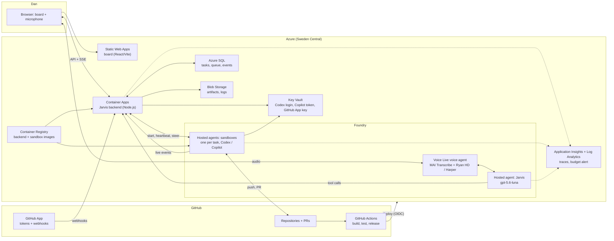
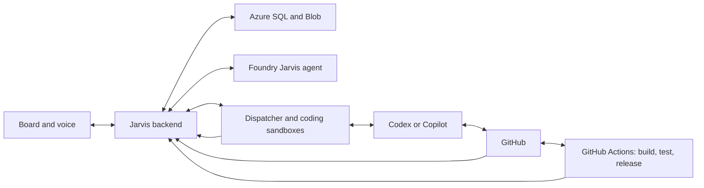
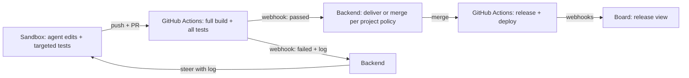

# Architecture

Jarvis is one backend with a shared core and one module per area, a static web app, Foundry agents for Jarvis and the coding sandboxes, and GitHub for code, CI, and releases. Phase 1 builds only the core and the Software Factory area. P0-01 provides the monorepo folders. P0-02 and P0-03 implement the web and backend skeletons. Statuses below distinguish implementation, design, and prototype evidence.

- Requirements: [PRODUCT.md](../PRODUCT.md). Phases and tasks: [PLAN.md](../PLAN.md). Decisions and learnings (L1–L28): [decisions.md](decisions.md).
- Data model: [data-model.md](data-model.md).
- **Flow diagrams:** [architecture-flows.html](architecture-flows.html). Tab 0 shows the complete flow, and tabs 1–13 show each flow as swimlanes, coloured by evidence (proven, documented, assumed). Open it in a browser.

## Stack overview

| Area | Choice | Status |
| --- | --- | --- |
| Repository | One GitHub monorepo `jarvis`: `apps/web`, `apps/backend`, `agents/jarvis`, `runner`, `infra`, `db`; npm workspaces for the two apps, one root lockfile | Implemented in P0-01; empty app builds verified in Codex cloud |
| Development tooling | Node.js 22.23.3, npm 10.9.9, TypeScript 6.0.3; Python 3.12.14 baseline (`.python-version`), voice reference container remains on 3.13; MIT licence | Node/npm/Python pinned in P0-01; TypeScript updated in P0-02 for lint compatibility; builds verified, Python production components pending |
| Web | React/React DOM 19.3.0, React Router 7.18.4, Vite 8.3.2, React plugin 6.1.1; Azure Static Web Apps Free in West Europe | Skeleton implemented in P0-02; sign-in P0-09 and deployment P0-11 pending |
| Backend | Node.js + TypeScript on Azure Container Apps (Consumption): minimum 1 replica, sleep switch | Health/logging/container skeleton implemented in P0-03; sleep switch and Azure deployment pending |
| Backend framework | Fastify 5.12.5, @fastify/cors 11.3.0: schema validation, a plugin per area, SSE support | Skeleton implemented; area plugins and SSE in their tasks |
| Database | Azure SQL, free offer: one database `jarvis`; Entra admin is the group `jarvis-sql-admins` (Dan and the backend identity) | Decided |
| Database access | `mssql` driver with Entra ID (managed identity); plain SQL migrations, applied by the backend at startup under a SQL app lock | Decided; **verify** in P0-07 |
| Files | Azure Blob Storage for artifacts and logs | Decided |
| Secrets | Azure Key Vault (RBAC) | Decided |
| Images | Azure Container Registry: backend and sandbox images | Decided |
| Monitoring | Pino 10.4.0 JSON logs, Application Insights SDK 3.16.0 manual traces + Log Analytics workspace in the resource group (L8); 300 DKK budget alert | Offline logging/export adapter implemented in P0-03; live ingestion and budget deployment pending P0-11 |
| Infrastructure as code | Bicep, deployed by GitHub Actions with OpenID Connect | Decided 3 October 2026 |
| Sign-in | Entra ID: the web app signs in with MSAL and calls the backend with a bearer token; the backend allows only Dan's object ID and Jarvis's own service identities | Decided |
| Board updates | Server-sent events (SSE) over `fetch`, so the bearer token can be sent | Decided |
| Jarvis agent and runner | Python 3.12/3.13 (Foundry hosted agents support Python or C#) | Decided |
| Coding sandbox | Foundry Hosted Agents, Invocations protocol, one session per task; Container Apps Jobs as fallback | Proven |
| Agent protocol | ACP for both agents: Copilot CLI `--acp` (preview); Codex via `codex-acp`; CLI versions pinned (L13) | Proven |
| Voice | Danish: Voice Live voice bridge, MAI Transcribe, Harper. English: `gpt-realtime-2.1` speech to speech, Ryan HD | Decided |
| Build and release | GitHub Actions: full build, tests, releases, deployments; status through GitHub App webhooks | Decided |
| Testing | Web/backend: Vitest 5.0.3; web: jsdom 30.1.1, React Testing Library 16.3.3; lint: ESLint 10.12.0, typescript-eslint 8.71.0. Python pytest, future Playwright board checks and SQL container tests | Web/backend implemented in P0-02/P0-03; remaining checks in their tasks |

## Web skeleton and configuration

- React mounts into `apps/web/index.html`. BrowserRouter renders the home page
  and a catch-all page with a return link. Production static hosting must fall
  back to `index.html` for client routes (P0-11).
- Vite selects the tenant ID, web client ID and API scope from the bootstrap
  output and injects only those fields plus the backend origin. The bootstrap
  file is read at build time, never imported into the browser.
- `apps/web/config.json` records the production HTTPS origin; `VITE_BACKEND_URL`
  can override it at build/dev time. Missing deployment leaves the shell usable;
  invalid identity fields or URLs stop startup. P0-11 must persist its
  `backendFqdn` as the public URL. Backend connectivity is unverified until then.
- The neutral foundation page shows pending capabilities. It does not authenticate
  or contact an API; those interactions begin in P0-09.
- `web-ci.yml` runs lint, tests and root builds without Azure access. P0-10 extends
  this to monorepo checks rather than duplicating the web job.

## Runtime overview

The backend factory is separate from the process entrypoint. `/health` returns
200 with `{"status":"ok"}`; it does not claim SQL or Azure readiness. The process
binds to `0.0.0.0:3000` by default, validates configuration before listening and
handles SIGTERM/SIGINT with a five-second close and telemetry flush deadline.
Browser requests allow only the exact configured `STATIC_WEB_APP_ORIGIN` and
`http://localhost:5173`; other Origin values receive 403. Authentication remains
P0-08. The server generates request IDs and records only approved event names,
methods, route templates, statuses and timings. A final output allowlist covers
child logger bindings as well as log arguments, dropping request/provider secrets.

With backend-only `APPLICATIONINSIGHTS_CONNECTION_STRING` (P0-11 Key Vault
reference), an isolated SDK client exports these events as manual traces. No
global auto-instrumentation captures request headers, URLs or dependency calls,
and disk retry caching is disabled. Without that setting, stdout JSON logs keep
offline/CI operation usable. Fake sinks prove the adapter contract; live Azure
ingestion remains pending. `backend-ci.yml` proves the production container and
its health/CORS/shutdown behavior in GitHub Actions without Azure credentials.
The image uses Node.js 22.23.3, a non-root user, and only backend production output
and dependencies; prototypes and frontend sources are excluded.

Where each part runs. The web app is static files on Static Web Apps: free and always reachable. Container Apps hosts only the backend.

Rendered image: [assets/runtime-overview.png](assets/runtime-overview.png).

## Application structure

| Layer | Design |
| --- | --- |
| Web | One app shell (Jarvis) with area navigation; each area owns its pages. The main page is the conversation plus activity across areas. |
| Backend | A shared core (sign-in, events, settings, usage, the Jarvis tool registry, dispatcher) plus one module per area, in one deployable backend. Board, voice, and later the Windows app call the same functions. |
| Jarvis tools | Each area registers its tools with the core, so Jarvis gains abilities without being rebuilt. |
| Data | Relational Azure SQL tables per area; no JSON files as the domain model. See [data-model.md](data-model.md). |
| Project source | GitHub owns code, project instructions, and durable project decisions. |

## Logical flow

These boxes are responsibilities; they do not each need a separate service.

- Accept work durably before dispatch; execution survives client disconnects.
- One owner for the queue and retries: the backend dispatcher. Reconcile uncertain work before replaying it.
- Isolated workspace per task; verify PRs and checks directly with GitHub.
- Keep recovery data beyond sandbox lifetimes. Blob is not the live build filesystem.
- Scoped identities and secrets; provider-specific details stay inside adapters.

## Dispatch and live updates

| Part | Design |
| --- | --- |
| Queue | The Azure SQL task table. The dispatcher picks Ready rows within the concurrency limit. |
| Retries | Attempt count and next-attempt time on the task row; after the limit, Needs attention. |
| Sandbox heartbeat | While a task runs, the backend calls the sandbox about once a minute. It keeps the sandbox alive (2-minute idle timeout) and detects a dead one. |
| Crash detection | HTTP 424/404/5xx on two polls or for 30 s. Never an event gap alone: a healthy 4-minute command produced no events (L22). |
| Live progress | The runner pushes sandbox events to the backend; every runner event is stored. |
| Build and release status | GitHub App webhooks: `pull_request`, `check_run`, `workflow_run`, `deployment_status`. No polling. |
| Board updates | The backend pushes to the board with SSE; the browser reconnects and reconciles. |
| Idle | No SQL queries while no task is Ready, Running, or waiting for a retry. The dispatcher wakes on task changes and on the next retry time, not by polling. |
| Always on | The backend runs with a minimum of 1 replica, so the heartbeat never stops. The board's sleep switch sets the minimum to 0 (it wakes on the next request) and is refused while tasks run. The backend does not query SQL while idle, so the database can still pause. |

Scale settings are revision-scope in Container Apps, so the sleep switch creates a new revision; that is acceptable because it is used only when nothing runs.

## Coding sandbox

Proven end to end with Copilot and Codex on 1–2 October 2026 ([report](reference/coding-sandbox-prototype/REPORT.md)).

| Item | Design |
| --- | --- |
| Host | Foundry Hosted Agents, one session per task. Container Apps Jobs is the fallback behind the same runner contract. |
| Size | 1 vCPU / 2 GiB default; 2 vCPU / 4 GiB for .NET (3.5× faster restore). Never 0.5 / 1 (L3). |
| Disk | 6 GiB writable at every size, shared by image, `$HOME`, `/files`, and `/tmp`; about 3 GiB free with a .NET image. The agent builds single projects and keeps package caches small; full builds run in GitHub Actions (L23). |
| Runner contract | Start, steer, pause, resume, cancel, and events. The host can change without changing the backend. |
| Adapter | Python; lives only in the sandbox image. The backend stays Node. |
| Steer and pause | ACP `session/cancel` stops the current turn; the next turn continues the same conversation with `session/load` (L4, L5). |
| Idle timeout | 2 minutes without requests shuts the sandbox down; files and the conversation survive an idle shutdown. |
| Crash | Files and conversation since the last persist point are lost; a new agent version does not restart running sessions. Recovery starts a new session from the task branch with the task history from SQL; the agent pushes often (L22). |
| Endpoints | Administration (connections, versions): `*.services.ai.azure.com`. Sessions and Invocations: `*.cognitiveservices.azure.com` (L10). |
| Settings | Model and reasoning per task: `codex-acp` (`model`, `model_reasoning_effort`) and Copilot `--model`; **verify** in P2. |

### Production runner implementation

Issue #28 ports the adapter to `runner/` with task, steer, pause, resume, cancel,
credential probe, and Codex renewal handlers. Prototype crash-test mode is removed.
Local Python tests exercise ACP subprocess fixtures; production Azure acceptance
remains pending #11 and the main-branch runner workflow.

- Node/Python use the small base image; a separate .NET image adds SDK 8.0.419.
  Both expose 1 vCPU / 2 GiB and 2 vCPU / 4 GiB variants. The default stays 1×2;
  .NET normally uses 2×4. Full builds stay in GitHub Actions (L23).
- Python 3.12.14 and Node 22.23.3 are pinned. CLI pins: Copilot 1.0.91, Codex
  0.157.0, Codex ACP 2.1.1, GitHub CLI 2.98.0. Python hashes and npm integrity
  locks are committed. Container build and packaged runtime checks run in Runner CI.
- Runner deploy builds in ACR and deploys manifest digests through OIDC on `main`.
  It uses the successful infrastructure deployment's admin/runtime endpoints and
  records each variant only after both Key Vault provider probes pass. Probe
  sessions are explicitly deleted, including failed probes (L14).
- Each dedicated agent identity reads only the three credential secret scopes;
  write access covers only `codex-login`. The port retains `github-token` from the
  prototype until #40 adds task-scoped GitHub App installation tokens; CLI seat
  authentication is separate. No workflow seeds credentials.
- Invocation metadata is stored separately for each turn, with path-safe IDs and
  backward reads of earlier session records. Idle recreation retains earlier
  status lookups; prompts, results, and credentials are omitted (L28).
- Live event push (#29), coordinated renewal scheduling (#34), and frequent Git
  pushes (#35) remain later work. See [runner instructions](../runner/README.md).

### Sandbox credentials

The agent can read everything in its sandbox, including environment variables, so each token is limited to what the task needs.

| Credential | Scope | Renewal | Status |
| --- | --- | --- | --- |
| Copilot | Fine-grained token with only the Copilot Requests permission | Manual, at the expiry chosen at creation | Proven |
| Codex | Jarvis-only ChatGPT Pro login, separate from Dan's own apps | Jarvis renews when 3 days or less remain on the access token and writes it back to Key Vault | Proven |
| GitHub | GitHub App token for one repository: contents and pull requests | 1 hour; the Git credential helper fetches the current token for each push | Decided; the prototype used a fine-grained token |

**Codex login rules** (Pro login only; no API key):

1. Create the login once with `codex login` in a Jarvis-only folder. Never copy Dan's own login (L6).
2. Key Vault holds the only copy. Deployment seeds it once, deletes the local seed file, and never overwrites a renewed copy.
3. Renew while no Codex turn runs, when 3 days or less remain on the access token. The access token lasts 10 days; Codex itself renews only 5 minutes before expiry (L12).
4. To renew, the runner marks its private copy as expired; Codex renews it through its own client. The runner writes it back only if it is newer than the stored copy.
5. If renewal fails, Codex tasks pause and Jarvis asks Dan to sign in again.

Jarvis has its own Codex session, so it never signs Dan out of the ChatGPT app or the reverse. The Pro plan's Codex limits are shared with Dan's own Codex use.

**Access rules**

- Key Vault holds only these credentials; only the sandbox identity reads them, and it can write only the Codex login secret.
- Agents run only on Dan's private repositories.
- The backend keeps the GitHub App key, creates each task's token, and performs merges outside the sandbox.
- The sandbox identity cannot reach Jarvis data or other areas; it reports through the backend.

## Build and release

| Where | Does |
| --- | --- |
| Sandbox | The agent edits, runs targeted builds and tests, commits, pushes, and opens or updates the PR. |
| GitHub Actions | Full build and all tests on every PR push; release on merge to `main`; deployments to Azure with OpenID Connect (no stored secrets). |
| Backend | Receives webhooks, updates task and release records, pushes events to the board, and steers the agent with failed-check logs. |

- One release per merge to `main`; no tags.
- Commits are not stored; the release view fetches them from GitHub on demand.

## Voice

Proven 2 October 2026 in a separate prototype ([voice report](reference/voice-prototype/REPORT.md)).

| Area | Design | Evidence |
| --- | --- | --- |
| Danish path | Browser microphone → Voice Live voice agent (`kind: voice`) → Foundry hosted Jarvis agent over the voice bridge (preview) → backend tools | 20/20 Danish commands, 4/4 status answers |
| English path | `gpt-realtime-2.1` speech-to-speech voice agent with Ryan HD and the butler persona; tools run in the backend, which holds the voice connection | First audio ≈0.5–1.1 s |
| Speech to text | MAI Transcribe, language `da`, project and agent names as phrase hints (L15) | 0–1.8 % word errors |
| Jarvis model | `gpt-5.6-luna`, reasoning `none`, strict action rules (L16) | ≈0.003 DKK per command |
| Voices | English: `en-GB-Ryan:DragonHDLatestNeural`. Danish: `en-US-Harper:MAI-Voice-2` locked to `da-DK` with `voice_locale`. Language toggle in the UI. | Chosen by Dan from samples |
| Confirmations | Spoken from the tool result, not only the model's wording | L16 |
| Speed | Warm the agent with a silent no-model message (`/diag`) before the microphone opens; preload running tasks | 2.7–3.9 s to first audio; ≈5 s cold (L17, L21) |
| Interruption | The client stops playback on Voice Live's `speech_started` | Detected in 0.6 s |
| Reconnect | Reconnect automatically when the voice bridge ends | L21 |

Models and voices come from the settings page, passed per session; a new voice-agent version is created only when the speech-to-text model or voice changes.

## Identity and security

- Dan signs in with Entra ID through `jarvis-web`. `jarvis-api` requires user assignment, and only Dan is assigned; the backend also checks Dan's object ID and allows Jarvis's own service identities.
- [`infra/bootstrap.ps1`](../infra/bootstrap.ps1) creates what the deploy workflows can't create for themselves: the deploy identity (GitHub OIDC, main branch only; Contributor and Role Based Access Control Administrator on `rg-jarvis`), the sign-in apps, `id-jarvis-backend`, and `jarvis-sql-admins`. Its IDs are in `infra/bootstrap.output.json` and in the repository's Actions variables.
- Managed identities between Azure services; GitHub Actions deploys with OpenID Connect.
- Secrets only in Key Vault; none in code, images, environment variables, or logs.

## Bicep resources

[`infra/main.bicep`](../infra/main.bicep) deploys at resource-group scope into the existing `rg-jarvis`; it does not create the resource group or bootstrap Entra objects. Names with `{suffix}` use `uniqueString(resourceGroup().id)`, so they are stable for this resource group while satisfying global-name uniqueness where required.

| Resource | Name | Region and SKU/configuration |
| --- | --- | --- |
| Log Analytics workspace | `law-jarvis-{suffix}` | Sweden Central; `PerGB2018`, 30-day retention |
| Application Insights | `appi-jarvis-{suffix}` | Sweden Central; workspace-based, linked to the workspace above |
| Key Vault | `kv-jarvis-{suffix}` | Sweden Central; Standard, RBAC authorization |
| Storage account | `stjarvis{suffix}` | Sweden Central; StorageV2, Standard_LRS, Hot; HTTPS only, shared-key access and public Blob access disabled |
| Blob containers | `artifacts`, `logs` | Private; created under the Storage account |
| Container Registry | `crjarvis{suffix}` | Sweden Central; Basic (≈33 DKK/month); admin account disabled |
| SQL server | `sql-jarvis-{suffix}` | Sweden Central; Entra administrator `jarvis-sql-admins`; Entra-only authentication |
| SQL database | `jarvis` | General Purpose serverless, Gen5, 1 vCore; 32-GB max size, 0.5 minimum capacity, 60-minute auto-pause; SQL free limit enabled and pauses on quota exhaustion |
| Container Apps environment | `cae-jarvis-{suffix}` | Sweden Central; Consumption; logs sent to Log Analytics |
| Backend Container App | `ca-jarvis-backend-{suffix}` | Sweden Central; 0.25 vCPU / 0.5 GiB, exactly 1 replica (the SSE hub and dispatcher run in one process; more copies need Web PubSub, see Ideas in PLAN.md); external HTTPS ingress to port 3000 |
| Static Web App | `swa-jarvis-{suffix}` | West Europe; Free |
| Monthly budget | `jarvis-monthly` | Resource-group scoped; 300 in the subscription billing currency, monthly from 1 October 2026 (fixed start date; Azure rejects changing it), actual-cost alerts above 80 % and 100 % to resource group owners |

The backend uses the existing `id-jarvis-backend` identity. Bicep assigns it **AcrPull** at the registry, **Storage Blob Data Contributor** at the Storage account, and **Key Vault Secrets User** at the vault. The existing `jarvis-sql-admins` group ID is used as the SQL server administrator; bootstrap already adds Dan and the backend identity to that group. The SQL server firewall rule permits Azure services (`0.0.0.0` to `0.0.0.0`); actual Azure connectivity and permissions remain to be checked by the first deployment.

Required deployment parameters are the full `backendIdentityResourceId`, `sqlAdminGroupObjectId`, `backendImage`, and `foundryNameTimestamp`. The Foundry timestamp is a 14-digit UTC value (`yyyyMMddHHmmss`, for example `20261003120000`). P0-11 must persist it in deployment configuration and pass the same value on normal redeployments. The account name is `jarvis-{timestamp}-{suffix}` and the project name is `jarvis-{timestamp}`; regenerating the timestamp would create new resources instead of updating those already deployed.

PR #79 adds the Foundry account, project, model deployments and ACR/Application Insights connections. Both `gpt-5.6-luna` and `gpt-realtime-2.1` use Global Standard capacity 1, configured independently. Dan accepted this starting allocation; adjust it if testing demonstrates rate limits. Exact model-specific limits and regional quota availability remain to be verified in P0-11. Normal deployment does not delete the account or project. The fresh-name rule in L2 applies only to recovery after deletion.

`sqlAdminGroupName` defaults to `jarvis-sql-admins`, `monthlyBudgetAmount` to `300`, `budgetStartDate` to `2026-10-01T00:00:00Z`, and budget notification emails to an empty array (the Owner role is also notified). The amount is interpreted in the subscription billing currency; confirm that currency is DKK.

## Cost

| Part | Cost (DKK) | Basis |
| --- | --- | --- |
| Sandbox | ≈0.89 per sandbox-hour (1×2); ≈0.07 per small PR task | Measured |
| Container Registry | ≈33 per month | Measured |
| Backend always on | ≈30 per month (0.25 vCPU / 0.5 GiB idle rate) | List price |
| Voice (Danish bridge) | ≈4 per 30-minute day | Estimated; billed meters to confirm |
| Speech to speech | ≈11 per 30-minute day (`gpt-realtime-2.1`) or ≈3.4 (`-mini`) | List price |
| Static Web Apps, SQL free offer | 0 | Free tiers; the database pauses when idle |

- Monthly coding hours, and therefore total cost, are not estimated yet.
- Hosted Agents is GA; Copilot CLI's ACP mode, the voice bridge, and resilient execution are preview.

## Deployment topology

- Azure subscription "Dan Aakesen", tenant Novaro, region Sweden Central; details in [agent-context.md](agent-context.md#azure).
- One production environment in `rg-jarvis`; no dev environment.
- Local development: `npm run dev` in the repository root serves the web app on `http://localhost:5173` against the production backend. Backend changes are tested in CI and take effect after deploy.
- Migrations run in the backend at startup; GitHub runners never connect to Azure SQL.
- Development of Jarvis itself is remote only: Copilot cloud agent and Codex cloud deliver PRs, `pr-title.yml` keeps PR titles in the `<task ID>: 
` format, `copilot-ready.yml` takes finished Copilot PRs out of draft, a merge workflow merges them when checks pass against the latest `main`, and the deploy workflows release them. Rules: [development workflow](agent-context.md#development-workflow).
- Everything except the bootstrap items is created by Bicep and deployed by GitHub Actions on merge to `main`; no portal changes.

## References

- Microsoft: [Hosted Agents](https://learn.microsoft.com/en-us/azure/foundry/agents/concepts/hosted-agents), [sessions](https://learn.microsoft.com/en-us/azure/foundry/agents/how-to/manage-hosted-sessions), [Container Apps Jobs](https://learn.microsoft.com/en-us/azure/container-apps/jobs), [Container Apps scaling](https://learn.microsoft.com/en-us/azure/container-apps/scale-app), [voice bridge](https://learn.microsoft.com/en-us/azure/foundry/how-to/voice-first-with-hosted-agent), [Voice Live languages](https://learn.microsoft.com/en-us/azure/ai-services/speech-service/voice-live-language-support), [Voice Live models and pricing](https://learn.microsoft.com/en-us/azure/ai-services/speech-service/voice-live), [resilience](https://learn.microsoft.com/en-us/azure/foundry/agents/concepts/long-running-agent-resilience).
- Costs: [Container Apps](https://azure.microsoft.com/en-us/pricing/details/container-apps/), [SQL free offer](https://learn.microsoft.com/en-us/azure/azure-sql/database/free-offer), [Foundry](https://azure.microsoft.com/en-us/pricing/details/foundry-agent-service/).
- Authentication: [Codex](https://learn.chatgpt.com/docs/auth), [Codex in automation](https://learn.chatgpt.com/docs/auth/ci-cd-auth), [Codex renewal logic](https://github.com/openai/codex/blob/main/codex-rs/login/src/auth/manager.rs), [Copilot CLI](https://docs.github.com/en/copilot/how-tos/copilot-cli/set-up-copilot-cli/authenticate-copilot-cli), [GitHub App tokens](https://docs.github.com/en/apps/creating-github-apps/authenticating-with-a-github-app/generating-an-installation-access-token-for-a-github-app).
- Agent protocol: [Copilot CLI ACP](https://docs.github.com/en/copilot/reference/copilot-cli-reference/acp-server), [codex-acp](https://github.com/agentclientprotocol/codex-acp), [ACP Python SDK](https://github.com/agentclientprotocol/python-sdk).
- GitHub Actions: [workflow triggers](https://docs.github.com/en/actions/writing-workflows/choosing-when-your-workflow-runs/events-that-trigger-workflows), [OpenID Connect to Azure](https://docs.github.com/en/actions/security-for-github-actions/security-hardening-your-deployments/configuring-openid-connect-in-azure), [webhook events](https://docs.github.com/en/webhooks/webhook-events-and-payloads).
- Background: [open-source research](open-source.md) (selective reuse; no foundation chosen); prototype code and reports in [reference/](reference/).
