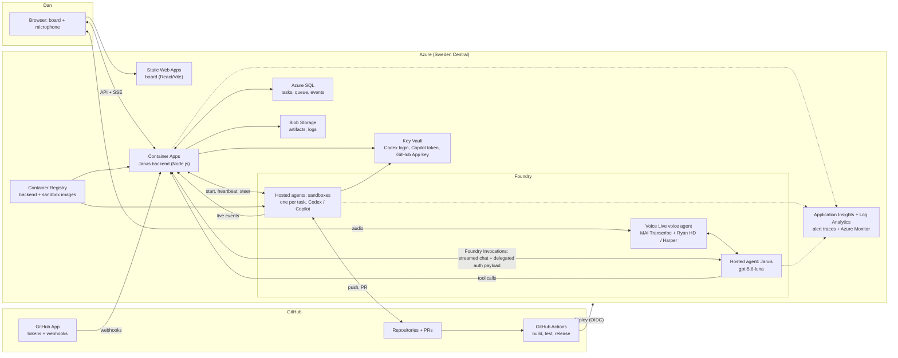
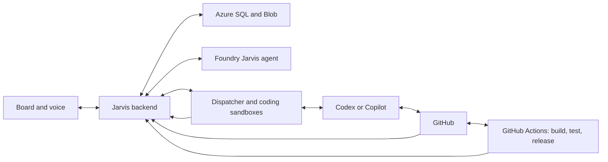
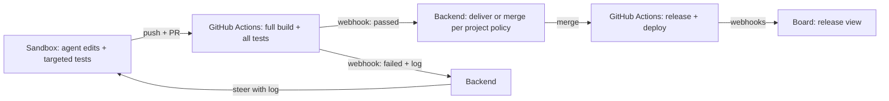
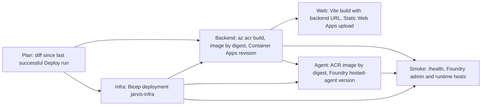

# Architecture

Jarvis is one backend with a shared core and one module per area, a static web app, Foundry agents for Jarvis and the coding sandboxes, and GitHub for code, CI, and releases. Phase 1 builds only the core and the Software Factory area. P0-01 provides the monorepo folders. P0-02 and P0-03 implement the web and backend skeletons. Statuses below distinguish implementation, design, and prototype evidence.

- Requirements: [PRODUCT.md](../PRODUCT.md). Feature summaries: [features.md](features.md). Phases and tasks: [PLAN.md](../PLAN.md). Decisions and learnings (L1–L36): [decisions.md](decisions.md).
- Data model: [data-model.md](data-model.md).
- **Flow diagrams:** [architecture-flows.html](architecture-flows.html). Tab 0 shows the complete flow, and tabs 1–20 show each flow as swimlanes, coloured by evidence (prototype/offline-tested, documented, assumed). Open it in a browser.

## Stack overview

| Area | Choice | Status |
| --- | --- | --- |
| Repository | One GitHub monorepo `jarvis`: `apps/web`, `apps/backend`, `agents/jarvis`, `runner`, `infra`, `db`; npm workspaces for the two apps, one root lockfile | Implemented in P0-01; empty app builds verified in Codex cloud |
| Development tooling | Node.js 22.23.3, npm 10.9.9, TypeScript 6.0.3; Python 3.12.14 baseline (`.python-version`), voice reference container remains on 3.13; MIT licence. Cloud agent environments (P0-14): `copilot-setup-steps.yml` and `scripts/codex-setup.sh` provide the pinned toolchain, then the shared `scripts/setup-dependencies.sh` installs from the lockfiles | Node/npm/Python pinned in P0-01; TypeScript updated in P0-02 for lint compatibility; builds verified, Python production components pending; Copilot setup verified in P0-14, Codex setup pending P0-15 |
| Web | React/React DOM 19.3.0, React Router 7.18.4, `@azure/msal-browser` 5.24.0, Vite 8.3.2, React plugin 6.1.1; Azure Static Web Apps Free in West Europe | Skeleton and MSAL sign-in implemented; live Entra sign-in and deployment verification remain pending |
| Backend | Node.js + TypeScript on Azure Container Apps (Consumption): minimum 1 replica, heartbeat poller, sleep switch, `@azure/storage-blob` 12.31.0, `@azure/keyvault-secrets` 4.11.2, and `fflate` 0.8.3 | Health/logging/container skeleton implemented in P0-03; heartbeat polls active sandbox invocations without querying SQL while idle and distinguishes completed-turn expiry from active crashes; P1-12 implements the authenticated sleep API and board control; P6-03 archives old task events and reads them on demand; P2-10 starts fresh recovery sessions; P3-14 opens or reuses an App-token PR after completed task work and leaves policy completion to P3-06; P3-02 reads the GitHub App key through the backend identity; P3-05 stores bounded failed-job logs and steers the task; live Azure behavior remains unverified |
| Backend framework | Fastify 5.12.5, @fastify/cors 11.3.0: schema validation, a plugin per area, SSE support | Skeleton, core/factory module registration and P1-03 projects API implemented; remaining domain APIs and SSE are in their tasks |
| Database | Azure SQL, free offer: one database `jarvis`; Entra admin is the group `jarvis-sql-admins` (Dan and the backend identity) | Decided |
| Database access | `mssql` 12.7.2 (`@types/mssql` 12.3.0), Tedious managed identity; immutable SQL migrations under a transaction-owned app lock before backend listen; reviewed down scripts | Implemented in #7; groups 1–3 schema in #15, groups 4 and 6 in #27, group 5 in #42, heartbeat agent routing in #32, and `idle_expired` session end reason in #226; deployed heartbeat verification remains open |
| Files | Azure Blob Storage for artifacts, logs, and archived task events | Decided |
| Secrets | Azure Key Vault (RBAC) | Decided |
| Images | Azure Container Registry: backend and sandbox images | Decided |
| Monitoring | Pino 10.4.0 JSON logs, Application Insights SDK 3.16.0 manual traces + Log Analytics workspace in the resource group (L8); stateful Azure Monitor email alerts and 300 DKK budget thresholds | Alert contracts, deduplication and Bicep compile offline; SQL Server integration, live ingestion, budget reads and email delivery remain unverified |
| Infrastructure as code | Bicep, deployed by GitHub Actions with OpenID Connect | Decided 3 October 2026 |
| Sign-in | Entra ID: tenant-specific MSAL Browser requests the delegated `jarvis-api` scope; backend verifies bearer tokens with jose 6.2.12 and Dan's object ID. `/me` returns only the validated display name. The hosted Jarvis agent's app-only token (application role `Jarvis.Tools`) is accepted only on the agent-enabled routes: tools (P4-01), turn context (P4-04) and its effective Jarvis-settings read (P4-07) | Browser and backend contracts checked offline in #9; agent policy checked offline in P4-01/P4-04/P4-07; the P4-08 main deployment and bootstrap succeeded. Live Dan sign-in and deployed chat invocation remain to verify |
| Board updates | Authenticated server-sent events (SSE) over `fetch`, so the bearer token can be sent. Reconnects resume from `Last-Event-ID`; persisted task events replay before buffered live hub events, with duplicate IDs suppressed. A comment heartbeat is sent every 25 seconds. | Implemented and tested offline; SQL Server integration and deployed streaming remain unverified |
| Jarvis agent and runner | Python 3.12 (Foundry hosted agents support Python or C#). `agents/jarvis` (P4-01): Python 3.12.14 image, `azure-ai-agentserver-invocations` 1.2.0 voice host, `openai` 3.24.0 Responses API, `azure-identity` 1.26.0, `httpx` 0.28.1; hash-locked `requirements.txt` | Agent ported and checked offline and as a local container in P4-01; Foundry deployment completed in P4-08; P4-09 registers chat through the public Invocations handler |
| Coding sandbox | Foundry Hosted Agents, Invocations protocol, one session per task; Container Apps Jobs as fallback | Proven |
| Agent protocol | ACP for both agents: Copilot CLI `--acp` (preview); Codex via `codex-acp`; CLI versions pinned (L13) | Proven |
| Voice | Danish: Voice Live voice bridge, MAI Transcribe, Harper. English: `gpt-realtime-2.1` speech to speech, Ryan HD. Browser traffic uses an authenticated backend WebSocket relay; provider credentials stay server-side. | Relay design selected; local mock spike verified, Azure interoperability unverified |
| Build and release | GitHub Actions: full build, tests, releases, deployments; Project board synchronizes issue/PR status | Jarvis coordinator removed at Dan's request. Project board script/workflow and existing environment retained. PR merges require Dan or explicit agent authorization; P3-03 receives signed webhooks, P3-04 maps them to group 5, P3-05 processes failed task-PR checks, and P3-07 creates one default-branch release per project/SHA with runs and deployments linked by SHA. |
| Testing | Web/backend: Vitest 5.0.3; web: jsdom 30.1.1, React Testing Library 16.3.3; lint: ESLint 10.12.0, typescript-eslint 8.71.0. Python pytest, future Playwright board checks and SQL container tests | Web/backend implemented in P0-02/P0-03; remaining checks in their tasks |

## Web skeleton and configuration

- React mounts into `apps/web/index.html`. BrowserRouter renders the home page
  and a catch-all page with a return link. Production static hosting must fall
  back to `index.html` for client routes (P0-11).
- Vite selects the tenant ID, web client ID and API scope from the bootstrap
  output and injects only those fields plus the backend origin. The bootstrap
  file is read at build time, never imported into the browser.
- `apps/web/config.json` records the production HTTPS origin; `VITE_BACKEND_URL`
  can override it at build/dev time. Missing deployment leaves the shell usable;
  invalid identity fields or URLs stop startup. P0-11 must persist its
  `backendFqdn` as the public URL. Backend connectivity is unverified until then.
- The home page uses a tenant-specific MSAL Browser client with the public web
  client ID and API scope. MSAL stores its cache in session storage; sign-in
  requests only the delegated API scope and sends the access token to `/me`.
  Cached accounts use silent token acquisition. A missing backend URL disables
  sign-in instead of presenting a false success state.
- P1-07 adds the app shell. `useSignIn` owns the MSAL session for the whole
  app, so navigation never repeats sign-in. Until `/me` succeeds, every shell
  route shows sign-in and the header hides navigation; unknown addresses still
  show the not-found page. `src/areas.ts` registers each area (`id`, label, top-level
  path, component). The shell renders its navigation entry and mounts it at
  `/<path>/*`; the area renders its own nested routes. Software Factory
  (`src/factory/`) owns `/factory/tasks`, `/factory/tasks/:id`,
  `/factory/projects`, `/factory/projects/new`, `/factory/projects/:id` and
  `/factory/releases/:id`;
  invalid IDs show not found. The Usage area (`src/usage/`) owns `/usage` and
  reads the signed-in user's usage report. `/settings` is the shared settings entry. P1-11
  implements it as a responsive form for Jarvis, voice, coding-agent defaults
  and the global task limit; remaining voice samples, sleep and credential
  controls are visibly disabled until their owning services exist.
- P7-16 extends the same authenticated, validated `dbo.settings` key/value store
  with bounded personality preferences. Hosted chat and Danish voice read them
  for each new agent invocation/session; the backend snapshots them when it
  configures each new English voice relay. Active voice connections keep their
  original snapshot.
- P1-10 passes the backend URL and MSAL token provider into the Software Factory
  area. The projects list and settings page call the authenticated project CRUD
  routes; running counts are derived from `GET /factory/tasks?state=Running`
  and refreshed on demand. Failure to load tasks leaves project management
  usable with counts marked unavailable. Last release is marked unavailable
  until release data is connected. Client validation improves form feedback;
  the backend remains authoritative. Live Azure CRUD is not verified by the
  browser-mocked UI check.
- The main page's "Now" activity panel takes a typed `NowFeed`
  (`src/activity.ts`): running tasks (title, project, agent, activity, start
  time) and activity items (category, title, `activity.link`, time). Only
  `task:<id>`, `release:<id>` and `project:<id>` links become routes. Dismissal
  removes an item only after the backend confirms it. P1-13 loads this data
  from authenticated `GET /now`, persists dismissal through
  `POST /now/activity/:id/dismiss`, and refreshes snapshots from authenticated
  `/now/events`. The panel identifies unavailable data and reconnecting or
  unavailable live updates rather than claiming a stale snapshot is current.
  P6-02 adds a dismissible Alerts group backed by `activity.alert_key`. Failed
  deployment, confirmed sandbox crash and credential-expiry activity is inserted
  transactionally with its source change and emits a hashed Application Insights
  trace only after commit. A unique filtered index suppresses repeated conditions.
  Stateful Azure Monitor rules query those traces and email through the configured
  action group. Budget actual spend is read with the backend managed identity every
  15 minutes; a unique monthly threshold activity refreshes Now. The native Azure
  Budget 80% threshold also uses the email action group. Failures remain visible in
  backend logs; no SMS or voice actions are configured.
- `/me` inherits the root authentication hook. The verifier accepts only
  Dan's signed delegated API token and returns a bounded display name from its
  validated `name` claim, falling back to `Dan` if that optional claim is absent
  or malformed. The route exposes only that name, never token claims or IDs.
- P1-14 tracks pending data requests in `src/backend-request.ts`. The signed-in
  shell probes authenticated `GET /database/status` while foreground requests
  are pending and displays “Waking Jarvis…” only for `{ waking: true }`.
  The endpoint reads process-local retry state, never SQL, and is not cached.
  Data requests allow 120 seconds; status probes stop when requests settle or
  the page is hidden. Task SSE sends `event: ready` after replay so heartbeat
  comments cannot falsely indicate the database wait has finished.
- `GET /settings` and `PATCH /settings` inherit the same Dan-only delegated
  authentication. The backend returns effective defaults with the validated
  model catalog, rejects unknown keys and unsupported values, and writes a
  partial update transactionally to whitelisted `global` rows in `dbo.settings`.
  The `newProjects` settings area validates owner, visibility, templates
  repository, default agent, policy, per-project task limit, and default branch;
  these defaults reuse the existing settings table and are available to future
  project registration without changing the project API.
  The SQL adapter is injected only when database configuration exists; the API
  returns 503 without it. The model catalog offers deployed Jarvis models and
  only provider defaults for Codex and Copilot because their available-model
  catalog values have not been verified. The agent-only `GET /agent/settings`
  route returns only the effective Jarvis model and reasoning effort to the
  `Jarvis.Tools` principal. The hosted agent reads it before acknowledging a new
  session and holds that snapshot for the session; if the read is unavailable,
  it logs a warning and uses the defaults. Future task creation reads these
  defaults; existing sessions and tasks are not updated.
- `ci.yml` (P0-10) is the aggregate CI on every PR, `main` push and
  `workflow_dispatch`. It calls the reusable `web-ci.yml`, `backend-ci.yml`
  (including the container smoke), `database-ci.yml` (isolated SQL Server migrations), `foundry-contract.yml`, `runner-ci.yml`
  (runner images) and `jarvis-agent-ci.yml` (agent image, non-root and fail-fast
  configuration checks, and a model-free voice turn over its WebSocket), runs Python lint, tests and byte-compilation for `runner`
  and `agents/jarvis` when they exist,
  and ends in one `CI result` gate job. No job uses Azure credentials.

## Runtime overview

The backend factory is separate from the process entrypoint. `/health` returns
200 with `{"status":"ok"}`; it does not claim SQL or Azure readiness. The process
binds to `0.0.0.0:3000` by default, validates configuration before listening and
handles SIGTERM/SIGINT with a five-second close and telemetry flush deadline.
Browser requests allow only the exact configured `STATIC_WEB_APP_ORIGIN` and
`http://localhost:5173`; other Origin values receive 403. A root `onRequest`
authentication hook runs before CORS and protects current and future nested routes.
Only the registered `/health` GET/HEAD, GitHub's signed webhook route, and
CORS-generated preflight are public; explicit business OPTIONS handlers require
authentication. `POST /github/webhooks` is the sole public business route and opts
out of Entra authentication through its route configuration only. It accepts
GitHub's JSON bytes unchanged, verifies `X-Hub-Signature-256` with the Key Vault
secret `github-app-webhook-secret`, and records the `X-GitHub-Delivery` ID and
event in `dbo.webhook_deliveries`. An atomic, serialized insert returns 202 for
new and duplicate deliveries. The five subscribed event types are marked `ok`;
valid unhandled events such as GitHub's setup `ping` are marked `ignored`.
Only delivery metadata is stored; P3-04 and P3-07 map allowlisted event fields to the project records.
`KEY_VAULT_URI` is supplied by Bicep, and the backend managed identity reads and
caches the secret after its first successful Key Vault lookup. Missing Key Vault
configuration or secret fails webhook requests with 503, not an unsigned fallback.
The server generates request IDs and records only approved event names, methods,
route templates, statuses and timings. A final output allowlist covers child
logger bindings as well as log arguments, dropping request/provider secrets.

The factory module exposes authenticated `POST /factory/tasks`, filtered and
paginated `GET /factory/tasks`, and `GET /factory/tasks/:id` with paginated event
history. It validates active projects and bounded request/query inputs. Runner
identities with the `Jarvis.Runner.Events` app role may call
`POST /factory/sandbox-events` and `POST /factory/tasks/:id/github-token`. The
token route requires an active task and its unended Foundry session, derives its
repository from task/project state, and mints a one-hour repository-scoped App
token; it accepts neither a repository nor an unrelated task/session from the
caller. The events route validates task/event fields and records source
`runner` through `TaskStore.recordEvent`. Clients cannot update task state directly;
the task store serializes backend transitions, checks the lifecycle, and records
state events atomically. Completion can reach Done only through a trusted call that
confirms completion. The browser and hosted agent service identities do not receive
a task-state bypass. Responses are capped at 1 MiB, and event payloads above 4 KiB
are omitted with an explicit truncation flag.

`POST /factory/tasks/:id/controls` accepts only `steer`, `pause`, `resume`, `recover`, or
`cancel`; it uses the default Dan-only authentication and never accepts a requested
task state. The dispatcher validates the current state, uses the Foundry client for
the remote operation, and persists the accepted invocation or lifecycle transition.
Steering also stores the bounded user message as a `steered` task event in the same
transaction as its turn, then publishes the event after commit; SSE payloads over
4 KiB are omitted and marked truncated. Pause remains `PauseRequested` until heartbeat
confirms the turn stopped; steering and resume register the accepted turn for heartbeat
monitoring. `recover` starts a new session on the existing task branch and accepts
`Running` only for a session ending `idle_expired`, first moving it to NeedsAttention.
A stale or invalid transition returns 409, unavailable runtime state returns
503, and remote failures are sanitized. The board and detail page share one state-aware
controls component.

P1-08's web board uses the authenticated project and task APIs for filters and
task creation, requesting at most 100 newest matching tasks at a time. It opens
the P1-06 authenticated fetch-SSE client for nonterminal tasks, resumes from each
stream's last event ID, and refreshes the filtered task snapshot after events.
Connection and reconnection state is visible. The list API does not yet return
pull-request, check, or usage values; cards mark those data points unavailable
instead of inferring them. No backend route or persistence change is required.

The main page's authenticated `GET /now` returns up to 100 running tasks with
their project, agent, current activity and start time, plus up to 100
non-dismissed attention, release/deployment and credential activity records.
The read derives attention from the latest activity for each task in
`NeedsAttention`; other categories use their `activity.kind`. The
`POST /now/activity/:id/dismiss` route updates `activity.dismissed_at`, returns
404 for an unknown ID, and is safe to repeat for an existing item. Task-event
commits and dismissals invalidate the Now snapshot through `/now/events`; the
browser reconnects and rereads the bounded snapshot. This stream is separate
from task-history replay and has a 25-second heartbeat. These routes use the
default Dan-only authentication. Offline API and SQL Server integration tests
cover the contracts; deployed Entra, SQL and streaming behavior remain
unverified.

P1-09's task detail page reads `GET /factory/tasks/:id` in 100-event pages using
`eventOffset`; the backend merges archived and SQL rows transparently. It resumes
the authenticated P1-06 SSE stream from the last event in the initial page and
deduplicates live/replayed events with the same persisted IDs. Project links reuse
the active-project API to form validated GitHub branch links. PR/check data,
artifacts remain unavailable until their integrations are ready; P2-07's task
controls call the authenticated dispatcher route, and P2-12's usage section shows
the task's recorded usage. For tasks created from a
conversation, it fetches the matching message with a one-row paginated history
request. P2-07 adds a separate authenticated control write route; no schema change
is required.

`GET /operations/sleep` reports the Container App's configured minimum replicas;
`PUT /operations/sleep` accepts only awake (1) or asleep (0). Both routes use the
root's Dan-only authentication. The backend targets only its Bicep-configured
Container App resource ID and obtains an ARM token with its user-assigned
managed identity. Before requesting sleep, the task store checks for Ready,
Running, or PauseRequested tasks under an exclusive SQL application lock; task creation and state
transitions use the matching shared lock, held through their writes. The lock
remains held through the bounded ARM request, closing the race with new active
tasks. Refusal is a 409; unavailable ARM configuration or failures return a
sanitized service error. The custom role grants only Container App read/write
and is assigned at the backend app. Endpoint, refusal, lock, and ARM request
contracts are tested offline and against SQL Server; live Azure authorization
and scaling remain unverified.

The factory registers authenticated `GET /factory/projects`,
`POST /factory/projects`, `PATCH /factory/projects/:id`, and
`DELETE /factory/projects/:id` routes. The project
store uses the process-owned SQL pool and parameterized queries; list returns
active rows, archive sets `active = 0`, and duplicate repositories return 409.
Request schemas validate required settings and the database's policy, sandbox,
tech, repository, and concurrency constraints. When SQL is not configured,
project requests return 503 rather than claiming success. Route and query-binding
contracts are covered offline, and SQL Server-container tests execute project
CRUD and archive queries. Real Azure identity and project CRUD remain unverified
without Azure access.

With backend-only `APPLICATIONINSIGHTS_CONNECTION_STRING` (P0-11 Key Vault
reference), an isolated SDK client exports these events as manual traces. No
global auto-instrumentation captures request headers, URLs or dependency calls,
and disk retry caching is disabled. Without that setting, stdout JSON logs keep
offline/CI operation usable. Fake sinks prove the adapter contract; live Azure
ingestion remains pending. `backend-ci.yml` proves the production container and
its health/CORS/shutdown behavior in GitHub Actions without Azure credentials.
The image uses Node.js 22.23.3, a non-root user, and only backend production output
and dependencies; prototypes and frontend sources are excluded.

### Backend authentication

The backend verifies RS256 signatures using the configured tenant's Entra v2
JWKS endpoint. It requires the exact v2 issuer, API client-ID audience (not the
`api://` resource URI), expiry/not-before/issued-at claims, tenant and v2 version.
Verified tokens must contain Dan's allow-listed `oid` and delegated
`access_as_user` scope. Missing, malformed, duplicate or unverifiable credentials
receive sanitized 401 with a Bearer challenge; verified users/scopes without
permission receive 403. These early denials retain CORS response headers only
for the exact approved browser origins, so sign-in can inspect their status.
ID tokens and other app-only tokens are not authorized here.

The hosted Jarvis agent is the tools service identity (P4-01). When
`ENTRA_JARVIS_AGENT_OBJECT_ID` is set, a verified token whose `oid` matches it must
carry the `Jarvis.Tools` application role, no delegated `scp`, and `idtyp` absent
or `app`; otherwise 403. Its principal goes to `request.agentPrincipal`, never
`request.principal`, and only routes with `config: { jarvisAgent: true }` accept it:
`GET /tools`, `GET /factory/context`, and `POST /tools/{name}`. Coding runner
identities receive a separate `Jarvis.Runner.Events` app role and are accepted only
on `POST /factory/sandbox-events` and the narrowly scoped
`POST /factory/tasks/:id/github-token`; the latter requires the Foundry session
ID and can only issue a token for that session's active task repository. Their principal is kept separately as
`request.runnerPrincipal`. The bootstrap script assigns this role only to the
runner principals supplied after Runner deploy. All other routes, including `/me`
and task APIs, reject runner identities. `jarvis-api` requires role assignment, so
Entra issues app-only tokens only to explicitly assigned principals.

JWKS lookups have a five-second timeout, a 30-second refresh cooldown and a
ten-minute key cache. Provider outages fail closed. Only object ID, tenant ID,
and a validated display name reach `request.principal`; `/me` returns only the
display name. The agent principal holds only its object ID and tenant ID. Tokens, other claims and provider details are excluded from logs
and responses. Configuration accepts `ENTRA_TENANT_ID`,
`ENTRA_API_CLIENT_ID` and `ENTRA_OWNER_OBJECT_ID` UUID overrides and otherwise
uses the nonsecret bootstrap identities; `ENTRA_JARVIS_AGENT_OBJECT_ID` is an
optional UUID that must differ from Dan's. Real RSA signatures, local HTTP JWKS,
socket duplicate headers, `/me` authorization and stalled-provider tests
establish this offline boundary. No deployed Entra token was obtained; live
browser sign-in and deployment verification remain #11.

## Database startup and migration ownership

The process creates one `mssql` pool when SQL settings are supplied and shares
that process-owned pool with the tool-call and task stores. Production
configuration requires an Azure SQL host, database and user-assigned identity
client ID; `azure-active-directory-msi-app-service` delegates token acquisition
and renewal to Tedious/Azure Identity. TLS certificate validation stays enabled.
No SQL settings selects the offline skeleton; partial settings stop startup.
Password authentication is permitted only for isolated loopback CI in test mode.

`index.ts` awaits database initialization before listening, outside Fastify's
10-second ready-hook limit. Connection and pool acquisition/creation attempts
are bounded at 30 seconds; executed query timeouts remain 120 seconds. A
300-second overall startup deadline includes auto-resume, the 60-second app-lock
wait and all migrations. Cancellation stops active requests, rolls back the
transaction and closes the pool. If cancellation occurs during connect, its owner
closes the late connection before any migration can begin. Process shutdown has
the existing five-second final deadline. Database logs expose fixed event names,
never raw errors, tokens or SQL text.

P1-14's shared wake handler retries startup connection and pool acquisition
with 1-, 2-, 4-, 8-, then 10-second backoff within a 90-second deadline,
including attempts. Resume errors 40613, 40197, 40501 and connection timeouts
qualify; unrelated errors fail normally. Acquisition happens before statements
or transaction BEGIN, so writes can safely wait there. Explicitly read-only,
nontransactional queries opt into `databaseReadRequest`; acquisition and read
retries share the original deadline. Executed writes and transactions are never
replayed, even for a resume-like error or an ambiguous commit. Cancellation
releases late acquired connections and shutdown owns outstanding attempts.
The waking flag counts concurrent waits and clears after success, failure or
cancellation; there is no idle SQL polling and no SQL store contract change.

The backend reads committed `db/migrations/NNNN_name.sql` batches, acquires
`jarvis.schema-migrations` exclusively with `LockOwner=Transaction`, validates the
applied checksum prefix and applies all pending batches plus ledger entries in
one transaction. Rollback preserves both data and migration history. No recurring
migration or readiness queries run while idle; pool minimum is zero and
`validateConnection=socket` avoids validation queries. The production image
includes the same migration directory. `0001_core_tables.sql` (P1-01, #15) creates
data-model groups 1–3. Each forward migration has a reviewed reverse script in
`db/migrations/down/`; startup never runs it. `revertMigration` runs it under the
same lock and transaction, only for the latest applied migration, and removes its
ledger row. CI proves up, down and re-up against SQL Server. This includes the
`tool_calls` table that the tool dispatcher (P4-02) writes.

Real managed-identity token exchange and migrations in a deployed Azure revision
remain issue #11. See the [database guide](../apps/backend/src/database/README.md)
and [migration format](../db/migrations/README.md) for configuration and ownership.

Where each part runs. The web app is static files on Static Web Apps: free and always reachable. Container Apps hosts only the backend.

### Backend module composition

Issue #16 adds `BackendModule` (`id`, `registerRoutes`, `tools`) and registers
each module as an encapsulated Fastify plugin after global security/CORS/logging
hooks. `buildApp` defaults to `core` and `factory`; its optional module list selects
the complete composition. A new area contributes routes and tools through this
contract without changing `core`. Readiness awaits async module registration and
refuses a failed plugin; Fastify owns plugin close hooks.

Core owns the health route, tool catalogue, HTTP dispatcher and typed in-process
event hub. The Factory task store persists task events and corresponding activity
rows in the same SQL transaction as task creation, state transitions, or an event
write; it publishes to the hub only after commit. `TaskStore.recordEvent` is the
small producer API for later runner and backend event sources. The hub is
process-local; the single production replica keeps subscribers together. Event
payloads are capped at 1 MiB, and published payloads over 4 KiB are omitted.
The authenticated SSE endpoint, heartbeat and replay are P1-06. Factory also owns
projects and task APIs. The catalogue rejects duplicate
module/tool identities, snapshots frozen schemas and exposes read-only descriptors
with ownership and handlers. Authenticated `GET /tools` exposes every descriptor's
name, description and input schema. The core registers a schema-validated
`POST /tools/{name}` for every tool at composition time, passes the request and
cancellation signal to its handler, then writes the arguments, result and outcome
to `tool_calls` using the process-owned SQL pool. Each response carries `outcome`
(`ok`, `refused` from a tool's `ToolRefusal`, or `error`) and a `confirmation`
built only from that recorded result (L16), which Jarvis relays instead of its own
claim; a non-200 response means nothing was confirmed. Calls require
`X-Jarvis-Message-ID`; absent persistence returns 503 before tool execution. The
tool routes accept Dan's delegated token and opt in to the Jarvis agent identity
([backend authentication](#backend-authentication)). Existing Foundry client, health/security/logging and
process shutdown behavior are preserved.
The [module guide](../apps/backend/src/modules.README.md) explains adding areas,
resource lifetimes and the verified offline extension contract.

P4-10 registers the Software Factory's `list_projects`, `list_tasks`, `get_task`,
`create_task`, `steer_task`, `pause_task`, `resume_task`, and `cancel_task` tools.
They call the injected project/task stores and task controller, so the same
validation and lifecycle state machine serve HTTP, chat and voice. Task details sent
to a tool contain bounded event summaries, not event payloads. The project and task
tool overview is in [features.md](features.md).

### New project creation (P3-12)

The `create_project` tool accepts only a repository name and description. It reads
validated New projects defaults, creates the repository through the backend-only
`jarvis-repo-admin` Key Vault secret, registers the configured project values, and
creates a chat-origin scaffold task linked to the calling message. The token is
read with the backend managed identity and used only in the outbound GitHub request;
it is not included in tool arguments/results, the task prompt, runner environment,
or task events. `KEY_VAULT_URI` configures this server-side boundary. Repository
calls reject redirects, bound response bodies and time out after 30 seconds;
provider details are sanitized. If repository creation succeeds but project or
task persistence fails, the tool reports the partial result instead of claiming
success.

The scaffold task runs in the normal sandbox, uses its HTTPS Git credential helper
to clone the configured templates repository and Jarvis P3-09 workflow sources,
runs the documented `cpinit` command with PowerShell 7, fills the product/plan
documents, and opens a PR. A final `JARVIS_NEEDS_ATTENTION: <question>` line from
the agent is surfaced by the runner as a terminal `needs_attention` status; the
heartbeat stores the bounded question in the task's state-change event. Offline
contracts cover the backend credential boundary, task creation, runner marker,
and heartbeat transition; a clarification ends the sandbox session normally rather
than recording a crash. Live repository creation and the end-to-end PR remain a
coordinator post-merge check. New projects use the `node`/`1x2` base defaults until
their stack is established.

P2-12 adds group 7 `dbo.usage`. Before each ACP prompt the runner sends an
`agent_turn` event; the backend derives Codex/Copilot from the task row and
idempotently stores the turn. It stores token or premium-request counts only when
an ACP result or usage notification contains a nonnegative integer in the
allowlisted `usage` fields. The provider's values are not inferred from a turn.
When a sandbox session pauses, the dispatcher stores its elapsed minutes and
estimated DKK in the same transaction as the session/turn end updates. Resume
reopens that same Foundry session row and starts a new active interval; the unique
Foundry session ID remains intact, and each pause adds its elapsed minutes and cost
to the existing usage row. Cancellation also ends an idle paused row. Task detail
calculates a live estimate for an open interval. Rates use the documented
Sweden Central vCPU/memory basis: 0.8901 DKK/hour for 1×2 and 1.7802 DKK/hour
for 2×4; actual billed amounts may differ. SQL Server integration and live
provider reporting remain post-merge checks.

P6-01 adds an authenticated read-only `GET /usage?period=7d|30d|90d|all`.
The SQL store groups existing `dbo.usage` rows by task, project, agent, source,
and metric; it suppresses DKK for Codex/Copilot, includes period-clipped live
sandbox estimates without writing rows, and caps the result at 1,000 groups with
an explicit truncation flag. The Usage page groups those rows by project, agent,
or source and links task rows to task detail. Existing voice rows are included
when present; P5-06 remains the writer. Route/store/web contract tests pass, but
Chromium inspection at 390/1280 px verifies local mocked interactions.
Live Azure SQL and provider/voice report data remain unverified.

P6-03's backend job checks for events older than 90 days hourly, in bounded SQL
batches, and uploads deterministic per-task blobs before deleting each batch in
the same SQL transaction. The transaction-owned archive lock serializes archiving
with task-detail reads, but does not affect `recordEvent` or its SSE/runner callers.
Task detail reads archived blob indexes and its SQL page under a shared lock, then
downloads only the requested archived chunks after releasing the SQL transaction.
Blob or SQL failures fail the detail request rather than presenting partial history.
Migration `0005_task_event_archives.sql` commits blob references atomically with SQL
deletion; unindexed blobs from interrupted transactions are not exposed. The private
`task-events` container is created by Bicep before the backend app is deployed.

### Conversation storage and history

P4-03 adds the authenticated `/conversation/sessions` API to the shared backend.
`POST /conversation/sessions` starts one `jarvis_sessions` row per chat or voice
sitting, `POST /conversation/sessions/{id}/messages` appends a bounded message to
an active session, and `POST /conversation/sessions/{id}/end` idempotently records
its end. P4-06 adds `POST /conversation/sessions/{id}/turns` for an active chat
session. It stores Dan's bounded message first and streams `user`, `delta`, `done`,
or `error` SSE events; a complete assistant reply is stored before `done`.
`GET /conversation/history` reads the one continuous conversation across sessions
in pages of 50 (maximum 100), ordered oldest-to-newest within each page and
continued with a message-ID cursor. Each entry includes its session's chat/voice
channel and language. It returns tool-call names, outcomes and task IDs, not the
stored arguments or results.

When `JARVIS_CHAT_AGENT_NAME` is configured, the backend uses its managed
identity to call
`POST {FOUNDRY_PROJECT_ENDPOINT}/agents/{agent_name}/endpoint/protocols/invocations?api-version=v1`
with the `https://ai.azure.com/.default` scope. The application payload contains
the caller's delegated authorization and the stored source-message ID; it is not
forwarded as the Foundry HTTP `Authorization` header. The hosted agent registers
the chat handler with the Invocations protocol and returns the application-defined
text SSE stream. The agent verifies the caller through the backend's `/me` route,
confirms the exact source message in stored history, and uses at most 20 earlier
messages / 32,000 characters as context. Its existing Responses tool loop records
calls against Dan's message ID using the agent identity. The backend persists
only a completed assistant response; an interrupted turn leaves Dan's message
visible and the UI warns that an action may have completed. The browser never
receives agent credentials.

The conversation store shares the process-owned SQL pool and uses the existing
group-one schema; no migration or new service is required. Tool calls continue to
be written by the P4-02 dispatcher against their source message. The task schema
already requires `origin_message_id` for non-board tasks; task-creation write
paths remain in P1-04/P4-01. The global authentication hook keeps these routes
restricted to Dan. Store, API, agent handler and web behavior are tested offline.
The agent name is set by Bicep and the main Deploy workflow; the backend project
endpoint already comes from Bicep. No schema migration or custom `/chat` route is
needed. The store passes a disposable SQL Server integration test, not a
production Azure SQL test. Live Foundry chat streaming and a tool-call row linked
to its stored message remain a post-merge Azure acceptance check.

Rendered image: [assets/runtime-overview.png](assets/runtime-overview.png).

## Application structure

| Layer | Design |
| --- | --- |
| Web | One app shell (Jarvis) with area navigation from `apps/web/src/areas.ts`; each area owns its pages and nested routes. The main page is the conversation plus activity across areas. Shell implemented in P1-07. |
| Backend | A shared core (sign-in, events, settings, usage, the Jarvis tool registry, dispatcher) plus one module per area, in one deployable backend. Board, voice, and later the Windows app call the same functions. |
| Jarvis tools | Each area registers its tools with the core, so Jarvis gains abilities without being rebuilt. |
| Data | Relational Azure SQL tables per area; no JSON files as the domain model. See [data-model.md](data-model.md). |
| Project source | GitHub owns code, project instructions, and durable project decisions. |

## Logical flow

These boxes are responsibilities; they do not each need a separate service.

- Accept work durably before dispatch; execution survives client disconnects.
- One owner for the queue and retries: the backend dispatcher. Reconcile uncertain work before replaying it.
- Isolated workspace per task; verify PRs and checks directly with GitHub.
- Keep recovery data beyond sandbox lifetimes. Blob is not the live build filesystem.
- Scoped identities and secrets; provider-specific details stay inside adapters.

## Dispatch and live updates

| Part | Design |
| --- | --- |
| Queue | The Azure SQL task table. A transaction-owned dispatcher app lock serializes claims across replicas; Ready rows are leased only when both global and project limits allow them. Active Running and PauseRequested tasks and unexpired startup leases consume capacity. The P6-05 SQL Server load test runs three competing dispatchers over 15 tasks in three projects with both agents. It checks both limits at every start, exactly one sandbox per task, and released capacity after Codex limit failures. |
| Retries | `attempt_count` and `next_attempt_at` on the task row. Safe pre-start failures retry after 15 and 30 seconds, up to three attempts; ambiguous Foundry starts and exhausted attempts move to Needs attention. Expired startup leases move to Needs attention rather than being replayed, avoiding duplicate remote sessions. |
| Sandbox heartbeat | At startup, the backend loads active sessions with their current invocation status once; the dispatcher registers new turns. Each registered invocation is checked immediately and about once a minute, and `last_heartbeat_at` is updated after a valid response. The poller holds active sessions in memory and makes no recurring SQL reads while idle. A runner `needs_attention` status ends monitoring and transactionally moves the task to NeedsAttention with the bounded question. A `session_question` event marks the turn completed and moves the task to NeedsAttention but keeps its session monitored so later expiry can be classified. |
| Crash detection | Two consecutive HTTP 424/404/5xx responses, with a confirming poll after 30 s, mark an active invocation's sandbox Crashed and move its task to NeedsAttention. If the correlated turn already completed, the sandbox instead ends as `Ended`/`idle_expired`, and task state is unchanged. Both outcomes persist in one transaction and publish the committed task event through the in-process hub. Event gaps alone never trigger a crash (L22). |
| Recovery and completion | Recover atomically claims a NeedsAttention task after an actual crash; Continue after `idle_expired` uses the same branch-recovery path. Both start a fresh Foundry session from the existing task branch with the original request, bounded steering history, and event summary. A completed invocation is correlated to its active task session; the backend accepts Done only after a repository-scoped GitHub App check confirms both the branch and a pull request. Missing evidence returns the task to NeedsAttention; API failures do not produce false success. Migration `0010_idle_expired_sessions.sql` extends the session end-reason vocabulary. Offline fake tests cover both heartbeat outcomes and continuation; SQL Server CI, live runner, Foundry, and GitHub behavior remain unverified. |
| Live progress | The runner posts task-scoped events to `POST /factory/sandbox-events` with its managed identity; the backend records each through P1-05's transaction and publishes only after commit. The dispatcher sends `task_id` in every start and resume invocation; a runner deployed with `JARVIS_BACKEND_URL` rejects task invocations without one (L59). Browser streaming is P1-06. |
| Build and release status | GitHub App webhooks: `pull_request`, `check_run`, `workflow_run`, `deployment_status`, and `push`. No polling. |
| Board updates | `GET /factory/tasks/:id/events` authenticates the bearer token, replays `task_events` after `Last-Event-ID`, then streams committed hub events and a 25-second heartbeat. The fetch client reconnects with its last delivered ID and ignores repeats. |
| Factory task view | P1-08 loads up to 100 tasks from the filtered task API, opens task-scoped SSE streams for nonterminal cards, and refreshes the snapshot after updates. P2-14 exposes the latest session end reason so an expired completed invocation offers Continue rather than Recover. Live state is visible; PR/check/usage values stay unavailable until their owning data integrations exist. |
| Idle | The dispatcher subscribes to committed task events and schedules only the next retry deadline. After its startup scan, it makes no recurring SQL queries while idle; there is no polling timer. |
| Always on | The backend normally runs with a minimum of 1 replica, so the heartbeat never stops. The main-page sleep switch sets the minimum to 0 (it wakes on the next request) and is refused while a task is Ready, Running, or PauseRequested. The backend does not query SQL while idle, so the database can still pause. |

Scale settings are revision-scope in Container Apps, so the sleep switch creates a new revision; that is acceptable because it is used only when nothing runs. The SQL application lock blocks new active-task writes between the idle check and the ARM update.

## Coding sandbox

Proven end to end with Copilot and Codex on 1–2 October 2026 ([report](reference/coding-sandbox-prototype/REPORT.md)).

| Item | Design |
| --- | --- |
| Host | Foundry Hosted Agents, one session per task. Container Apps Jobs is the fallback behind the same runner contract. |
| Size | 1 vCPU / 2 GiB default; 2 vCPU / 4 GiB for .NET (3.5× faster restore). Never 0.5 / 1 (L3). |
| Disk | Measured 6 GiB writable at every size (Microsoft documents a budget of up to 20 GiB at ≥1 vCPU with about 20 % reserved, not configurable), shared by image, `$HOME`, `/files`, and `/tmp`; about 3 GiB free with a .NET image. The runner reports total, used and free bytes at task-turn start and checks free space every 15 seconds; below the configurable `JARVIS_DISK_LOW_THRESHOLD_BYTES` (default 1 GiB), it reports `disk_low`, stops the turn, and the backend moves the task to NeedsAttention. The live measurement remains a post-merge check (P6-07). The agent builds single projects and keeps package caches small; full builds run in GitHub Actions (L23). |
| Runner contract | Start, steer, pause, resume, cancel, and events. The host can change without changing the backend. |
| Task workspace | P2-13 start requests carry `repository` (`owner/name`), `defaultBranch`, and `branch`. The dispatcher persists `tasks.branch`; the runner clones through its existing Git credential helper, checks out the remote task branch or creates it from the default branch, and runs ACP in that checkout. Resume retains workspace metadata. A new session supplied with the persisted task branch restores pushed commits; the user-facing recovery action/history remains P2-10. |
| Adapter | Python; lives only in the sandbox image. The backend stays Node. |
| Steer and pause | ACP `session/cancel` stops the current turn; the next turn continues the same conversation with `session/load` (L4, L5). |
| Idle timeout | 2 minutes without requests shuts the sandbox down; files and the conversation survive an idle shutdown. |
| Crash | Files and conversation since the last persist point are lost; a new agent version does not restart running sessions. Recover starts a new session from the task branch with the original task, recorded steering, and a bounded event summary; the agent pushes often (L22). Provider completion is accepted only with GitHub branch and pull-request evidence. |
| Endpoints | Administration (connections, versions): `*.services.ai.azure.com`. Sessions and Invocations: `*.cognitiveservices.azure.com` (L10). |
| Settings | The Foundry invocation carries the effective `model` and, for Codex, `reasoning`. Copilot CLI 1.0.91 accepts `--model`; `@agentclientprotocol/codex-acp` 2.1.1 applies `model` and `reasoning_effort` through `session/set_config_option`. The runner retains the effective values with the ACP session so steer/resume does not pick up changed defaults. P2-05 resolves task overrides before settings defaults. |

### Production runner implementation

Issue #28 ports the adapter to `runner/` with task, steer, pause, resume, cancel,
credential probe, and Codex renewal handlers. Prototype crash-test mode is removed.
Local Python tests exercise ACP subprocess fixtures; production Azure acceptance
remains pending #11 and the main-branch runner workflow.

P6-07 reports writable-filesystem disk snapshots through the P2-03 runner event
route, checks for low headroom during each active task turn, and stops work before
a build can exhaust disk. `disk_low` and the NeedsAttention transition commit
together with reason `disk_low`; the deployment setting defaults to 1 GiB. The
runner event, SQL Server integration, and task-detail display are locally covered;
live Foundry disk measurement remains post-merge.

P2-13 compares task-branch commits before and after each agent turn. An
`end_turn` without a new task-branch commit emits `session_question` with the
last agent message. The backend records the question and moves a Running or
PauseRequested task to NeedsAttention with reason `session_question` in the same
transaction, then publishes committed events.
Repository-access and Git failures remain failures, not successful turns.
Local Git/ACP and backend contracts cover this flow; live Copilot and Codex
pushes on `DanAakesen/jarvis-test-target` are the coordinator's post-merge check.
New checkouts receive repository-local Git author defaults using the existing
`github-actions[bot]` automation identity, so an empty sandbox HOME can commit.
Resume preserves existing author settings; commit authorship is separate from
the credential helper's push authentication.

P6-05 classifies a Codex ACP prompt rejection whose error data carries
`codexErrorInfo: "usageLimitExceeded"` (the codex-acp 2.1.1 shape when the
ChatGPT plan's Codex allowance is exhausted). The runner records the failed event as
`Codex usage limit reached` with reason `codex_usage_limit` and omits the
provider's message text. The heartbeat then moves the task to NeedsAttention as for
any failed turn. Other ACP failures keep the generic `Runner task failed: <type>`
error. Live Codex limit behavior remains unverified.

P3-12 adds PowerShell 7 to the base runner image and checks `pwsh --version` in
Runner CI. During a task, the ACP adapter collects assistant text chunks and
recognizes only the explicit `JARVIS_NEEDS_ATTENTION:` marker; it bounds the
question to 500 characters, reports the terminal status, and does not treat ordinary
assistant prose as a clarification request.

P2-11 extends the invocation body with the effective model and optional Codex
reasoning effort. Copilot receives a non-default model as a separate `--model`
argument; Codex receives non-default values with ACP `session/set_config_option`
(`model`, then `reasoning_effort`) and the runner verifies the returned current
value. The ACP session metadata preserves those choices across process recreation.
The dispatcher passes the task override when present, otherwise the settings
default. No model catalog values beyond provider default have been enabled, and
live provider selection remains unverified.

- Node/Python use the small base image; a separate .NET image adds SDK 8.0.419.
  Both expose 1 vCPU / 2 GiB and 2 vCPU / 4 GiB variants. The default stays 1×2;
  .NET normally uses 2×4. Full builds stay in GitHub Actions (L23).
- Python 3.12.14 and Node 22.23.3 are pinned. CLI pins: Copilot 1.0.91, Codex
  0.157.0, Codex ACP 2.1.1, GitHub CLI 2.98.0. Python hashes and npm integrity
  locks are committed. Container build and packaged runtime checks run in Runner CI.
- Runner deploy builds in ACR and deploys manifest digests through OIDC on `main`.
  It uses the successful infrastructure deployment's admin/runtime endpoints and
  records each variant only after both Key Vault provider probes pass. Probe
  sessions are explicitly deleted, including failed probes (L14).
- Each dedicated agent identity reads only its credential secret scopes; write
  access covers only `codex-login`. The runner retains `jarvis-github` from the
  prototype while App-token mode is off by default; P3-02 adds the opt-in
  task-scoped App flow. Keep the legacy secret and grant until its live push check
  succeeds. CLI seat authentication is separate. No workflow seeds credentials.
- Invocation metadata is stored separately for each turn, with path-safe IDs and
  backward reads of earlier session records. Idle recreation retains earlier
  status lookups; prompts and credentials are omitted. Only allowlisted Codex
  expiry and Copilot Key Vault metadata survive runner recreation.
- P2-03 sends runner events in order using an app-only token for
  `api://<jarvis-api>/.default`. The runner deployment receives the backend origin
  and API scope; `infra/bootstrap.ps1 -JarvisRunnerPrincipalIds ...` assigns the
  separate events role to its four runner identities. Each event is bounded to
  256 KiB; a failed delivery marks the invocation failed and is not silently
  reported as success. Offline contracts pass; Azure identity assignment and live
  event delivery remain unverified.
- P2-08 adds a daily backend Codex renewal check, status dates in Settings, and
  a SQL lease shared with Codex task starts. The backend renews at three days or
  less, refreshes the lease while polling, and leaves uncertain invocations
  leased until expiry. `TaskStore.transition` refuses Codex starts during a
  renewal or while credential status is failed; P2-05 dispatch must use this
  transition contract. Live Key Vault/Codex proof remains pending P0-16 and
  Dan's credential setup. P2-09 prepends task-branch commit/push instructions
  to every ACP prompt, including resumed and recovered turns; live
  intermediate-commit acceptance awaits P2-07. See
  [runner instructions](../runner/README.md).

### Backend Foundry client

`apps/backend/src/foundry/client.ts` implements start, Codex renewal start, steer, pause, resume, cancel, status and explicit session deletion. It stores distinct runtime and administration project endpoints for the same account/project. Administration preflight checks connections and the named agent's versions on the administration host; it creates no session. Sandbox sessions retain their Foundry `agent_name`, which lets the heartbeat poll sessions deployed under different runner variants.

The module uses Node 22 native fetch and an injected identity provider requesting `https://ai.azure.com/.default`. Each HTTP call bounds authentication, fetch and response consumption to 30 seconds by default, limits response bodies to 1 MiB, propagates cancellation and refuses redirects. It validates responses and exposes sanitized typed failures, preserving HTTP status codes. The client has no retry loop or background polling; the renewal job owns its bounded polling and session cleanup. The dispatcher owns task retries/session lifetime, and the heartbeat owns crash detection and completed-turn idle expiry. Provider `completed` still requires GitHub branch/PR evidence; resume applies to clean pause/idle shutdown, while crash recovery and idle-expiry continuation start a new session on the task branch.

Issue #30's offline contracts use actual locally recorded runner handler responses from #28 with ACP execution stubbed. P2-06 starts the heartbeat monitor after SQL startup and rehydrates active sessions once; P2-14 preserves completed-turn evidence so a confirmed idle expiry ends the session without a crash or task-state transition. Bicep supplies both project endpoints and grants the backend identity Foundry User on the project. Azure envelope/routing/authorization, SQL Server integration, and live expiry verification remain unverified. The [module guide](../apps/backend/src/foundry/README.md) describes the API, bounds and recording provenance.

### Sandbox credentials

The agent can read everything in its sandbox, including environment variables, so each token is limited to what the task needs.

| Credential | Scope | Renewal | Status |
| --- | --- | --- | --- |
| Copilot | Fine-grained token with only the Copilot Requests permission | Manually renewed at its configured expiry; Key Vault expiry/update metadata is shown in Settings | Implemented offline; live metadata pending #11 |
| Codex | Jarvis-only ChatGPT Pro login, separate from Dan's own apps | Daily check; renews when 3 days or less remain and writes it back to Key Vault | Implemented offline; live renewal proof pending #11 and Dan's credential setup |
| GitHub | GitHub App token for one repository: contents and pull requests | 1 hour; the Git credential helper requests a fresh token from the backend for each Git credential request | Implemented offline; live sandbox push remains unverified |

### GitHub credentials inventory

Every GitHub credential Jarvis uses, checked with Dan on 4 October 2026. Each token's Key Vault secret has exactly the token's GitHub name, so a problem with one is found under the same name in both places. Anything not listed here is not used by Jarvis and should be deleted.

| Credential | Type and scope | Stored in | Used by | Lifetime |
| --- | --- | --- | --- | --- |
| Jarvis Software Factory | GitHub App, installed on all of Dan's repositories. Repository permissions: Contents and Pull requests read/write; Actions, Checks and Deployments read; Metadata read; nothing else | Private key as Key Vault `github-app-private-key` (backend only) | Backend: one-hour, single-repository installation tokens (P3-02 to P3-06 and P3-14) | Permanent; rotate the key if exposed |
| `jarvis-github` | Fine-grained token: Contents and Pull requests read/write on all repositories | Key Vault `jarvis-github` | Legacy sandbox Git credential path while App-token mode is disabled | Keep until the post-merge App-token push check succeeds; then revoke/remove in a follow-up |
| `jarvis-copilot` | Fine-grained token: only the Copilot Requests account permission; no repository access | Key Vault `jarvis-copilot` | Copilot CLI sign-in inside the sandbox | Until revoked |
| `jarvis-repo-admin` | Fine-grained token: Administration read/write on all repositories (creates repositories) | Key Vault `jarvis-repo-admin` | Backend only, when creating a new project repository | Until revoked |
| `PROJECT_TOKEN` | Classic token: `project` and `repo` | GitHub environment `project-board` (only `main` can use it) | Project board sync workflow; user-owned boards accept no App or fine-grained token | Until revoked |
| `GITHUB_TOKEN` | Automatic per workflow run | GitHub Actions | CI and repository workflows | One run |

Azure sign-in from GitHub Actions uses OpenID Connect and stores no secret. The Codex credential is a ChatGPT login (Key Vault `codex-login`), not a GitHub token. Removed on 4 October 2026: the unused `COPILOT_ASSIGNMENT_TOKEN` (former P0-12 coordinator) and an unused fine-grained token named `Jarvis`.

### GitHub App

[`github-app-manifest.json`](github-app-manifest.json) prepares a private App with contents and pull-request write access, and checks, Actions, and deployments read access. It subscribes to `check_run`, `deployment_status`, `pull_request`, `push`, and `workflow_run`. The permission set is limited to the operations in P3-02 and P3-03; repository metadata read is GitHub's required baseline.

The backend reads `github-app-private-key` from Key Vault with its managed identity
and uses the configured `GITHUB_APP_ID` to mint one-hour installation tokens
scoped to the repository of an active task. The Deploy workflow maps repository
Actions variable `JARVIS_GITHUB_APP_ID` to that backend setting. The runner-only
`POST /factory/tasks/:id/github-token` route requires the caller's Foundry session
ID and verifies it is an unended session for the active task before deriving the
repository from backend task/project state; it does not trust a caller-supplied
repository or task ID alone. The runner's app-only identity must carry
`Jarvis.Runner.Events`, and the route opts into that principal separately from user
and Jarvis-agent routes. The key never enters a sandbox. Git credential requests
call the backend for a fresh token and match the returned repository to the
GitHub host and path before returning credentials. The runner retries a 404
session lookup with bounded delays to cover the interval before the backend
persists the newly started Foundry session.

P3-13 adds a backend-only `GitHubRepositoryCatalog` alongside the task token
issuer. It finds the active App installation matching `new_projects.owner`,
requests an installation token limited to `contents: read`, and reads every
page of `/installation/repositories` (100 per page, at most 10,000 entries).
Per-owner results are cached in memory for five minutes; authenticated
`GET /factory/repositories?refresh=true` bypasses that cache on demand and
returns only repository metadata, never a token. The Projects page receives
`fullName`, name, default branch, last push, and language with
`Cache-Control: no-store`.

`POST /factory/projects/manage` and the backend `manage_repository` tool share
the same registration operation. It confirms the canonical repository is in
the configured installation before reading its default-branch Git tree and
detecting tech from project marker files, falling back to the normalized
primary-language identifier or `unknown`. It creates a row in the existing
`projects` table using the repository's actual default branch plus configured
New projects agent, policy, and task limit; no schema change is needed. The
user route retains Dan-only authentication, the tool uses the existing
Jarvis-agent role, and neither route exposes the private key or installation
token. Contracts are tested offline; live GitHub, Key Vault, Entra, and Azure
SQL behavior remain unverified.

App-token mode is explicitly opt-in through the Runner deploy Actions variable `JARVIS_GITHUB_APP_TOKEN_ENABLED` (default `false`); enabling it also requires `GITHUB_APP_ID`. Keep the legacy `jarvis-github` secret and runner read grant until the live post-merge push check against `DanAakesen/jarvis-test-target` succeeds. The same backend identity reads the separate `github-app-webhook-secret` for P3-03 webhook signature verification; Bicep supplies the vault URI. After raw-body signature verification, P3-04 maps only allowlisted fields from `pull_request`, `check_run`, `workflow_run`, `deployment_status`, and `push`. A serializable SQL transaction commits the delivery ID and mapped group 5 rows together, so duplicate deliveries cannot replay writes; no payload or secret is stored or logged. P3-05 reacts to a failed `pull_request` workflow after persistence, uses a repository-scoped installation token with only Actions read access to retrieve bounded job logs, and writes them to the existing private `logs` container. A bounded, sanitized excerpt and the Blob path go through the P2-07 task controller; the token remains backend-only. `global.max_check_attempts` defaults to 3 (validated range 0–10); on exhaustion or an unavailable log/steer, the task moves to NeedsAttention. SQL reuses `workflow_runs.log_artifact` and task-event markers; no migration is required. `push` to a registered project's default branch creates the release row, and the `Release` workflow's run number fills its version. The App does not subscribe to GitHub's `release` event because releases represent merges, not tags. The App ID is configuration, not a secret.
For task completion, the backend uses the same repository-scoped App issuer to
read the task branch and find a pull request with that branch as its head. A
provider `completed` status cannot transition a task to Done if either GitHub
record is missing; failed or malformed API responses fail closed.

P3-07 creates one release per project and default-branch SHA even when a `Release`
workflow run arrives before its matching push event. The later push reconciles the
run; workflow runs and deployments link to releases by project and SHA.

When a task turn completes, P3-14 uses the repository-scoped GitHub App token to verify the task branch, reuse an open PR for the configured base if present, or compare the branch with the default branch and create a PR only when it is ahead. Branch/PR reads happen outside the task policy lock; the backend rechecks that the task is Running under the lock before the bounded PR create, reconciles an ambiguous create response with a matching-PR lookup, and records `pull_request_opened` before releasing it. This serializes the side effect with cancellation without holding the lock across the GitHub preflight. The new PR uses the task title and links to its Jarvis task through the configured Static Web App origin. The backend ends the completed sandbox without marking the task Done; GitHub's signed PR/check webhooks continue the P3-06 policy flow. A missing branch, no new commits, or GitHub API refusal records a clear task event and moves the task to Needs attention. Duplicate completions reuse the PR, including a second lookup after GitHub reports a duplicate create. The GitHub App token stays backend-side.

P3-06 joins the task-linked PR record to its project policy, checks the recorded result against GitHub's current PR and check-run/commit-status APIs, and issues a repository-scoped token through the existing App token issuer. `deliver_pr` marks a verified green, non-draft PR Done without merging. `complete_without_deployment` additionally requires the PR base SHA to match the current branch tip and GitHub to report a clean/mergeable PR, then requests a squash merge with the expected head SHA. GitHub enforces the repository's required checks and branch protection at merge time; a refusal is stored as a backend task event. A task-scoped SQL application lock serializes automatic merges with cancellation, and task state is rechecked while the lock is held. On merge acceptance, a task event is committed before releasing the lock; cancellation is refused until the signed merge webhook is persisted. GitHub rate limits remain retryable webhook failures. A successful merge response is not sufficient to mark Done: the backend waits for the signed `pull_request` webhook to persist the merged state, then verifies that state and checks before transitioning the task. Duplicate webhook deliveries re-evaluate the persisted row, so a transient follow-up failure can be retried. Fake-backed tests cover PR creation, both policies, and refusal reasons; live App installation and test-repository acceptance remain unverified.

**Codex login rules** (Pro login only; no API key):

1. Create the login once with `codex login` in a Jarvis-only folder. Never copy Dan's own login (L6).
2. Key Vault holds the only copy. Deployment seeds it once, deletes the local seed file, and never overwrites a renewed copy.
3. Renew while no Codex turn runs, when 3 days or less remain on the access token. The access token lasts 10 days; Codex itself renews only 5 minutes before expiry (L12).
4. To renew, the runner marks its private copy as expired; Codex renews it through its own client. The runner writes it back only if it is newer than the stored copy.
5. If renewal fails, the status is `failed`, Settings shows "Action needed", and the task store refuses new Codex starts until renewal succeeds. Dan must reseed the Jarvis-only login; no secret is displayed in Jarvis.

Jarvis has its own Codex session, so it never signs Dan out of the ChatGPT app or the reverse. The Pro plan's Codex limits are shared with Dan's own Codex use.

**Access rules**

- Key Vault holds these credentials; the sandbox identity reads only its agent credentials and can write only the Codex login secret. The backend identity reads the GitHub App private key; it is never accessible to the sandbox. The legacy GitHub secret remains readable by the runner until the post-merge App-token push check succeeds.
- Bicep assigns the backend identity Foundry User at project scope so it can invoke and poll the runner and serve the Danish voice agent.
- Agents run only on Dan's private repositories.
- The backend keeps the GitHub App key and creates each task's token; the task-scoped token is the only App credential sent to its sandbox. The backend performs merges outside the sandbox.
- The sandbox identity cannot reach Jarvis data or other areas; it reports through the backend.

## Build and release

| Where | Does |
| --- | --- |
| Sandbox | The agent edits, runs targeted builds and tests, commits, pushes, and opens or updates the PR. |
| GitHub Actions | Full build and all tests on every PR push; release on merge to `main`; deployments to Azure with OpenID Connect (no stored secrets). |
| Backend | Receives webhooks, updates task and release records, pushes events to the board, and steers the agent with failed-check logs. |

- One release per merge to `main`; no tags.
- Commits are not stored; the release view fetches them from GitHub on demand.
- Copy-ready managed-project examples live in [`templates/github-actions/`](../templates/github-actions/), with Azure OIDC setup and customization steps in [github-actions-templates.md](github-actions-templates.md). PR checks have read-only permissions; the release build and tests precede an artifact upload, and only the `main`-gated deploy job receives `id-token: write`. Azure federation and deployment in an adopting project remain unverified.

## Voice

Proven 2 October 2026 in a separate prototype ([voice report](reference/voice-prototype/REPORT.md)).

| Area | Design | Evidence |
| --- | --- | --- |
| Browser connection | Browser connects to the selected authenticated `/voice` or `/voice/da` WebSocket using its delegated API token in the WebSocket subprotocol. It captures and sends mono 24 kHz PCM only after the relay is ready; provider credentials never enter the browser or URL. | Browser-client tests cover relay selection, warm-up ordering, interruption, and reconnect. Real microphone/audio-device behavior and Azure interoperability remain unverified. |
| Danish path | Browser → authenticated backend `/voice/da` WebSocket → provisioned Voice Live voice agent → Foundry hosted Jarvis agent over the voice bridge (preview) → backend tools | The client sends `session.start`, waits for readiness, warms the hosted agent with `/diag` without opening the microphone, then captures audio. Local mock tests verify the Danish route and relay; the hash-locked provisioner sets MAI Transcribe (`da`, phrase list) and Harper (`da-DK`). Live voice provisioning, Azure interoperability, and browser round-trip remain unverified; the hosted Jarvis agent is deployed by P4-08. |
| English session | The backend configures `gpt-realtime-2.1`, Ryan HD (`en-GB-Ryan:DragonHDLatestNeural`), British butler defaults, PCM audio, and the composed tool schemas. New relays snapshot saved tone, response style, and bounded custom instructions from Settings; the browser cannot replace session configuration or submit tool results. | Local mock tests verify server-owned session settings, saved personality preferences, and client event handling; real browser audio and live Voice Live behavior remain unverified. |
| English tools | The backend intercepts realtime function-call events, validates arguments against the registered tool schema, executes the tool, returns its result and P4-05 confirmation to Voice Live, and requests the spoken continuation. | Local mock round-trip verifies execution and result delivery. Completed voice transcripts are persisted as messages; voice tool calls are not stored as `tool_calls`. |
| Voice persistence | The authenticated relay creates one `jarvis_sessions` row, stores completed user/assistant transcript events in `messages`, and ends the session with its connected duration recorded as `voice`/`minutes` usage. Stop waits for the final usage write before refreshing history. | Focused backend/web tests cover transcript extraction, duplicate transcript IDs, usage persistence, end acknowledgement and history refresh. SQL Server and live Voice Live verification remain unverified. |
| Speech to text | MAI Transcribe, language `da`, project and agent names as phrase hints (L15) | 0–1.8 % word errors |
| Jarvis model | `gpt-5.6-luna`, reasoning `none`, strict action rules (L16) | ≈0.003 DKK per command |
| Voices | English: `en-GB-Ryan:DragonHDLatestNeural`. Danish: `en-US-Harper:MAI-Voice-2` locked to `da-DK` with `voice_locale`. Language toggle in the UI. | Chosen by Dan from samples |
| Confirmations | Spoken from the tool result, not only the model's wording | L16 |
| Speed | Warm the agent with a silent no-model message (`/diag`) before the microphone opens; preload running tasks | 2.7–3.9 s to first audio; ≈5 s cold (L17, L21) |
| Interruption | The client stops playback on Voice Live's `speech_started` | Detected in 0.6 s |
| Reconnect | Reconnect automatically when the voice bridge ends | L21 |

P5-03 pins the English model and Ryan HD in the backend. P5-04 implements browser PCM capture/playback, stops playback when speech starts, reconnects after a relay drop, and exposes language selection for the next session. P5-02 provides Danish voice provisioning; P5-05 owns the language toggle and voice settings. P5-06 persists completed transcripts and voice minutes without a migration; voice minutes measure connected relay duration, not speaking time.

The Danish backend connector uses the Foundry project endpoint from `FOUNDRY_PROJECT_ENDPOINT` and a server-side Azure Identity token. Bicep grants the backend managed identity the `Foundry User` role on the project. After a successful `Deploy`, its smoke step grants the workflow's deploy identity `Foundry User`; the `Danish voice agent` workflow then creates/updates `jarvis-voice-mai` when provisioning inputs change, or by manual dispatch. It uses a hash-locked SDK to wrap the hosted agent `jarvis`. The P5-04 client is implemented and locally tested; live browser audio remains unverified.

### Jarvis agent

`agents/jarvis` (P4-01) is the ported voice-prototype agent: the Voice Live Bridge
runtime, response coordinator, strict action rules for spoken Danish replies and
a per-session model tool loop over the Responses API. At voice session start and
for each new chat invocation, it reads effective model, reasoning, and personality
settings from the agent-only `GET /agent/settings` route. The voice runtime keeps
that immutable snapshot for the session; chat uses a per-invocation snapshot.
Tone, response style, and JSON-quoted custom instructions modify presentation
only, with identity, backend tool permissions, and truthful action outcomes
remaining fixed. It defines no tools itself. Each turn loads the backend catalogue from `GET /tools`
(cached for 60 seconds) and sends each model tool call to `POST /tools/{name}`.
The agent gets a token for `api://<jarvis-api>/.default`
from its platform identity through `DefaultAzureCredential`; the same credential
reaches the model when no API key is set. The backend result is passed back to the
model unchanged. Only `outcome: "ok"` counts as done.

Failures come back to the model as `outcome: "error"`. They say whether nothing was
done (the request never left the agent), or whether a timeout or broken
connection after sending means the action may have happened. They cover unknown tools, invalid JSON,
rejected arguments, refused identity, unavailable persistence and an unreachable
backend. An unavailable catalogue fails the turn before the model is called.
Responses are capped at 1 MiB, catalogues at 128 tools.
`JARVIS_BACKEND_URL` must be an HTTPS origin, or HTTP only for localhost.

Each model turn fetches `GET /factory/context` using the same agent identity.
The backend reads at most 20 running tasks and each task's three latest events
from the existing `tasks` and `task_events` tables. The snapshot omits task
requests and event payloads; event summaries are capped at 400 characters.
The agent inserts the snapshot before the current user message, so a status
answer can use it in one model round instead of calling a task-list tool first.
An unavailable or invalid snapshot fails the turn before the model call rather
than answering with stale status. The existing connection history is bounded to
12 messages, 24,000 characters total, and 8,000 characters per message.

Each call sends `X-Jarvis-Message-ID` from the turn's `current_message_id` context.
P4-09 forwards the stored chat message ID through the Invocations payload, so the
agent can set it for tool calls rather than invent an ID. The prototype's English
instructions (P5-03) and Azure Table tool log were not ported; the backend's
`tool_calls` is the record. The hosted agent is deployed; live invocation and tool
call linkage remain the post-merge P4-09 acceptance check.

## Identity and security

- Dan signs in with Entra ID through `jarvis-web`. `jarvis-api` requires user assignment, and only Dan is assigned; the backend also checks Dan's object ID. The hosted Jarvis agent is assigned the application role `Jarvis.Tools` and may call only the tool routes.
- [`infra/bootstrap.ps1`](../infra/bootstrap.ps1) creates what the deploy workflows can't create for themselves: the deploy identity (GitHub OIDC, main branch only, trusting both the name-based and the ID-based subject (L50); Contributor and Role Based Access Control Administrator on `rg-jarvis`), the sign-in apps, `id-jarvis-backend`, and `jarvis-sql-admins`. Its IDs are in `infra/bootstrap.output.json` and in the repository's Actions variables.
- Managed identities between Azure services; GitHub Actions deploys with OpenID Connect.
- The backend identity has `Foundry User` on the Foundry project for the Danish voice relay.
- Secrets only in Key Vault; none in code, images, environment variables, or logs.

## Bicep resources

[`infra/main.bicep`](../infra/main.bicep) deploys at resource-group scope into the existing `rg-jarvis`; it does not create the resource group or bootstrap Entra objects. Names with `{suffix}` use `uniqueString(resourceGroup().id)`, so they are stable for this resource group while satisfying global-name uniqueness where required.

| Resource | Name | Region and SKU/configuration |
| --- | --- | --- |
| Log Analytics workspace | `law-jarvis-{suffix}` | Sweden Central; `PerGB2018`, 30-day retention |
| Application Insights | `appi-jarvis-{suffix}` | Sweden Central; workspace-based, linked to the workspace above |
| Key Vault | `kv-jarvis-{suffix}` | Sweden Central; Standard, RBAC authorization |
| Storage account | `stjarvis{suffix}` | Sweden Central; StorageV2, Standard_LRS, Hot; HTTPS only, shared-key access and public Blob access disabled |
| Blob containers | `artifacts`, `logs`, `task-events` | Private; created under the Storage account |
| Container Registry | `crjarvis{suffix}` | Sweden Central; Basic (≈33 DKK/month); admin account disabled |
| SQL server | `sql-jarvis-{suffix}` | Sweden Central; Entra administrator `jarvis-sql-admins`; Entra-only authentication |
| SQL database | `jarvis` | General Purpose serverless, Gen5, 1 vCore; 32-GB max size, 0.5 minimum capacity, 60-minute auto-pause; SQL free limit enabled and pauses on quota exhaustion |
| Container Apps environment | `cae-jarvis-{suffix}` | Sweden Central; Consumption; logs sent to Log Analytics |
| Backend Container App | `ca-jarvis-backend-{suffix}` | Sweden Central; 0.25 vCPU / 0.5 GiB, exactly 1 replica (the SSE hub and dispatcher run in one process; more copies need Web PubSub, see Ideas in PLAN.md); external HTTPS ingress to port 3000; `/health` startup (up to about 310 s, covering migrations and SQL auto-resume), liveness and readiness probes; settings `STATIC_WEB_APP_ORIGIN`, `APPLICATIONINSIGHTS_CONNECTION_STRING`, `KEY_VAULT_URI`, `SQL_SERVER`, `SQL_DATABASE`, `SQL_MANAGED_IDENTITY_CLIENT_ID` (`id-jarvis-backend`), `TASK_EVENT_ARCHIVE_STORAGE_ACCOUNT`, `FOUNDRY_ADMIN_ENDPOINT`, `FOUNDRY_RUNTIME_ENDPOINT`, `FOUNDRY_PROJECT_ENDPOINT`, `FOUNDRY_RUNNER_AGENT_NAME`, `BACKEND_CONTAINER_APP_RESOURCE_ID`, and optional `ENTRA_JARVIS_AGENT_OBJECT_ID` |
| Static Web App | `swa-jarvis-{suffix}` | West Europe; Free |
| Azure Monitor action group | `jarvis-alerts` | Email receivers from required `budgetContactEmails`; no SMS/voice receivers |
| Log alert rules | Deployment failure, sandbox crash, credential expiry | Stateful scheduled-query rules on `AppTraces`; group by hashed alert condition and send through `jarvis-alerts` |
| Monthly budget | `jarvis-monthly` | Resource-group scoped; 300 in the subscription billing currency, monthly from 1 October 2026 (fixed start date; Azure rejects changing it), actual-cost alerts above 80 % and 100 % to `jarvis-alerts` |

The backend uses the existing `id-jarvis-backend` identity. Bicep assigns it **AcrPull** at the registry, **Storage Blob Data Contributor** at the Storage account, **Key Vault Secrets User** at the vault, **Foundry User** on the Foundry project (runtime status polling and the Danish voice agent), **Cost Management Reader** at the resource group for budget reads, and a custom role with only `Microsoft.App/containerApps/read` and `Microsoft.App/containerApps/write` at the backend Container App. It reads `jarvis-repo-admin` only for repository creation; the sandbox identity cannot read it. `infra/bootstrap.ps1` creates the scale role definition, because the deploy identity cannot (L54). The configured resource ID prevents the API from accepting a caller-selected target. The existing `jarvis-sql-admins` group ID is used as the SQL server administrator; bootstrap already adds Dan and the backend identity to that group. The SQL server firewall rule permits Azure services (`0.0.0.0` to `0.0.0.0`); live role assignment and ARM behavior remain unverified until the change is deployed.

Required deployment parameters are `backendIdentityResourceId`, `sqlAdminGroupObjectId`, `foundryNameTimestamp`, and `budgetContactEmails`; the comma-separated email list comes from protected GitHub secret `JARVIS_BUDGET_CONTACT_EMAILS`. `backendImage` and `jarvisAgentObjectId` are optional. An empty `backendImage` skips the backend app, which the Deploy workflow uses only before the registry holds the first backend image; the `backendAppName` and `backendFqdn` outputs are then empty. `jarvisAgentObjectId` is populated from the nonsecret `ENTRA_JARVIS_AGENT_OBJECT_ID` Actions variable after bootstrap assigns the hosted agent's role. The Foundry timestamp is a 14-digit UTC value (`yyyyMMddHHmmss`). P0-11 fixes it at `20261003200000` in [`infra/main.parameters.json`](../infra/main.parameters.json), and every deploy passes that file. The account name is `jarvis-{timestamp}-{suffix}` and the project name is `jarvis-{timestamp}`; regenerating the timestamp would create new resources instead of updating those already deployed.

PR #79 adds the Foundry account, project, model deployments and ACR/Application Insights connections. Both `gpt-5.6-luna` and `gpt-realtime-2.1` use Global Standard capacity 1, configured independently. Dan accepted this starting allocation; adjust it if testing demonstrates rate limits. Exact model-specific limits and regional quota availability remain to be verified in P0-16. Normal deployment does not delete the account or project. The fresh-name rule in L2 applies only to recovery after deletion.

`sqlAdminGroupName` defaults to `jarvis-sql-admins`, `monthlyBudgetAmount` to `300`, and `budgetStartDate` to `2026-10-01T00:00:00Z`. Budget notification emails are required through `budgetContactEmails`; actual cost is interpreted in the subscription billing currency, which remains to be confirmed as DKK.

## Cost

| Part | Cost (DKK) | Basis |
| --- | --- | --- |
| Sandbox | ≈0.89 per sandbox-hour (1×2); ≈0.07 per small PR task | Measured |
| Container Registry | ≈33 per month | Measured |
| Backend always on | ≈30 per month (0.25 vCPU / 0.5 GiB idle rate) | List price |
| Voice (Danish bridge) | ≈4 per 30-minute day | Estimated; billed meters to confirm |
| Speech to speech | ≈11 per 30-minute day (`gpt-realtime-2.1`) or ≈3.4 (`-mini`) | List price |
| Static Web Apps, SQL free offer | 0 | Free tiers; the database pauses when idle |

- Monthly coding hours, and therefore total cost, are not estimated yet.
- Hosted Agents is GA; Copilot CLI's ACP mode, the voice bridge, and resilient execution are preview.

## Deployment topology

- Azure subscription "Dan Aakesen", tenant Novaro, region Sweden Central; details in [agent-context.md](agent-context.md#azure).
- One production environment in `rg-jarvis`; no dev environment.
- Local development: `npm run dev` in the repository root serves the web app on `http://localhost:5173` against the production backend. Backend changes are tested in CI and take effect after deploy.
- Migrations run in the backend at startup; GitHub runners never connect to Azure SQL.
- Development of Jarvis itself is remote only: Copilot cloud agent and Codex cloud deliver PRs, `pr-title.yml` keeps PR titles in the `<task ID>: 
` format, `worker-label.yml` labels the tasks Copilot takes, `project-board.yml` keeps the Project Jarvis board's columns in step with the issues, `copilot-ready.yml` takes finished Copilot PRs out of draft, Dan or an explicitly authorized agent merges them when checks pass against the latest `main`, and the deploy workflows release them. Rules: [development workflow](agent-context.md#development-workflow).
- `worker-label.yml` maintains the Copilot worker label; Codex, Dan, and Jarvis set their own labels. `plan-status.yml` reconciles every task's Issue link and Status in `PLAN.md` from GitHub issues, worker labels, and pull requests on issue/PR events, Worker label workflow completion, and manual dispatch. A push changing `PLAN.md` also creates missing task issues and ensures their "Blocked by" links. It commits only Issue- and Status-cell changes to `main`, skips no-op commits, and rebases/retries once after a rejected push. It uses `GITHUB_TOKEN`; compatibility with protected `main` remains unverified.
- Everything except the bootstrap items is created by Bicep and deployed by GitHub Actions on merge to `main`; no portal changes.

### Production deploy (P0-11)

[`.github/workflows/deploy.yml`](../.github/workflows/deploy.yml) runs on push to `main` and on `workflow_dispatch`, signing in with the bootstrap OIDC identity (no GitHub environment). GitHub signs this repository's tokens with the immutable-ID subject `repo:DanAakesen@68902534/jarvis@1403065900:ref:refs/heads/main`, which `infra/bootstrap.ps1` registers as the federated credential `github-main-ids` (L49).

- **Plan:** [`deploy_plan.py`](../.github/scripts/deploy_plan.py) compares the commit with the head of the last successful Deploy run, so a failed or cancelled deploy is retried by the next one. `infra/` → Bicep; `apps/backend/`, `db/` or `.dockerignore` → backend; `apps/web/` (and `infra/bootstrap.output.json`) → web; `agents/jarvis/` → hosted agent. Root `package.json`, the lockfile, `tsconfig.base.json`, `.nvmrc`, any workflow and the `deploy_*` scripts deploy everything; so does a manual run or a missing base. Documentation (`*.md`, `docs/`) never deploys, and a docs-only push does not start a run. A run whose commit is already contained in the last successful deploy is superseded and deploys nothing.
- **Order:** one deploy at a time in the `jarvis-production-deploy` group, shared with Runner deploy, with `queue: max` and no cancellation, so quick merges deploy one after another.
- **Infra:** [`deploy_bicep.sh`](../.github/scripts/deploy_bicep.sh) deploys `infra/main.bicep` as the fixed deployment `jarvis-infra`, keeping the running backend image. Later jobs and Runner deploy read its outputs.
- **Backend:** builds `apps/backend/Dockerfile` in ACR, then updates the Container App to the image digest. On the first deploy the app does not exist yet, so Bicep creates it with that image. The job waits until the new revision is the latest ready revision; the previous revision serves until then.
- **Agent:** builds `agents/jarvis` in ACR and creates a Foundry hosted-agent version from the image digest with `JARVIS_BACKEND_URL` and the `gpt-5.6-luna` deployment. It routes traffic to the active version, updates the backend's `ENTRA_JARVIS_AGENT_OBJECT_ID` to its instance identity, and waits for backend health. The deploy identity receives Foundry project roles; Dan runs bootstrap once with the reported principal ID to grant `Jarvis.Tools` and persist it for future Bicep deployments.
- **Web:** builds with `VITE_BACKEND_URL` from the `backendFqdn` output and uploads `apps/web/dist` with the Static Web Apps deployment token (masked, read with the deploy identity). `staticwebapp.config.json` rewrites client routes to `index.html`. The job checks `/` and a deep link.
- **Smoke:** `/health` must return 200; the backend listens only after its managed-identity SQL connection and migrations succeed. After an infra deploy, [`deploy_smoke.py`](../.github/scripts/deploy_smoke.py) grants the deploy identity Foundry User on the project, requires the administration host's `connections` to include `container-registry` and `application-insights`, and requires the runtime host to stop answering "Project not found" (sessions list of a placeholder agent; creates nothing).
- **Before the first successful deploy:** Dan re-runs `infra/bootstrap.ps1` so the deploy identity trusts the immutable-ID subject (P0-16).
- **Once after the first deploy:** run `infra/bootstrap.ps1 -WebRedirectUris <Static Web App URL>`, record the backend URL in `apps/web/config.json`, and set `JARVIS_INFRA_DEPLOYMENT_NAME=jarvis-infra` (P0-16). The run summary prints both URLs.

## References

- Microsoft: [Hosted Agents](https://learn.microsoft.com/en-us/azure/foundry/agents/concepts/hosted-agents), [sessions](https://learn.microsoft.com/en-us/azure/foundry/agents/how-to/manage-hosted-sessions), [Container Apps Jobs](https://learn.microsoft.com/en-us/azure/container-apps/jobs), [Container Apps scaling](https://learn.microsoft.com/en-us/azure/container-apps/scale-app), [voice bridge](https://learn.microsoft.com/en-us/azure/foundry/how-to/voice-first-with-hosted-agent), [Voice Live languages](https://learn.microsoft.com/en-us/azure/ai-services/speech-service/voice-live-language-support), [Voice Live models and pricing](https://learn.microsoft.com/en-us/azure/ai-services/speech-service/voice-live), [resilience](https://learn.microsoft.com/en-us/azure/foundry/agents/concepts/long-running-agent-resilience).
- Costs: [Container Apps](https://azure.microsoft.com/en-us/pricing/details/container-apps/), [SQL free offer](https://learn.microsoft.com/en-us/azure/azure-sql/database/free-offer), [Foundry](https://azure.microsoft.com/en-us/pricing/details/foundry-agent-service/).
- Authentication: [Codex](https://learn.chatgpt.com/docs/auth), [Codex in automation](https://learn.chatgpt.com/docs/auth/ci-cd-auth), [Codex renewal logic](https://github.com/openai/codex/blob/main/codex-rs/login/src/auth/manager.rs), [Copilot CLI](https://docs.github.com/en/copilot/how-tos/copilot-cli/set-up-copilot-cli/authenticate-copilot-cli), [GitHub App tokens](https://docs.github.com/en/apps/creating-github-apps/authenticating-with-a-github-app/generating-an-installation-access-token-for-a-github-app).
- Agent protocol: [Copilot CLI ACP](https://docs.github.com/en/copilot/reference/copilot-cli-reference/acp-server), [codex-acp](https://github.com/agentclientprotocol/codex-acp), [ACP Python SDK](https://github.com/agentclientprotocol/python-sdk).
- GitHub Actions: [workflow triggers](https://docs.github.com/en/actions/writing-workflows/choosing-when-your-workflow-runs/events-that-trigger-workflows), [OpenID Connect to Azure](https://docs.github.com/en/actions/security-for-github-actions/security-hardening-your-deployments/configuring-openid-connect-in-azure), [webhook events](https://docs.github.com/en/webhooks/webhook-events-and-payloads).
- Background: [open-source research](open-source.md) (selective reuse; no foundation chosen); prototype code and reports in [reference/](reference/).
