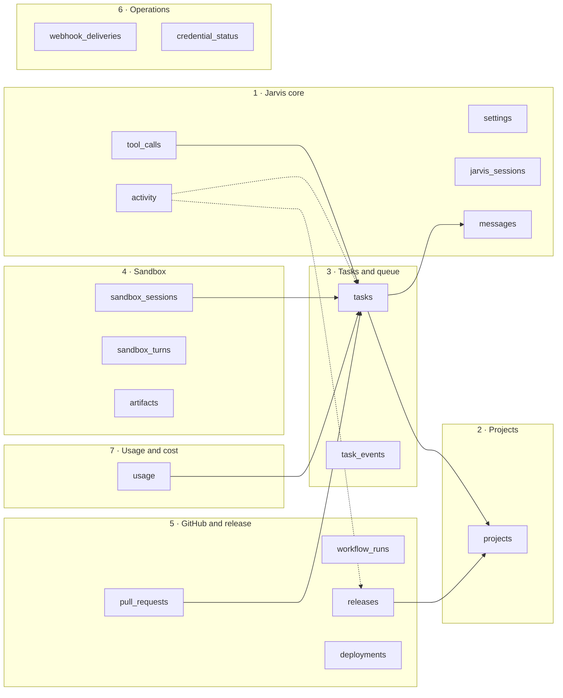
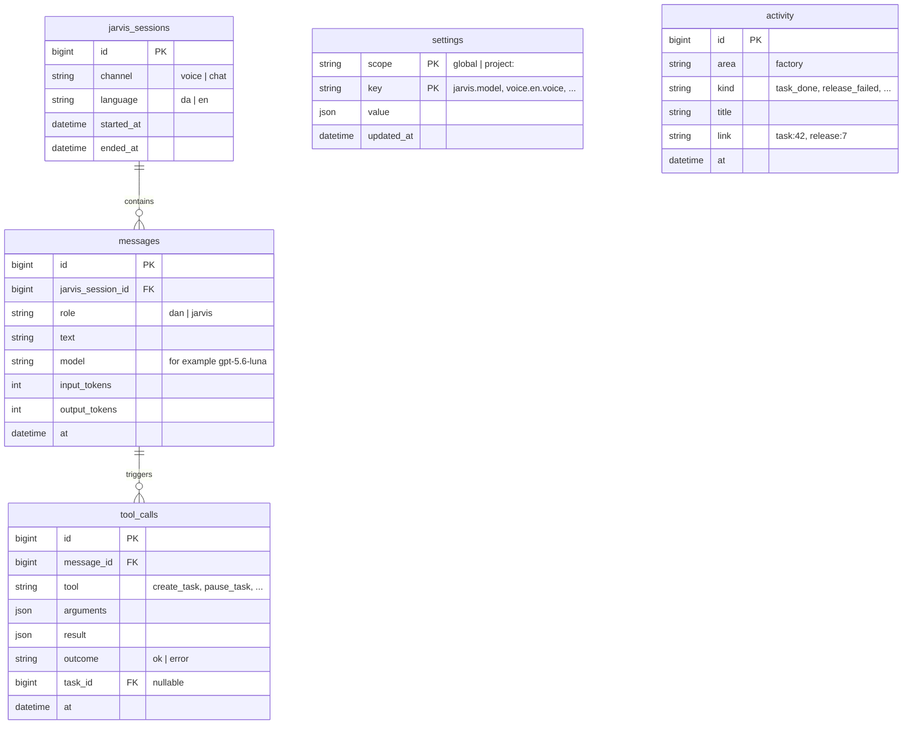
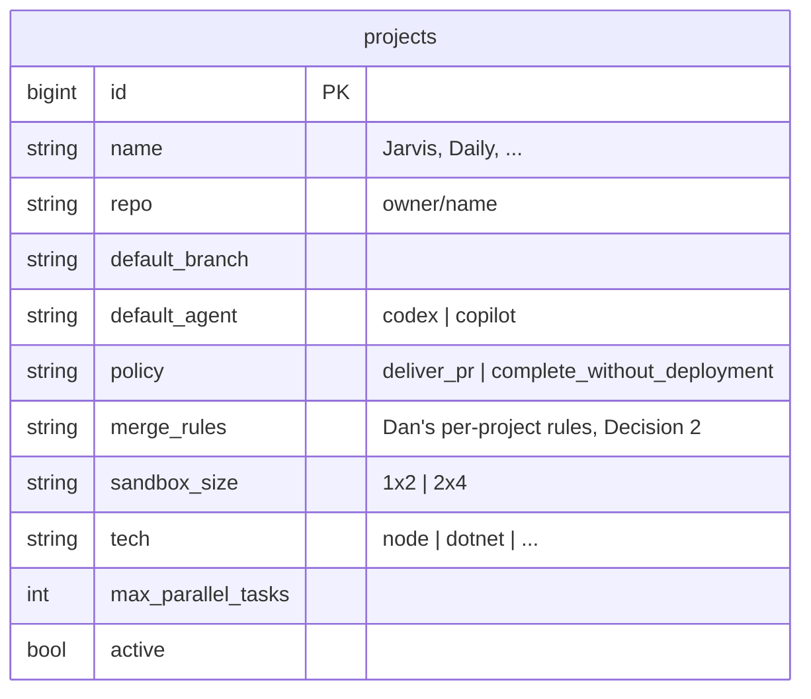
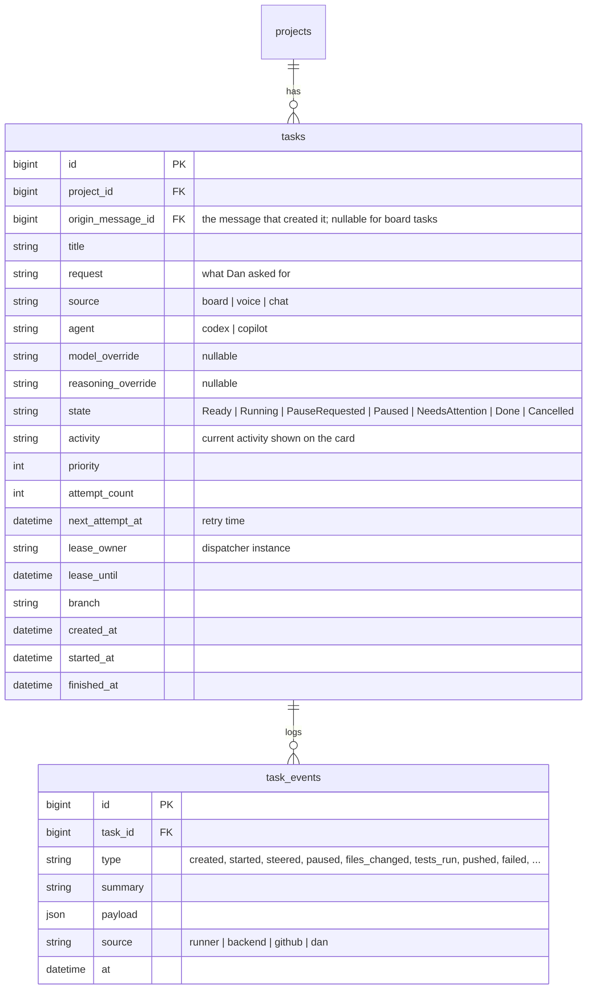
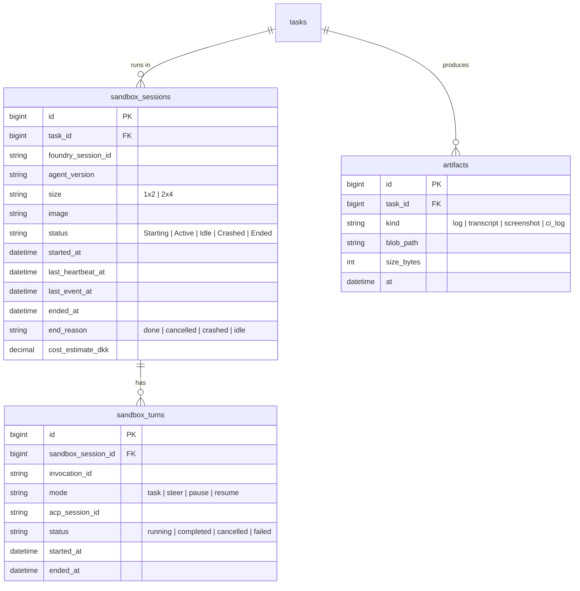
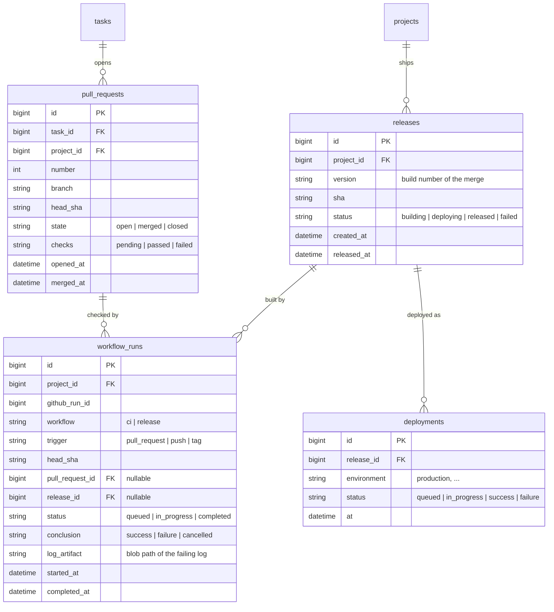
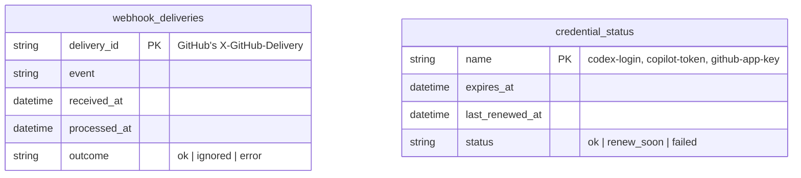
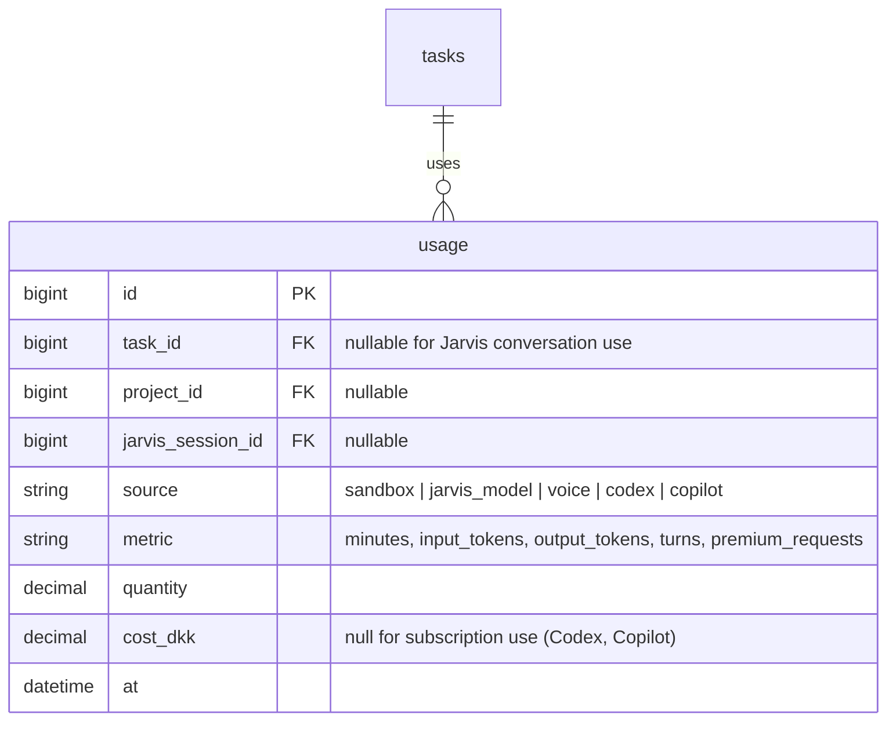

# Data model

Version 1, 3 October 2026 (after sparring with Dan). Scope: the Jarvis core and the Software Factory only. Azure SQL is the source of truth ([Decision 3](decisions.md#decision-areas)); Blob Storage holds large files referenced from SQL. Requirements: [PRODUCT.md](../PRODUCT.md); system: [architecture.md](architecture.md).

## Migration infrastructure

Issue #7 adds `dbo.schema_migrations`, an internal deployment ledger separate
from the seven domain groups: `name nvarchar(255)` primary key, `checksum char(64)`
(SHA-256 of committed file bytes), and `applied_at datetime2(7)` defaulting to
`SYSUTCDATETIME()`. The backend creates and writes it only while holding the
transaction-owned `jarvis.schema-migrations` app lock. Its rows must remain an
unchanged prefix of the committed migrations. Failed or cancelled startup rolls
back schema, data and ledger together. Issue #7 introduced no domain schema or seed
data. Groups 1–3 are `db/migrations/0001_core_tables.sql` (P1-01, #15), with a
reverse script in `db/migrations/down/`; see [Physical schema](#physical-schema-groups-13).
Groups 4–7 follow in P2-01, P2-12 and P3-04.

## Overview

Seven groups. Arrows show the main references between groups.

| # | Group | Supports | Tables |
| --- | --- | --- | --- |
| 1 | Jarvis core | The one continuous conversation with Jarvis, settings, the activity feed on the main page | `settings`, `jarvis_sessions`, `messages`, `tool_calls`, `activity` |
| 2 | Projects | Which repositories Jarvis works on and their rules | `projects` |
| 3 | Tasks and queue | The task view, dispatch, retries, the task's history | `tasks`, `task_events` |
| 4 | Sandbox | The Foundry sessions that run a task, each turn, files kept in Blob | `sandbox_sessions`, `sandbox_turns`, `artifacts` |
| 5 | GitHub and release | Pull requests, checks, the release view (commits fetched from GitHub on demand) | `pull_requests`, `workflow_runs`, `releases`, `deployments` |
| 6 | Operations | Safe webhook handling, credential expiry warnings | `webhook_deliveries`, `credential_status` |
| 7 | Usage and cost | Transparency per task and project: sandbox time, model tokens, voice, Codex and Copilot usage | `usage` |

Repository task statuses and their GitHub issues are workflow metadata managed from `PLAN.md`; they are not stored in the Jarvis SQL model.

P5-03 does not create `jarvis_sessions`, `messages`, or `tool_calls`; the realtime tool round-trip is backend-executed but not persisted yet. P4-03 owns conversation persistence, and P5-06 owns voice transcripts and usage. No schema or migration changes are part of P5-03.

## 1 · Jarvis core

- **One continuous conversation.** Jarvis has a single thread; each time Dan talks or types is a `jarvis_session` within it. Over time the thread needs compaction and memory (Decision 6, deferred); `messages` keeps the full record either way.
- `tool_calls` records what Jarvis actually did. Spoken confirmations are built from these results (L16).
- The backend tool dispatcher requires `X-Jarvis-Message-ID` and stores the validated arguments, result and `ok`/`error` outcome in `tool_calls`. P1-01 (#15) owns the table migration; no live SQL write has been verified yet.
- `settings` holds the settings page. A task stores its own overrides on the `tasks` row.
- `activity` is the "what's happening" feed on the main page. It carries an `area`, so later areas can add to it without changes.

## 2 · Projects

- One row per repository. `tech` chooses the sandbox image (small images, L23).

## 3 · Tasks and queue

- **The queue is `tasks` itself (Decision 3, option A).** The dispatcher takes the oldest `Ready` task within the project's and the global limit, sets `lease_owner` and `lease_until`, and starts a sandbox. A lease that expires means the dispatcher died, and another may take over.
- **Retries:** `attempt_count` and `next_attempt_at`; after the limit the task moves to `NeedsAttention`.
- `task_events` stores **every** runner event (Dan's choice: maximum freedom for the UI). It is append-only, drives the card's live updates (via SSE) and the task's history, and is the only fast-growing table; archive by age.
- `origin_message_id` links a task to the message in Jarvis's conversation that created it.

## 4 · Sandbox

- A task can have several sessions: a crash ends one session, and recovery starts a new one from the branch (L22).
- The sandbox heartbeat updates `last_heartbeat_at`; live runner events update `last_event_at` and add `task_events`.
- Large content (logs, CI logs, transcripts) lives in Blob; SQL keeps only the path.

## 5 · GitHub and release

- **One release = one merge to `main`** (no tags). Filled from GitHub webhooks (`pull_request`, `check_run`, `workflow_run`, `deployment_status`, `push`), never by polling.
- **Commits are not stored.** The release area shows a horizontal git graph per project (branches as lines, commits as dots): commits and branches come from the GitHub API when the page opens or when Dan asks Jarvis; the dots are coloured from `pull_requests`, `workflow_runs`, `releases` and `deployments`.
- A failed PR check stores the log in Blob, and the backend steers the task with it.
- The release view reads `releases`, `workflow_runs` and `deployments`, plus commits from GitHub on demand.

## 6 · Operations

- `webhook_deliveries` makes webhook handling idempotent: GitHub may deliver the same event twice.
- `credential_status` stores dates only, never secret values; it drives "renew soon" warnings on the board.

## 7 · Usage and cost

| Source | Measured from | Cost in DKK |
| --- | --- | --- |
| Sandbox | Session start to end (`sandbox_sessions`) × size | Yes, ≈ 0.89 DKK per hour at 1 vCPU / 2 GiB |
| Jarvis model | Token usage per model round | Yes, list price per model |
| Voice | Voice minutes per `jarvis_session` | Yes, estimated |
| Codex | Turns, and tokens if `codex-acp` reports them | No: ChatGPT Pro subscription; usage shown only. To verify what is reported |
| Copilot | Turns, and premium requests if Copilot CLI reports them | No: Copilot seat; usage shown only. To verify what is reported |

- Views sum `usage` per task, per project and per period, so Dan sees when Codex and Copilot were used and what each task cost.

## Physical schema (groups 1–3)

`0001_core_tables.sql` implements the diagrams above in `dbo` with these choices:

| Topic | Rule |
| --- | --- |
| Keys | `bigint IDENTITY` primary keys; `settings` uses `(scope, [key])` (`key` is reserved in T-SQL, so quote it) |
| Time | `datetime2(7)` UTC; event and creation times default to `SYSUTCDATETIME()` |
| Fixed values | `nvarchar` with `Latin1_General_100_BIN2` collation and a check, so `ready` is rejected where `Ready` is required. Values exactly as in the diagrams |
| Open vocabularies | `activity.area`/`kind` and `task_events.type`: lowercase letters and `_`. `settings.key`: lowercase, digits, `.`, `-`, `_`. `projects.tech`: lowercase, digits, `.`, `-`, `_`. `tool_calls.tool`: the tool registry's `[A-Za-z0-9_-]{1,64}` |
| JSON | `nvarchar(max)` with `ISJSON(..., VALUE)` (any JSON value, including strings and `null`); `tool_calls.arguments` must be an object (`ISJSON(..., OBJECT)`) |
| `settings.scope` | `global` or `project:<id>` with a positive integer id |
| `projects` | `repo` is unique (case-insensitive) and shaped `owner/name` using `A–Z a–z 0–9 . _ -`; `max_parallel_tasks` ≥ 1, default 1; `active` defaults to 1; `merge_rules` is free text, nullable |
| `tasks` | `state` defaults to `Ready`; `origin_message_id` is required unless `source = 'board'`; `lease_owner` and `lease_until` are both set or both null; `attempt_count` ≥ 0; `priority` defaults to 0; `started_at`/`finished_at` not before `created_at` |
| `messages` | `model` and token counts are nullable (Dan's messages have none); token counts ≥ 0 |
| `tool_calls` | `result` nullable; `outcome` is `ok` or `error`; `task_id` nullable |
| Foreign keys | No cascades. Projects are archived (`active = 0`), not deleted |
| Indexes | Dispatcher `IX_tasks_state_next_attempt_at`; timeline `IX_task_events_task_id_at`; plus one per foreign key: `IX_messages_jarvis_session_id_at`, `IX_tasks_project_id_state` (also the per-project running count), filtered `IX_tasks_origin_message_id`, `IX_tool_calls_message_id`, filtered `IX_tool_calls_task_id` |

The API still validates every field (P1-03, P1-04); these checks are the last line of defence.

## Conventions

- `bigint` identity keys; UTC `datetime2` timestamps; states as short strings with check constraints.
- JSON only for event payloads, tool arguments and settings values; never as the domain model.
- Indexes: `tasks(state, next_attempt_at)` for the dispatcher; `task_events(task_id, at)`; `workflow_runs(head_sha)`; `usage(task_id)`, `usage(project_id, at)`; and an index supporting each foreign key.
- Every migration ships a reverse script in `db/migrations/down/`; CI applies, reverts and reapplies all of them.
- Thousands of tasks over time are no concern; `task_events` is the only table that grows fast and can be archived by age.

## Decided in sparring (3 October 2026)

| # | Question | Decision |
| --- | --- | --- |
| 1 | Conversations and tasks | One continuous Jarvis conversation, split into sessions; a task stores `origin_message_id`. Compaction and memory later (Decision 6). |
| 2 | Task events | Store every runner event in SQL; archive by age. |
| 3 | Releases | One release per merge to `main`; no tags. |
| 4 | Commits | Not stored; fetched from GitHub on demand. A horizontal git graph per project in the release area. |
| 5 | Costs | Track usage per task and project in `usage`; DKK where billed, usage only for Codex and Copilot. |
| 6 | Settings history | Not needed. |

## Still open

- What usage Codex (`codex-acp`) and Copilot CLI report per turn (tokens, premium requests); **verify** in P2.