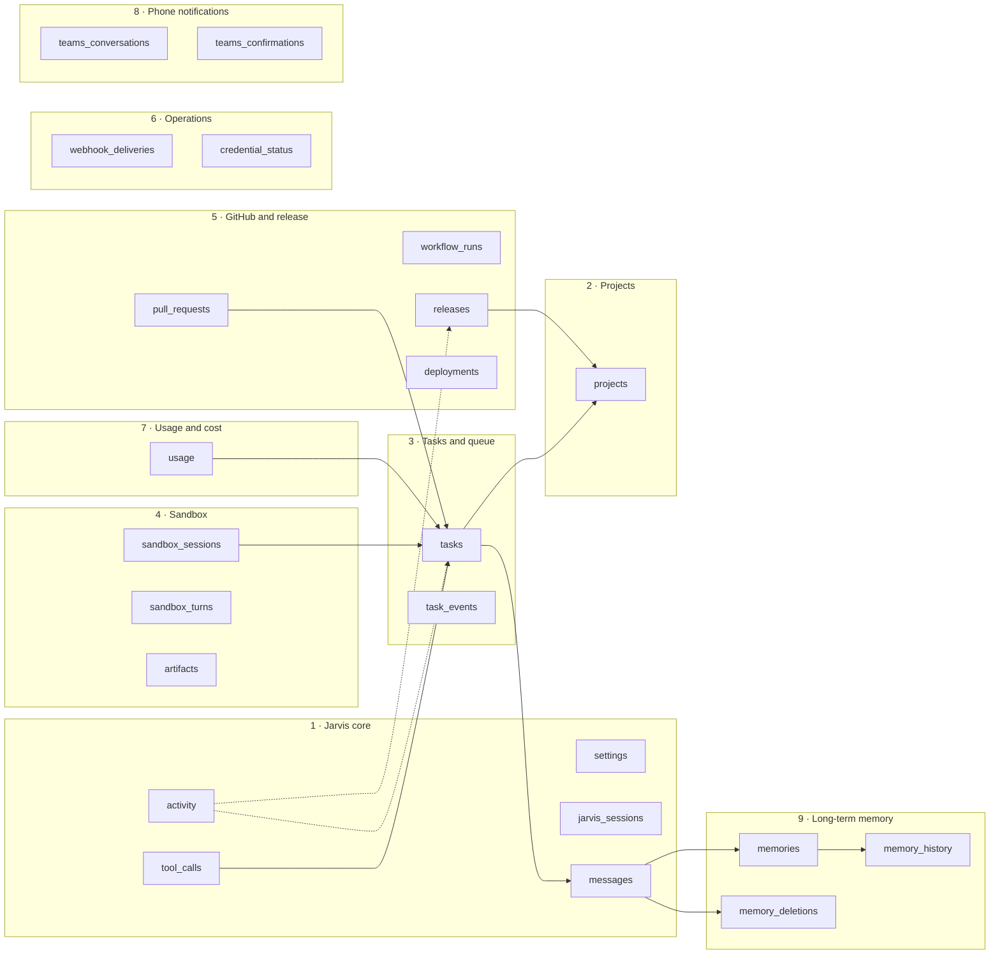
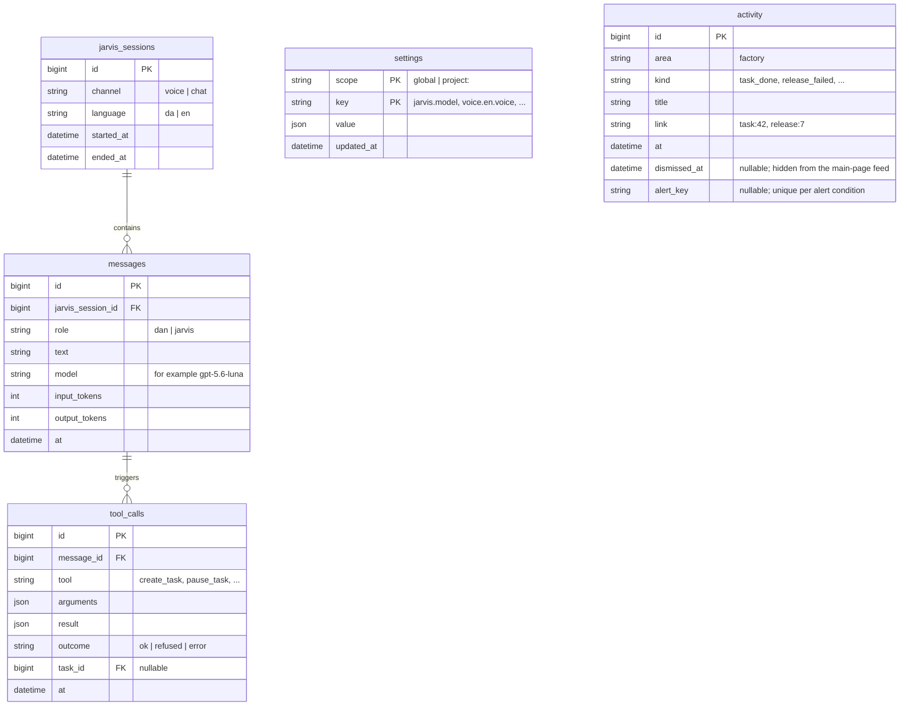
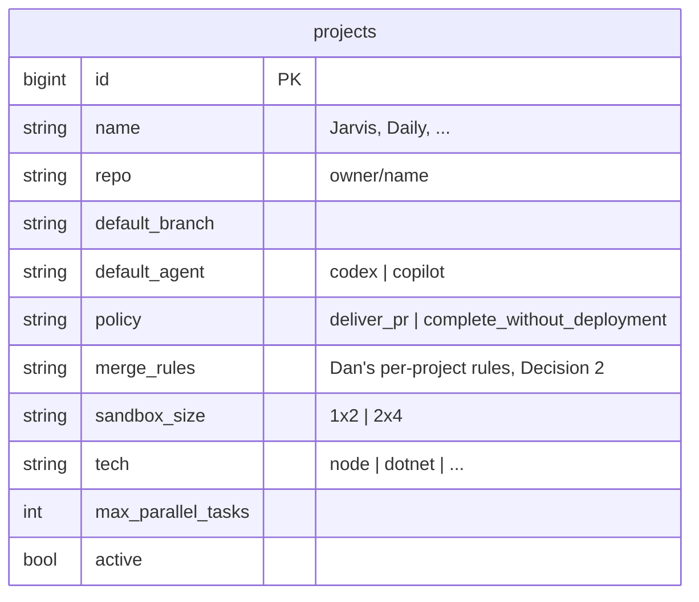
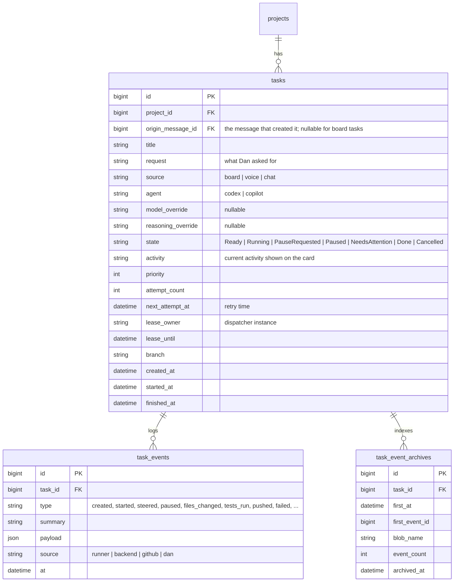
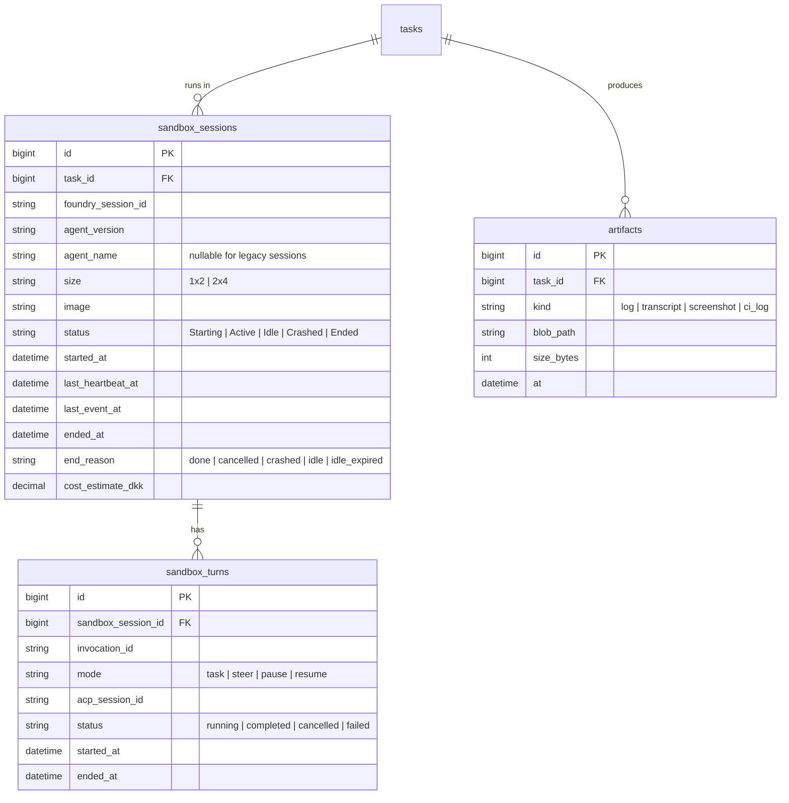
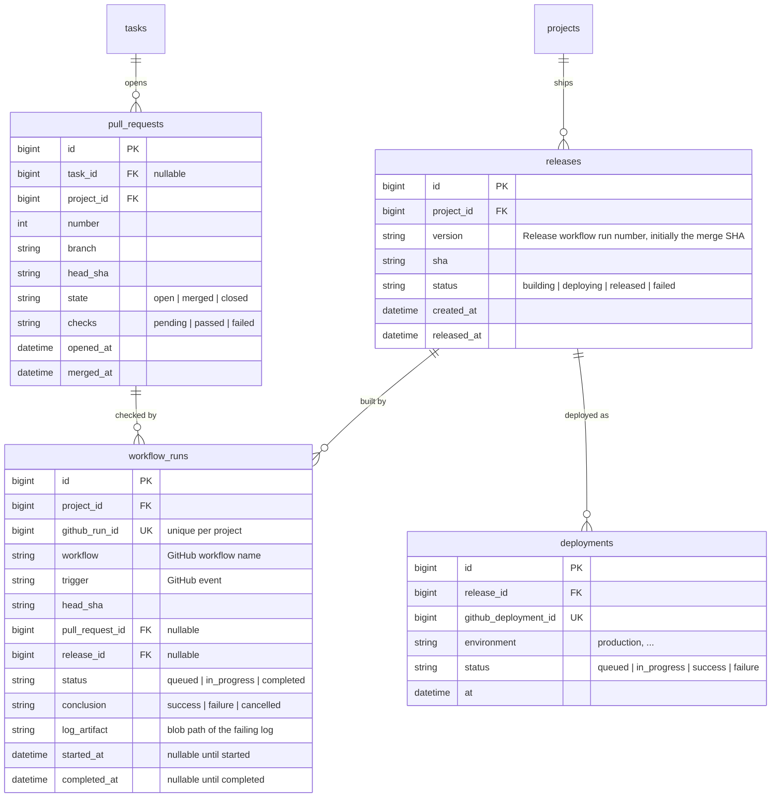
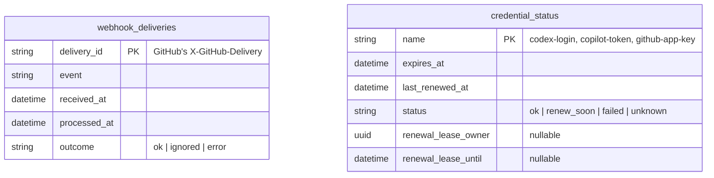
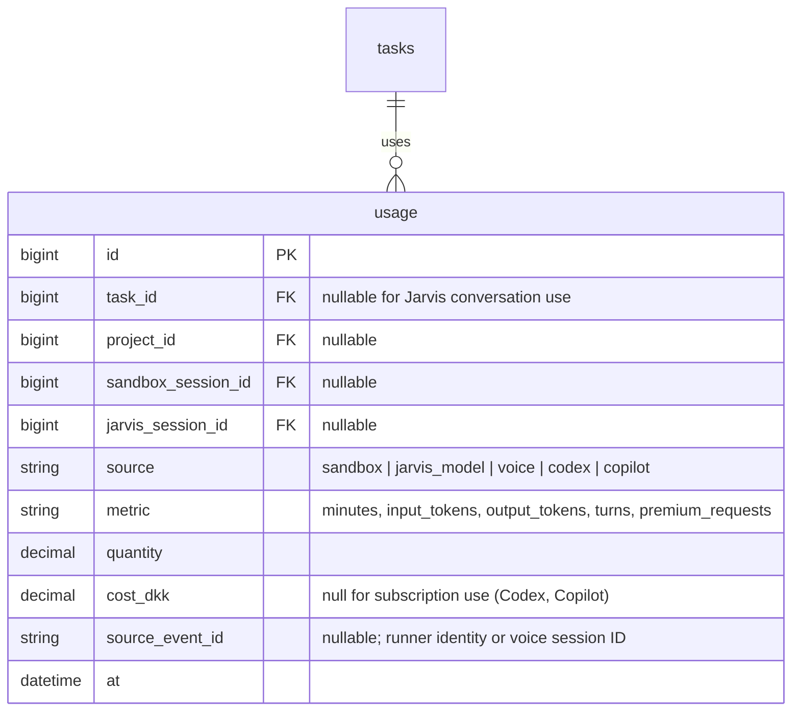
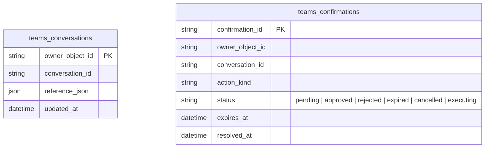

# Data model

Version 1, updated 4 October 2026 for P7-03 and P7-13. Scope: the Jarvis core and the Software Factory only. Azure SQL is the source of truth ([Decision 3](decisions.md#decision-areas)); Blob Storage holds large files referenced from SQL. Requirements: [PRODUCT.md](../PRODUCT.md); system: [architecture.md](architecture.md).

## Migration infrastructure

Issue #7 adds `dbo.schema_migrations`, an internal deployment ledger separate
from the nine domain groups: `name nvarchar(255)` primary key, `checksum char(64)`
(SHA-256 of committed file bytes), and `applied_at datetime2(7)` defaulting to
`SYSUTCDATETIME()`. The backend creates and writes it only while holding the
transaction-owned `jarvis.schema-migrations` app lock. Its rows must remain an
unchanged prefix of the committed migrations. Failed or cancelled startup rolls
back schema, data and ledger together. Issue #7 introduced no domain schema or seed
data. Groups 1–3 are `db/migrations/0001_core_tables.sql` (P1-01, #15), with a
reverse script in `db/migrations/down/`; see [Physical schema](#physical-schema-groups-13).
Groups 4–7 follow in P2-01, P2-12 and P3-04. P2-06 adds the nullable
`sandbox_sessions.agent_name` column in `0003_sandbox_agent_name.sql`; new
sessions must populate it so the heartbeat can address the correct Foundry agent.
P6-03 adds `task_event_archives` in `0005_task_event_archives.sql`, indexing each
committed event blob so interrupted uploads remain invisible and task history
pages can locate the required blobs without listing the container.
P1-13 adds nullable `activity.dismissed_at` in `0008_activity_dismissals.sql`;
the feed omits dismissed activity while retaining it for history and supports
reverting the column with the paired down migration.
P2-14 adds `idle_expired` to the `sandbox_sessions.end_reason` check in
`0010_idle_expired_sessions.sql`; its down migration maps that value to `idle`
before restoring the prior constraint.
P6-02 adds nullable `activity.alert_key` and a filtered unique index in
`0011_alert_deduplication.sql`; each event condition has one activity row and
can be safely retried. Its down migration removes the index and column.
P7-03 adds the Teams conversation and confirmation tables in
`0014_teams_notifications.sql`; its down migration removes both tables and the
confirmation expiry index.
P7-13 adds group 9 in `0016_long_term_memory.sql`: source-linked memories,
revision history, a content-free deletion audit and nullable voice source-item IDs.
The migration adds `vector(1536)` only when SQL exposes that type. After the
transaction commits, the idempotent `setup/0016_long_term_memory.sql` creates the
full-text catalog/index when installed; its paired down script removes memory tables
and the voice source-item index/column.

## Overview

Nine groups. Arrows show the main references between groups.

| # | Group | Supports | Tables |
| --- | --- | --- | --- |
| 1 | Jarvis core | The one continuous conversation with Jarvis, settings, the activity feed on the main page | `settings`, `jarvis_sessions`, `messages`, `tool_calls`, `activity` |
| 2 | Projects | Which repositories Jarvis works on and their rules | `projects` |
| 3 | Tasks and queue | The task view, dispatch, retries, the task's history | `tasks`, `task_events` |
| 4 | Sandbox | The Foundry sessions that run a task, each turn, files kept in Blob | `sandbox_sessions`, `sandbox_turns`, `artifacts` |
| 5 | GitHub and release | Pull requests, checks, the release view (commits fetched from GitHub on demand) | `pull_requests`, `workflow_runs`, `releases`, `deployments` |
| 6 | Operations | Safe webhook handling, credential expiry warnings | `webhook_deliveries`, `credential_status` |
| 7 | Usage and cost | Transparency per task and project: sandbox time, model tokens, voice, Codex and Copilot usage | `usage` |
| 8 | Phone notifications | Dan's validated Teams personal conversation and expiring one-time approvals | `teams_conversations`, `teams_confirmations` |
| 9 | Long-term memory | Relevant source-linked preferences, project facts, decisions and unfinished tasks across sessions | `memories`, `memory_history`, `memory_deletions` |

Repository task statuses and their GitHub issues are workflow metadata managed from `PLAN.md`; they are not stored in the Jarvis SQL model.

P5-03 and P5-04 do not create conversation rows; P5-06 creates voice `jarvis_sessions`, stores completed transcript events in `messages`, and records voice-minute `usage` rows. Realtime voice tool calls are not stored in `tool_calls`. The existing group-one and group-seven schemas support this; no migration is needed.

## 1 · Jarvis core

P4-06 uses the existing `jarvis_sessions`, `messages`, and `tool_calls` tables:
each chat sitting is a chat session, the user message is the tool-call source,
and the completed assistant reply is another message. Task links come from the
stored `tool_calls.task_id`; no columns or migrations are added.

- **One continuous conversation.** Jarvis has a single thread; each chat or voice sitting is a `jarvis_session` within it. `messages` keeps the complete source record; compaction and generated views do not own durable memory or change conversation retention.
- P4-03's authenticated conversation API creates and idempotently ends sessions, appends messages only to active sessions, and reads history across sessions. History is paginated by message ID (50 by default, up to 100) and ordered chronologically; it includes session channel/language, voice minutes when recorded, and tool name, outcome, and task ID, not tool arguments or results. The main page reads history; P4-06 sends chat turns through the session turn endpoint, while the authenticated voice relay creates voice sessions and stores completed transcript events. No schema migration was needed.
- `tool_calls` records what Jarvis actually did. Spoken confirmations are built from these results (L16).
- P4-04's agent-only turn context reads up to 20 running tasks and their three latest `task_events` from the existing tables. It selects task status/activity and event type, summary, source, and time; it excludes task requests and event payloads, and clips summaries to 400 characters. No schema or migration change is needed.
- P7-13's `memories` row is keyed by category and stable key, has one current Dan source message, and optionally stores a 1536-dimensional embedding. `memory_history` keeps each replaced source-linked revision; `memory_deletions` records only the forgotten memory ID, request message ID and deletion time, never deleted content. Forget cascades to revisions but does not remove messages. Chat writes use the existing message ID; voice persists the provider transcript item ID on `messages` and resolves it to Dan's stored transcript before a write. Retrieval joins the current source message and returns bounded source text.
- The backend tool dispatcher requires `X-Jarvis-Message-ID` and stores the validated arguments, result and `ok`/`refused`/`error` outcome in `tool_calls`. A tool refuses by throwing `ToolRefusal` with a safe reason, stored as `{ "refused": reason }`; `ToolFailure` stores a bounded safe explanation with an `error` outcome, while unexpected failures stay generic. P7-10 stores its bounded query and returned title/snippet/link values in this existing table; no new table or migration is needed. P1-01 (#15) owns the table migration; no live SQL write has been verified yet. P4-06 stores the source message before P4-09 sends its ID and the delegated token in the application payload to the hosted agent through Foundry Invocations. The agent registers its chat handler with that protocol, verifies the caller and message through the backend, and sets the message ID in the per-turn context used by tool calls. P4-04's running-task context is fetched by the model client on every turn. No data-model or migration change is required.
- P3-12 `create_project` reuses `dbo.projects`, `dbo.tasks`, `dbo.messages`, and `dbo.tool_calls`: tool arguments/results contain the requested name/description and project/task identifiers, while the task uses `source = 'chat'` and references the calling message. The backend-only repository token is never persisted; the project starts with the `node`/`1x2` base defaults. No schema or migration change is required.
- Session, message, history, task-origin, and tool-call behavior is covered by offline and disposable SQL Server tests; live Azure SQL writes have not been verified.
- `settings` holds the settings page. A task stores its own overrides on the `tasks` row.
- P1-11 stores global defaults in the existing key/value table; missing keys use
  the documented defaults. Current keys are `jarvis.model`,
  `jarvis.reasoning_effort`, `personality.tone`, `personality.response_style`,
  `personality.custom_instructions`, `voice.stt.model`, `voice.en.model`,
  `voice.en.voice`, `voice.da.voice`, `voice.default_language`, `codex.model`,
  `codex.reasoning_effort`, `copilot.model`, `global.max_parallel_tasks`, and
  `global.max_check_attempts` (default 3; integer range 0–10, where 0 disables
  automatic check repair).
  P7-16 adds the three `personality.*` JSON string settings to that same
  key/value scope; tone and response style use closed catalogs, and custom
  instructions are limited to 2,000 characters. The existing `dbo.settings`
  schema already supports these keys, so no migration is required.
  P3-11 adds `new_projects.owner`, `new_projects.visibility`,
  `new_projects.templates_repository`, `new_projects.default_agent`,
  `new_projects.policy`, `new_projects.max_parallel_tasks`, and
  `new_projects.default_branch` to the same global settings scope.
  Values are JSON scalars. Model/voice/language/reasoning choices are validated
  against the backend catalog; Codex/Copilot catalogs currently contain only
  `default`. P2-11 verified that the runner can apply explicit model overrides
  (and Codex reasoning) through provider options. Task rows retain an optional
  model override and Codex reasoning override. The runner's ACP session metadata
  retains the effective selection across resumed turns. P2-05 still owns
  resolving task overrides before the applicable settings default. The global
  task limit is an integer from 1 to
  100. New-project owner and repository values are validated as GitHub
  identifiers; visibility, agent, and policy use closed catalogs; task limits
  are integers from 1 to 100; branch names reject invalid Git ref characters.
  No migration is needed. Partial writes are transactional; settings are defaults
  for future sessions/tasks, not live updates or history. At the start of a hosted Jarvis
  session, the agent keeps the effective model and reasoning effort in memory for
  that session; the snapshot is not persisted.
- `activity` is the "what's happening" feed on the main page. It carries an `area`, so later areas can add to it without changes. The authenticated Now-feed read excludes `dismissed_at` rows; dismissing sets the UTC timestamp without deleting the activity record. P6-02 writes alerts in the same transaction as the condition where available, with a unique filtered `alert_key` index to suppress repeats. Keys identify deployment, sandbox session, credential expiry timestamp, or budget month; the feed never displays the key.

## 2 · Projects

- One row per repository. `tech` chooses the sandbox image (small images, L23).
- P1-03's SQL-backed API returns active projects, updates only active rows, and
  archives by setting `active = 0`; archived rows remain to preserve task
  references and the unique repository constraint. Repositories stay reserved
  after archive.
- P1-10 reads project settings from that API and derives each running-task count
  from `tasks.state = 'Running'`. No project columns or migration are added;
  release data remains in group 5 and is not yet shown as a real value.

## 3 · Tasks and queue

- **The queue is `tasks` itself (Decision 3, option A).** The dispatcher takes the highest-priority oldest eligible `Ready` task within the global and project limits. A transaction-owned `jarvis.task-dispatcher` app lock serializes capacity checks and claims; `lease_owner` and `lease_until` reserve a startup slot. Expired startup leases move to `NeedsAttention`, not another start, because the remote start may have succeeded before the dispatcher stopped.
- **Retries:** `attempt_count` increments for each leased start. Safe pre-start failures retry after 15 and 30 seconds, up to three attempts; `next_attempt_at` gates each retry. Ambiguous Foundry start outcomes are not replayed and move to `NeedsAttention`.
- P2-13 sets the existing `tasks.branch` to `jarvis/task-<id>` on dispatch when absent and preserves it for retries, resume, and recovery. No schema migration is needed. A runner `session_question` event stores the last agent message; its transaction moves a Running or PauseRequested task to NeedsAttention with reason `session_question` and releases its lease before publishing the events.
- `task_events` stores **every** task event (Dan's choice: maximum freedom for the UI). It is append-only, drives the card's live updates (via SSE) and the task's history, and is the only fast-growing table; archive by age: a backend job moves events older than 90 days to private Blob Storage in bounded batches. The SQL rows are deleted only after their archive blobs upload successfully, and `task_event_archives` records the blob references in the same SQL transaction as deletion. Task-detail pages read only the indexed archived chunks they need and keep the same bounded pagination. The live `recordEvent` write path remains unchanged. Each event also creates a `factory` activity row with its type as `kind`, its summary (or type) as title, and `task:<id>` as link.
- P7-11 updates the existing task agent/model/reasoning fields only when the task is Ready, then writes a bounded `model_changed` event and activity row in the same transaction. The committed event is published through the existing hub so task detail refreshes; no table or migration is added.
- `origin_message_id` links a task to the message in Jarvis's conversation that created it. The existing schema requires this reference for non-board tasks; board tasks may omit it.
- P1-04 creates a board task only for an active project, using the project's default agent unless the request selects one. Task creation and its `created` event share a transaction. Backend state transitions lock the task row, enforce the product lifecycle, and write a `state_changed` event in that transaction; `Done` requires GitHub verification of the task branch and a pull request in the configured repository. There is no client state-update route.
- P3-12 creates its initial scaffold task through the same store and transaction, linked to the chat message that invoked `create_project`; a runner clarification becomes a normal `NeedsAttention` state-change event with a bounded question and ends the sandbox session as `Ended`/`done`, not `Crashed`.
- P1-05 writes each task event and its activity row in the same transaction. The runner-only `POST /factory/sandbox-events` validates its task-scoped input and calls `TaskStore.recordEvent` with source `runner` (no schema change); `recordEvent` is also the producer API for backend event sources; JSON payloads are capped at 1 MiB. The in-process hub publishes only after commit; payloads over 4 KiB are omitted from the published event and marked truncated. P1-06's authenticated SSE endpoint reads missed events from `task_events` by ascending ID in bounded pages, buffers live hub publications during replay, and suppresses overlapping IDs. The fetch client reconnects with the last delivered ID; the stream sends a heartbeat comment every 25 seconds. No schema change is needed.
- P3-05 records `checks_retry_started`, `checks_retry_failed`, and `checks_attempts_exhausted` markers in this same event stream. Successful steers are recognized by the run ID embedded in the existing `steered` event; the serialized event payload is searched as `nvarchar(max)` because SQL Server `JSON_VALUE` would truncate this long prompt lookup. No schema change is needed.
- `GET /factory/tasks` filters by project, agent, state, creation period and search, with bounded offset pagination. `GET /factory/tasks/:id` returns the task and a bounded, pageable event slice (event limit up to 200; offset up to 10,000). P1-09 requests 100 at a time, loads additional pages on demand, and merges them with the authenticated SSE stream by event ID; archived and SQL events use the same order and response shape. Its optional `origin_message_id` lookup uses a single row from `/conversation/history`. Responses are capped at 1 MiB; event payloads over 4 KiB are omitted and marked truncated. No schema change is required for the detail page.
- P1-08's board uses the task list and event stream without changing the schema. The current task-list contract has no pull-request, check, or usage fields, so those card values remain explicitly unavailable until the GitHub integration (P3-03/P3-04) and usage work (P2-12) supply them.
- Runner task events carry disk readings in `payload.data`: `disk_snapshot` records
  `disk_total_bytes`, `disk_used_bytes`, and `disk_free_bytes` at turn start, with
  the configured `disk_low_threshold_bytes`. A `disk_low` event records the
  threshold breach; its transaction moves a Running task to NeedsAttention with
  reason `disk_low` and releases the task lease. No schema migration is required.

## 4 · Sandbox

- A task can have several sessions: a crash ends one session, and recovery starts a new one from the branch (L22). The unique `foundry_session_id` row is reused after a clean pause: resume resets `started_at`, clears `ended_at`, and adds the completed active interval to that session's existing sandbox usage row. Cancelling a paused task marks its idle session Ended. The dispatcher records `agent_name` for heartbeat routing. `agent_version = 'active'` and `image` records the selected Foundry runner route (for example `jarvis-runner-base-1x2`); the Invocations start response does not expose the resolved version number or container digest.
- The sandbox heartbeat updates `last_heartbeat_at`; it needs the session's `agent_name` to address the Foundry runtime. Runner completion events mark the matching `sandbox_turns` row completed. If Foundry later confirms that this invocation's session expired, the session ends with `idle_expired` while task state remains unchanged; the task API exposes the latest session end reason for Continue versus Recover. Live runner events update `last_event_at` and add `task_events`.
- Heartbeat-observed completion also persists the matching turn's terminal status. Expiry and generic NeedsAttention cleanup check the latest turn and its matching committed runner completion events, so an event arriving before turn insertion cannot become a false crash. An old invocation's poll cannot end a newer turn. These guards require no schema migration.
- Large content (logs, CI logs, transcripts) lives in Blob; SQL keeps only the path.
- The schema checks sandbox sizes, statuses, turn modes, end reasons and artifact kinds against these vocabularies. UTC `datetime2` end and heartbeat/event timestamps cannot precede their start.
- `sandbox_sessions` is indexed by task and status; turns and artifacts are indexed by their parent and timestamp for the session/task timelines.

## 5 · GitHub and release

- **One release = one push of a merge to the project's default branch** (no tags). A `push` creates it by project and SHA; if its webhook arrives first, the matching `Release` workflow run on that branch creates the same row with the run number. The push and workflow paths are idempotent, and the push links any earlier workflow runs by project/SHA. `pull_request` updates its record, `check_run` updates the PR check summary, `workflow_run` upserts by GitHub run ID, and `deployment_status` upserts by GitHub deployment ID. The release view is filled from the subscribed GitHub webhooks, never by polling.
- PRs are upserted by project and PR number; their task link is derived from a matching task branch. Workflow runs link to a matching PR and release by project/SHA. A deployment status is retained only when its SHA already identifies a release; a matching default-branch `Release` run can create that row before the push notification arrives.
- A delivery row and its mapped records commit in one serializable SQL transaction. A duplicate delivery ID leaves every mapped record unchanged. The receiver verifies the raw-body signature, then keeps only these mapped fields in memory; it never stores or logs webhook payloads or secrets.
- P3-05 reuses `workflow_runs.log_artifact` for the private `logs` Blob path and existing `task_events` for bounded repair-attempt markers. Failed logs themselves remain in Blob; no new SQL table or migration is needed.
- P3-06 joins a task-linked `pull_requests` row to its project policy and task state after the webhook transaction commits. `pull_requests.state` and `pull_requests.checks` are the persisted completion evidence; no policy-specific columns or tables are added. Backend task events record policy blocks and accepted merge requests.
- `deliver_pr` completes only after the persisted PR/check records and current GitHub PR/check state agree. `complete_without_deployment` requests a squash merge only for a non-draft, green, up-to-date, mergeable PR; the task becomes Done only after the signed webhook records the merge.
- When completed task work has commits on its task branch but no open PR, the backend creates one using the repository-scoped GitHub App token, task branch as head, project default branch as base, task title and a link to the Jarvis task. The resulting PR webhook is persisted before policy evaluation.
- **Commits are not stored.** The release area shows a horizontal git graph per project (branches as lines, commits as dots): commits and branches come from the GitHub API when the page opens or when Dan asks Jarvis; the dots are coloured from `pull_requests`, `workflow_runs`, `releases` and `deployments`.
- A failed task-PR workflow stores the bounded failed-job log in private Blob storage and steers the same task with a bounded excerpt and the log path. The backend limits repairs using `global.max_check_attempts`, persists attempt markers in `task_events`, and moves exhausted or unavailable repairs to NeedsAttention.
- The release view reads `releases`, `workflow_runs` and `deployments`, plus commits from GitHub on demand.

## 6 · Operations

- `webhook_deliveries` makes webhook handling idempotent: GitHub may deliver the same event twice. P3-03 verifies the signature before atomically storing the delivery ID, event, processing time, and outcome (`ok` for mapped events, `ignored` for other valid events such as `ping`); duplicate IDs leave the existing row unchanged.
- No webhook payload or secret is stored here. P3-04 maps only the fields listed in group 5 to project records in the same transaction as the delivery row.
- `credential_status` stores expiry/last-updated dates and status only, never secret values. Codex and Copilot start as `unknown`; Key Vault metadata and Codex renewal populate dates. A paired owner/expiry lease serializes Codex renewal against Codex task starts; unknown status alone does not block tasks, while a failed Codex renewal does.
- Container App sleep state is read from Azure's configured minimum replicas; it is not persisted in `settings` or another SQL table. The sleep refusal check takes an exclusive transaction-owned application lock while task creation and state transitions take the shared lock, so no Ready, Running, or PauseRequested task can be introduced between the check and scale request. This adds no schema object.

## 7 · Usage and cost

| Source | Measured from | Cost in DKK |
| --- | --- | --- |
| Sandbox | Session start to end (`sandbox_sessions`) × size | Yes, ≈ 0.89 DKK per hour at 1 vCPU / 2 GiB |
| Jarvis model | Token usage per model round | Yes, list price per model |
| Voice | Connected relay duration per `jarvis_session` | Yes, estimated |
| Codex | Turns, and tokens if `codex-acp` reports them | No: ChatGPT Pro subscription; usage shown only. Actual live report fields remain to verify |
| Copilot | Turns, and premium requests if Copilot CLI reports them | No: Copilot seat; usage shown only. Actual live report fields remain to verify |

P2-12's `0007_usage.sql` implements the table and its reverse migration. Sandbox
rows are tied to a `sandbox_session_id`; their minute quantity and DKK estimate
are written when that session ends, while an active session's elapsed estimate
is computed by task detail. Agent turns are recorded immediately before an ACP
prompt. Provider metrics are stored only from explicit numeric `usage` objects in
ACP prompt results or usage notifications, with a runner invocation/event key to
make repeated delivery idempotent. The task detail API and page expose those
entries. Offline package documentation advertises Codex token-usage events but
does not establish their exact fields; Copilot documentation explains quota
consumption but not a per-turn ACP report. Authenticated live runs remain
necessary to verify either provider's actual report.

P5-06 writes one `voice`/`minutes` row when a voice session ends, linked by
`jarvis_session_id`; the session ID is the idempotency key. Session end and
usage insertion share one SQL transaction. The history query returns that
session total with its messages, and the main page displays it once per sitting.

- P6-01 reads `usage` without changing its writers. The authenticated usage report
  sums rows by task, project, agent, source and metric for 7-, 30-, 90-day or
  all-time periods; the page groups the breakdown by project, agent or source.
  Codex/Copilot cost is always null. Active sandbox estimates are calculated
  read-only and clipped to the selected period. The API returns at most 1,000
  grouped breakdowns and marks partial results so displayed subtotals are not
  mistaken for full-period totals. Existing voice rows are included when P5-06
  has written them.

## 8 · Phone notifications

P7-03 stores one validated personal Teams conversation reference for Dan and
single-use confirmation state bound to his object ID and conversation ID.
`IX_teams_confirmations_expiry` supports expiry cleanup. Cards and message text
are not persisted in these tables; voice bytes live only in a bounded in-memory
store with five-minute links. Startup expires pending confirmations, and an
approval is atomically consumed before the backend invokes its action.

## Physical schema (groups 1–3)

`0001_core_tables.sql` implements the diagrams above in `dbo` with these choices:

| Topic | Rule |
| --- | --- |
| Keys | `bigint IDENTITY` primary keys; `settings` uses `(scope, [key])` (`key` is reserved in T-SQL, so quote it) |
| Time | `datetime2(7)` UTC; event and creation times default to `SYSUTCDATETIME()` |
| Fixed values | `nvarchar` with `Latin1_General_100_BIN2` collation and a check, so `ready` is rejected where `Ready` is required. Values exactly as in the diagrams |
| Open vocabularies | `activity.area`/`kind` and `task_events.type`: lowercase letters and `_`. `settings.key`: lowercase, digits, `.`, `-`, `_`. `projects.tech`: lowercase, digits, `.`, `-`, `_`. `tool_calls.tool`: the tool registry's `[A-Za-z0-9_-]{1,64}` |
| JSON | `nvarchar(max)` with `ISJSON(..., VALUE)` (any JSON value, including strings and `null`); `tool_calls.arguments` must be an object (`ISJSON(..., OBJECT)`) |
| `settings.scope` | `global` or `project:<id>` with a positive integer id |
| `projects` | `repo` is unique (case-insensitive) and shaped `owner/name` using `A–Z a–z 0–9 . _ -`; `max_parallel_tasks` ≥ 1, default 1; `active` defaults to 1; `merge_rules` is free text, nullable |
| `tasks` | `state` defaults to `Ready`; `origin_message_id` is required unless `source = 'board'`; `lease_owner` and `lease_until` are both set or both null; `attempt_count` ≥ 0; `priority` defaults to 0; `started_at`/`finished_at` not before `created_at` |
| `messages` | `model` and token counts are nullable (Dan's messages have none); token counts ≥ 0 |
| `tool_calls` | `result` nullable; `0001` permits `ok` or `error`; `task_id` nullable |
| Foreign keys | No cascades. Projects are archived (`active = 0`), not deleted |
| Indexes | Dispatcher `IX_tasks_state_next_attempt_at`; timeline `IX_task_events_task_id_at`; plus one per foreign key: `IX_messages_jarvis_session_id_at`, `IX_tasks_project_id_state` (also the per-project running count), filtered `IX_tasks_origin_message_id`, `IX_tool_calls_message_id`, filtered `IX_tool_calls_task_id` |

P6-03's `0005_task_event_archives.sql` adds the archive index table without changing
the `task_events` producer schema. The API still validates every field (P1-03,
P1-04); these checks are the last line of defence.

P4-05 adds `refused` to the runtime tool-call outcomes, but the current
`CK_tool_calls_outcome` constraint in `0001_core_tables.sql` still permits only
`ok` and `error`. Persisting a refused call therefore needs a forward schema
migration; the history API accepts and displays all three outcomes.

## Long-term memory schema (group 9)

`0016_long_term_memory.sql` adds:

| Table/column | Contract |
| --- | --- |
| `memories` | One current row per `(category, memory_key)`, with validated content, a required source message, revision and update time; optional `vector(1536)` when supported |
| `memory_history` | Previous values and their Dan source-message IDs; deleting a memory cascades only to its versions |
| `memory_deletions` | Content-free audit of the memory ID and Dan message that requested forgetting; no FK to the deleted memory |
| `messages.source_item_id` | Nullable provider transcript item identifier used to resolve a voice tool call to the saved Dan transcript; indexed only when non-null |

All memory searches and list/history pages are bounded and join only Dan source
messages. Vector search uses cosine distance when the SQL vector type is available;
otherwise retrieval uses SQL full-text when installed and bounded substring search
as the final fallback. A memory is independent of session boundaries, compaction,
generated windows and the continued retention of its original source record.
The full-text catalog is created outside migration transactions and remains empty
after a down migration; the idempotent setup batch can recreate the index later.

## Conventions

- `bigint` identity keys; UTC `datetime2` timestamps; states as short strings with check constraints.
- JSON only for event payloads, tool arguments and settings values; never as the domain model.
- Indexes: `tasks(state, next_attempt_at)` for the dispatcher; `task_events(task_id, at)`; `pull_requests(project_id, head_sha)`; `workflow_runs(project_id, head_sha)`; `releases(project_id, created_at)`; `deployments(release_id, at)`; `usage(task_id)`, `usage(project_id, at)`; and an index supporting each foreign key.
- Every migration ships a reverse script in `db/migrations/down/`; CI applies, reverts and reapplies all of them.
- Thousands of tasks over time are no concern; `task_events` is the only table that grows fast and can be archived by age.

## Decided in sparring (3 October 2026)

| # | Question | Decision |
| --- | --- | --- |
| 1 | Conversations and tasks | One continuous Jarvis conversation, split into sessions; a task stores `origin_message_id`. Compaction and memory later (Decision 6). |
| 2 | Task events | Store every runner event in SQL; archive by age. |
| 3 | Releases | One release per merge to `main`; no tags. |
| 4 | Commits | Not stored; fetched from GitHub on demand. A horizontal git graph per project in the release area. |
| 5 | Costs | Track usage per task and project in `usage`; DKK where billed, usage only for Codex and Copilot. |
| 6 | Settings history | Not needed. |

## Still open

- What usage Codex (`codex-acp`) and Copilot CLI actually report per turn (tokens, premium requests); offline package documentation was inspected in P2-12, but authenticated live runs remain the verification step.
