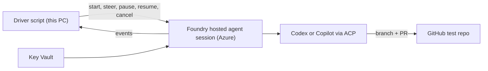

# Goal — Jarvis coding-sandbox prototype

## Objective

Prove that Foundry Hosted Agents can run Jarvis coding tasks in Azure. Build and run the proof of concept defined in `C:\Repo\Jarvis\jarvis.md` (section "Proof of concept — proposed").

## What runs where

| Where | What |
| --- | --- |
| **Azure — Foundry** | Hosted agent `jarvis-runner`: one VM-isolated sandbox per task. Inside: Python ACP adapter, Copilot CLI, Codex CLI with `codex-acp`. The agents clone, build, test, push, and open PRs from here. |
| **Azure — supporting** | Container Registry (agent image), Key Vault (tokens), Application Insights (logs, CPU, memory). |
| **GitHub** | Private test repository `DanAakesen/jarvis-poc-target`; receives branches and PRs. |
| **This PC** | Source code, deploy/teardown scripts, and the Node/TypeScript driver that calls the Foundry endpoint — stands in for the future Jarvis backend. |

## Deliverables

- `C:\Repo\Jarvis\prototype\` (local git):
  - `runner/` — Python adapter (Foundry Invocations endpoint ↔ ACP client) and Dockerfile with Copilot CLI, Codex CLI, and `codex-acp`.
  - `driver/` — Node/TypeScript CLI: start, steer, pause, resume, cancel, and stream events.
  - `infra/deploy.ps1` — creates all Azure resources and uploads the tokens to Key Vault (Azure CLI/REST only).
  - `infra/teardown.ps1` — deletes everything the prototype created; see "Teardown".
  - `README.md` — how to deploy, run each check, and tear down.
  - `REPORT.md` — how it went; see "Report".
- Azure resource group `rg-jarvis-poc`, Sweden Central, subscription "Dan Aakesen" (`0ac7d719-89bc-4100-be87-a79d33e953a7`): Foundry resource and project, hosted agent `jarvis-runner` (idle timeout 120 s), Container Registry Basic (image built with `az acr build`), Key Vault (Copilot token and Codex login only), Application Insights, and a 300 DKK monthly budget alert scoped to the resource group.
- Test repository `DanAakesen/jarvis-poc-target` (private, created by Dan) filled with a copy of an MIT-licensed TypeScript project whose install, build, and test take 2–10 minutes.

## Report

`REPORT.md`, written for Dan to read in the morning:

1. **Summary** — does Foundry Hosted Agents work for Jarvis? Recommendation: keep Foundry, adjust, or switch to Container Apps Jobs, with the reason.
2. **Results** — one row per proof-of-concept check in jarvis.md: Pass, Fail, or Blocked, with evidence (PR links, session IDs, timings, peak memory/disk).
3. **Cost** — Azure cost so far and estimated cost per task-hour; Copilot and Codex usage observed.
4. **Problems and workarounds** — what broke, how it was solved or why it is blocked.
5. **Design impact** — proposed changes to jarvis.md, listed only; not applied.
6. **Next steps** — what Dan must decide or do.

## Teardown

`infra/teardown.ps1` removes everything the prototype created in Azure:

- Deletes hosted-agent sessions, then the resource group `rg-jarvis-poc` with all its resources and the budget.
- Purges the soft-deleted Key Vault and Foundry resource so nothing is retained or billed and names can be reused.
- Confirms nothing remains and prints what it deleted.
- Optional switches: `-DeleteTestRepo` (deletes `jarvis-poc-target`; needs the `delete_repo` scope on the `gh` login) and `-DeleteLocalSecrets` (deletes `C:\Repo\Jarvis\.secrets\`).
- Prints a reminder to revoke the two fine-grained tokens in GitHub settings.

## Done when

1. `deploy.ps1` creates everything from scratch.
2. Copilot and Codex each turn a task into a pushed branch and an open PR on the test repository. The work runs inside a Foundry hosted agent session in Azure, started from the driver; nothing runs the agents locally.
3. Every check in the jarvis.md proof-of-concept table has Pass, Fail, or Blocked in `REPORT.md`, with evidence. "Not tried" is not allowed.
4. `teardown.ps1` is proven: after the checks, it runs once, Azure shows nothing left in `rg-jarvis-poc` and no soft-deleted Key Vault or Foundry resource, and `deploy.ps1` then succeeds again. If the redeploy fails, `REPORT.md` says so.
5. `REPORT.md` contains every section listed under "Report".
6. No hosted-agent sessions remain; resources stay deployed for review.

## Constraints

- Change only `rg-jarvis-poc`, the test repository, and `C:\Repo\Jarvis\prototype\`. Do not touch other resource groups, repositories, or `jarvis.md` and `jarvis-open-source.md`.
- Pass `--subscription` explicitly; do not change the Azure CLI default subscription.
- No secrets in code, images, environment-variable settings of agent versions, logs, or `REPORT.md`. Tokens are read from `C:\Repo\Jarvis\.secrets\` (git-ignored; never print or commit them) and stored in Key Vault. Any git repository created under `C:\Repo\Jarvis` must keep `.secrets/` ignored.
- PRs only; never merge or deploy.
- Foundry only. If Foundry blocks a check, record the evidence as Blocked; do not build the Container Apps Jobs fallback.
- If a token file is missing, mark the dependent checks Blocked. Do not substitute broader tokens such as the `gh` CLI login.

## Inputs prepared by Dan

- `C:\Repo\Jarvis\.secrets\copilot-token.txt` — fine-grained token with only Copilot Requests.
- `C:\Repo\Jarvis\.secrets\github-token.txt` — fine-grained token for `jarvis-poc-target` only: Contents and Pull requests read/write; 7-day expiry.
- `%USERPROFILE%\.codex\auth.json` — existing ChatGPT Pro login (already present).
