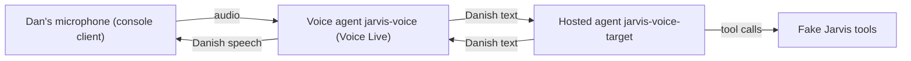

# Goal — Jarvis Danish voice prototype

## Objective

Prove that Dan can talk Danish to a Jarvis agent through Voice Live, that the agent picks the right action and answers in Danish, and measure quality, speed, and cost. This settles boxes 1.3, 1.4, 1.7, 1.8, 2.7, 6.5, and 6.7 in `jarvis-flows.html`.

## What runs where

| Where | What |
| --- | --- |
| **Azure — Foundry** | Hosted agent `jarvis-voice-target`: Voice Live Bridge Protocol 1.0 over `invocations_ws`, Jarvis instructions in Danish, and fake Jarvis tools. Voice agent `jarvis-voice` (`kind: voice`) wraps it: Danish speech to text, turn detection, interruption, and a Danish voice. |
| **Azure — supporting** | Model deployment(s), Container Registry or code deployment as the sample requires, Application Insights, 100 DKK monthly budget alert. |
| **This PC** | Console voice client (microphone and speakers) and test scripts. Stands in for the future board. |

Base the hosted agent and voice wrapper on Microsoft's sample `foundry-samples/samples/python/hosted-agents/bring-your-own/voice-agent-target-agent/basic`.

## Fake tools

In-memory data: projects Jarvis, Daily, and Banking; two or three running tasks with Codex and Copilot. The tools mirror the backend functions in `jarvis.md`:

`list_projects`, `list_tasks`, `task_status(task_id)`, `create_task(project, agent, text)`, `steer_task(task_id, text)`, `pause_task(task_id)`, `resume_task(task_id)`, `cancel_task(task_id)`.

Every tool call is recorded with its arguments, so tests and the console can show what the agent did.

## Checks

| # | Check | Pass when |
| --- | --- | --- |
| V1 | **Voice bridge** — voice agent reaches the hosted agent | A spoken turn produces a Danish spoken reply through the deployed voice agent. |
| V2 | **Danish speech to text** | Synthetic Danish test audio (Azure text to speech, at least two voices) is transcribed with a word error rate per configuration: `azure-speech` with `da-DK`, `mai-transcribe` with `da`, and the default automatic setting as a control. Mixed Danish/English terms (Codex, Copilot, dark mode, pull request, Jarvis) are included; a phrase list is tried. |
| V3 | **Intent accuracy** | 20 typical Danish commands, sent as text to the deployed hosted agent, are scored for correct tool and arguments. Run on at least two models (the sample's `gpt-5.4-mini` and one larger). Record accuracy, latency, and tokens per command. |
| V4 | **Danish status answers** | Status questions ("Hvordan går det med Codex-opgaven?") return Danish answers that match the fake task data. |
| V5 | **End-to-end voice** | The synthetic audio from V2 runs through the voice agent to the correct tool call. Record latency from end of speech to first reply audio. |
| V6 | **Interruption** | Speaking over a reply stops it, and the next turn works. |
| V7 | **Cost** | Cost per voice-minute and per command from measured usage and current prices, and the Voice Live pricing tier that applies when a hosted agent is the conversation engine. |
| V8 | **Live test by Dan** | Dan runs the console client and talks Danish. The console shows what was heard, which tool was called, the reply, and timings. Results and Dan's verdict go into the report. |

## Deliverables

- `C:\Repo\Jarvis\voice-prototype\` (local git):
  - `agent/` — hosted agent (Bridge Protocol 1.0, Jarvis instructions, fake tools).
  - `client/` — console voice client: `python client\talk.py` with microphone and speakers; flags for transcription model and voice.
  - `tests/` — scripted checks V2–V7; results saved as JSON under `results/`.
  - `infra/deploy.ps1` and `infra/teardown.ps1`.
  - `README.md` — deploy, run tests, talk, tear down.
  - `REPORT.md` — see "Report".
- Azure resource group `rg-jarvis-voice-poc`, Sweden Central, subscription "Dan Aakesen" (`0ac7d719-89bc-4100-be87-a79d33e953a7`).

## Report

`REPORT.md`:

1. **Summary** — does the Danish voice path work for Jarvis? Recommended transcription model, voice, and Jarvis model, with reasons.
2. **Results** — one row per check V1–V8: Pass, Fail, or Blocked, with evidence.
3. **Cost** — per voice-minute, per command, and an estimate for 30 minutes of voice per day.
4. **Problems and workarounds**.
5. **Design impact** — proposed changes to `jarvis.md` and box colors in `jarvis-flows.html`, listed only; not applied.

## Teardown

`infra/teardown.ps1` deletes the resource group with everything in it, purges soft-deleted Foundry and Key Vault resources, confirms nothing remains, and prints what it deleted.

## Done when

1. `deploy.ps1` creates everything from scratch.
2. V1–V7 have Pass, Fail, or Blocked with evidence in `REPORT.md`.
3. The console client is ready, and `README.md` tells Dan exactly how to start it. V8 is completed with Dan, then the report is finalized.
4. `teardown.ps1` is proven once, and `deploy.ps1` succeeds again afterwards.
5. No sessions remain; resources stay deployed for review.

## Constraints

- Change only `rg-jarvis-voice-poc` and `C:\Repo\Jarvis\voice-prototype\`. Do not touch `rg-jarvis-poc`, `jarvis.md`, or `jarvis-flows.html`.
- Pass `--subscription` explicitly; never change the Azure CLI default tenant or subscription.
- Use fresh Foundry account and project names; never reuse a deleted name (`jarvis.md` learnings).
- No secrets in code, logs, or the report. Use Entra ID; no API keys.
- Fake tools only; nothing calls GitHub, the coding sandbox, or real data.
- Dan does not record audio files. Automated tests use synthetic speech; real-voice evidence comes only from the live test (V8).
