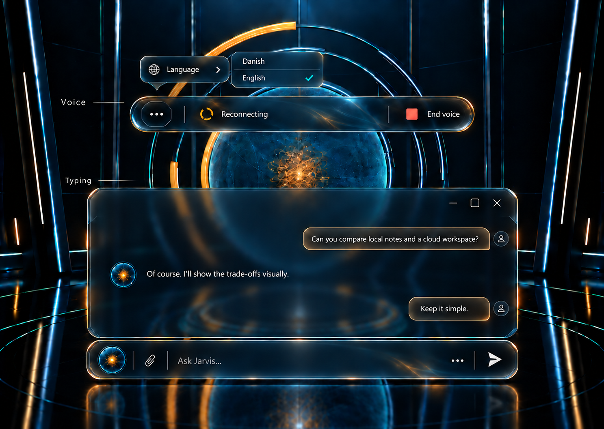

# Approved luminous-glass conversation controls

Dan selected the last Luminous Glass component-family concept, then removed the separator above the messages and the small orb/Jarvis title in the window's top-left header. This reference preserves those changes. The illustration shows voice and typing components together for comparison; the application continues to show them in their appropriate modes. Example messages are illustrative.

Implementation issues: [P8-36 (#397)](https://github.com/DanAakesen/jarvis/issues/397); [P8-37 (#398)](https://github.com/DanAakesen/jarvis/issues/398); [P8-38 (#399)](https://github.com/DanAakesen/jarvis/issues/399). These tasks are planned and unclaimed. This document does not report them as implemented or start a worker. Wait until this handoff is on main before implementing.

## Shared requirements

- One material and typography family: restrained smoky/frosted glass with fine cyan/amber refracted full perimeters. Prioritise readable text over the moving 3D scene. Extend the existing shared tokens rather than introducing a second theme system.
- Compact voice status bar and matching bottom-centre chat composer. More contains an icon plus Language row with a Danish/English flyout and a checked current choice; no large standalone language toggle.
- No duplicate microphone, screen-sharing or camera group in the voice bar. Retain those capabilities and their existing placements and truthful permissions/state.
- Message-window chrome retains a drag region and top-right minimise/maximise/close. Remove only the full-width separator above messages and the orb/Jarvis title at the top-left header. Keep the small voice-start orb in the input, large scene orb and assistant identity inside messages.
- Preserve Enter/Send steering, Ctrl+Enter FIFO queueing and queue removal from #371. Controls stay usable during streaming/tool rounds; no Stop button or replacement conversation/window manager.
- Keep explicit voice activation, truthful state/recovery, ordinary input/history hidden during voice unless history is requested, existing view/tab continuity and the default-off minimise-on-voice-entry setting. Generated views remain temporary; theme preferences retain their existing persistence.
- Inspect keyboard/touch, dark/light, phone, streaming/tool/error states and reduced motion in the actual browser. A generated reference is not proof of accessibility or runtime behavior.

## Implementation scope

### P8-36 — #397

Replace the current oversized voice status/control treatment with the selected Luminous Glass bar. Reuse the existing voice runtime and shared appearance tokens; do not replace the room, camera or session engine.

- [ ] Match the approved compact glass bar: More on the left, an understated state glyph and readable runtime status, and End voice on the right. Fine cyan/amber refracted edges and restrained smoky glass must remain readable over the moving room. No large status icon disc or duplicate microphone/screen/camera group in this bar; retain those capabilities and their existing placements.
- [ ] More contains a globe/icon plus Language text, with a flyout for Danish and English and a checked current choice. Remove the large DA/EN toggle. Bind the shared menu to real language/session state, retaining existing rules and truthful feedback for active-session changes; reuse it in the composer.
- [ ] Drive status from the existing runtime: connecting, listening, thinking/tool activity, speaking, reconnecting and failure. Do not imply listening during reconnect or use illustrative reference text as a simulated production state. Keep relevant recovery and End voice reachable.
- [ ] Keep explicit voice activation, ordinary input/history hidden in voice, current window continuity/default-off minimise preference, End voice and keyboard handling. Escape first dismisses a menu/flyout before the existing end-voice action. Do not duplicate the workspace or remount the 3D scene.
- [ ] Extend canonical shared tokens/components rather than creating a second visual system. Verify readable dark/light surfaces, 44px touch targets, focus/keyboard/flyout dismissal, narrow screens and reduced motion. Run relevant web checks and record browser comparison with the reference; distinguish local fixtures from live voice/device acceptance.

### P8-37 — #398

Apply the approved matching composer to the existing typing workflow. This is a visual refinement of working chat, not a replacement of streaming, steering or queue behavior.

- [ ] Match the reference material, perimeter, typography and compact proportions of the voice bar. Keep a small voice-start orb, attachments, usable multiline writing area, More and Send. The composer remains at the bottom centre; the small orb stays even though the message-window header orb is removed.
- [ ] Use P8-36's shared three-dot menu: globe/icon plus Language text, Danish/English flyout, checked current selection. Remove the standalone DA/EN toggle without removing language or real voice switching functionality.
- [ ] Preserve #371: Enter/Send steers the active turn, tool-round messages reach the next safe boundary, and Ctrl+Enter remains FIFO queueing. Send, language and voice remain usable while a reply streams. Preserve queued-item removal/language, drafts, attachments, partial replies, focus and existing failure/recovery. No Stop button, blanket disabling of input, parallel turns or duplicate submissions.
- [ ] Typing shows conversation automatically. Explicit voice entry hides the composer and leaving voice restores usable typing with the existing view/window state. Preserve the default-off minimise-on-entry preference and do not restart the room or request a microphone until voice is activated.
- [ ] Use canonical appearance tokens and responsive widths, dark/light contrast, touch/keyboard focus and reduced motion. Relevant checks cover steering versus queueing, streaming/tool rounds, menu/language, attachments, voice handoff and error states. Capture actual desktop/phone comparisons; record fixture/live limitations.

### P8-38 — #399

Replace messages scattered directly over the bright 3D room with the approved coherent frosted message window. Use the existing workspace/window system and preserve conversation semantics.

- [ ] Implement the approved Luminous Glass message surface with readable frosted opacity, purposeful spacing, constrained line length (about 65 characters), clear user/assistant hierarchy, and matching material/type to the composer and voice bar. Keep the room visible without text competing with its moving rings.
- [ ] Apply Dan's two exact removals: no horizontal separator above the chat messages, and no small orb or Jarvis title at the top left of the window header. Keep an unobtrusive drag region and top-right minimise/maximise/close. Do not remove the small voice-start orb in the composer, the scene orb or the assistant identity inside message content.
- [ ] Retain safe Markdown from #328, genuine tool outcomes, streaming/interrupted partial replies, Enter/Send steering and Ctrl+Enter queueing from #371. Never copy illustrative messages or invented status into production. Auto-follow only while at the latest message; preserve manual reading position and an accessible return-to-latest action.
- [ ] Reuse existing workspace lifecycle/commands: move/resize, focus/z-order, overlap/tile, tabs and minimise/restore. Closing or minimising the visible history must leave typing usable; re-open history when typing needs responses. Do not create an alternate window manager or save generated temporary views as permanent content.
- [ ] Keep history hidden during voice unless requested, one foreground phone view with orb docking and swipe/restore, existing mode continuity and default-off minimise-on-voice-entry. Verify dark/light legibility over the brightest moving stage, long/streamed/tool/error content, keyboard/touch/window controls and reduced motion with relevant checks and actual browser evidence.

## Evidence and boundaries

The selected image was edited with Image Gen to apply the two requested header removals; its PNG is checked into this directory. On 6 October 2026, the latest main at `e00e54d3999092e9387dcb505c336d74a038fae2` was run from a fresh worktree with Node 22.23.3 and npm 10.9.9. Dependency installation and the contracts build completed. Chromium captured the actual signed-in shell using a scratch auth fixture and mocked backend responses; production code/auth were unchanged. The capture used software WebGL and does not validate live authentication, Azure APIs, microphone/audio or GPU motion quality. The separate shell-styling concepts remain proposals until Dan selects one.
