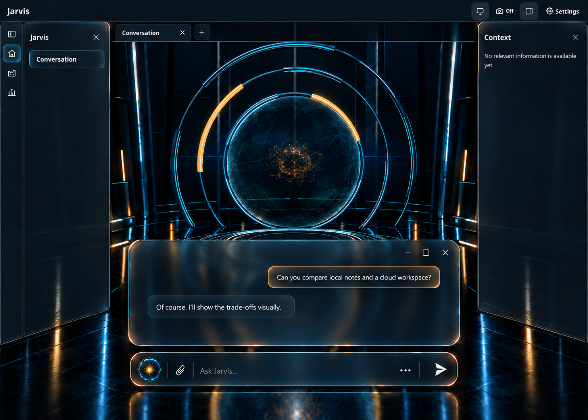

# Selected Architectural Glass shell — 6 October 2026

**Status: selected, awaiting implementation.** Dan chose the third/last displayed concept, Architectural Glass, and requested GitHub issues. He removed the bottom app-shell/status bar requirement and requested removal of both human and Jarvis avatar icons inside the chat window. #401 implements the shell and bottom-bar removal; the existing #399 is updated for the avatar-free message window. The original alternatives remain below for provenance.

The structure stays fixed: thin edge-to-edge top bar, narrow icon rail below it, closable left navigation, main tabs/workspace, closable right context panel, Settings top right, with no separate bottom bar. The bottom-centred composer and compact voice-session control bar remain. Only the Jarvis area gets the room and large orb. The approved [chat/voice component family](../chat-voice/README.md) is the shared styling reference.

## Refined approved reference

The last displayed concept was edited to remove only the two message-avatar icons and reclaim their gaps. Retain the large scene orb and small input voice-start orb. This is the selected visual target; the message window has no top-left header orb/title or separator above messages.

Implementation: [#401](https://github.com/DanAakesen/jarvis/issues/401) (P8-39) and [#399](https://github.com/DanAakesen/jarvis/issues/399) (P8-38). Use #397/#398 for the shared voice bar/menu and matching input. Publication of this design does not start a worker.

## Actual current shell

Captured at 1440 × 1024 in Chromium from main commit `e00e54d3999092e9387dcb505c336d74a038fae2`, with local scratch auth, empty history/context and mocked backend data. Production frontend source was unchanged. Software WebGL rendered the room after startup; unresolved mock stream/status requests returned 503, with no JavaScript page errors. This is browser layout evidence, not live authentication/backend, voice or hardware performance acceptance. Dan's unpushed localhost changes were unavailable; he explicitly authorised this fallback.

## Displayed concept 1 — Smoked Prism

Anchored smoked-glass shell surfaces with restrained refracted full contours; a readable floating message window occupies the upper main workspace.

## Displayed concept 2 — Floating Frost

Inset rounded frosted side panels and lighter foreground weight; the message window floats lower to leave more of the orb visible.

## Displayed concept 3 — Architectural Glass

Graphite/glass shell framing with stronger foreground hierarchy; the message window sits below the orb above its matching composer.

## Boundaries for later implementation

The refined selected image defines material, composition and contrast; the three original concepts below it document the exploration. Example messages are illustrative. Preserve real navigation, existing camera/sharing placement and truthful availability, actual workspace tabs, runtime data and accessible keyboard/touch controls. Generated extra affordances such as a plus tab are not approved new behavior. Correct isolated accent borders or over-bright surfaces rather than copying a generated detail that conflicts with the project rules. Neither a picture nor this handoff validates motion, accessibility, language switching or a live provider.

The selected shell extends the approved composer/voice refinements in #397/#398, and #399 adopts the updated avatar-free message window. Remove the shared footer/layout track, relocating the existing database-waking feedback into compact top-bar status treatment. Preserve operational feedback, real navigation, state and accessible author roles. Shell implementation starts only after its blockers are complete and the updated handoff is on main; this documentation does not claim it has been built.
