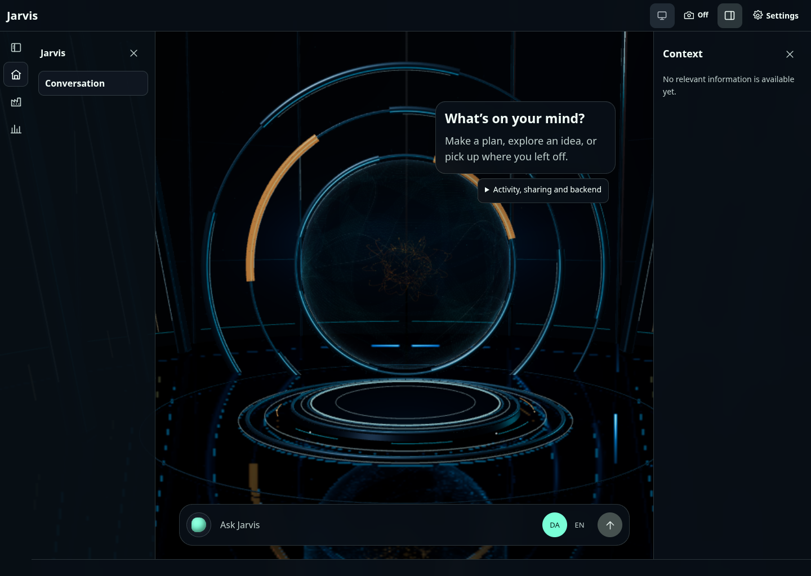
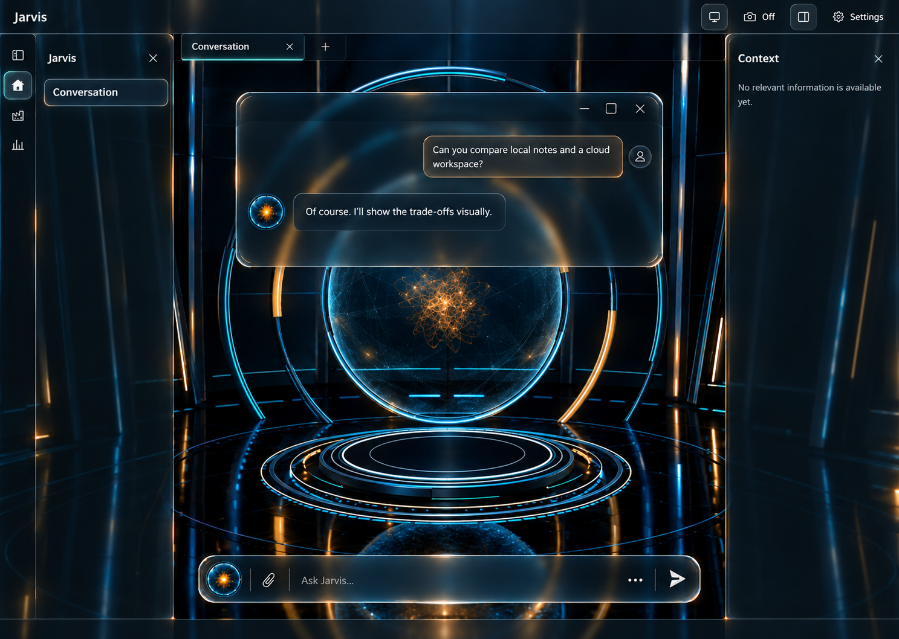
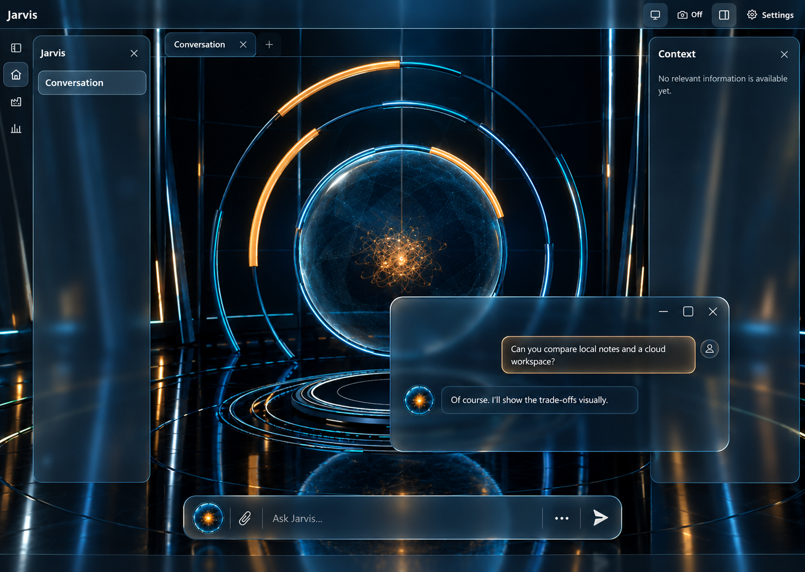
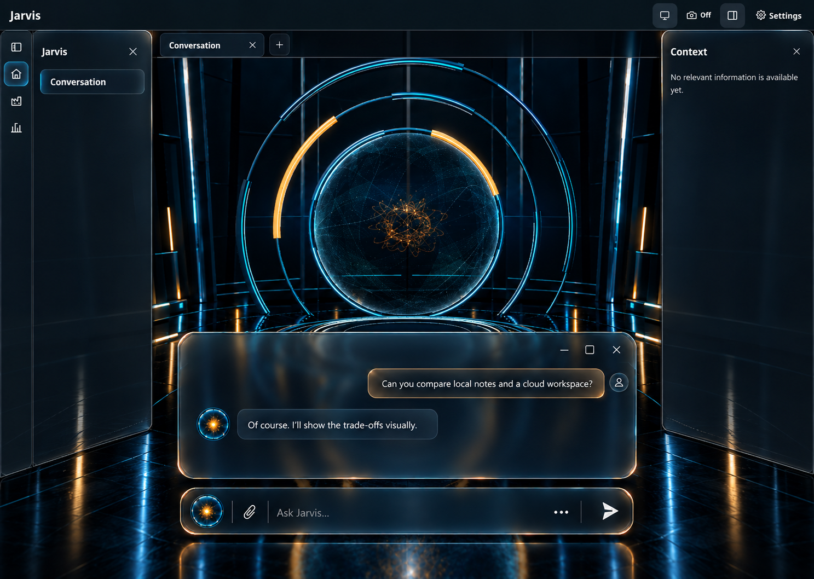

# Shell styling proposals — 6 October 2026

**Status: unselected.** Dan requested three ways to style the current shell around the Jarvis 3D room. These independent generated concepts are proposals, not implemented screens or permission to build. Their order matches the order displayed in this design conversation.

The structure stays fixed: thin edge-to-edge top bar, narrow icon rail below it, closable left navigation, main tabs/workspace, closable right context panel, Settings top right and a thin bottom bar. Only the Jarvis area gets the room and large orb. The approved [chat/voice component family](../chat-voice/README.md) is the shared styling reference.

## Actual current shell

Captured at 1440 × 1024 in Chromium from main commit `e00e54d3999092e9387dcb505c336d74a038fae2`, with local scratch auth, empty history/context and mocked backend data. Production frontend source was unchanged. Software WebGL rendered the room after startup; unresolved mock stream/status requests returned 503, with no JavaScript page errors. This is browser layout evidence, not live authentication/backend, voice or hardware performance acceptance. Dan's unpushed localhost changes were unavailable; he explicitly authorised this fallback.

## Displayed concept 1 — Smoked Prism

Anchored smoked-glass shell surfaces with restrained refracted full contours; a readable floating message window occupies the upper main workspace.

## Displayed concept 2 — Floating Frost

Inset rounded frosted side panels and lighter foreground weight; the message window floats lower to leave more of the orb visible.

## Displayed concept 3 — Architectural Glass

Graphite/glass shell framing with stronger foreground hierarchy; the message window sits below the orb above its matching composer.

## Boundaries for later implementation

These images illustrate material, composition and contrast. Example messages are illustrative. Preserve real navigation, existing camera/sharing placement and truthful availability, actual workspace tabs, runtime data and accessible keyboard/touch controls. Generated extra affordances such as a plus tab are not approved new behavior. Correct isolated accent borders or over-bright surfaces rather than copying a generated detail that conflicts with the project rules. Neither a picture nor this handoff validates motion, accessibility, language switching or a live provider.

The shell proposal does not replace the already approved composer/message/voice refinements in #397–#399. Record Dan's selection and any revisions before starting shell implementation.
