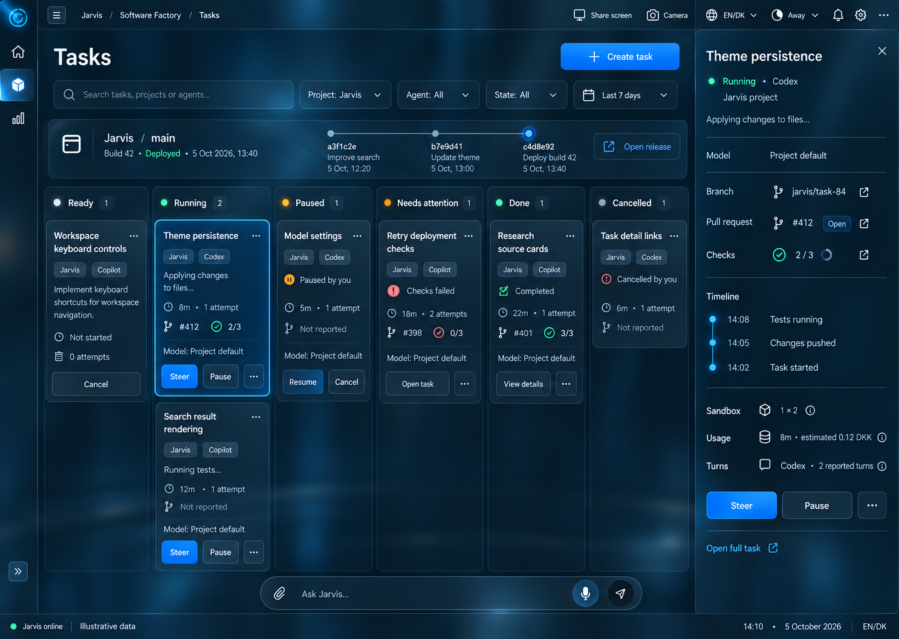

# Approved Software Factory layout — 5 October 2026

Implementation: [issue #369](https://github.com/DanAakesen/jarvis/issues/369), P8-34. Status: implemented offline; live integration acceptance remains unverified. The mockup remains a visual reference and its values are not production data.

**Task:** Implement the approved Software Factory task-board layout, with a project release bar and a contextual task-details pane.

Dan approved the combined concept: image 2 (Task Lens) as the base, the release bar from image 3, and the task details panel on the right. This issue implements that design; it does not rebuild the already implemented task lifecycle or release engine.

### Approved visual reference

[Open the mockup](task-lens-release-bar.png)

The mockup is generated and uses illustrative data. Implement actual controls and source data; do not copy example task titles, PR numbers, commit hashes, prices, timestamps or the fixture footer into production.

### Scope

- Keep the selected dark smoky-glass treatment, narrow left area rail, expandable area navigation, thin shared bars, workspace tabs and Settings at the top right. Tasks, Projects, Releases and Usage remain reachable. Adapt existing tokens for light appearance. The 3D chamber and large orb belong to Jarvis only.
- On `/factory/tasks`, retain Ready, Running, Paused, Needs attention, Done and Cancelled, including the pending-pause state. Preserve create-task, search and project/agent/state/period filters, card facts, live updates and the existing bounded task list.
- Add the compact release bar beneath filters and above the board: selected project/repository, default branch, latest build/deployment status, short real commit timeline and Open release. Reuse the authenticated release API and full Releases page. When no single project is selected, prompt for a project rather than showing another project's release. Distinguish no releases, unavailable/stale data and failed deployment; selecting a new project must never leave the previous project's graph under the new label.
- Selecting a task opens the closable right details pane while preserving filters, task selection and board scroll. Show title, request, project, agent/model, observed state/activity, branch/PR/checks, timeline preview, sandbox/heartbeat/disk and usage as available. Reuse existing detail/timeline/session/usage contracts and Open full task for the complete history. Guard against stale responses during rapid selection and update from real committed events.
- Reuse the contextual panel controller so Jarvis and Dan can open, close and change relevant context. Preserve keyboard focus and existing workspace/tab lifecycle. Connect the shared Ask Jarvis input shown in the mockup to existing conversation/send/explicit voice-start behavior; do not ship a decorative input or start the microphone automatically.
- Keep state-valid controls: Running supports Steer/Pause/Cancel; Paused supports Resume/Cancel; Ready supports Cancel. Show Continue only when an actionable task's completed-turn session expired; show Recover only for an actual active-turn sandbox crash. Ordinary failed checks use Open task and the existing allowed controls; Done does not show Continue. Pending actions and refusals/errors remain visible and cannot duplicate submissions.
- Show Not reported for missing provider data. Label sandbox cost as an estimate; provider-reported Codex/Copilot turns/token/premium usage remain separate, without invented subscription DKK prices. Use written labels with colors, a full-outline/surface selection treatment and accessible focus.

### Acceptance criteria

- [x] Implement the approved composition with existing task/release data contracts; retain all six states, create/search/filter and state-valid controls; scope release context to the selected project; preserve selection and board position; cover loading/empty/error/stale states and both appearances.
- [x] Board, compact release bar and open right details pane match the approved composition at a wide browser viewport; closing the pane restores usable board space.
- [x] Project switching, task selection, state controls, links, navigation and the shared input use existing contracts. Focused tests cover task details and conversation handoff; fixture browser checks verify project isolation and retained selection/position. Live Entra/backend/SSE behavior remains unverified.
- [x] Tests cover populated, loading, empty, unavailable, disconnected/stale, pending and rejected-action states; no fixture content is embedded in production.
- [x] Inspect dark/light desktop and 390px phone layouts in Chromium fixtures. Verify no horizontal overflow, keyboard close/focus return, reduced-motion styling and a 44×44px panel close target. Physical-device and live contrast acceptance remain unverified.
- [x] Run relevant web tests, lint and build; add regressions for project-scoped release data, stale task-selection responses and state-dependent actions. Commands/results and fixture screenshots are recorded in [agent-context](../../agent-context.md#setup-and-commands); see the approved mockup above as the illustrative reference.

**Depends on:** P8-31 (#364); P1-08 (#22); P1-09 (#23); P3-08 (#46); P8-04 (#235); P8-07 (#238); P8-08 (#239); P8-15 (#253)

The shared glass task #364 owns canonical shell styling; this issue owns the Software Factory composition and data integration. Wait for its blocker and this design handoff to be on `main` before implementing. Creation of this issue does not start or assign a worker.

Source of truth: [PLAN.md](https://github.com/DanAakesen/jarvis/blob/main/PLAN.md). Follow the [development workflow](https://github.com/DanAakesen/jarvis/blob/main/docs/agent-context.md#development-workflow).

### Before you start

Claim this issue first with your worker label (`Codex`, `Copilot`, `Dan` or `Jarvis`); stop if another worker has claimed it. Use a fresh checkout of current `main`, check blockers and coordinate shared files with active work.

### Definition of done

- [ ] One PR named `P8-34: <short summary>`, containing `Fixes #369`.
- [ ] Acceptance criteria met; actual commands/results, browser evidence and material unverified limits recorded.
- [ ] Update affected PLAN.md, PRODUCT.md, DESIGN.md, ui.md, docs/features.md and docs/decisions.md; update architecture/run documentation if implementation changes their contracts. Preserve other agents' work.
- [ ] Review for missing controls, stale context, credentials, fabricated data and regressions; mark ready only after the required checks.
